# Crear y administrar relaciones en Power BI Desktop
Al importar varias tablas, lo más probable es que vaya a realizar un análisis con los datos de todas ellas. Las relaciones entre esas tablas son necesarias para calcular los resultados de forma precisa y mostrar la información correcta en los informes. Power BI Desktop facilita la creación de esas relaciones. De hecho, en la mayoría de los casos no tendrá que hacer nada; la característica de detección automática lo hace por usted. Aunque es posible que, en ocasiones, tenga que crear relaciones o realizar cambios en una relación. En cualquier caso, es importante entender las relaciones en Power BI Desktop y cómo crearlas y editarlas.

## Detección automática durante la carga
Si consulta dos o más tablas al mismo tiempo, cuando se carguen los datos, Power BI Desktop intenta buscar y crear relaciones automáticamente. Las opciones de relación **Cardinalidad**, **Dirección de filtro cruzado** y **Activar esta relación** se establecen automáticamente. Power BI Desktop examina los nombres de columna en las tablas que se consultan para determinar si hay posibles relaciones. Si las hay, esas relaciones se crean automáticamente. Si Power BI Desktop no puede determinar con un alto nivel de confianza que hay una coincidencia, no crea automáticamente la relación. Sin embargo, puede usar el cuadro de diálogo **Administrar relaciones** para crear o modificar manualmente las relaciones.

## Creación de una relación con detección automática
En la pestaña **Inicio**, haga clic en **Administrar relaciones** \> **Detección automática**.

## Crear una relación de forma manual
1. En la pestaña **Inicio**, haga clic en **Administrar relaciones** \> **Nuevo**.

2. En el cuadro de diálogo **Crear relación**, en la primera lista desplegable de tablas, seleccione una tabla. Seleccione la columna que quiera usar en la relación.

3. En la segunda lista desplegable de tablas, seleccione la otra tabla que quiera incluir en la relación. Seleccione la otra columna que quiera usar y elija **Aceptar**.

   

De forma predeterminada, Power BI Desktop configura automáticamente las opciones **Cardinalidad** (dirección), **Dirección de filtro cruzado** y **Activar esta relación** en la nueva relación. Sin embargo, puede cambiar esta configuración si es necesario. Para obtener más información, consulte [Descripción de las opciones adicionales](#understanding-additional-options).

Si ninguna de las tablas seleccionadas para la relación tiene valores únicos, verá el siguiente error: *Una de las columnas debe tener valores únicos*. Al menos una tabla de una relación *debe* tener una lista distinta y única de valores de clave, que es un requisito común para todas las tecnologías de bases de datos relacionales. 

Si detecta ese error, hay un par de formas de corregir el problema:

* Usar **Quitar filas duplicadas** para crear una columna con valores únicos. El inconveniente de este enfoque es que podría perder información al quitar filas duplicadas; a menudo, una clave (fila) se duplica por un buen motivo.
* Agregar una tabla intermedia hecha de la lista de valores de claves distintos en el modelo, que luego se vinculará a ambas columnas originales de la relación.

Para más información, consulte [esta entrada de blog](https://blogs.technet.microsoft.com/cansql/2016/12/19/relationships-in-power-bi-fixing-one-of-the-columns-must-have-unique-values-error-message/).

## Editar una relación
1. En la pestaña **Inicio**, seleccione **Administrar relaciones**.

2. En el cuadro de diálogo **Administrar relaciones**, seleccione la relación y elija **Editar**.

## Configuración de opciones adicionales
Al crear o editar una relación, puede configurar opciones adicionales. De forma predeterminada, Power BI Desktop configura automáticamente las opciones adicionales en función de una mejor aproximación, que puede ser diferente para cada relación según los datos de las columnas.

### Cardinalidad
La opción **Cardinalidad** puede tener una de las siguientes opciones:

**Varios a uno (\*:1)** : una relación de varios a uno es el tipo más común de relación predeterminada. Indica que la columna de una tabla puede tener más de una instancia de un valor y que la otra tabla relacionada, a menudo conocida como tabla de búsqueda, solo tiene una instancia de un valor.

**Uno a uno (1:1)** : en una relación uno a uno, la columna de una tabla solo tiene una instancia de un valor determinado y la otra tabla relacionada solo tiene una instancia de un valor determinado.

**Uno a varios (1:*)** : en una relación uno a varios, la columna de una tabla solo tiene una instancia de un valor y la otra tabla relacionada puede tener más de una instancia de un valor.

**Varios a varios (\*:\*)** : con los modelos compuestos, puede establecer relaciones de varios a varios entre tablas, lo que elimina los requisitos de los valores únicos de las tablas. También permite descartar las soluciones alternativas anteriores, como el hecho de presentar nuevas tablas solo para establecer relaciones. Para obtener más información, consulte [Relaciones con una cardinalidad de varios a varios](https://docs.microsoft.com/power-bi/desktop-many-to-many-relationships). 

Para obtener más información sobre cuándo cambiar la cardinalidad, consulte [Descripción de las opciones adicionales](#understanding-additional-options).

### Dirección de filtro cruzado
La opción **Dirección de filtro cruzado** puede tener una de las siguientes opciones:

**Ambos**: indica que, a efectos de filtrado, ambas tablas se tratan como si fueran una sola tabla. La opción**Ambos** funciona bien con una única tabla que tenga varias tablas de búsqueda a su alrededor. Un ejemplo es una tabla de datos reales de ventas con una tabla de búsqueda del departamento. Esta configuración suele denominarse configuración de esquema de estrella (una tabla central con varias tablas de búsqueda). Aunque, si tiene dos o más tablas que también tengan tablas de búsqueda (con algo en común), no querrá usar la opción **Ambos**. Para continuar con el ejemplo anterior, en este caso, también dispone de una tabla de ventas de presupuesto que registra el presupuesto de destino para cada departamento. Además, la tabla de departamento está conectada a la tabla de presupuesto y de ventas. Evite la opción **Ambos** para este tipo de configuración.

**Único**: dirección predeterminada más común, que significa que las opciones de filtrado en tablas conectadas trabajan sobre la tabla donde se agregan los valores. Si importa un modelo de datos de Power Pivot o anterior en Excel 2013, todas las relaciones tendrán una dirección única. 

Para obtener más información sobre cuándo cambiar la dirección de filtro cruzado, consulte [Descripción de las opciones adicionales](#understanding-additional-options).

### Activar esta relación
Si se activa, significa que la relación actúa como la relación predeterminada y activa. En casos donde hay más de una relación entre dos tablas, la relación activa proporciona una manera para que Power BI Desktop cree automáticamente visualizaciones que incluyan las dos tablas.

Consulte [Descripción de las opciones adicionales](#understanding-additional-options) para obtener más información sobre cuándo activar determinada relación.

## Descripción de las relaciones
Una vez que haya conectado dos tablas con una relación, puede trabajar con los datos en ambas tablas como si fueran una sola tabla, lo que le libera de tener que preocuparse sobre los detalles de la relación o de tener que acoplar esas tablas en una sola tabla antes de importarlas. En muchas situaciones, Power BI Desktop puede crear automáticamente relaciones por usted. Sin embargo, si Power BI Desktop no puede determinar con un grado alto de certeza que deba existir una relación entre dos tablas, no creará la relación automáticamente. En ese caso, deberá hacerlo usted. 

Vamos a hacer un breve tutorial para mostrarle mejor cómo funcionan las relaciones en Power BI Desktop.

>[!TIP]
>Puede completar esta lección por su cuenta: 
>
> 1. Copie la siguiente tabla **ProjectHours** en una hoja de cálculo de Excel (sin incluir el título), seleccione todas las celdas y elija **Insertar** \> **Tabla**. 
> 2. En el cuadro de diálogo **Crear tabla**, seleccione **Aceptar**. 
> 3. Seleccione cualquier celda de la tabla, seleccione **Diseño de tabla** \> **Nombre de tabla** y especifique *ProjectHours*. 
> 4. Haga lo mismo para la tabla **CompanyProject**. 
> 5. Importe los datos mediante **Obtener datos** en Power BI Desktop. Seleccione ambas tablas como origen de datos y, luego, **Cargar**.

Esta primera tabla, **ProjectHours**, es un registro de los vales de trabajo que registran el número de horas que una persona ha trabajado en determinado proyecto. 

**ProjectHours**

| **Ticket** | **SubmittedBy** | **Hours** | **Project** | **DateSubmit** |
| ---:|:--- | ---:|:--- | ---:|
| 1001 |Brewer, Alan |22 |Azul |1/1/2013 |
| 1002 |Brewer, Alan |26 |Rojo |2/1/2013 |
| 1003 |Ito, Shu |34 |Amarillo |12/4/2012 |
| 1004 |Brewer, Alan |13 |Naranja |1/2/2012 |
| 1005 |Bowen, Eli |29 |Púrpura |1/10/2013 |
| 1006 |Bento, Nuno |35 |Verde |2/1/2013 |
| 1007 |Hamilton, David |10 |Amarillo |1/10/2013 |
| 1008 |Han, Mu |28 |Naranja |1/2/2012 |
| 1009 |Ito, Shu |22 |Púrpura |2/1/2013 |
| 1010 |Bowen, Eli |28 |Verde |10/1/2013 |
| 1011 |Bowen, Eli |9 |Azul |10/15/2013 |

Esta segunda tabla, **CompanyProject**, es una lista de proyectos con una prioridad asignada: A, B o C. 

**CompanyProject**

| **ProjName** | **Priority** |
| --- | --- |
| Azul |A |
| Rojo |B |
| Verde |C |
| Amarillo |C |
| Púrpura |B |
| Naranja |C |

Observe que cada tabla tenga una columna de proyecto. Cada una tiene un nombre ligeramente distinto, pero los valores parecen iguales. Esto es importante y volveremos a abordarlo en breve.

Ahora que tenemos nuestras dos tablas importadas en un modelo, vamos a crear un informe. Lo primero que queremos obtener es el número de horas presentadas por prioridad del proyecto, así que seleccionamos **Priority** y **Hours** en el panel **Campos**.

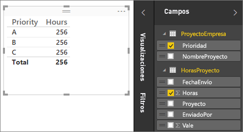

Si observamos nuestra tabla en el lienzo del informe, verá que el número de horas es de 256 para cada proyecto, que es también el total. Claramente este número no es correcto. ¿Por qué? Esto se debe a que no se puede calcular una suma total de valores de una tabla (**Hours** en la tabla **Project**), segmentada por valores en otra tabla (**Priority** en la tabla **CompanyProject**) sin establecer una relación entre estas dos tablas.

Por lo tanto, vamos a crear una relación entre estas dos tablas.

¿Recuerda las columnas que vimos en ambas tablas, con un nombre de proyecto, pero con valores similares? Utilizaremos estas dos columnas para crear una relación entre las tablas.

¿Por qué estas columnas? Bueno, si miramos la columna **Project** de la tabla **ProjectHours**, veremos valores como Azul, Rojo, Amarillo, Naranja, etc. De hecho, veremos varias filas que tienen el mismo valor. En efecto, tenemos muchos valores de color para **Project**.

Si miramos la columna **ProjName** de la tabla **CompanyProject**, veremos que solo hay uno de cada uno de los valores de color para el nombre de proyecto. El valor de cada color en esta tabla es único y eso es importante, porque podemos crear una relación entre estas dos tablas. En este caso, una relación varios a uno. En una relación de varios a uno, al menos una columna en una de las tablas debe contener valores únicos. Hay algunas opciones adicionales para ciertas relaciones, que veremos más adelante. Por ahora, vamos a crear una relación entre las columnas del proyecto en cada una de nuestras dos tablas.

### Para crear la nueva relación
1. Seleccione **Administrar relaciones** en la pestaña **Inicio**.
2. En **Administrar relaciones**, seleccione **Nuevo** para abrir el cuadro de diálogo **Crear relación**, donde se pueden seleccionar las tablas, las columnas y cualquier otra opción adicional que queramos para nuestra relación.
3. En la primera lista desplegable, seleccione **ProjectHours** como primera tabla y, luego, elija la columna **Project**. Se trata del lado *varios* de nuestra relación.
4. En la segunda lista desplegable, **CompanyProject** está preseleccionada como segunda tabla. Seleccione la columna **ProjName**. Se trata del lado *uno* de nuestra relación. 
5. Conserve los valores predeterminados para las opciones de relación y seleccione **Aceptar**.

   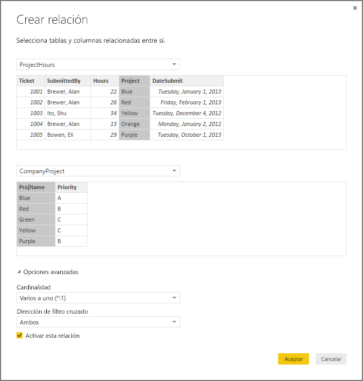

6. En el cuadro de diálogo **Administrar relaciones**, seleccione **Cerrar**.

En aras de una divulgación completa, acaba de crear esta relación por las malas. Habría bastado con seleccionar **Detección automática** en el cuadro de diálogo **Administrar relaciones**. De hecho, la detección automática habría creado automáticamente la relación por usted al cargar los datos si las dos columnas tuvieran el mismo nombre. Pero, ¿cuál es el desafío?

Ahora, echemos un vistazo en la tabla del lienzo del informe una vez más.

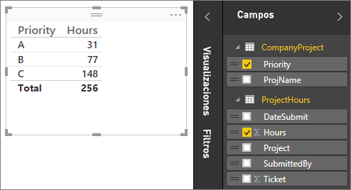

Ahora se ve mucho mejor, ¿verdad?

Cuando se suman horas por **Priority**, Power BI Desktop busca todas las instancias de los valores de color únicos en la tabla de búsqueda **CompanyProject**, busca todas las instancias de cada uno de esos valores en la tabla **ProjectHours** y calcula una suma total para cada valor único.

Eso es fácil. De hecho, con la detección automática, puede que ni siquiera tuviera que hacer tanto.

## Descripción de las opciones adicionales
Cuando se crea una relación, ya sea con detección automática o de forma manual, Power BI Desktop configura automáticamente las opciones adicionales según los datos de las tablas. Estas propiedades de relación adicionales se encuentran en la parte inferior de los cuadros de diálogo **Crear relación** y **Editar relación**.

 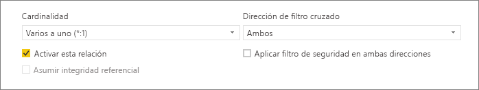

Power BI establece estas opciones automáticamente y no habría que ajustarlas. Sin embargo, hay varias situaciones en las que tal vez quiera configurar estas opciones.

## Actualización de relaciones automáticas

Puede administrar cómo Power BI trata y ajusta automáticamente las relaciones en los informes y modelos. Para especificar cómo Power BI controla las opciones de relaciones, seleccione **Archivo** > **Opciones y configuración** > **Opciones** en Power BI Desktop y elija **Carga de datos** en el panel izquierdo. Aparecerán las opciones para **Relaciones**.

   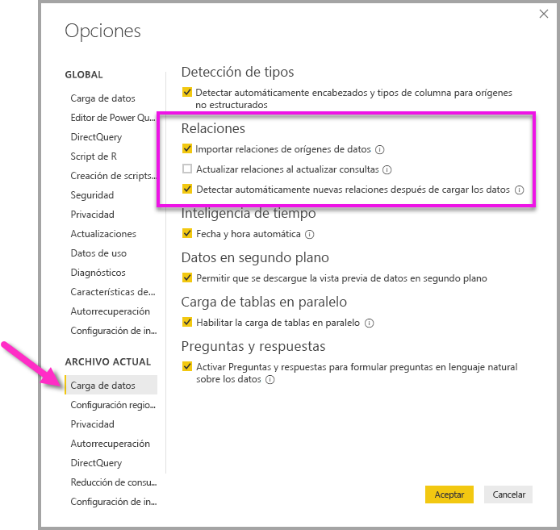

Hay tres opciones que se pueden seleccionar y habilitar: 

- **Importar relaciones de orígenes de datos en la primera carga**: Esta opción está activada de forma predeterminada. Si se selecciona, Power BI comprobará las relaciones definidas en el origen de datos, tales como las relaciones entre la clave externa y la clave principal en el almacenamiento de datos. Si existen dichas relaciones, se reflejarán en el modelo de datos de Power BI al cargar los datos por primera vez. Esta opción permite empezar a trabajar rápidamente con el modelo, sin necesidad de tener que buscar o definir esas relaciones por su cuenta.

- **Actualizar o eliminar las relaciones al actualizar los datos**: Esta opción está desactivada de forma predeterminada. Si se selecciona, Power BI comprobará si hay cambios en las relaciones del origen de datos al actualizar el conjunto de datos. Si dichas relaciones cambian o se quitan, Power BI refleja esos cambios en su propio modelo de datos, y las actualiza o elimina para que coincidan.

   > [!WARNING]
   > No se recomienda seleccionar esta opción si utiliza la seguridad de nivel de fila basada en las relaciones definidas. Si se quita una relación de la que depende la configuración de RLS, el modelo puede resultar menos seguro. 

- **Detectar automáticamente nuevas relaciones después de cargar los datos**: Esta opción se describe en [Detección automática durante la carga](#autodetect-during-load). 

## Las futuras actualizaciones de datos requieren una cardinalidad diferente
Normalmente, Power BI Desktop puede determinar automáticamente la mejor cardinalidad para la relación. Si tiene que reemplazar la configuración automática, porque sabe que los datos cambiarán en el futuro, puede cambiarla en el control **Cardinalidad**. Veamos un ejemplo donde se debe seleccionar una cardinalidad diferente.

La tabla **CompanyProjectPriority** es una lista de todos los proyectos de la empresa y su prioridad. La tabla **ProjectBudget** es el conjunto de proyectos para los que se ha aprobado presupuesto.

**CompanyProjectPriority**

| **ProjName** | **Priority** |
| --- | --- |
| Azul |A |
| Rojo |B |
| Verde |C |
| Amarillo |C |
| Púrpura |B |
| Naranja |C |

**ProjectBudget**

| **Proyectos aprobados** | **BudgetAllocation** | **AllocationDate** |
|:--- | ---:| ---:|
| Azul |40,000 |12/1/2012 |
| Rojo |100,000 |12/1/2012 |
| Verde |50 000 |12/1/2012 |

Si creamos una relación entre la columna **ApprovedProjects** de la tabla **ProjectBudget** y la columna **ProjectName** de la tabla **CompanyProjectPriority**, Power BI establece automáticamente **Cardinalidad** en **Uno a uno (1:1)** y **Dirección de filtro cruzado** en **Ambos**. 

 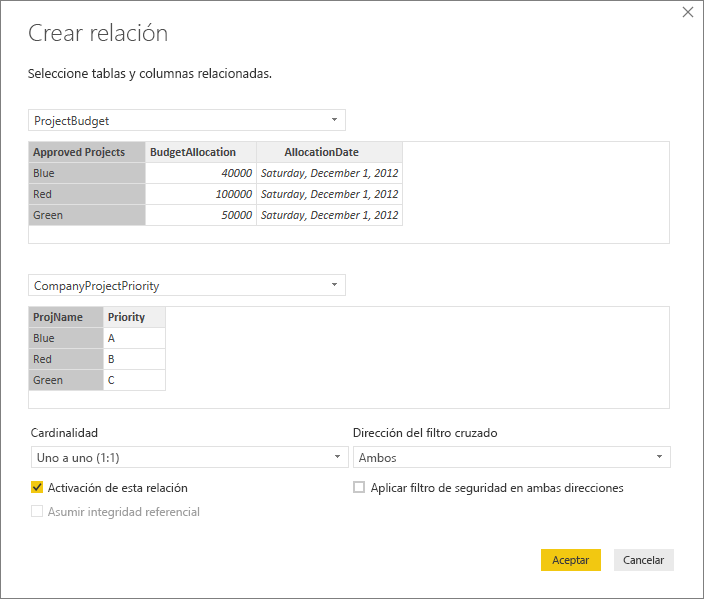

El motivo por el que Power BI crea esta configuración es porque, para Power BI Desktop, la mejor combinación de las dos tablas es la siguiente:

| **ProjName** | **Priority** | **BudgetAllocation** | **AllocationDate** |
|:--- | --- | ---:| ---:|
| Azul |A |40,000 |12/1/2012 |
| Rojo |B |100 000 |12/1/2012 |
| Verde |C |50,000 |12/1/2012 |
| Amarillo |C |  |  |
| Púrpura |B |  |  |
| Naranja |C |  |  |

Hay una relación uno a uno entre nuestras dos tablas porque no hay ningún valor que se repita en la columna **ProjName** de la tabla combinada. La columna **ProjName** es única porque cada valor se produce solo una vez, por lo que las filas de las dos tablas se pueden combinar directamente sin ninguna duplicación.

Sin embargo, supongamos que sabe que los datos cambiarán la próxima vez que los actualice. Una versión actualizada de la tabla **ProjectBudget** tiene ahora filas adicionales para los proyectos Azul y Rojo:

**ProjectBudget**

| **Proyectos aprobados** | **BudgetAllocation** | **AllocationDate** |
| --- | ---:| ---:|
| Azul |40,000 |12/1/2012 |
| Rojo |100,000 |12/1/2012 |
| Verde |50 000 |12/1/2012 |
| Azul |80,000 |6/1/2013 |
| Rojo |90,000 |6/1/2013 |

 Estas filas adicionales implican que la mejor combinación de las dos tablas tiene ahora el siguiente aspecto: 

| **ProjName** | **Priority** | **BudgetAllocation** | **AllocationDate** |
| --- | --- | ---:| ---:|
| Azul |A |40,000 |12/1/2012 |
| Rojo |B |100 000 |12/1/2012 |
| Verde |C |50,000 |12/1/2012 |
| Amarillo |C |  |  |
| Púrpura |B |  |  |
| Naranja |C |  |  |
| Azul |A |80000 |6/1/2013 |
| Rojo |B |90000 |6/1/2013 |

En esta nueva tabla combinada, la columna **ProjName** tiene valores repetidos. Las dos tablas originales no tienen una relación uno a uno, una vez que se actualiza la tabla. En este caso, como sabemos que las actualizaciones futuras harán que la columna **ProjName** tenga duplicados, queremos establecer **Cardinalidad** en **Muchos a uno (\*:1)** , donde el lado *muchos* se asigna a **ProjectBudget** y el lado *uno*, a **CompanyProjectPriority**.

## Ajuste de la dirección del filtro cruzado para un conjunto complejo de tablas y relaciones
Para la mayoría de las relaciones, la dirección de filtro cruzado se establece en **Ambos**. Sin embargo, hay algunas circunstancias poco comunes en las que tal vez necesite establecer esta opción de forma diferente al valor predeterminado, como si estuviera importando un modelo de una versión anterior de Power Pivot, donde cada relación se establece en un sola dirección. 

La opción **Ambos** permite que Power BI Desktop trate todos los aspectos de las tablas conectadas como si fueran una sola tabla. Sin embargo, existen algunas situaciones en las que Power BI Desktop no puede establecer la dirección de filtro cruzado de una relación en **Ambos** y también mantener un conjunto ambiguo de valores predeterminados disponibles a efectos de la elaboración de informes. Si la dirección de filtro cruzado de una relación no se establece en **Ambos**, suele ser porque se crearía ambigüedad. Si el valor predeterminado del filtro cruzado no funciona en su caso, intente configurarlo en una tabla determinada o en **Ambos**.

El filtro cruzado de una sola dirección funciona para muchas situaciones. De hecho, si ha importado un modelo de PowerPivot en Excel 2013 o versiones anteriores, todas las relaciones se establecerán en una dirección única. Una dirección única significa que las opciones de filtrado en tablas conectadas funcionan en la tabla donde sucede el trabajo de agregación. A veces, comprender el filtrado cruzado puede ser un poco complicado; veamos un ejemplo.

Con el filtro cruzado de dirección única, si crea un informe que resuma las horas del proyecto, podrá optar por resumir (o filtrar) por la tabla **CompanyProject** y su columna **Priority** o por la tabla **CompanyEmployee** y su columna **City**. Sin embargo, si quiere contar el número de empleados por proyecto (una pregunta menos común), esto no funcionará. Obtendrá una columna de valores que son los mismos. En el ejemplo siguiente, la dirección de filtro cruzado de ambas relaciones se establece en una dirección única: hacia la tabla **ProjectHours**. En el cuadro **Valores**, el campo **Proyecto** se establece en **Recuento**:

 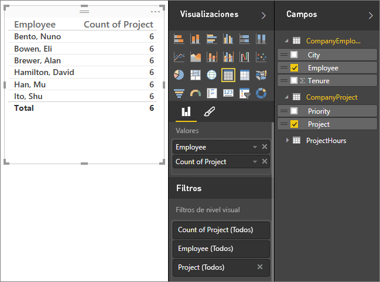

La especificación del filtro fluirá de **CompanyProject** a **CompanyEmployee** (como se muestra en la imagen siguiente), pero no hasta **CompanyEmployee**. 

 

Sin embargo, si establece la dirección de filtro cruzado en **Ambos**, sí funcionará. La opción **Ambos** permite que la especificación del filtro fluya hasta **CompanyEmployee**.

 

Con la dirección de filtro cruzado establecida en **Ambos**, nuestro informe parece ahora correcto:

 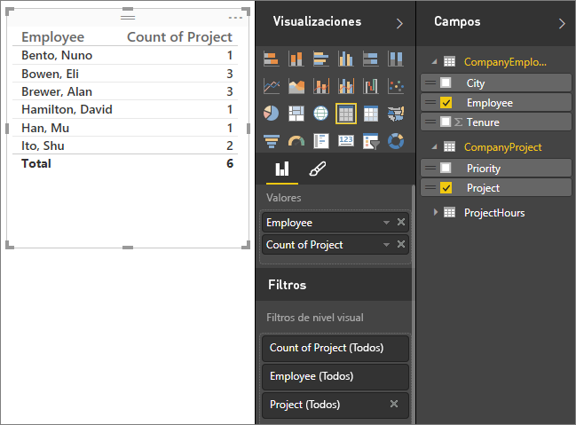

El filtrado cruzado en ambas direcciones funciona bien con un modelo de relaciones de tablas como el patrón anterior. Este esquema se denomina habitualmente esquema de estrella, similar al siguiente:

 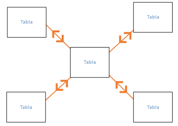

La dirección del filtro cruzado no funciona bien con un patrón más general que se suele encontrarse en las bases de datos, como en este diagrama:

 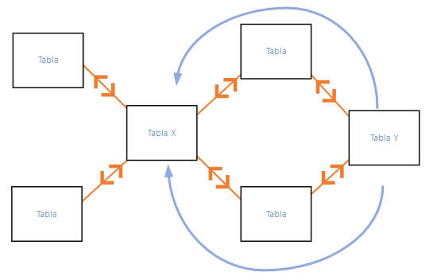

Si tiene un patrón de tabla como este, con bucles, el filtro cruzado puede crear un conjunto ambiguo de relaciones. Por ejemplo, si suma un campo de Tabla X y después elige filtrar por un campo en la Tabla Y, no resulta claro cómo debe viajar el filtro, si a través de la tabla superior o la tabla inferior. Un ejemplo común de este tipo de patrón se presenta con TableX como tabla de ventas con datos reales y TableY como tabla de datos de presupuesto. A continuación, las tablas en la parte central son tablas de búsqueda que utilizan las dos tablas, como la de división o de región. 

De igual modo que con las relaciones activas e inactivas, Power BI Desktop no permitirá que una relación se establezca en **Ambos** si eso crease ambigüedad en los informes. Hay varias maneras de controlar esta situación. Estas son las dos más comunes:

* Eliminar o marcar las relaciones como inactivas para reducir la ambigüedad. A continuación, puede establecer un filtro cruzado de relación en **Ambos**.
* Agregar una tabla dos veces (con un nombre diferente la segunda vez) para eliminar los bucles. Esto hace que el patrón de relaciones sea como un esquema de estrella. Con un esquema de estrella, todas las relaciones pueden establecerse en **Ambos**.

## Relación activa incorrecta
Cuando Power BI Desktop crea automáticamente relaciones, a veces encuentra más de una relación entre dos tablas. Cuando esto sucede, solo una de las relaciones se establece para estar activa. La relación activa actúa como la relación predeterminada para que, al elegir los campos de dos tablas diferentes, Power BI Desktop pueda crear automáticamente una visualización por usted. Sin embargo, en algunos casos la relación seleccionada de forma automática puede ser incorrecta. Puede usar el cuadro de diálogo **Administrar relaciones** para establecer una relación como activa o inactiva, o bien establecer la relación activa en el cuadro de diálogo **Editar relación**. 

Para garantizar que haya una relación predeterminada, Power BI Desktop solo permite una sola relación activa entre dos tablas en un momento dado. Por lo tanto, debe establecer primero la relación actual como inactiva y, luego, establecer la relación que quiere que esté activa.

Veamos un ejemplo. La primera tabla es **ProjectTickets** y la segunda tabla es **EmployeeRole**.

**ProjectTickets**

| **Ticket** | **OpenedBy** | **SubmittedBy** | **Hours** | **Project** | **DateSubmit** |
| ---:|:--- |:--- | ---:|:--- | ---:|
| 1001 |Perham, Tom |Brewer, Alan |22 |Azul |1/1/2013 |
| 1002 |Roman, Daniel |Brewer, Alan |26 |Rojo |2/1/2013 |
| 1003 |Roth, Daniel |Ito, Shu |34 |Amarillo |12/4/2012 |
| 1004 |Perham, Tom |Brewer, Alan |13 |Naranja |1/2/2012 |
| 1005 |Roman, Daniel |Bowen, Eli |29 |Púrpura |1/10/2013 |
| 1006 |Roth, Daniel |Bento, Nuno |35 |Verde |2/1/2013 |
| 1007 |Roth, Daniel |Hamilton, David |10 |Amarillo |1/10/2013 |
| 1008 |Perham, Tom |Han, Mu |28 |Naranja |1/2/2012 |
| 1009 |Roman, Daniel |Ito, Shu |22 |Púrpura |2/1/2013 |
| 1010 |Roth, Daniel |Bowen, Eli |28 |Verde |10/1/2013 |
| 1011 |Perham, Tom |Bowen, Eli |9 |Azul |10/15/2013 |

**EmployeeRole**

| **Employee** | **Role** |
| --- | --- |
| Bento, Nuno |Administrador del proyecto |
| Bowen, Eli |Responsable del proyecto |
| Brewer, Alan |Administrador del proyecto |
| Hamilton, David |Responsable del proyecto |
| Han, Mu |Responsable del proyecto |
| Ito, Shu |Responsable del proyecto |
| Perham, Tom |Patrocinador del proyecto |
| Roman, Daniel |Patrocinador del proyecto |
| Roth, Daniel |Patrocinador del proyecto |

En realidad hay dos relaciones aquí:
- Entre **Employee** en la tabla **EmployeeRole** y **SubmittedBy** en la tabla **ProjectTickets**.
- Entre **OpenedBy** en la tabla **ProjectTickets** y **Employee** en la tabla **EmployeeRole**.

 

Si agregamos ambas relaciones al modelo (**OpenedBy** primero), el cuadro de diálogo **Administrar relaciones** mostrará que **OpenedBy** está activa:

 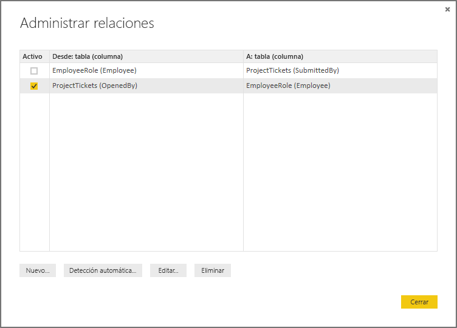

Ahora, si creamos un informe que usa los campos **Role** y **Employee** de **EmployeeRole** y el campo **Hours** de **ProjectTickets** en una visualización de la tabla en el lienzo del informe, solo veremos patrocinadores del proyecto porque son los únicos que abrieron un vale del proyecto.

 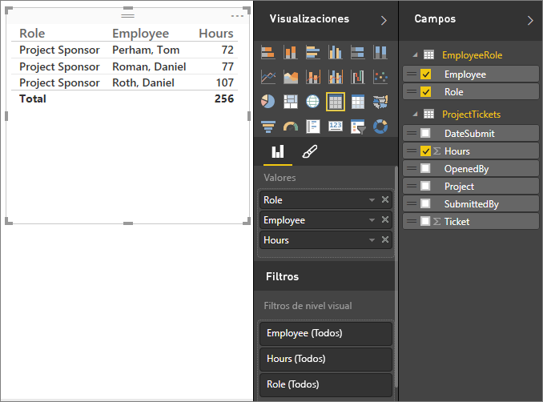

Podemos cambiar la relación activa y obtener **SubmittedBy** en lugar de **OpenedBy**. En **Administrar relaciones**, desactivamos la relación **ProjectTickets(OpenedBy)** con **EmployeeRole(Employee)** y, luego, activamos la relación **EmployeeRole(Employee)** con **Project Tickets(SubmittedBy)** .

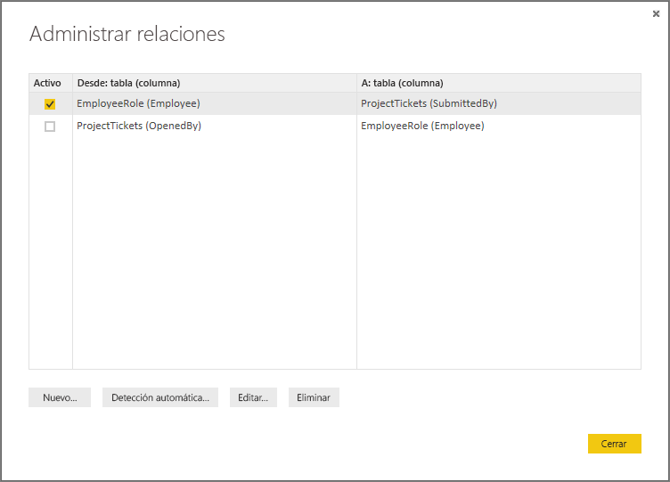

## Consulta de todas las relaciones en la vista Relación
A veces, el modelo tiene varias tablas y relaciones complejas entre ellas. La vista **Relación** de Power BI Desktop muestra todas las relaciones del modelo, su dirección y cardinalidad en un diagrama personalizable y fácil de entender. 

Para obtener más información, consulte [Vista de relaciones en Power BI Desktop](desktop-relationship-view.md).

