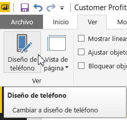
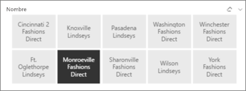
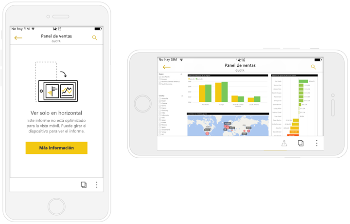

# Optimizar los informes para las aplicaciones móviles de Power BI
Puede mejorar la experiencia de visualización de informes en las aplicaciones móviles mediante la creación de un diseño vertical. En Power BI Desktop y el servicio Power BI, reorganizar y cambiar el tamaño de los objetos visuales de informes para una experiencia óptima en modo vertical.  

¿Busca información acerca de cómo ver los informes en un dispositivo móvil en su lugar? Pruebe este tutorial rápido [Explore paneles e informes en las aplicaciones móviles de Power BI](consumer/mobile/mobile-apps-quickstart-view-dashboard-report.md).

Además se puede crear [ *con capacidad de respuesta* objetos visuales](#optimize-a-visual-for-any-size) y [segmentaciones con capacidad de respuesta](#enhance-slicers-to-work-well-in-phone-reports) que cambiar el tamaño también en cualquier lugar. Si agrega filtros a un informe, muestran automáticamente en el informe optimizado.

## Diseño de una versión vertical de una página de informe

Después de crear un informe, puede optimizarlo para teléfonos y tabletas.

1. En la vista de informes de Power BI Desktop, en la pestaña **Vista**, seleccione **Diseño de teléfono**.  
   
    
   
    En el servicio Power BI, seleccione **Editar informe** > **Diseño para móviles**.

    Verá un lienzo en blanco con la forma de un teléfono. Todos los elementos visuales en la página de informe original se muestran en el panel Visualizaciones de la derecha.

3. Para agregar un objeto visual al diseño de teléfono, arrástrelo desde el panel Visualizaciones al lienzo de teléfono.
   
    Informes de teléfono utilizan un diseño de cuadrícula. Al arrastrar objetos visuales al lienzo móvil, se ajustan a la cuadrícula.
   
    
   
    Puede agregar todos o algunos de los objetos visuales de página de informe maestro a la página de informe de teléfono. Puede agregar cada objeto visual solo una vez. No debe incluir todos los objetos visuales.

4. Puede cambiar el tamaño de los objetos visuales en la cuadrícula, como lo haría para los mosaicos en los paneles y paneles móviles.
   
   La cuadrícula del informe de teléfono se escala en los teléfonos de tamaños diferentes, por lo que el informe se ve correctamente tanto en teléfonos con pantallas pequeñas y grandes.
   
   

## Optimización de un objeto visual de cualquier tamaño
Puede configurar los objetos visuales en el panel o informe para que tengan *capacidad de respuesta*. Pueden cambiar de forma dinámica para mostrar la máxima cantidad de datos y conclusiones, independientemente del tamaño de la pantalla. 

Cuando un objeto visual cambia de tamaño, Power BI da prioridad a la vista de datos. Por ejemplo, puede eliminar el relleno y desplazar la leyenda de la parte superior del objeto visual automáticamente, para que este siga siendo informativo aunque se haga de menor tamaño.

Elija si desea activar la capacidad de respuesta de cada objeto visual. Obtenga más información sobre la [optimización de objetos visuales](visuals/desktop-create-responsive-visuals.md).

## Consideraciones sobre la creación de diseños de informe de teléfono
* Para los informes con varias páginas, puede optimizar todas las páginas o solo algunas. 
* Si se ha definido un color de fondo de una página de informe, el informe de teléfono tendrá el mismo color de fondo.
* No puede modificar la configuración de formato solo para el teléfono. La aplicación de formato es coherente entre los diseños maestros y móviles. Por ejemplo, los tamaños de fuente serán los mismos.
* Para cambiar un objeto visual, como cambiar su formato, conjunto de datos, filtros o cualquier otro atributo, vuelva al modo de creación de informes regulares.
* Power BI proporciona títulos y nombres de página predeterminados para los informes de teléfono de la aplicación móvil. Si ha creado objetos visuales de texto para títulos y nombres de página en el informe, considere la posibilidad de no agregarlos a los informes de teléfono.     

## Quitar un objeto visual del diseño de teléfono
* Para quitar un objeto visual, haga clic en la X en la parte superior derecha del objeto visual en el lienzo de teléfono o selecciónelo y pulse **Eliminar**.
  
   Si quita el objeto visual de aquí solo lo quita del lienzo de diseño del teléfono. El objeto visual y el informe original no se ven afectados.
  
   

## Mejorar segmentaciones para que funcionen bien en los informes de teléfono
Las segmentaciones ofrecen el filtrado en lienzo de los datos de informes. Al diseñar las segmentaciones en el modo de creación de informes regular, puede modificar la configuración de la segmentación para que sean más útiles en los informes de teléfono:

* Decida si los lectores de los informes pueden seleccionar solo uno o más elementos.
* Coloque un cuadro alrededor de la segmentación para facilitar el análisis del informe.
* Haga que la segmentación sea vertical, horizontal o *con capacidad de respuesta*. 

Si crea una segmentación con capacidad de respuesta, al cambiar su tamaño y forma muestra más o menos opciones. Puede ser alta, baja, ancha o estrecha. Si la hace suficientemente pequeña, se convierte en un icono de filtro en la página del informe. 

Obtenga más información sobre la [creación de segmentaciones con capacidad de respuesta](power-bi-slicer-filter-responsive.md).

## Publicar un informe de teléfono
* Para publicar la versión de teléfono de un informe, [publique el informe principal de Power BI Desktop al servicio Power BI](desktop-upload-desktop-files.md) y la versión de teléfono se publica al mismo tiempo.
  
    Obtenga más información sobre [el uso compartido y los permisos en Power BI](service-how-to-collaborate-distribute-dashboards-reports.md).

## Visualización de informes tanto optimizados como no optimizados en un teléfono o tableta
En las aplicaciones móviles de los teléfonos, Power BI detecta automáticamente informes de teléfono optimizados y no optimizados. Si existe un informe optimizado de teléfono, la aplicación de teléfono de Power BI abre automáticamente el informe en el modo de informe de teléfono.

Si no existe ningún informe optimizado para móviles, el informe se abre en la vista horizontal no optimizada.  

Durante la visualización de un informe para móviles, si se cambia la orientación del teléfono a horizontal, el informe se abrirá en la vista no optimizada con el diseño del informe original, independientemente de si el informe se optimiza o no.

Si solo optimiza algunas páginas, los lectores verán un mensaje en vista vertical, que indica que el informe está disponible en horizontal.

Los lectores de informes pueden activar sus teléfonos o tabletas lateralmente para ver la página en modo horizontal. Obtenga más información sobre la [interacción con informes de Power BI optimizados para el modo vertical](consumer/mobile/mobile-apps-view-phone-report.md).

## Pasos siguientes
* [Create a phone view of a dashboard in Power BI (Crear una vista de teléfono de un panel en Power BI)](service-create-dashboard-mobile-phone-view.md)
* [Ver informes de Power BI optimizados para el teléfono](consumer/mobile/mobile-apps-view-phone-report.md)
* [Crear objetos visuales con capacidad de respuesta optimizados para cualquier tamaño](visuals/desktop-create-responsive-visuals.md)
* ¿Tiene más preguntas? [Pruebe a preguntar a la comunidad de Power BI](http://community.powerbi.com/)

