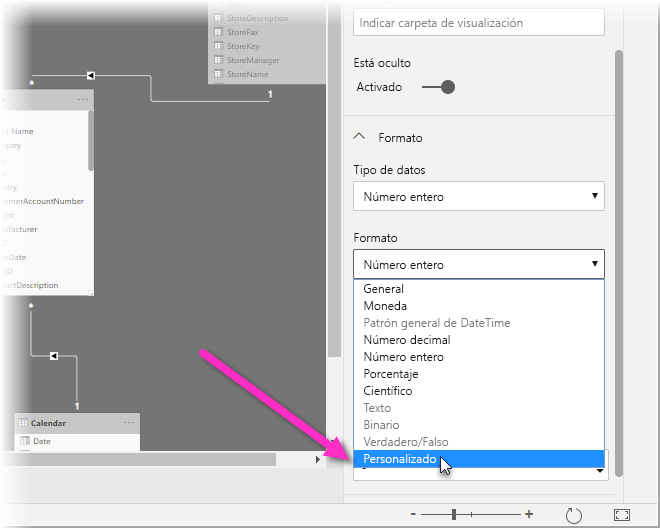
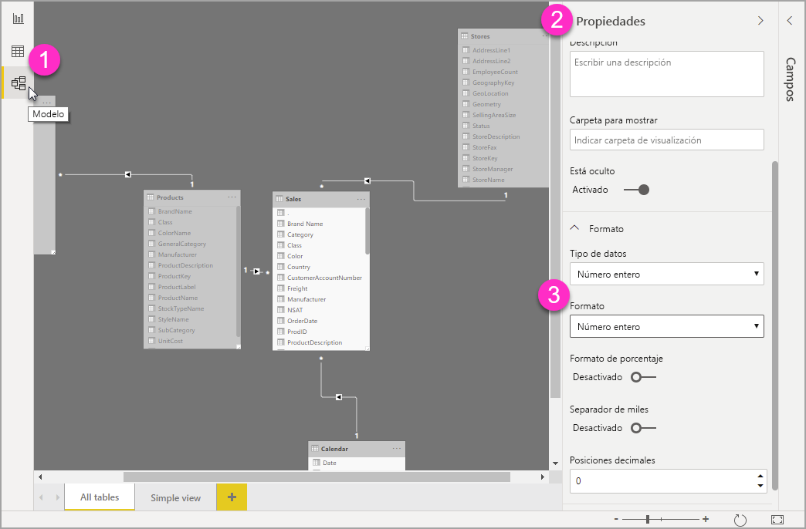

# Uso de cadenas de formato personalizado en Power BI Desktop

Con las cadenas de formato personalizado de **Power BI Desktop**, puede personalizar el modo en que los campos aparecen en los objetos visuales y asegurarse de que los informes tienen exactamente la apariencia que busca.

## Cómo usar cadenas de formato personalizado

Para crear cadenas de formato personalizado, seleccione el campo en la vista **Modelado** y, luego, seleccione **Formato** en el panel **Propiedades**.

Cuando haya seleccionado **Personalizado** en la lista desplegable **Formato**, puede seleccionar una de las cadenas de formato que se usan más comúnmente de la lista. 

## Sintaxis de formato personalizado admitida

Las cadenas de formato personalizado siguen la sintaxis de estilo VBA, común a Excel y a otros productos de Microsoft, pero no admiten toda la sintaxis usada en otros productos. 

En las tablas siguientes se define la sintaxis admitida en Power BI.

En la tabla siguiente se muestran los **símbolos de fecha** admitidos:

| **Símbolo** | **Intervalo** |
| --- | --- |
| _d_ | 1 a 31 (día del mes, sin cero a la izquierda). |
| _dd_ | 01 a 31 (día del mes, con un cero a la izquierda). |
| _m_ | 1 a 12 (mes del año, sin cero a la izquierda, a partir de enero = 1). |
| _mm_ | 01 a 12 (mes del año, con un cero a la izquierda, a partir de enero = 01). |
| _mmm_ | Muestra los nombres de los meses abreviados (los nombres de los meses Hijri no tienen abreviaturas). |
| _mmmm_ | Muestra los nombres de los meses completos. |
| _y_ | 1 a 366 (día del año). |
| _yy_ | 00 a 99 (últimos dos dígitos del año). |
| _yyyy_ | 100 a 9999 (año de tres o cuatro dígitos). |

En la tabla siguiente se muestran los **símbolos de hora** admitidos:

| **Símbolo** | **Intervalo** |
| --- | --- |
| _h_ | 0 a 23 (1 a 12 con &quot;AM&quot; o &quot;PM&quot; anexado) (hora del día, sin cero a la izquierda). |
| _hh_ | 00 a 23 (01 a 12 con &quot;AM&quot; o &quot;PM&quot; anexado) (hora del día, con un cero a la izquierda). |
| _n_ | 0 a 59 (minuto de hora, sin cero a la izquierda). |
| _nn_ | 00 a 59 (minuto de hora, con un cero a la izquierda). |
| _m_ | 0 a 59 (minuto de hora, sin cero a la izquierda). Solo si va precedido de _h_ o _hh_. |
| _mm_ | 00 a 59 (minuto de hora, con un cero a la izquierda). Solo si va precedido de _h_ o _hh_. |
| _s_ | 0 a 59 (segundo de minuto, sin cero a la izquierda). |
| _ss_ | 00 a 59 (segundo de minuto, con un cero a la izquierda) |

Puede ver un [ejemplo](https://docs.microsoft.com/office/vba/language/reference/user-interface-help/format-function-visual-basic-for-applications#example) de cómo cambiar el formato de las cadenas de valores personalizados.

Una expresión de formato definida por el usuario para los números puede tener de una a tres secciones separadas por punto y coma. Si incluye signos de punto y coma sin nada entre ellos, no se mostrará la sección que falta (será &quot;&quot;). Si no se especifica el punto y coma, se usará el formato positivo.

Estos son ejemplos de distintos formatos para diferentes cadenas de valor:

|   | **Cadenas de formato** |   |   |   |
| --- | --- | --- | --- | --- |
| **Valores** | **0,00;-0,0;&quot;Cero&quot;** | **0,00;;** | **0,00;-0,0;** | **0,00;** |
| **-1,234** | -1,2 | &quot;&quot; | -1,2 | &quot;&quot; |
| **0** | &quot;Cero&quot; | &quot;&quot; | &quot;&quot; | 0,00 |
| **1,234** | 1,23 | 1,23 | 1,23 | 1,23 |

En la tabla siguiente se identifican los **formatos de fecha y hora con nombre** predefinidos:

| **Nombre de formato** | **Descripción** |
| --- | --- |
| **Fecha general** | Muestra una fecha u hora, por ejemplo, 4/3/93 05:34 p. m. Si no hay ninguna parte fraccionaria, muestra solo una fecha, por ejemplo, 4/3/93. Si no hay ninguna parte entera, solo se muestra la hora, por ejemplo, 05:34 p. m. La visualización de las fechas viene determinada por la configuración del sistema. |
| **Fecha larga** | Muestra una fecha según el formato de fecha larga del sistema. |
| **Fecha corta** | Muestra una fecha con el formato de fecha corta del sistema. |
| **Hora larga** | Muestra una hora con el formato de hora larga del sistema; incluye horas, minutos y segundos. |
| **Hora corta** | Muestra una hora con el formato de 24 horas, por ejemplo, 17:45. |

Formatos numéricos con nombre

En la tabla siguiente se identifican los **formatos numéricos con nombre** predefinidos:

| **Nombre de formato** | **Descripción** |
| --- | --- |
| **Número general** | Muestra el número sin separador de miles. |
| **Moneda** | Muestra el número con separador de miles, si procede; muestra dos dígitos a la derecha del separador decimal. La salida se basa en la configuración regional del sistema. |
| **Fijo** | Muestra al menos un dígito a la izquierda y dos a la derecha del separador decimal. |
| **Estándar** | Muestra el número con separador de miles, al menos un dígito a la izquierda y dos a la derecha del separador decimal. |
| **Porcentaje** | Muestra el número multiplicado por 100 con un signo de porcentaje ( **%** ) anexado a la derecha; siempre muestra dos dígitos a la derecha del separador decimal. |
| **Científico** | Usa la notación científica estándar. |

En la tabla siguiente se identifican los caracteres que se pueden usar para crear **formatos de fecha y hora definidos por el usuario**.

| **Carácter** | **Descripción** |
| --- | --- |
| ( **:** ) | Separador de líneas. En algunas configuraciones regionales, se pueden usar otros caracteres para representar el separador de hora. El separador de hora separa las horas, los minutos y los segundos cuando se aplica formato a los valores de hora. La configuración del sistema determina el carácter real que se usa como separador de hora en la salida con formato. |
| ( **/** ) | Separador de fecha. En algunas configuraciones regionales, se pueden usar otros caracteres para representar el separador de fecha. El separador de fecha separa el día, el mes y el año cuando se aplica formato a los valores de fecha. La configuración del sistema determina el carácter real que se usa como separador de fecha en la salida con formato. |
| d | Muestra el día como un número sin un cero a la izquierda (1 a 31). |
| dd | Muestra el día como un número con un cero a la izquierda (01 a 31). |
| ddd | Muestra el día abreviado (dom a sáb). Localizado. |
| dddd | Muestra el día como un nombre completo (domingo a sábado). Localizado. |
| m | Muestra el mes como un número sin un cero a la izquierda (1 a 12). Si m sigue inmediatamente a h o hh, se muestra el minuto en lugar del mes. |
| mm | Muestra el mes como un número con un cero a la izquierda (01 a 12). Si m sigue inmediatamente a h o hh, se muestra el minuto en lugar del mes. |
| mmm | Muestra el mes abreviado (ene a dic). Localizado. |
| mmmm | Muestra el mes con el nombre completo (enero a diciembre). Localizado. |
| y | Muestra el día del año como un número (1 a 366). |
| yy | Muestra el año como un número de 2 dígitos (00 a 99). |
| yyyy | Muestra el año como un número de 4 dígitos (100 a 9999). |
| h | Muestra la hora como un número sin un cero a la izquierda (0 a 23). |
| hh | Muestra la hora como un número con un cero a la izquierda (00 a 23). |
| n | Muestra el minuto como un número sin un cero a la izquierda (0 a 59). |
| nn | Muestra el minuto como un número con un cero a la izquierda (00 a 59). |
| d | Muestra el segundo como un número sin un cero a la izquierda (0 a 59). |
| ss | Muestra el segundo como un número con un cero a la izquierda (00 a 59). |
| AM/PM | Usa el reloj de 12 horas y muestra AM en mayúsculas con cualquier hora antes del mediodía; muestra PM en mayúsculas con cualquier hora entre el mediodía y las 11:59 p.m. |

En la tabla siguiente se identifican los caracteres que se pueden usar para crear **formatos de número definidos por el usuario**.

| **Carácter** | **Descripción** |
| --- | --- |
| Ninguno | Muestra el número sin formato. |
| ( **0** ) | Marcador de posición de dígitos. Muestra un dígito o un cero. Si la expresión tiene un dígito en la posición donde aparece el 0 en la cadena de formato, se muestra; en caso contrario, se muestra un cero en esa posición. Si el número tiene menos dígitos que ceros (en cualquier lado del separador decimal) en la expresión de formato, se muestran ceros a la izquierda o a la derecha. Si el número tiene más dígitos a la derecha del separador decimal que ceros en la expresión de formato, se redondea el número a tantos lugares decimales como ceros haya. Si el número tiene más dígitos a la izquierda del separador decimal que ceros en la expresión de formato, se muestran los dígitos adicionales sin modificación. |
| ( **#** ) | Marcador de posición de dígitos. Muestra un dígito o nada. Si la expresión tiene un dígito en la posición donde aparece este símbolo en la cadena de formato, se muestra; en caso contrario, no se muestra nada en esa posición. Este símbolo funciona como marcador de posición de 0 dígitos, excepto que los ceros a la izquierda y a la derecha no se muestran si el número tiene los mismos dígitos o menos que caracteres # en cualquier lado del separador decimal en la expresión de formato. |
| ( **.** ) | Marcador de posición decimal. En algunas configuraciones regionales, se usa una coma como separador decimal. El marcador de posición decimal determina el número de dígitos que se muestran a la izquierda y a la derecha del separador decimal. Si la expresión de formato solo contiene signos de número a la izquierda de este símbolo, los números menores que 1 comienzan con un separador decimal. Para mostrar un cero a la izquierda con números fraccionarios, use 0 como primer marcador de posición de dígitos a la izquierda del separador decimal. El carácter real usado como marcador de posición de decimales en la salida con formato depende del formato de número que reconozca el sistema. |
| ( **%)** | Marcador de posición de porcentaje. La expresión se multiplica por 100. El carácter de porcentaje  **( %** ) se inserta en la posición en la que aparece en la cadena de formato. |
| ( **,** ) | Separador de miles. En algunas configuraciones regionales, se usa un punto como separador de miles. El separador de miles separa miles de cientos en un número que tiene cuatro o más posiciones a la izquierda del separador decimal. El uso estándar del separador de miles se especifica si el formato contiene un separador de miles rodeado de marcadores de posición de dígitos (**0** o **#** ). Dos separadores de miles adyacentes o un separador de miles inmediatamente a la izquierda del separador decimal (tanto si se especifica o no un decimal) significa &quot;dividir el número entre mil para escalarlo y redondearlo según sea necesario.&quot; Por ejemplo, puede usar la cadena de formato &quot;##0,,&quot; para representar 100 millones como 100. Los números menores que 1 millón se muestran como 0. Dos separadores de miles adyacentes en cualquier posición que no sea la inmediatamente a la izquierda del separador decimal se tratan simplemente como si se especificara el uso de un separador de miles. El carácter real que se usa como separador de miles en la salida con formato depende del formato de número que reconozca el sistema. |
| ( **:** ) | Separador de líneas. En algunas configuraciones regionales, se pueden usar otros caracteres para representar el separador de hora. El separador de hora separa las horas, los minutos y los segundos cuando se aplica formato a los valores de hora. La configuración del sistema determina el carácter real que se usa como separador de hora en la salida con formato. |
| ( **/** ) | Separador de fecha. En algunas configuraciones regionales, se pueden usar otros caracteres para representar el separador de fecha. El separador de fecha separa el día, el mes y el año cuando se aplica formato a los valores de fecha. La configuración del sistema determina el carácter real que se usa como separador de fecha en la salida con formato. |
| ( **E- E+ e- e+** ) | Formato científico. Si la expresión de formato contiene al menos un marcador de posición de dígitos ( **0** o **#** ) a la derecha de E-, E+, e- o e+, el número se muestra en formato científico y se inserta E o e entre el número y su exponente. El número de marcadores de posición de dígitos a la derecha determina el número de dígitos en el exponente. Use E- o e- para colocar un signo menos junto a los exponentes negativos. Use E + o e + para colocar un signo menos junto a los exponentes negativos y un signo más junto a los exponentes positivos. |
| **- + $**  ( ) | Muestra un carácter literal. Para mostrar un carácter que no sea uno de los enumerados, debe ir precedido de una barra diagonal inversa (\) o encerrado entre comillas dobles (&quot; &quot;). |
| ( * *\** ) | Muestra el siguiente carácter en la cadena de formato. Para mostrar un carácter que tiene un significado especial como un carácter literal, debe ir precedido de una barra diagonal inversa (\). La barra diagonal inversa no se muestra. El uso de una barra diagonal inversa es igual que incluir el carácter siguiente entre comillas dobles. Para mostrar una barra diagonal inversa, use dos barras diagonales inversas (\\). Algunos ejemplos de caracteres que se pueden mostrar como caracteres literales son los caracteres de formato de fecha y hora (a, c, d, h, m, n, p, q, s, t, w, y,/y:), los caracteres de formato numérico (#, 0,%, e, e, coma y punto) y los caracteres de formato de cadena (@, &amp;, \&lt;, \&gt; y !). |
| (&quot;ABC&quot;) | Muestra la cadena entre comillas dobles (&quot; &quot;). |

## Pasos siguientes
Puede que también esté interesado en los siguientes artículos:

* [Cadenas de formato VBA](https://docs.microsoft.com/office/vba/language/reference/user-interface-help/format-function-visual-basic-for-applications#example)
* [Medidas en Power BI Desktop](desktop-measures.md)
* [Tipos de datos en Power BI Desktop](desktop-data-types.md)
* [Formato condicional en tablas](desktop-conditional-table-formatting.md)

