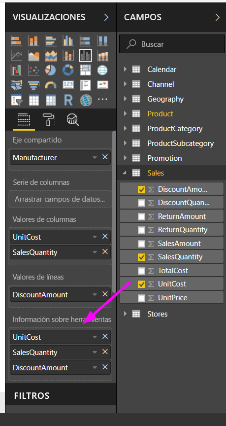
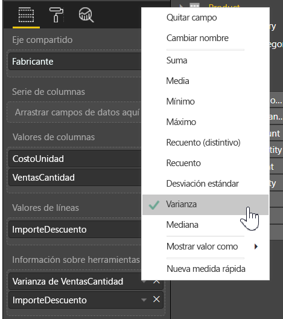

# Personalización de la información sobre herramientas en Power BI Desktop

La información sobre herramientas es una forma elegante de brindar más información contextual y detalles a los puntos de datos de un objeto visual. La imagen siguiente muestra una información sobre herramientas aplicada a un gráfico de Power BI Desktop.

Cuando se crea una visualización, la información sobre herramientas predeterminada muestra el valor y la categoría del punto de datos. Hay muchas instancias en las que personalizar la información sobre herramientas resulta útil. Personalizar la información sobre herramientas proporciona contexto e información adicionales a los usuarios que ven el objeto visual. La información sobre herramientas personalizada le permite especificar puntos de datos adicionales que se muestran como parte de la información sobre herramientas.

## Cómo personalizar la información sobre herramientas

Para crear una información sobre herramientas personalizada, en el área **Campos** del panel **Visualizaciones**, arrastre un campo al cubo **Información sobre herramientas**, como se muestra en la imagen siguiente. En la imagen siguiente, se colocaron tres campos en el cubo **Información sobre herramientas**.

Una vez que se agrega la información sobre herramientas a **Información sobre herramientas**, mantenga el puntero sobre un punto de datos en la visualización para ver los valores de esos campos.

## Personalización de la información sobre herramientas con agregación o medidas rápidas

Puede personalizar más una información sobre herramientas seleccionando una función de agregación o una *medida rápida*. Seleccione la flecha situada junto al campo en el cubo **Información sobre herramientas**. A continuación, seleccione entre las opciones disponibles.

Hay muchas formas de personalizar la información sobre herramientas, mediante cualquier campo disponible en el conjunto de datos, para transmitir información rápida y detallada a los usuarios que ven sus paneles o informes.
