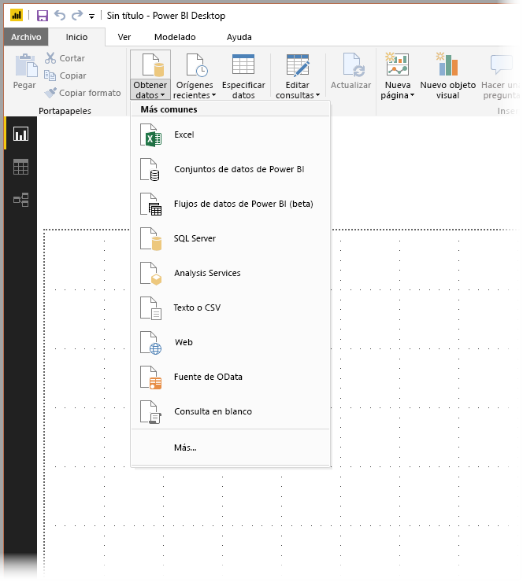
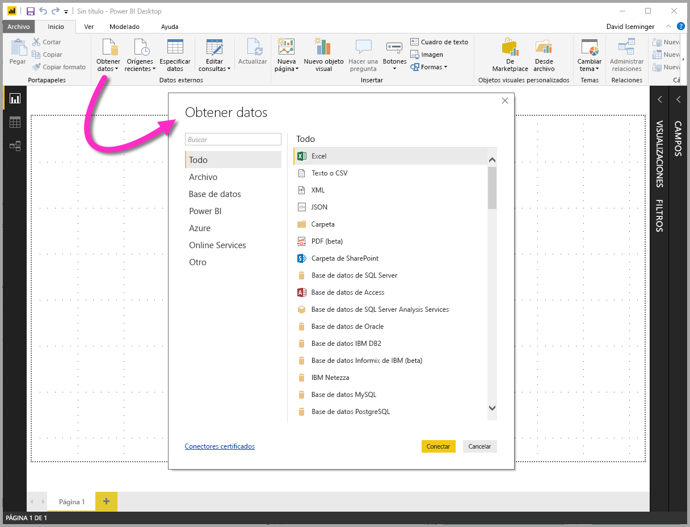
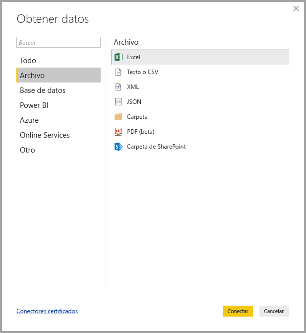
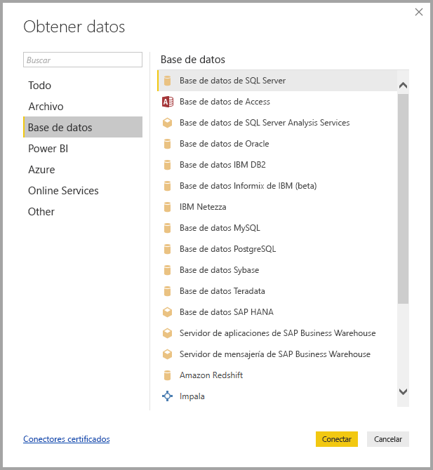
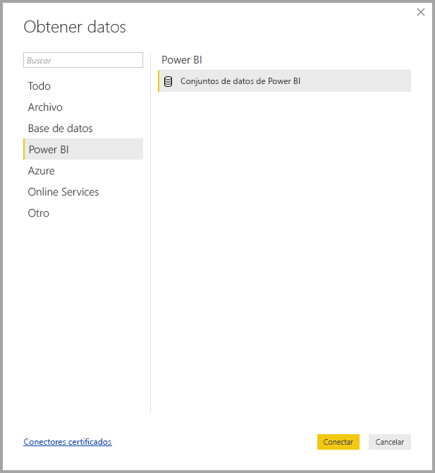
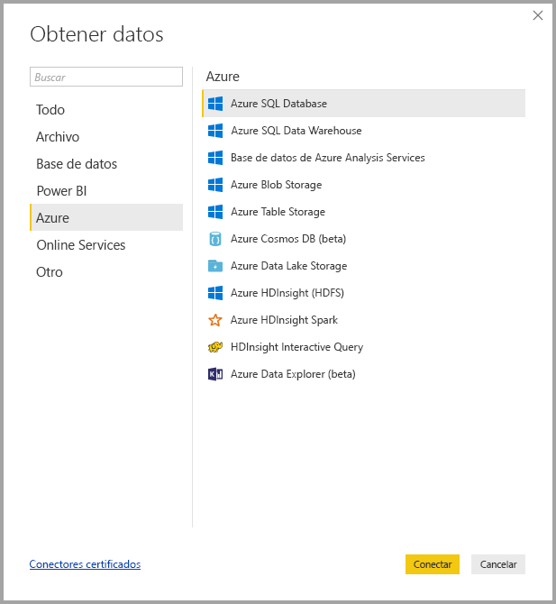
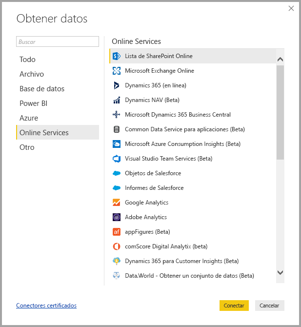
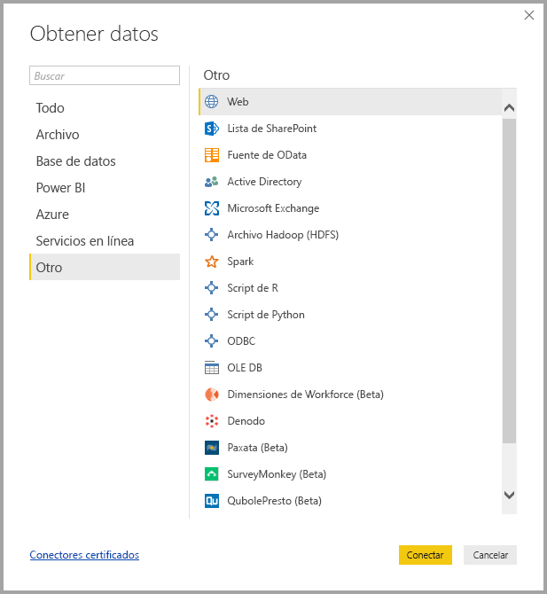
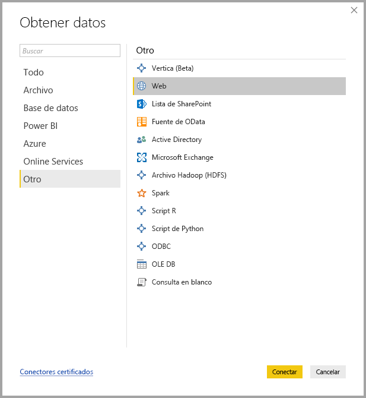

# Orígenes de datos en Power BI Desktop
Power BI Desktop permite conectarse a datos de muchos orígenes diferentes. En la parte inferior de esta página puede consultar una lista completa de los orígenes de datos disponibles.

Para conectarse a datos, seleccione **Obtener datos** desde la cinta de opciones **Inicio** . Al seleccionar la flecha abajo o el texto **Obtener datos** en el botón, se muestra el menú de tipos de datos **Más comunes** en la siguiente imagen:

Al seleccionar **Más…** en el menú **Más comunes**, se muestra la ventana **Obtener datos**. También puede abrir la ventana **Obtener datos** (y omitir el menú **Más comunes** ) seleccionando el icono **Obtener datos** **directamente** .

> [!NOTE]
> El equipo de Power BI está ampliando continuamente los orígenes de datos disponibles en **Power BI Desktop** y **servicio Power BI**. Por lo tanto, a menudo verá las versiones anteriores de orígenes de datos en proceso de desarrollo marcados como *Beta* o *Versión preliminar*. Cualquier origen de datos marcada como *Beta* o *Versión preliminar* tiene una compatibilidad y funcionalidades limitadas y, no debe usarse en entornos de producción.
> 
> 

## Orígenes de datos
Los tipos de datos se organizan en las categorías siguientes:

* Todos
* Archivo
* Base de datos
* Power BI
* Celeste
* Online Services
* Otros

La categoría **Todos** incluye todos los tipos de conexión de datos de todas las categorías.

La categoría **Archivo** proporciona las siguientes conexiones de datos:

* Excel
* Texto o CSV
* XML
* JSON
* Carpeta
* Carpeta de SharePoint

La siguiente imagen muestra la ventana **Obtener datos** para **Archivo**.

La categoría **Base de datos** proporciona las siguientes conexiones de datos:

* Base de datos de SQL Server
* Base de datos de Access
* Base de datos de SQL Server Analysis Services
* Base de datos de Oracle
* Base de datos IBM DB2
* Base de datos Informix de IBM (beta)
* IBM Netezza
* Base de datos de MySQL
* Base de datos de PostgreSQL
* Base de datos de Sybase
* Base de datos de Teradata
* Base de datos SAP HANA
* Servidor de aplicaciones de SAP Business Warehouse
* Servidor de mensajería de SAP Business Warehouse (Beta)
* Amazon Redshift
* Impala
* Google BigQuery
* Snowflake
* Exasol

> [!NOTE]
> Para habilitar algunos conectores de bases de datos, debe seleccionar primero **Archivo > Opciones y configuración > Opciones** y, después, **Características en vista previa**. Si no ve algunos de los conectores mencionados anteriormente y quiere usarlos, compruebe la configuración de **Características en vista previa**. Tenga también en cuenta que cualquier origen de datos marcada como *Beta* o *Versión preliminar* tiene una compatibilidad y funcionalidades limitadas, y no debe usarse en entornos de producción.
> 
> 

La siguiente imagen muestra la ventana **Obtener datos** para **Base de datos**.

La categoría **Power BI** proporciona las siguientes conexiones de datos:

* Conjuntos de datos de Power BI
* Grupos de datos de Power BI (beta)

La siguiente imagen muestra la ventana **Obtener datos** para **Power BI**.

La categoría **Azure** proporciona las siguientes conexiones de datos:

* Azure SQL Database
* Azure SQL Data Warehouse
* Base de datos de Azure Analysis Services
* Azure Blob Storage
* Azure Table Storage
* Azure Cosmos DB (beta)
* Azure Data Lake Store
* Azure HDInsight (HDFS)
* Azure HDInsight Spark (Beta)
* HDInsight Interactive Query (Beta)
* KustoDB de Azure (beta)

La siguiente imagen muestra la ventana **Obtener datos** para **Azure**.

La categoría **Online Services** proporciona las siguientes conexiones de datos:

* Lista de SharePoint Online
* Microsoft Exchange Online
* Dynamics 365 (en línea)
* Dynamics NAV (Beta)
* Dynamics 365 Business Central
* Common Data Service para aplicaciones (Beta)
* Common Data Service (Beta)
* Microsoft Azure Consumption Insights (Beta)
* Visual Studio Team Services (Beta)
* Objetos de Salesforce
* Informes de Salesforce
* Google Analytics
* Adobe Analytics
* appFigures (Beta)
* comScore Digital Analytix (beta)
* Dynamics 365 para Customer Insights (Beta)
* Data.World - Obtener un conjunto de datos (Beta)
* Facebook
* GitHub (Beta)
* MailChimp (Beta)
* Marketo (Beta)
* Mixpanel (Beta)
* Planview Enterprise One - PRM (Beta)
* PlanView Projectplace (Beta)
* QuickBooks Online (Beta)
* Smartsheet
* SparkPost (Beta)
* Stripe (Beta)
* SweetIQ (Beta)
* PlanView Enterprise One - CMT (Beta)
* Twilio (Beta)
* tyGraph (Beta)
* Webtrends (Beta)
* Zendesk (Beta)
* TeamDesk (Beta)

La imagen siguiente muestra la ventana **Obtener datos** para **Online Services**

La categoría **Otros** proporciona las siguientes conexiones de datos:

* Vertica (Beta)
* Web
* Lista de SharePoint
* Fuente de OData
* Active Directory
* Microsoft Exchange
* Archivo Hadoop (HDFS)
* Spark (Beta)
* Script R
* ODBC
* OLE DB
* Consulta en blanco

La siguiente imagen muestra la ventana **Obtener datos** para **Otros**.

> [!NOTE]
> En este momento, no es posible conectarse a orígenes de datos personalizados que se protegen mediante Azure Active Directory.
> 
> 

## Conectarse a un origen de datos
Para conectarse a un origen de datos, seleccione el origen de datos en la ventana **Obtener datos** y seleccione **Conectar**. En la siguiente imagen, la opción **Web** está seleccionada en la categoría de conexión de datos **Otros** .

Se muestra una ventana de conexión, específica al tipo de conexión de datos. Si se necesitan credenciales, se le pedirá que las proporcione. La siguiente imagen muestra una dirección URL que se escribió para conectarse a un origen de datos web.

Cuando se escribe la información de conexión de recurso o la dirección URL, seleccione **Aceptar**. Power BI Desktop realiza la conexión al origen de datos y presenta los orígenes de datos disponibles en el **Navegador**.

Puede cargar los datos seleccionando el botón **Cargar** situado en la parte inferior del panel **Navegador** , o bien editar la consulta antes de cargar datos seleccionando el botón **Editar** .

Eso es todo lo que se necesita para conectarse a orígenes de datos en Power BI Desktop. Intente conectarse a datos de nuestra lista de orígenes de datos en crecimiento y vuelva a consultarla con frecuencia, debido a que siempre agregamos elementos a esta lista.

## Pasos siguientes
Se puede hacer todo tipo de cosas con Power BI Desktop. Para obtener más información sobre sus capacidades, consulte los siguientes recursos:

* [¿Qué es Power BI Desktop?](desktop-what-is-desktop.md)
* [Información general sobre consultas con Power BI Desktop](desktop-query-overview.md)
* [Tipos de datos en Power BI Desktop](desktop-data-types.md)
* [Combinar datos y darles forma con Power BI Desktop](desktop-shape-and-combine-data.md)
* [Tareas de consultas comunes en Power BI Desktop](desktop-common-query-tasks.md)    
