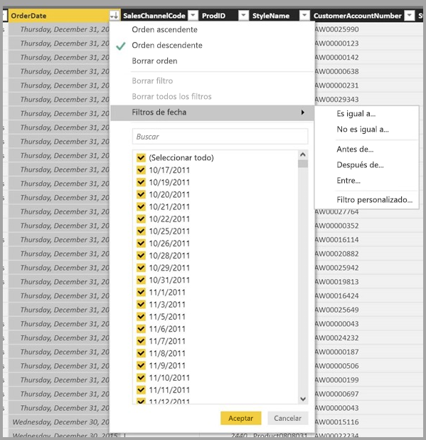

# Vista de datos en Power BI Desktop
La **vista de datos** le permite inspeccionar, explorar y analizar los datos de su modelo de **Power BI Desktop**. Es diferente de cómo ve las tablas, columnas y datos en el **Editor de consultas**. Con la vista de datos, ve los datos *después* de que se hayan cargado en el modelo.

Cuando se están modelando los datos, a veces desea ver lo que hay realmente en una tabla o columna sin crear un elemento visual en el lienzo del informe, normalmente justo debajo del nivel de fila. Es útil sobre todo cuando crea columnas calculadas y medidas o cuando tiene que identificar un tipo de datos o una categoría de datos.

Eche un vistazo más de cerca a algunos de los elementos de la **vista de datos**.

1. **Icono de vista de datos**: seleccione este icono para entrar en la vista de datos.

2. **Cuadrícula de datos**: se muestra la tabla seleccionada y todas las columnas y filas que contiene. Las columnas ocultas de la **vista de informe** están atenuadas. Puede hacer clic con el botón derecho en una columna de opciones.

3. **Cinta de opciones de modelado**: aquí puede administrar relaciones, crear cálculos y cambiar el tipo de datos, el formato y la categoría de datos de una columna.

4. **Barra de fórmulas**: indique fórmulas DAX para las columnas calculadas y las medidas.

5. **Búsqueda**: busque una tabla o una columna en el modelo.

6. **Lista de campos**: seleccione una tabla o una columna para verla en la cuadrícula de datos.

## Filtrado en la vista de datos

También puede filtrar y ordenar datos en la **vista de datos**. En cada columna se muestra un icono que identifica la dirección de ordenación (si procede).

Puede filtrar valores concretos o puede usar el filtrado avanzado en función de los datos de la columna. 

