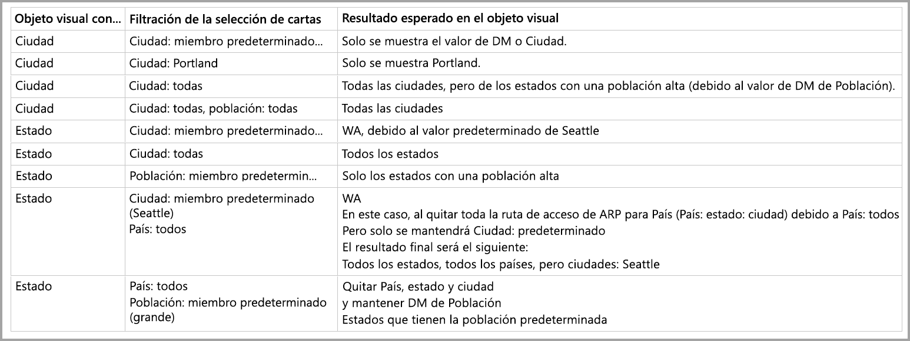

# Miembro predeterminado en los modelos multidimensionales en Power BI

Puede conectarse a modelos multidimensionales en Power BI y crear informes que en los que se visualizan todos los tipos de datos dentro del modelo. Cuando se trabaja con modelos multidimensionales, Power BI aplica reglas al modo de procesar datos, en función de la columna que se defina como *miembro predeterminado*. 

Cuando se trabaja con los modelos multidimensionales, Power BI trata los datos del modelo en función de dónde se utilice la columna que contiene el valor **DefaultMember**. El atributo *DefaultMember* se establece en CSDL (lenguaje de definición de esquemas conceptuales) para una columna determinada en un modelo multidimensional. Puede aprender más sobre el miembro predeterminado en el [artículo de las propiedades de su atributo](https://docs.microsoft.com/sql/analysis-services/multidimensional-models/attribute-properties-define-a-default-member?view=sql-server-2017). Cuando se ejecuta una consulta de DAX, el miembro predeterminado especificado en el modelo se aplica automáticamente.

En este artículo se describe cómo se comporta Power BI en diversas circunstancias cuando se trabaja con modelos multidimensionales, en función de dónde se encuentre el *modelo predeterminado*. 

## Trabajo con tarjetas de filtro

Al crear una tarjeta de filtro en un campo con un miembro predeterminado, el valor del campo del miembro predeterminado se selecciona automáticamente en la tarjeta de filtro. Como resultado, todos los objetos visuales que se ven afectados por la tarjeta de filtro conservan sus modelos predeterminados en la base de datos. Los valores de dichas tarjetas de filtro reflejan ese miembro predeterminado.

Si se quita el miembro predeterminado, la anulación de la selección del valor lo borra para todos los objetos visuales a los que se aplica la tarjeta de filtro, y los valores mostrados no reflejan el miembro predeterminado.

Por ejemplo, imagine que tenemos una columna *Currency* que tiene el miembro predeterminado establecido en *USD*:

* En este caso de ejemplo, si tenemos una tarjeta que muestra *Total Sales*, el valor tendrá el miembro predeterminado aplicado y vemos las ventas que corresponden a "USD".
* Si arrastramos *Currency* al panel de la tarjeta de filtro, vemos *USD* como valor predeterminado seleccionado. El valor de *Total Sales* sigue siendo el mismo, porque está aplicado el miembro predeterminado.
* Sin embargo, si desactivamos el valor *USD* de la tarjeta de filtro, el miembro predeterminado *Currency* se elimina y ahora *Total Sales* refleja todas las monedas.
* Por lo tanto, cuando se selecciona otro valor en la tarjeta de filtro (supongamos que seleccionamos *EURO*) junto con el miembro predeterminado, *Total Sales* refleja el filtro *Currency IN {USD, EURO}* .

## Comportamiento de agrupación

En Power BI, cada vez que agrupa un objeto visual en una columna que tiene un *miembro predeterminado*, Power BI borra el *miembro predeterminado* de esa columna y su ruta de acceso de relación de atributo. De este modo se garantiza que el objeto visual muestre todos los valores, en lugar de solo los valores predeterminados.

## Rutas de acceso de relación de atributo

Las rutas de acceso de relación de atributo proporcionan *miembros predeterminados* con funciones eficaces, pero también presentan cierta complejidad. Cuando se encuentran rutas de acceso de relación de atributo, Power BI sigue la ruta de acceso de tales rutas para borrar los miembros predeterminados adicionales de otras columnas, a fin de ofrecer un control coherente y preciso de los datos para los elementos visuales.

Veamos un ejemplo para aclarar este comportamiento. Supongamos que la configuración de las rutas de acceso de relación de atributo es la siguiente:

Ahora imaginemos que se establecen los siguientes *miembros predeterminados* para estas columnas:

* City > Seattle
* State > WA
* Country > US
* Population > Large

Ahora examinemos lo que sucede cuando cada una de las columnas se usa en Power BI. Cuando los objetos visuales se agrupan en las siguientes columnas, estos son los resultados:

* **City**: Power BI muestra todas las ciudades borrando todos los **miembros predeterminados** para *City*, *State*, *Country*, pero conserva el **miembro predeterminado** para *Population*; Power BI borra toda la ruta de acceso de relación de atributo para *City*.
    > [!NOTE]
    > *Population* no está en la ruta de acceso de relación de atributo de *City*, está relacionado únicamente con *State* y, por tanto, Power BI no la desactiva.
* **State**: Power BI muestra todos los valores de *State* borrando todos los **miembros predeterminados** para *City*, *State*, *Country* y *Population*.
* **Country**: Power BI muestra todos los países borrando todos los **miembros predeterminados** para *City*, *State* y *Country*, pero conserva el **miembro predeterminado** para *Population*.
* **City y State**: Power BI borra todos los **miembros predeterminados** para todas las columnas.

Los grupos que se muestran en el objeto visual tienen toda su ruta de acceso de relación de atributo borrada. 

Si un grupo no se muestra en el objeto visual, pero forma parte de la ruta de acceso de relación de atributo de otra alumna agrupada, se aplica lo siguiente:

* No todas las ramas de la ruta de acceso de relación de atributo se borran automáticamente.
* Ese grupo todavía se filtra por ese **miembro predeterminado** no borrado.

### Segmentaciones de datos y tarjetas de filtro

Cuando se trabaja con segmentaciones de datos o tarjetas de filtro, se produce el siguiente comportamiento:

* Cuando se carga con datos una segmentación de datos o una tarjeta de filtro, Power BI agrupa según la columna en el objeto visual, así que el comportamiento de la visualización es el mismo que se describe en la sección anterior.

Puesto que las segmentaciones de datos y las tarjetas de filtro a menudo se utilizan para interactuar con otros objetos visuales, la lógica de borrado de **miembros predeterminados** de los objetos visuales afectados se produce como se explica en la tabla siguiente. 

Para esta tabla, se utilizan los mismos datos de ejemplo usados anteriormente en este artículo:

Se aplican las siguientes reglas al funcionamiento de Power BI en estas circunstancias.

Power BI borra un **miembro predeterminado** para una columna determinada si:

* Power BI agrupa según esa columna
* Power BI agrupa según una columna relacionada con esa columna (en cualquier lugar de la ruta de acceso de relación de atributo, hacia arriba o hacia abajo)
* Power BI filtra según una columna que está en la ruta de acceso de relación de atributo (arriba o abajo)
* La columna tiene una tarjeta de filtro con el estado *ALL*
* La columna tiene una tarjeta de filtro con cualquier valor seleccionado (Power BI recibe un filtro para la columna)

Power BI NO borra un **miembro predeterminado** para una columna determinada si:

* La columna tiene una tarjeta de filtro con el estado predeterminado y Power BI agrupa según una columna en su ruta de acceso de relación de atributo.
* La columna está por encima de otra columna en la ruta de acceso de relación de atributo y Power BI tiene una tarjeta de filtro para esa otra columna en estado predeterminado.

## Pasos siguientes

En este artículo se describe el comportamiento de Power BI cuando se trabaja con miembros predeterminados en modelos multidimensionales. Puede que también esté interesado en los siguientes artículos: 

* [Característica Mostrar elementos sin datos de Power BI](desktop-show-items-no-data.md)
* [Orígenes de datos en Power BI Desktop](desktop-data-sources.md)
