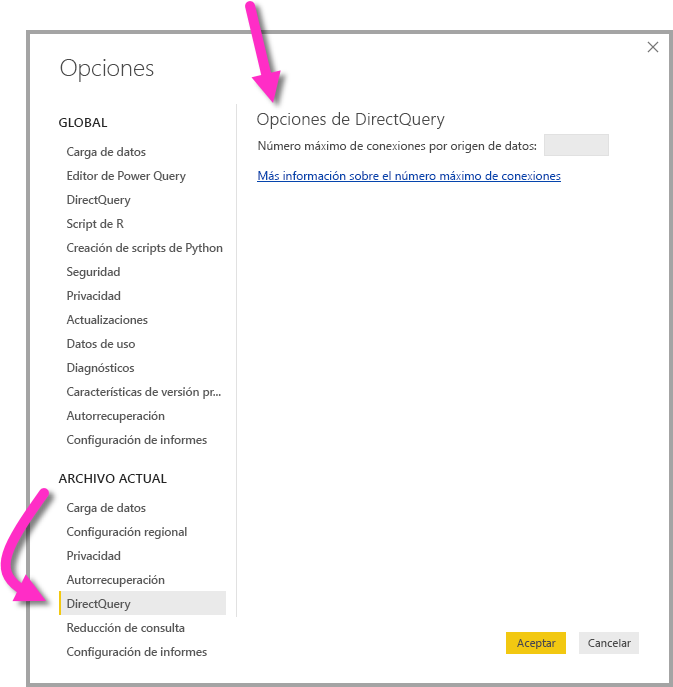

# <a name="about-using-directquery-in-power-bi"></a>Acerca del uso de DirectQuery en Power BI

Puede conectarse a todo tipo de orígenes de datos distintos cuando usa *Power BI Desktop* o el *servicio Power BI*, y establecer esas conexiones de datos de otras formas. Puede *importar* datos a Power BI, que es la forma más común de obtener datos, o bien conectarse directamente a los datos en el repositorio de origen original, lo que se conoce como *DirectQuery*. En este artículo se describe DirectQuery y sus funcionalidades:

* Distintas opciones de conectividad para DirectQuery
* Guía para cuando se deba considerar usar DirectQuery en lugar de la importación
* Desventajas del uso de DirectQuery
* Procedimientos recomendados para usar DirectQuery

Siga los procedimientos recomendados sobre el uso de la importación frente a DirectQuery:

* Debe importar datos a Power BI siempre que sea posible. La importación aprovecha el motor de consultas de alto rendimiento de Power BI y ofrece una experiencia completa y altamente interactiva.
* Si no puede cumplir sus objetivos importando datos, considere la posibilidad de usar DirectQuery. Por ejemplo, si los datos cambian con frecuencia y los informe deben reflejar los datos más recientes, es posible que la mejor opción sea DirectQuery. Aunque el uso de DirectQuery solo es viable cuando el origen de datos subyacente puede proporcionar consultas interactivas (en menos de cinco segundos) para la típica consulta de funciones agregadas y puede controlar la carga de consultas que se va a generar. Además, es necesario estudiar cuidadosamente la lista de limitaciones inherentes al uso de DirectQuery.

El conjunto de funcionalidades que ofrece Power BI para la importación y DirectQuery evolucionará con el tiempo. Los cambios incluyen proporcionar más flexibilidad cuando se usen datos importados, de manera que la importación se pueda utilizar en más casos, y eliminar algunas de las desventajas que presenta el uso de DirectQuery. Independientemente de las mejoras, cuando use DirectQuery, preste siempre mucha atención al rendimiento del origen de datos subyacente. Si el origen de datos subyacente en cuestión es lento, seguirá siendo inviable usar DirectQuery para ese origen.

En este artículo se describe DirectQuery con Power BI y no *SQL Server Analysis Services*. DirectQuery también es una característica de SQL Server Analysis Services. Muchos de los detalles que se describen en este artículo se aplican a esa característica. También hay diferencias importantes. Para obtener información sobre cómo usar DirectQuery con SQL Server Analysis Services, vea [DirectQuery en SQL Server 2016 Analysis Services](https://download.microsoft.com/download/F/6/F/F6FBC1FC-F956-49A1-80CD-2941C3B6E417/DirectQuery%20in%20Analysis%20Services%20-%20Whitepaper.pdf).

Este artículo se centra en el flujo de trabajo recomendado para DirectQuery, donde el informe se crea en Power BI Desktop pero, además, trata sobre cómo conectarse directamente en el servicio Power BI.

## <a name="power-bi-connectivity-modes"></a>Modos de conectividad de Power BI

Power BI se conecta a una gran cantidad de orígenes de datos distintos, entre los que se encuentran los siguientes:

* Servicios en línea (Salesforce, Dynamics 365, etc.)
* Bases de datos (SQL Server, Access, Amazon Redshift, etc.)
* Archivos simples (Excel, JSON, etc.)
* Otros orígenes de datos (Spark, Websites, Microsoft Exchange, etc.)

Para estos orígenes, es posible importar los datos a Power BI. Para algunos, también es posible conectarse mediante DirectQuery. Para obtener un resumen de los orígenes que admiten DirectQuery, vea [Orígenes de datos compatibles con DirectQuery](desktop-directquery-data-sources.md). La mayoría de los orígenes será compatible con DirectQuery en el futuro, centrándose principalmente en los orígenes que se puede esperar que tengan un buen rendimiento de consultas interactivas.

SQL Server Analysis Services es un caso especial. Cuando se conecta a SQL Server Analysis Services, puede elegir importar los datos o usar una *conexión dinámica*. El uso de una conexión dinámica es similar a DirectQuery. No se importa ningún dato y el origen de datos subyacente se consulta siempre para actualizar un objeto visual. Una conexión dinámica es diferente en muchos aspectos, por lo que se usa otro término, *conexión dinámica* frente a *DirectQuery*.

En las siguientes secciones se explican detalladamente estas tres opciones de conexión a los datos: *importación*, *DirectQuery* y *conexión dinámica*.

### <a name="import-connections"></a>Importación de conexiones

En cuanto a la importación, cuando se usa **Obtener datos** en Power BI Desktop para conectarse a un origen de datos como SQL Server y se elige Importar, el comportamiento de dicha conexión es el siguiente:

* Durante la experiencia inicial de Obtener datos, cada conjunto de tablas seleccionado define una consulta que devolverá un conjunto de datos. Esas consultas pueden editarse antes de cargar los datos para, por ejemplo, aplicar filtros, agregar los datos o combinar distintas tablas.
* Después de la carga, todos los datos definidos por esas consultas se importarán a la caché de Power BI.
* Después de crear un objeto visual dentro de Power BI Desktop, se consultarán los datos importados. El almacén de Power BI garantiza que la consulta será rápida. Todos los cambios realizados en los objetos visuales se reflejan inmediatamente.
* Los cambios que se hagan en los datos subyacentes no se reflejarán en ningún objeto visual. Es necesario *actualizar* para volver a importar los datos.
* Después de publicar el informe como archivo *.pbix* en el servicio Power BI, se crea un conjunto de datos y se carga en el servicio Power BI. Los datos importados se incluyen en ese conjunto de datos. Entonces es posible configurar una actualización programada de esos datos para, por ejemplo, volver a importar los datos todos los días. En función de la ubicación del origen de datos original, podría ser necesario configurar una puerta de enlace de datos local.
* Cuando se abre un informe existente en el servicio Power BI o se crea otro informe, los datos importados se consultan de nuevo, lo que garantiza la interactividad.
* Además, pueden anclarse objetos virtuales o páginas de informes completas como iconos de un panel. Los iconos se actualizarán automáticamente cada vez que se actualice el conjunto de datos subyacente.

### <a name="directquery-connections"></a>Conexiones de DirectQuery

En el caso de DirectQuery, cuando se usa **Obtener datos** en Power BI Desktop para conectarse a un origen de datos, el comportamiento de dicha conexión es el siguiente:

* Durante la experiencia inicial de Obtener datos, se selecciona el origen. En el caso de los orígenes relacionales, se selecciona un conjunto de tablas y cada una de ellas sigue definiendo una consulta que lógicamente devuelve un conjunto de datos. En el caso de los orígenes multidimensionales, como SAP BW, solo se selecciona el origen.
* Aunque, después de la carga, no se importará ningún dato al almacén de Power BI. En cambio, después de crear un objeto visual dentro de Power BI Desktop, las consultas se enviarán al origen de datos subyacente para recuperar los datos necesarios. El tiempo que se tarda en actualizar el objeto visual depende del rendimiento del origen de datos subyacente.
* Los cambios que se hagan en los datos subyacentes no se reflejan de inmediato en ningún objeto visual existente. Todavía es necesario actualizar. Las consultas necesarias se reenvían para cada uno de los objetos visuales y el objeto visual se actualiza según sea necesario.
* Después de publicar el informe en el servicio Power BI, generará nuevamente un conjunto de datos en el servicio Power BI, como ocurre con la importación. Sin embargo, no se incluyen *datos* en ese conjunto de datos.
* Cuando se abre un informe existente en el servicio Power BI o se crea otro informe, el origen de datos subyacente se consulta de nuevo para recuperar los datos necesarios. En función de la ubicación del origen de datos original, es posible que sea necesario configurar una puerta de enlace de datos local, tal y como se necesita para el modo de importación si se actualizan los datos.
* Además, pueden anclarse objetos virtuales o páginas de informes completas como iconos de un panel. Para garantizar que la apertura de un panel sea rápida, los iconos se actualizan automáticamente de acuerdo con una programación (por ejemplo, cada hora). La frecuencia de esta actualización se puede controlar para que refleje la frecuencia con que cambian los datos y la importancia que tiene poder ver los datos más recientes. Cuando se abra un panel, los iconos reflejarán los datos en el momento de la última actualización y no necesariamente los cambios más recientes efectuados en el origen subyacente. Puede actualizar un panel abierto para asegurarse de que está actualizado.

### <a name="live-connections"></a>Conexiones dinámicas

Cuando se conecta a SQL Server Analysis Services, tiene la opción de importar datos desde el modelo de datos seleccionado o conectarse a él de manera dinámica. Si utiliza la importación, se define una consulta en ese origen SQL Server Analysis Services externo y los datos se importarán de forma normal. Si usa la conexión dinámica, no se define ninguna consulta y se muestra el modelo externo completo en la lista de campos.

La situación descrita en el párrafo anterior también se aplica a las conexiones con los siguientes orígenes, salvo que no hay ninguna opción para importar los datos:

* Conjuntos de datos de Power BI, por ejemplo, cuando se conecta a un conjunto de datos de Power BI creado anteriormente y que se publicó en el servicio, para crear un nuevo informe sobre él.
* Common Data Services.

El comportamiento de los informes en SQL Server Analysis Services, después de la publicación en el servicio Power BI, es similar a los informes de DirectQuery de las siguientes maneras:

* Cuando se abre un informe existente en el servicio Power BI o se crea otro informe, se consulta el origen SQL Server Analysis Services subyacente, lo que posiblemente requiera una puerta de enlace de datos local.
* Los iconos de panel se actualizan automáticamente según una programación, por ejemplo cada hora.

También hay diferencias importantes. Por ejemplo, en el caso de las conexiones dinámicas, la identidad del usuario que abre el informe siempre se pasa al origen SQL Server Analysis Services subyacente.

Una vez mencionadas estas comparaciones, el resto de este artículo se centrará únicamente en DirectQuery.

## <a name="when-is-directquery-useful"></a>¿Cuándo es útil usar DirectQuery?

En la tabla siguiente se describen los escenarios en los que la conexión con DirectQuery podría ser especialmente útil. Incluye casos en los que dejar los datos en el origen original se consideraría beneficioso. La descripción incluye un análisis sobre si el escenario especificado está disponible en Power BI.

| Limitación | Descripción |
| --- | --- |
| Los datos cambian con frecuencia y se requiere generar informes casi en tiempo real |Los modelos con datos importados se pueden actualizar como máximo una vez por hora. Si los datos cambian constantemente y es necesario que en los informes se muestren los datos más recientes, es posible que usar la importación con actualización programada no satisfaga esas necesidades. Puede transmitir datos en secuencias directamente a Power BI, aunque existen límites en los volúmenes de datos que se admiten en este caso. <br/> <br/> Por el contrario, el uso de DirectQuery significa que cuando se abre o actualiza un informe o panel siempre se muestran los datos más recientes en el origen. Además, los iconos de panel se pueden actualizar con más frecuencia (incluso cada 15 minutos). |
| El volumen de datos es muy grande |Si el volumen de datos es muy grande, sin duda no sería posible importarlos todos. Por el contrario, DirectQuery no requiere una transferencia de datos de gran volumen, puesto que la consulta se realiza en contexto. <br/> <br/> Pero los datos de gran tamaño también podrían implicar que el rendimiento de las consultas sobre ese origen subyacente es demasiado lento, tal y como se describe en [Implicaciones del uso de DirectQuery](#implications-of-using-directquery). No siempre tiene que importar los datos detallados completos. En cambio, los datos se pueden agregar previamente durante la importación. El *Editor de consultas* facilita la agregación previa durante la importación. En último caso, sería posible importar exactamente los datos agregados que se necesitan para cada objeto visual. Si bien DirectQuery es el enfoque más simple cuando se trata de datos de gran tamaño, la importación de datos agregados podría ser una buena solución si el origen subyacente es demasiado lento. |
| Las reglas de seguridad están definidas en el origen subyacente |Cuando se importan los datos, Power BI se conectará al origen de datos con las credenciales del usuario actual en Power BI Desktop o con las credenciales definidas como parte de la configuración de la actualización programada en el servicio Power BI. Al publicar y compartir dicho informe, tenga cuidado de compartirlo solo con usuarios que tienen permitido ver los mismos datos o definir seguridad de nivel de fila como parte del conjunto de datos. <br/> <br/> Idealmente, como DirectQuery siempre consulta el origen subyacente, esta configuración permitiría aplicar cualquier medida de seguridad en ese origen subyacente. Sin embargo, actualmente Power BI siempre se conecta al origen subyacente con las mismas credenciales que se usarían para la importación. <br/> <br/> Hasta que Power BI permita que la entidad del consumidor del informe pase al origen subyacente, DirectQuery no ofrece ninguna ventaja en cuanto a la seguridad del origen de datos. |
| Se aplican restricciones de soberanía de datos |Algunas organizaciones tienen directivas en torno a la soberanía de datos, lo que significa que los datos no pueden salir de las instalaciones de la organización. Claramente, una solución basada en la importación presentaría problemas. Por el contrario, con DirectQuery los datos quedan en el origen subyacente. <br/> <br/> Sin embargo, incluso con DirectQuery, algunas cachés de datos en el nivel de objeto visual se mantienen en el servicio Power BI debido a la actualización programada de los iconos. |
| El origen de datos subyacente es un origen OLAP que contiene medidas |Si el origen de datos subyacente contiene *medidas* tales como SAP HANA o SAP Business Warehouse, la importación de los datos genera otros problemas. Esto significa que los datos que se importan están en un nivel determinado de agregación, según lo definido por la consulta. Por ejemplo, medidas **TotalSales** por **Class**, **Year** y **City**. Después, si se crea un objeto visual que solicita datos a un agregado de nivel superior, como **TotalSales** por **Year**, se agrega adicionalmente al valor agregado. Esta agregación resulta adecuada con medidas de adición (como **Sum** o **Min**), pero supone un problema para las que no son de adición (como **Average** o **DistinctCount**). <br/> <br/> Para facilitar la obtención de los datos agregados correctos, según sea necesario para el objeto visual determinado, directamente desde el origen, se necesitaría enviar consultas por objeto visual, como en DirectQuery. <br/> <br/> Cuando se conecte a SAP Business Warehouse (BW), si elige DirectQuery permite este tratamiento de las medidas. Para obtener información sobre SAP BW, vea [DirectQuery y SAP BW](desktop-directquery-sap-bw.md). <br/> <br/> Sin embargo, actualmente DirectQuery sobre SAP HANA lo trata del mismo modo que un origen relacional y presenta un comportamiento similar en la importación. Este enfoque se analiza con más detalles en [DirectQuery y SAP HANA](desktop-directquery-sap-hana.md). |

En resumen, dadas las funcionalidades actuales de DirectQuery en Power BI, ofrece las ventajas en los escenarios siguientes:

* Los datos cambian con frecuencia y se requiere generar informes casi en tiempo real.
* Control de datos muy grandes, sin necesidad de agregarlos previamente.
* Se aplican restricciones de soberanía de datos.
* El origen de datos es un origen multidimensional que contiene medidas (como SAP BW).

Los detalles de la lista anterior solo están relacionados con el uso de Power BI. En su lugar, podría usar un modelo de SQL Server Analysis Services o Azure Analysis Services externo para importar los datos. Luego, use Power BI para conectarse a ese modelo. Si bien ese enfoque podría requerir configuración adicional, proporciona una mayor flexibilidad. Se pueden importar volúmenes de datos mucho más grandes. No hay ninguna restricción sobre la frecuencia con que se pueden actualizar los datos.

## <a name="implications-of-using-directquery"></a>Implicaciones de usar DirectQuery

El uso de DirectQuery tiene algunas posibles implicaciones negativas, tal como se detalla en esta sección. Algunas de esas limitaciones son ligeramente distintas en función del origen exacto que se usa. Abordamos las limitaciones cuando corresponda y esos orígenes, sustancialmente distintos, se describen en artículos independientes.

### <a name="performance-and-load-on-the-underlying-source"></a>Rendimiento y carga en el origen subyacente

Cuando se usa DirectQuery, la experiencia general depende en gran medida del rendimiento del origen de datos subyacente. Si la actualización de cada uno de los objetos visuales, por ejemplo, después de cambiar un valor de segmentación, tarda unos segundos, normalmente menos de 5 segundos, la experiencia sería razonable. La experiencia podría percibirse como lenta en comparación con la respuesta inmediata al importar los datos en Power BI. Si la lentitud del origen hace que los objetos visuales individuales tarden más de diez segundos, la experiencia es muy deficiente. Las consultas pueden incluso agotar el tiempo de espera.

Junto con el rendimiento del origen subyacente, preste atención a la carga que se encuentra en el origen. La carga afecta al rendimiento. Cada usuario que abre un informe compartido y cada icono del panel que se actualiza, envía al menos una consulta por objeto visual al origen subyacente. Este hecho requiere que el origen pueda controlar dicho tipo de carga de consulta, mientras se conserva un rendimiento razonable.

### <a name="security-implications-when-combining-data-sources"></a>Implicaciones de seguridad al combinar orígenes de datos

Es posible usar varios orígenes de datos en un modelo DirectQuery, dela misma manera que al importar datos, mediante la característica [Modelos compuestos](desktop-composite-models.md). Al hacerlo, es importante comprender cómo se mueven los datos entre los orígenes de datos subyacentes y las [implicaciones de seguridad](desktop-composite-models.md#security-implications) que ello acarrea.

### <a name="limited-data-transformations"></a>Transformaciones limitadas de datos

De manera similar, existen limitaciones en las transformaciones de datos que se pueden aplicar dentro del Editor de consultas. Con los datos importados, se puede aplicar fácilmente un conjunto sofisticado de transformaciones para limpiar los datos y volver a darles forma antes de usarlos para crear objetos visuales, tales como analizar documentos JSON o dinamizar datos de una columna con un formulario de filas. Esas transformaciones están más limitadas en DirectQuery.

En primer lugar, cuando se conecta a un origen OLAP como SAP Business Warehouse, no se puede definir ninguna transformación y todo el modelo externo se toma del origen. En el caso de los orígenes relacionales, como SQL Server, sigue siendo posible definir un conjunto de transformaciones por consulta, pero esas transformaciones se ven limitadas por motivos de rendimiento.

Cualquier transformación de ese tipo se deberá aplicar en cada consulta que se haga al origen subyacente, en lugar de hacerlo una vez cada actualización de datos, por lo que se limitan a esas transformaciones que se pueden convertir razonablemente en una consulta nativa única. Si usa una transformación demasiado compleja, recibe un error que indica que se debe eliminar o que el modelo se debe cambiar al modo de importación.

Además, la consulta resultante del cuadro de diálogo **Obtener datos** o del Editor de consultas se usará en una subselección dentro de las consultas generadas y enviadas para recuperar los datos necesarios para un objeto visual. La consulta definida en el Editor de consultas debe ser válida dentro de este contexto. En concreto, no se pueden usar consultas mediante expresiones de tabla comunes ni consultas que invoquen procedimientos almacenados.

### <a name="modeling-limitations"></a>Limitaciones del modelado

En este contexto, el término *modelado* se refiere a la acción de refinar y enriquecer los datos sin procesar, como parte de la creación de un informe con ellos. Los ejemplos incluyen:

* Definir relaciones entre tablas
* Agregar cálculos nuevos (columnas calculadas y medidas)
* Cambiar nombre y ocultar columnas y medidas
* Definir jerarquías
* Definir el formato, el resumen predeterminado y el criterio de ordenación de una columna
* Agrupar valores o agruparlos en clústeres

Cuando se usa DirectQuery, de todos modos se pueden aplicar muchos de estos enriquecimientos de modelos y ciertamente todavía existe el principio de que se enriquecen los datos sin procesar para mejorar así el consumo posterior. Pero hay algunas funcionalidades de modelado que no están disponibles, o que se ven limitadas, cuando se usa DirectQuery. Las limitaciones generalmente se aplican para evitar problemas de rendimiento. El conjunto de limitaciones comunes a todos los orígenes de DirectQuery se muestran aquí. Se pueden aplicar limitaciones adicionales a orígenes individuales, tal y como se describe en [Pasos siguientes](#next-steps).

* **Sin jerarquía de fechas integrada:** cuando se importen datos, cada columna de fecha o fecha y hora también tendrá una jerarquía de fechas integrada disponible de manera predeterminada. Por ejemplo, si se importa una tabla de pedidos de venta que incluye una columna **OrderDate**, después de usar **OrderDate** en un objeto visual será posible elegir el nivel adecuado (año, mes, día) que se va a usar. Esta jerarquía de fechas integrada no está disponible cuando se usa DirectQuery. Si hay una tabla **Date** disponible en el origen subyacente (como es habitual en muchos almacenes de datos), se pueden usar las funciones de inteligencia de tiempo de DAX como de costumbre.
* **Compatibilidad de fecha y hora únicamente con precisión en segundos:** Al utilizar las columnas de hora del conjunto de datos, Power BI solo genera consultas al origen subyacente a un nivel de detalle de segundos. Las consultas no se envían al origen de DirectQuery durante milisegundos. Quite esta parte de las horas de las columnas de origen.
* **Limitaciones en columnas calculadas:** las columnas calculadas están limitadas a ser intrafila, es decir, solo pueden hacer referencia a los valores de otras columnas de la misma tabla, sin usar ninguna función de agregado. Además, las funciones escalares de DAX, como `LEFT()`, que están permitidas, se limitan a aquellas funciones que se pueden insertar en el origen subyacente. Las funciones varían en función de las capacidades exactas del origen. Las funciones no compatibles no aparecen en Autocompletar cuando se crea la expresión DAX de una columna calculada y darían lugar a un error si se usan.
* **Sin compatibilidad con funciones DAX de elementos primarios y secundarios:** en el modo DirectQuery, no es posible usar la familia de funciones `DAX PATH()`, que generalmente controlan las estructuras de elementos primarios y secundarios (como planes contables o jerarquías de empleados).
* **No se admiten las tablas calculadas:** la capacidad de definir una tabla calculada con una expresión DAX no es compatible con el modo DirectQuery.
* **Filtrado de relaciones:** Para obtener información sobre el filtrado bidireccional, vea [Filtrado cruzado bidireccional](https://download.microsoft.com/download/2/7/8/2782DF95-3E0D-40CD-BFC8-749A2882E109/Bidirectional%20cross-filtering%20in%20Analysis%20Services%202016%20and%20Power%20BI.docx). En estas notas del producto se presentan ejemplos en el contexto de SQL Server Analysis Services. Los puntos fundamentales se aplican igualmente a Power BI.
* **Sin agrupación en clústeres:** cuando se usa DirectQuery, no se puede usar la funcionalidad de agrupación en clústeres para encontrar grupos de forma automática.

### <a name="reporting-limitations"></a>Limitaciones de informes

Los modelos DirectQuery admiten casi todas las funcionalidades de informes. Por lo tanto, y siempre que el origen subyacente ofrezca un nivel de rendimiento adecuado, se puede usar el mismo conjunto de visualizaciones. Hay algunas limitaciones importantes en algunas de las demás funcionalidades que ofrece el servicio Power BI una vez que se publica un informe:

* **No se admite Conclusiones rápidas:** Conclusiones rápidas de Power BI busca rápidamente en distintos subconjuntos del conjunto de datos al tiempo que aplica un conjunto de algoritmos sofisticados para detectar información de posible interés. Dada la necesidad de consultas de muy alto rendimiento, esta funcionalidad no está disponible en conjuntos de datos que usan DirectQuery.
* **No se admite Preguntas y respuestas:** Preguntas y respuestas de Power BI le permite explorar los datos a través de las funcionalidades de lenguaje natural e intuitivo y reciba respuestas en forma de gráficos. Pero actualmente no se admite en los conjuntos de datos que usan DirectQuery.
* **El uso de Explorar en Excel probablemente genere un rendimiento más deficiente:** es posible explorar datos si usa la funcionalidad Explorar en Excel en un conjunto de datos. Este enfoque permite crear tablas dinámicas y gráficos dinámicos en Excel. Si bien esta funcionalidad se admite en conjuntos de datos que usan DirectQuery, generalmente el rendimiento es más lento que al crear objetos visuales en Power BI y, por lo tanto, si el uso de Excel es importante en sus escenarios, debe tener en cuenta este hecho en su decisión de usar DirectQuery.

### <a name="security"></a>Seguridad

Como ya se analizó en este artículo, un informe con DirectQuery siempre usará las mismas credenciales fijas para conectarse al origen de datos subyacente después de la publicación en el servicio Power BI. Este comportamiento se aplica a DirectQuery y no a las conexiones dinámicas con SQL Server Analysis Services, que es diferente en este sentido. Inmediatamente después de publicar un informe de DirectQuery, es necesario configurar las credenciales de usuario que se usarán. Hasta que configure las credenciales, la apertura del informe en el servicio Power BI generará un error.

Las credenciales de usuario se usarán una vez que se proporcionen, *independientemente del usuario que abra el informe*. De esta manera, es exactamente igual que los datos importados. Todos los usuarios ven los mismos datos, a menos que se haya definido seguridad de nivel de fila como parte del informe. Debe prestar la misma atención al uso compartido del informe por si hay alguna regla de seguridad definida en el origen subyacente.

### <a name="behavior-in-the-power-bi-service"></a>Comportamiento en el servicio Power BI

En esta sección se describe el comportamiento de un informe de DirectQuery en el servicio Power BI, para explicar el grado de carga que se colocará en el origen de datos de back-end, dada la cantidad de usuarios con los que se compartirá el informe y el panel, la complejidad del informe y si se ha definido seguridad de nivel de fila en el informe.

#### <a name="reports--opening-interacting-with-editing"></a>Informes: apertura, interacción y edición

Cuando se abre un informe, se actualizarán todos los objetos visuales en la página actualmente visible. Generalmente, cada objeto visual requerirá al menos una consulta al origen de datos subyacente. Puede que algunos objetos visuales requieran más de una consulta. Por ejemplo, un objeto visual podría mostrar valores agregados de dos tablas de hechos distintas, contener una medida más compleja o contener totales de una medida no de adición, como Count Distinct. Al pasar a una nueva página se actualizan esos objetos visuales. La actualización envía un nuevo conjunto de consultas al origen subyacente.

Cada interacción del usuario en el informe podría hacer que se actualicen los objetos visuales. Por ejemplo, la selección de otro valor en una segmentación requiere enviar un nuevo conjunto de consultas para actualizar todos los objetos visuales afectados. Lo mismo sucede cuando se hace clic en un objeto visual para el resaltado cruzado de otros objetos visuales o para cambiar un filtro.

De manera similar, la edición de un nuevo informe requiere enviar consultas para cada paso de la ruta de acceso para generar el objeto visual final.

Hay algún tipo de almacenamiento en caché de los resultados en caché. La actualización de un objeto visual es instantánea es instantánea si se han obtenido exactamente los mismos resultados recientemente. Si no se define seguridad de nivel de fila, estas cachés no se comparten entre los usuarios.

#### <a name="dashboard-refresh"></a>Actualización de paneles

Objetos visuales individuales o páginas completas se pueden anclar como iconos al panel. Los iconos basados en conjuntos de valores de DirectQuery se actualizan automáticamente según una programación. Los iconos envían consultas al origen de datos de back-end. De manera predeterminada, los conjuntos de datos se actualizan cada hora, pero pueden configurarse como parte de las opciones de conjunto de datos para que sean entre semanales y cada 15 minutos.

Si no se define ninguna seguridad de nivel de fila en el modelo, cada icono se actualiza una sola vez y los resultados se comparten entre todos los usuarios. De lo contrario,puede haber un gran efecto multiplicador. Cada icono requiere que se envíen consultas independientes por usuario al origen subyacente.

Un panel con 10 iconos, compartido con 100 usuarios, creado en un conjunto de datos con DirectQuery con seguridad de nivel de fila y configurado para actualizarse cada 15 minutos, haría que se envíen al menos 1000 consultas cada 15 minutos al origen de back-end.

Preste mucha atención al uso de seguridad de nivel de fila y a la configuración de la programación de la actualización.

#### <a name="time-outs"></a>Tiempos de espera

Un tiempo de espera de cuatro minutos se aplica a las consultas individuales en el servicio Power BI. Las consultas que tarden más, generarán errores. Como se subrayó anteriormente, se recomienda usar DirectQuery con orígenes que ofrezcan un rendimiento de consulta casi interactivo. Este límite tiene por objeto evitar problemas de tiempos de ejecución demasiado largos.

### <a name="other-implications"></a>Otras implicaciones

Otras implicaciones generales del uso de DirectQuery son las siguientes:

* **Si los datos cambian, es necesario actualizar para asegurarse de que se muestran los datos más recientes:** como se usan memorias caché, no hay ninguna garantía de que el objeto visual siempre muestre los datos más recientes. Por ejemplo, un objeto visual puede mostrar las transacciones realizadas el último día. Dado que se cambia una segmentación, podría actualizarse para mostrar las transacciones de los dos últimos días. Las transacciones podrían incluir transacciones recientes recién llegadas. Devolver la segmentación a su valor original hará que nuevamente muestre el valor en caché que se obtuvo anteriormente.

  Si selecciona **Actualizar** se borran las cachés y se actualizan todos los objetos visuales de la página para mostrar los datos más recientes.

* **Si los datos cambian, no hay ninguna garantía de coherencia entre los objetos visuales:** los distintos objetos visuales distintos, ya estén en la misma página o en distintas páginas, se pueden actualizar en momentos distintos. Por tanto, si los datos del origen subyacente cambian, no hay garantía de que cada objeto visual muestre los datos en el mismo momento exacto. De hecho, y dado que a veces se requiere más de una consulta para un solo objeto visual (por ejemplo, para obtener los detalles y los totales), tampoco se garantiza la coherencia ni siquiera dentro de un solo objeto visual. Para garantizar esta coherencia, se requeriría la sobrecarga de actualizar todos los objetos visuales cada vez que se actualice algún objeto visual, en tándem con el uso de costosas características como el aislamiento de instantánea en el origen de datos subyacente.

  Este problema se puede mitigar en gran medida si se vuelve a seleccionar **Actualizar** para actualizar todos los objetos visuales de la página. Aunque se use el modo de importación, existe un problema similar para garantizar la coherencia si se importan datos de más de una tabla.

* **Se necesita una actualización en Power BI Desktop para reflejar cualquier cambio en los metadatos:** una vez que se publica un informe, la opción **Actualizar** actualizará los objetos visuales del informe. Si el esquema del origen subyacente cambió, esos cambios no se aplican automáticamente para cambiar los campos disponibles en la lista de campos. Si se quitaron tablas o columnas del origen subyacente, podrían producirse errores de consulta después de la actualización. Abrir el informe en Power BI Desktop y elegir la opción **Actualizar** actualizará los campos del modelo para reflejar los cambios.

* **Se devuelve un límite de un millón de filas en cualquier consulta:** existe un límite fijo de un millón de filas en el número de filas que se pueden devolver en cualquier consulta única del origen subyacente. Este límite no suele tener implicaciones prácticas y los propios objetos visuales no mostrarán esa cantidad de puntos. Sin embargo, el límite puede producirse en los casos en que Power BI no optimice completamente las consultas enviadas y se solicite algún resultado intermedio que excede ese límite. También puede producirse mientras se crea un objeto virtual en la ruta a un estado final más razonable. Por ejemplo, si se incluye **Customer** y **TotalSalesQuantity** se alcanzaría este límite si hubiese más de un millón de clientes, hasta que se aplique algún filtro.

  El error que se devolvería sería: "El conjunto de resultados de una consulta a un origen de datos externos superó el tamaño máximo permitido de '1 000 000' de filas."

* **No se puede cambiar del modo de importación al modo DirectQuery:** Aunque es posible cambiar un modelo del modo DirectQuery para usar el modo de importación, deben importarse todos los datos necesarios. Tampoco es posible revertir el cambio (principalmente debido a que el conjunto de características no se admite en el modo DirectQuery). Los modelos DirectQuery en orígenes multidimensionales, como SAP BW, tampoco se pueden cambiar de DirectQuery a la importación, debido al tratamiento distinto de las medidas externas.

## <a name="directquery-in-the-power-bi-service"></a>DirectQuery en el servicio Power BI

Todos los orígenes se admiten en Power BI Desktop. Algunos orígenes también están disponibles directamente en el servicio Power BI. Por ejemplo, es posible que un usuario profesional use Power BI para conectarse a sus datos en Salesforce y obtener inmediatamente un panel, sin usar Power BI Desktop.

Solo dos de los orígenes compatibles con DirectQuery están disponibles directamente en el servicio:

* Spark
* Azure SQL Data Warehouse

Aunque se recomienda que cualquier uso de DirectQuery sobre esos dos orígenes comience dentro de Power BI Desktop. La razón es que, cuando la conexión se realiza inicialmente en el servicio Power BI, se aplican muchas limitaciones clave. Si bien el punto de partida fue fácil, a partir del servicio de Power BI, hay limitaciones para mejorar aún más el informe resultante. Por ejemplo, no es posible crear ningún cálculo o usar muchas características analíticas o incluso actualizar los metadatos para reflejar cualquier cambio en el esquema subyacente.

## <a name="guidance-for-using-directquery-successfully"></a>Instrucciones para usar correctamente DirectQuery

Si va a usar DirectQuery, en esta sección se ofrecen instrucciones generales sobre cómo garantizar una correcta ejecución. Las instrucciones que aparecen en esta sección derivan de las implicaciones de usar DirectQuery que se describen en este artículo.

### <a name="back-end-data-source-performance"></a>Rendimiento del origen de datos de back-end

Valide que los objetos visuales simples se actualicen en un tiempo razonable. Un tiempo de actualización debe ser inferior a cinco segundos para tener una experiencia interactiva razonable. Si los objetos visuales tardan más de 30 segundos, es altamente probable que se produzcan más errores después de la publicación del informe. Estos problemas pueden hacer que la solución sea inviable.

Si las consultas son lentas, examine las consultas que se envían al origen subyacente y el motivo del rendimiento de consulta. En este artículo no se analiza el amplio rango de procedimientos recomendados de optimización de base de datos en el conjunto completo de los orígenes subyacentes potenciales. En este artículo se abordan las prácticas estándar de bases de datos que se aplican a la mayoría de las situaciones:

* Las relaciones basadas en columnas de enteros generalmente tienen un mejor rendimiento que las combinaciones en columnas de otros tipos de datos.
* Se deben crear los índices correspondientes. La creación de índices generalmente implica el uso de índices de almacén de columnas en esos orígenes que los admiten (por ejemplo, SQL Server).
* Se debe actualizar toda estadística necesaria en el origen.

### <a name="model-design-guidance"></a>Instrucciones para el diseño de modelos

Al definir el modelo, considere la posibilidad de seguir estas instrucciones:

* **Evite consultas complejas en el Editor de consultas.** El editor de consultas traduce una consulta compleja en una única consulta SQL. La consulta única aparece en la subselección de todas las consultas enviadas a esa tabla. Si esa consulta es compleja, podría generar problemas de rendimiento en cada consulta enviada. La consulta SQL real para un conjunto de pasos se puede obtener si selecciona el último paso en el Editor de consultas y elige **Ver consulta nativa** en el menú contextual.
* **Simplifique las medidas.** Al menos inicialmente, se recomienda limitar las medidas a agregados simples. Después, si las medidas tienen un funcionamiento satisfactorio, se pueden definir otras más complejas, pero siempre prestando atención al rendimiento de cada una de ellas.
* **Evite relaciones en las columnas calculadas.** Esta instrucción es pertinente para las bases de datos en las que es necesario realizar combinaciones de varias columnas. Actualmente, Power BI no permite que una relación se base en varias columnas, como CE/CP. La solución común es concatenar las columnas entre sí con una columna calculada y basar la combinación en esa columna. Aunque esta solución es razonable para los datos importados, en el caso de DirectQuery, genera una combinación en una expresión. Dicho resultado suele impedir el uso de cualquier índice y genera un rendimiento deficiente. La única solución es realmente materializar varias columnas en una sola columna en la base de datos subyacente.
* **Evite relaciones en columnas de tipo uniqueidentifier.** Power BI no admite de forma nativa un tipo de datos de `uniqueidentifier`. Por tanto, definir una relación entre columnas de tipo `uniqueidentifier` generará una consulta con una combinación que implica una conversión. Al igual que en el caso anterior, esto normalmente genera un rendimiento deficiente. Hasta que este caso se optimice de forma específica, la única solución es materializar las columnas de un tipo alternativo en la base de datos subyacente.
* **Oculte la columna "to" en las relaciones.** La columna *to* en las relaciones suele ser la clave principal de la tabla *to*. Esa columna debe estar oculta. Si se oculta, no aparece en la lista de campos y no se puede usar en objetos visuales. A menudo, las columnas en las que se basan las relaciones son, de hecho, *columnas de sistema* (por ejemplo, claves suplentes en un almacenamiento de datos). De todos modos, se recomienda ocultar estas columnas. Si la columna tiene significado, introduzca una columna calculada que sea visible y tenga una expresión simple que sea igual a la clave principal:

  ```sql  
      ProductKey_PK   (Destination of a relationship, hidden)
      ProductKey (= [ProductKey_PK],   visible)
      ProductName
      ...
  ```

* **Examine todos los usos de las columnas calculadas y los cambios de tipo de datos.** El uso de estas funcionalidades no es necesariamente perjudicial. En efecto, las consultas enviadas al origen subyacente contienen expresiones en lugar de simples referencias a columnas. Esto, de nuevo, podría dar lugar a que no se utilicen los índices.
* **Evite el uso del filtrado cruzado bidireccional en las relaciones.** El uso del filtrado cruzado bidireccional puede generar instrucciones de consulta que no funcionan bien.
* **Experimente con la configuración *Asumir integridad referencial*.** La configuración Asumir integridad referencial en las relaciones permite que las consultas usen instrucciones `INNER JOIN` en lugar de `OUTER JOIN`. Esta instrucción generalmente mejora el rendimiento de la consulta, aunque depende de los elementos específicos del origen de datos.
* **No use el filtrado de fechas relativas en el Editor de consultas.** Es posible definir el filtrado de fechas relativas en el Editor de consultas. Por ejemplo, para filtrar las filas en que la fecha se encuentra en los últimos 14 días.
  
  
  
  Sin embargo, este filtro se transformará en un filtro según la fecha fija, como en el momento en que se creó la consulta. Este resultado se puede ver desde la visualización de la consulta nativa.
  
  
  
  Este resultado probablemente no sea lo que buscaba. Para asegurarse de que el filtro se aplica según la fecha en el momento que se ejecuta el informe, aplique el filtro en el informe como Filtro de informe. Actualmente, este enfoque se haría creando una columna calculada que calcule el número de días transcurridos (con la función `DAX DATE()`) y luego use esa columna calculada en un filtro.

### <a name="report-design-guidance"></a>Instrucciones para el diseño de informes

Cuando cree un informe con una conexión DirectQuery, siga las instrucciones siguientes:

* **Considere la posibilidad de utilizar las opciones de reducción de consulta:** Power BI proporciona opciones en el informe para enviar menos consultas, y para deshabilitar ciertas interacciones que darían como resultado una experiencia deficiente si las consultas resultantes tardaran mucho tiempo en ejecutarse. Para acceder a estas opciones en Power BI Desktop, vaya a **Archivo** > **Opciones y configuración** > **Opciones**, y seleccione **Reducción de consulta.** .

   

    Al activar las casillas de la **Reducción de consulta** podrá deshabilitar el resaltado cruzado en todo el informe. También puede mostrar un botón **Aplicar** en segmentaciones o selecciones de filtro. Este enfoque le permite realizar luego muchas selecciones de filtro y de segmentación antes de aplicarlas. No se envía ninguna consulta hasta que se selecciona el botón **Aplicar** en la segmentación. Luego se podrán usar sus selecciones para filtrar los datos.

    Estas opciones se aplican al informe mientras se interactúa con él en Power BI Desktop. Estas opciones también se aplican cuando los usuarios consumen el informe en el servicio Power BI.

* **Aplique primero los filtros:** siempre aplique los filtros correspondientes al comienzo de la creación de un objeto visual. Por ejemplo, en lugar de arrastrar a **TotalSalesAmount** y **ProductName** y luego filtrar por un año determinado, aplique el filtro en **Year** desde el principio. Cada paso de la creación de un objeto visual envía una consulta. Aunque es posible hacer luego otro cambio antes de que se complete la primera consulta, este enfoque todavía deja una carga innecesaria en el origen subyacente. Si aplica los filtros al comienzo, generalmente esas consultas intermedias serán menos costosas. Además, si los filtros no se aplican al comienzo, se podría alcanzar el límite de un millón de filas.
* **Limite la cantidad de objetos visuales de una página:** cuando abre una página o cambia un filtro o una segmentación a nivel de página, se actualizan todos los objetos visuales de una página. También hay un límite en el número de consultas que se envían en paralelo. A medida que aumenta la cantidad de objetos visuales, algunos de estos se actualizarán en serie, lo que aumenta el tiempo que se tarda en actualizar la página completa. Por este motivo se recomienda limitar la cantidad de objetos visuales de una sola página y, en su lugar, tener más páginas más sencillas.
* **Considere la posibilidad de desactivar la interacción entre objetos visuales:** De forma predeterminada, las visualizaciones en una página de informe pueden usarse para el filtro cruzado y el resaltado cruzado de las otras visualizaciones en la página. Por ejemplo, si selecciona **1999** en el gráfico circular, el gráfico de columnas se resalta de forma cruzada para mostrar las ventas por categoría para **1999**.
  
  
  
  El filtrado cruzado y el resaltado cruzado de DirectQuery requieren el envío de consultas al origen subyacente. Las interacciones deben desactivarse si el tiempo que se tarda en responder a las selecciones de los usuarios es demasiado largo. Puede desactivar esta interacción. Desactive las interacciones para todo el informe, como se ha descrito antes para las opciones de reducción de consulta, o bien caso por caso. Para más información, vea [Aplicación de un filtro cruzado entre objetos visuales de un informe de Power BI](consumer/end-user-interactions.md).

Además de las sugerencias anteriores, cada una de las funcionalidades de creación de informes puede generar problemas de rendimiento:

* **Filtros de medidas:** los objetos visuales que contienen medidas o agregados de columnas pueden incluir filtros en esas medidas. Por ejemplo, el siguiente gráfico muestra **SalesAmount** por **Category**, pero solo incluye las categorías con más de **20 millones** de ventas.
  
  
  
  Este enfoque puede dar lugar a que se envíen dos consultas al origen subyacente:
  
  * La primera consulta recupera las categorías que cumplen la condición, **SalesAmount** superior a 20 millones de dolares.
  * La segunda consulta recupera los datos necesarios para el objeto visual, incluidas las categorías que cumplían la condición de la cláusula `WHERE`.
  
  Este enfoque tiene por lo general un buen rendimiento si existen cientos o miles de categorías, como en este ejemplo. El rendimiento puede disminuir si el número de categorías es mucho mayor. Se produce un error en la consulta cuando hay más de un millón de categorías que cumplen la condición. El límite de un millón de filas se analizó anteriormente.

* **Filtros TopN:** se pueden definir filtros avanzados para filtrar solo los N valores superiores o inferiores clasificados por alguna medida. Por ejemplo, los filtros pueden incluir las 10 categorías principales del objeto visual anterior. De nuevo, este enfoque puede dar lugar a que se envíen dos consultas al origen subyacente. Sin embargo, la primera consulta devolverá todas las categorías del origen subyacente y, luego, se determinan los valores TopN según los resultados devueltos. En función de la cardinalidad de la columna en cuestión, este enfoque puede generar problemas de rendimiento o errores de consulta debido al límite de un millón de filas.

* **Mediana:** Por lo general, cualquier agregación (como `Sum` o `Count Distinct`) se envía al origen subyacente. Aunque este hecho no se cumple en el caso de la mediana, ya que este agregado no suele ser compatible con el origen subyacente. En dichos casos, se recuperan los datos detallados del origen subyacente y la mediana se calcula a partir de los resultados devueltos. Este enfoque resulta razonable cuando la mediana se calcula sobre un número relativamente pequeño de resultados. Problemas de rendimiento o errores de consulta debido al límite de un millón de filas si la cardinalidad es grande. Por ejemplo, la **mediana de la población de un país** podría ser razonable, pero la **mediana del precio de ventas** podría no serlo.

* **Filtros de texto avanzados (* contains* y similares):* * cuando se filtra según una columna de texto, el filtrado avanzado permite filtros como *contains*, *begins with*, etc. Por supuesto, estos filtros pueden producir un rendimiento deteriorado para algunos orígenes de datos. En concreto, el filtro *contains* predeterminado no se debería usar si lo que se requiere es una coincidencia exacta. Si bien los resultados podrían ser iguales, según los datos reales, el rendimiento podría ser completamente distinto a causa del uso de índices.

* **Segmentaciones de selección múltiple:** de manera predeterminada, las segmentaciones solo permiten que se haga una selección. Permitir la selección múltiple en los filtros puede causar algunos problemas de rendimiento, ya que el usuario selecciona un conjunto de elementos en la segmentación. Por ejemplo, si el usuario selecciona los 10 productos de interés, cada nueva selección hace que las consultas se envíen al origen. Aunque el usuario puede seleccionar el elemento siguiente antes de que se complete la consulta, este enfoque se traduce en una carga adicional en el origen subyacente.

* **Considere la posibilidad de desactivar los totales en objetos visuales:** de forma predeterminada, las tablas y matrices muestran los totales y subtotales. En muchos casos, hay que enviar consultas independientes al origen subyacente a fin de obtener los valores para estos totales. Este hecho se aplica siempre que se usa la agregación *DistinctCount* o en todos los casos en que se usa DirectQuery en SAP BW o SAP HANA. Estos totales deben desactivarse mediante el panel **Formato**.

### <a name="maximum-number-of-connections-option-for-directquery"></a>Opción Número máximo de conexiones para DirectQuery

Puede establecer el número máximo de conexiones que abre DirectQuery para cada origen de datos subyacente, lo que controla el número de consultas enviadas al mismo tiempo a cada origen de datos.

DirectQuery abre un número máximo predeterminado de 10 conexiones simultáneas. Puede cambiar el número máximo del archivo actual en Power BI Desktop. Vaya a **Archivo** > **Opciones y configuración** > **Opciones**. En la sección **Archivo actual** del panel izquierdo, seleccione **DirectQuery**.



Esta opción solo se habilita cuando hay al menos un origen de DirectQuery en el informe actual. El valor se aplica a todos los orígenes de DirectQuery y a los nuevos orígenes de DirectQuery que se agreguen al mismo informe.

Aumentar el valor de **Número máximo de conexiones por origen de datos** garantiza que se puedan enviar más consultas, hasta el número máximo especificado, al origen de datos subyacente. Este enfoque resulta útil cuando muchos objetos visuales están en una sola página o muchos usuarios tienen acceso a un informe al mismo tiempo. Una vez alcanzado el número máximo de conexiones, las consultas siguientes se ponen en cola hasta que haya disponible una conexión. Aumentar este límite tiene como resultado más carga en el origen subyacente, por lo que no se garantiza que la opción mejore el rendimiento general.

Una vez que se publica un informe, el número máximo de consultas simultáneas enviadas al origen de datos subyacente también depende de límites fijos. Los límites dependen del entorno de destino en el que se publica el informe. Los distintos entornos, tales como Power BI, Power BI Premium o Power BI Report Server, pueden imponer distintos límites.

### <a name="diagnosing-performance-issues"></a>Diagnóstico de problemas de rendimiento

En esta sección se describe cómo diagnosticar problemas de rendimiento o cómo obtener información más detallada para permitir que se optimicen los informes.

Se recomienda encarecidamente que todo diagnóstico de problemas de rendimiento comience en Power BI Desktop, en lugar de hacerlo en el servicio Power BI. Los problemas de rendimiento suelen basarse en el rendimiento del origen subyacente. Puede identificar y diagnosticar problemas más fácilmente en el entorno más aislado de Power BI Desktop. Este enfoque elimina inicialmente determinados componentes, como la puerta de enlace de Power BI. Si los problemas de rendimiento no se encuentran en Power BI Desktop, investigue los elementos específicos del informe en el servicio Power BI. El [analizador de rendimiento](desktop-performance-analyzer.md) es una herramienta útil para identificar problemas a lo largo de este proceso.

De manera similar, se recomienda intentar aislar primero cualquier problema en un objeto visual individual, y no en varios objetos visuales en una página.

Digamos que se han seguido los pasos descritos en los párrafos anteriores de esta sección. Ahora tenemos un solo visual en una página en Power BI Desktop que todavía es lento. Puede usar el [analizador de rendimiento](desktop-performance-analyzer.md) para determinar las consultas que Power BI Desktop envía al origen subyacente. También es posible ver los seguimientos y la información de diagnóstico que podría emitir el origen de datos subyacente. Los seguimientos también podrían contener detalles útiles sobre cómo se ejecutó la consulta y cómo se podría mejorar.

Además, incluso en ausencia de dichos seguimientos del origen, es posible ver las consultas que envía Power BI, además de sus tiempos de ejecución, tal y como se describe en la siguiente sección.

#### <a name="determining-the-queries-sent-by-power-bi-desktop"></a>Determinación de las consultas que envía Power BI Desktop

De manera predeterminada, Power BI Desktop registra los eventos que se producen durante una sesión determinada en un archivo de seguimiento llamado *FlightRecorderCurrent.trc*.

En algunos orígenes de DirectQuery, este registro incluye todas las consultas enviadas al origen de datos subyacente. Los orígenes de DirectQuery restantes se incluirán en el futuro. Los orígenes siguientes envían consultas al registro:

* SQL Server
* Azure SQL Database
* Azure SQL Data Warehouse
* Oracle
* Teradatos
* SAP HANA

El archivo de seguimiento lo puede encontrar en la carpeta *AppData* del usuario actual:

*\<Usuario>\AppData\Local\Microsoft\Power BI Desktop\AnalysisServicesWorkspaces*

Para llegar a esta carpeta, en Power BI Desktop, seleccione **Archivo** > **Opciones y configuración** > **Opciones**, y luego elija **Diagnóstico**. Aparecerá el siguiente cuadro de diálogo:


Cuando selecciona **Abre la carpeta de volcado de memoria y seguimiento**, en **Opciones de diagnóstico**, se abre la carpeta siguiente: *\<Usuario>\AppData\Local\Microsoft\Power BI Desktop\Traces*.

Vaya a la carpeta principal de esta carpeta donde se muestra la carpeta que contiene *AnalysisServicesWorkspaces*, que contendrá una carpeta de área de trabajo para cada instancia abierta de Power BI Desktop. El nombre de estas carpetas incluye un sufijo de entero, como *AnalysisServicesWorkspace2058279583*.

Dentro de esa carpeta hay una carpeta *\\Data*. Contiene el archivo de seguimiento *FlightRecorderCurrent.trc* de la sesión actual de Power BI. La carpeta de área de trabajo correspondiente se elimina cuando finaliza la sesión de Power BI Desktop asociada.

Los archivos de seguimiento se pueden leer con la herramienta *SQL Server Profiler*. Se obtiene como parte de la descarga gratuita de [SQL Server Management Studio](https://msdn.microsoft.com/library/mt238290.aspx).

Una vez que descargue e instale SQL Server Management Studio, ejecute SQL Server Profiler.


Siga estos pasos para abrir el archivo de seguimiento:

1. En SQL Server Profiler, seleccione **Archivo** > **Abrir** > **Archivo de seguimiento**.

1. Escriba la ruta de acceso al archivo de seguimiento de la sesión de Power BI actualmente abierta, como: *C:\Users\<usuario>\AppData\Local\Microsoft\Power BI Desktop\AnalysisServicesWorkspaces\AnalysisServicesWorkspace2058279583\Data*.

1. Abra *FlightRecorderCurrent.trc*.

Se muestran todos los eventos de la sesión actual. Aquí se muestra un ejemplo con anotaciones en el que se resaltan los grupos de eventos. Cada grupo tiene los siguientes eventos:

* Los eventos `Query Begin` y `Query End`, que representan el inicio y el final de una consulta DAX generada por la interfaz de usuario (por ejemplo, desde un objeto visual o al rellenar una lista de valores en la interfaz de usuario del filtro).
* Uno o más pares de eventos `DirectQuery Begin` y `DirectQuery End`, que representan una consulta enviada al origen de datos subyacente como parte de la evaluación de la consulta DAX.

Se pueden ejecutar varias consultas DAX en paralelo, por lo que se pueden intercalar eventos de distintos grupos. Se puede usar el valor de `ActivityID` para determinar los eventos que pertenecen al mismo grupo.


Otras columnas de interés son las siguientes:

* **TextData:** el detalle textual del evento. En el caso de los eventos `Query Begin/End`, el detalle es la consulta DAX. En el caso de los eventos `DirectQuery Begin/End`, el detalle es la consulta SQL que se envía al origen subyacente. El valor **TextData** del evento actualmente seleccionado también se muestra en la región, en la parte inferior.
* **EndTime:** cuándo se completó el evento.
* **Duración:** duración, en milisegundos, que tardó la ejecución de la consulta DAX o SQL.
* **Error:** indica si se produjo un error, en cuyo caso, el evento también se muestra en rojo.

En la imagen anterior, se han estrechado algunas de las columnas menos interesantes, para que sea más fácil ver otras columnas.

Se recomienda el siguiente enfoque para capturar un seguimiento que ayude a diagnosticar un problema de rendimiento potencial:

* Abra una sesión única de Power BI Desktop, para evitar la confusión de tener varias carpetas de área de trabajo.
* Realice el conjunto de acciones de interés en Power BI Desktop. Incluya algunas acciones adicionales para asegurarse de que los eventos de interés se inserten en el archivo de seguimiento.
* Abra SQL Server Profiler y examine el seguimiento, tal y como se indicó anteriormente. Recuerde que al cerrar Power BI Desktop, se elimina el archivo de seguimiento. Además, las acciones adicionales en Power BI Desktop no aparecen inmediatamente. El archivo de seguimiento se debe cerrar y volver a abrir para ver los nuevos eventos.
* Mantenga sesiones individuales razonablemente pequeñas, quizás 10 segundos de acciones, no cientos. Este enfoque facilita la interpretación del archivo de seguimiento. También hay un límite en el tamaño del archivo de seguimiento. En el caso de las sesiones largas, existe la posibilidad de descartar los eventos iniciales.

#### <a name="understanding-the-form-of-query-sent-by-power-bi-desktop"></a>Descripción del formato de la consulta enviada por Power BI Desktop

El formato general de las consultas que Power BI Desktop crea y envía usa subselecciones para cada una de las tablas a las que se hace referencia. La consulta del Editor de consultas define la subselección. Por ejemplo, supongamos que tenemos las siguientes tablas TPC-DS en SQL Server:


Considere la consulta siguiente:


Esa consulta genera el siguiente objeto visual:


La actualización de ese objeto visual generará la consulta SQL que se muestra aquí. Como puede imaginar, hay tres subselecciones para `Web Sales`, `Item` y `Date_dim`, y cada una de ellas devuelve todas las columnas de la tabla respectiva, aunque en realidad el objeto visual haga referencia a solo cuatro columnas. Estas consultas en las subselecciones que aparecen sombreadas son exactamente el resultado de las consultas definidas en el Editor de consultas. No se ha encontrado que usar de esta manera las subselecciones tenga impacto alguno en el rendimiento de los orígenes de datos compatibles hasta el momento con DirectQuery. Los orígenes de datos como SQL Server optimizan las referencias a las otras columnas.

Power BI emplea este patrón porque el analista puede proporcionar directamente la consulta SQL utilizada. Se utiliza "tal cual", sin intentar volver a escribirla.


## <a name="next-steps"></a>Pasos siguientes

En este artículo se describen aspectos de DirectQuery que son comunes entre todos los orígenes de datos. Hay ciertos detalles específicos para los orígenes de individuales. Vea los temas siguientes en los que se describen orígenes específicos:

* [DirectQuery y SAP HANA](desktop-directquery-sap-hana.md)
* [DirectQuery y SAP BW](desktop-directquery-sap-bw.md)

Para obtener más información sobre DirectQuery, consulte los siguientes recursos:

* [Orígenes de datos compatibles con DirectQuery](desktop-directquery-data-sources.md)
