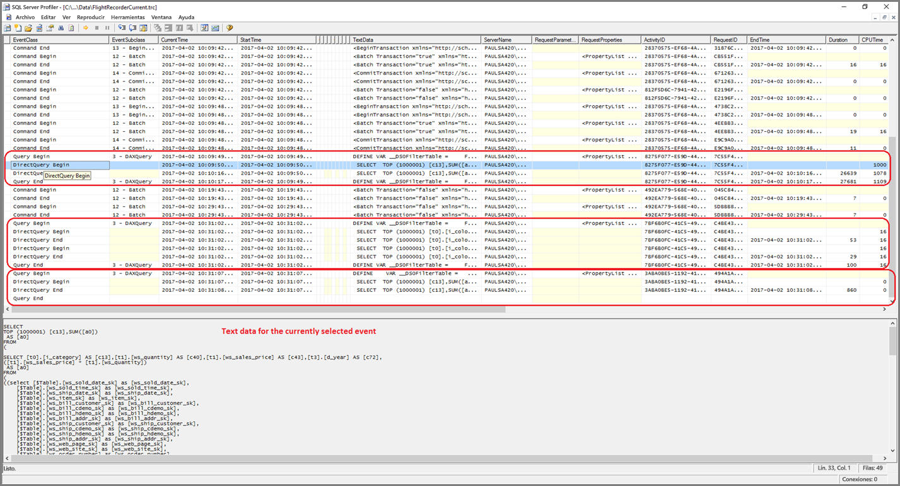
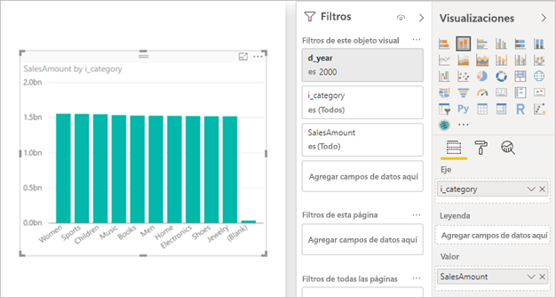

# <a name="directquery-model-troubleshooting-in-power-bi-desktop"></a>Solución de problemas del modelo de DirectQuery en Power BI Desktop

Este artículo está destinado a los modeladores de datos que desarrollan modelos de DirectQuery de Power BI, desarrollados mediante Power BI Desktop o el servicio Power BI. En él se describe cómo diagnosticar problemas de rendimiento y cómo obtener información más detallada que permita optimizar los informes.

## <a name="performance-analyzer"></a>Analizador de rendimiento

Es muy recomendable que todo diagnóstico de problemas de rendimiento comience en Power BI Desktop, en lugar de hacerlo en Power BI (el servicio o Power BI Report Server). Suele ocurrir que los problemas de rendimiento simplemente se basan en el nivel de rendimiento del origen de datos subyacente, y estos problemas se identifican y diagnostican con mayor facilidad en el entorno mucho más aislado de Power BI Desktop, lo que inicialmente elimina determinados componentes (como la puerta de enlace de Power BI). Solo si no se encuentran problemas de rendimiento en Power BI Desktop, la investigación se centrará en los aspectos específicos del informe en Power BI. El [Analizador de rendimiento](desktop-performance-analyzer.md) es una herramienta útil para identificar problemas a lo largo de este proceso.

De manera similar, se recomienda que primero intente aislar cualquier problema a un objeto visual único en lugar de varios objetos visuales en una página.

Imaginemos que ya se llevaron a cabo esos pasos (en los párrafos anteriores de este tema): ahora tenemos solo un objeto visual en una página de Power BI Desktop que sigue lenta. Puede usar el Analizador de rendimiento para determinar qué consultas envía Power BI Desktop al origen subyacente. También es posible ver los seguimientos o la información de diagnóstico que podría emitir el origen de datos subyacente. Los seguimientos podrían contener también información útil sobre los detalles de cómo se ejecutó la consulta y sobre cómo se podría mejorar.

Además, incluso en ausencia de dichos seguimientos del origen, es posible ver las consultas que envía Power BI, además de sus tiempos de ejecución, tal como se describe a continuación.

## <a name="review-trace-files"></a>Revisión de archivos de seguimiento

De manera predeterminada, Power BI Desktop registra los eventos que se producen durante una sesión determinada en un archivo de seguimiento llamado **FlightRecorderCurrent.trc**.

En el caso de algunos orígenes de DirectQuery, este registro incluye todas las consultas enviadas al origen de datos subyacente (en un futuro se podrían admitir los orígenes restantes de DirectQuery). Los orígenes que escriben consultas en el registro son los siguientes:

- SQL Server
- Azure SQL Database
- Azure SQL Data Warehouse
- Oracle
- Teradatos
- SAP HANA

El archivo de seguimiento lo puede encontrar en la carpeta **AppData** del usuario actual: _\\\<Usuario>\AppData\Local\Microsoft\Power BI Desktop\AnalysisServicesWorkspaces_

Este es un método fácil para llegar a esta carpeta: en Power BI Desktop, seleccione _Archivo > Opciones y configuración > Opciones_ y, luego, seleccione la página **Diagnóstico**. Aparecerá la siguiente ventana de diálogo:


Cuando selecciona el vínculo **Permite abrir la carpeta de volcado de memoria y seguimiento**, en Recopilación del volcado de memoria, se abre la carpeta siguiente: _\\\<Usuario>\AppData\Local\Microsoft\Power BI Desktop\Traces_

Vaya a la carpeta principal de esta carpeta donde se muestra la carpeta que contiene _AnalysisServicesWorkspaces_, que contendrá una subcarpeta de área de trabajo para cada instancia abierta de Power BI Desktop. El nombre de estas subcarpetas tiene un sufijo de entero, como _AnalysisServicesWorkspace2058279583_.

En la carpeta hay una subcarpeta _\Data_ que contiene el archivo de seguimientos FlightRecorderCurrent.trc para la sesión de Power BI actual. La carpeta de área de trabajo correspondiente se elimina cuando finaliza la sesión de Power BI Desktop asociada.

Los archivos de seguimiento se pueden abrir con la herramienta SQL Server Profiler, que está disponible como descarga gratis como parte de SQL Server Management Studio. Puede obtenerlo en [esta ubicación](/sql/ssms/download-sql-server-management-studio-ssms?view=sql-server-2017).

Una vez que descargue e instale SQL Server Management Studio, ejecute SQL Server Profiler.



Siga estos pasos para abrir el archivo de seguimiento:

1. En SQL Server Profiler, seleccione _Archivo > Abrir > Archivo de seguimiento_
2. Escriba la ruta de acceso al archivo de seguimiento de la sesión de Power BI actualmente abierta, como: _\\\<Usuario>\AppData\Local\Microsoft\Power BI Desktop\AnalysisServicesWorkspaces\AnalysisServicesWorkspace2058279583\Data_
3. Abra _FlightRecorderCurrent.trc_

Se muestran todos los eventos de la sesión actual. A continuación, se muestra un ejemplo con anotaciones en el que se resaltan los grupos de eventos. Cada grupo tiene los siguientes elementos:

- Un evento de _inicio de consulta_ y de _fin de consulta_, los que representan el inicio y el final de una consulta de DAX generada por la interfaz de usuario (por ejemplo, desde un objeto visual o al rellenar una lista de valores en la interfaz de usuario del filtro)
- Uno o más pares de eventos de _inicio de DirectQuery_ y de _fin de DirectQuery_, que representan una consulta enviada al origen de datos subyacente como parte de la evaluación de la consulta DAX

Tenga en cuenta que varias consultas DAX se pueden ejecutar en paralelo, por lo que se pueden intercalar eventos de distintos grupos. El valor de ActivityID se puede usar para determinar los eventos que pertenecen al mismo grupo.


Otras columnas de interés son las siguientes:

- **TextData:** el detalle textual del evento. En el caso de los eventos de _inicio y fin de consulta_, será la consulta DAX. En el caso de los eventos de _inicio y fin de DirectQuery_, será la consulta SQL enviada al origen subyacente. El valor _TextData_ del evento actualmente seleccionado también se muestra en la región, en la parte inferior.
- **EndTime:** cuándo se completó el evento.
- **Duración:** duración, en milisegundos, que tardó la ejecución de la consulta DAX o SQL.
- **Error:** indica si se produjo un error, en cuyo caso, el evento también se muestra en rojo.

En la imagen anterior, se han reducido algunas de las columnas menos interesantes, para que sea más fácil ver las columnas de interés.

El enfoque recomendado para capturar un seguimiento y diagnosticar un problema de rendimiento potencial es el siguiente:

- Abra una sesión única de Power BI Desktop (para evitar la confusión de tener varias carpetas de área de trabajo)
- Realice el conjunto de acciones de interés en Power BI Desktop. Incluya algunas acciones adicionales para asegurarse de que los eventos de interés se inserten en el archivo de seguimiento.
- Abra SQL Server Profiler y examine el seguimiento, tal como se indicó anteriormente. Recuerde que el archivo de seguimiento se eliminará después de cerrar Power BI Desktop. Además, no aparecerán acciones adicionales en Power BI Desktop de inmediato: se debe cerrar el archivo de seguimiento y volver a abrirlo para ver los eventos nuevos.
- Las sesiones individuales deben ser pequeñas (10 segundos de acciones, no cientos) para facilitar la interpretación del archivo de seguimiento (y, como hay un límite en el tamaño del archivo de seguimiento, en el caso de las sesiones muy prolongadas existe la posibilidad de que se quiten los primeros eventos).

## <a name="understand-queries-sent-to-the-source"></a>Información de las consultas enviadas al origen

El formato general de las consultas que Power BI Desktop genera y envía usa subconsultas para cada una de las tablas de modelos a las que se hace referencia, si la consulta de Power Query define la subconsulta. Por ejemplo, supongamos que tenemos las siguientes tablas TPC-DS en una base de datos relacional de SQL Server:


Considere el siguiente objeto visual y su configuración, teniendo en cuenta que la medida **SalesAmount** está definida con la siguiente expresión:

```dax

SalesAmount = SUMX(Web_Sales, [ws_sales_price] * [ws_quantity])

```



Actualizar ese objeto visual generará la consulta T-SQL que se muestra después del párrafo siguiente. Como puede ver, hay tres subconsultas para las tablas del modelo **Web_Sales**, **Item** y **Date_dim**. Cada una de estas tablas devuelve todas las columnas de las tablas del modelo, aunque el objeto visual haga solo referencia realmente a cuatro columnas. Estas subconsultas (que están sombreadas) son exactamente la definición de las consultas de Power Query. No se ha encontrado que usar de esta manera las subconsultas tenga impacto alguno en el rendimiento de los orígenes de datos compatibles hasta el momento con DirectQuery. Los orígenes de datos como SQL Server optimizan las referencias a las columnas no utilizadas.

Una razón por la que Power BI emplea este patrón es porque se puede definir una consulta de Power Query para que utilice una instrucción de consulta concreta. Por lo tanto, se utiliza "tal cual", sin intentar volver a escribirla. Tenga en cuenta que estos patrones restringen el uso de instrucciones de consulta que utilizan expresiones de tabla comunes (CTE) y procedimientos almacenados. Estas instrucciones no se pueden utilizar en subconsultas.


## <a name="gateway-performance"></a>Rendimiento de las puertas de enlace

Para más información sobre la solución de problemas de rendimiento de las puertas de enlace, lea el artículo [Solución de problemas de puertas de enlace: Power BI](service-gateway-onprem-tshoot.md).

## <a name="next-steps"></a>Pasos siguientes

Para más información acerca de DirectQuery, revise los siguientes recursos:

- [Usar DirectQuery en Power BI Desktop](desktop-use-directquery.md)
- [Modelos de DirectQuery en Power BI Desktop](desktop-directquery-about.md)
- [Instrucciones del modelo de DirectQuery en Power BI Desktop](guidance/directquery-model-guidance.md)
- ¿Tiene alguna pregunta? [Pruebe a preguntar a la comunidad de Power BI](https://community.powerbi.com/)
