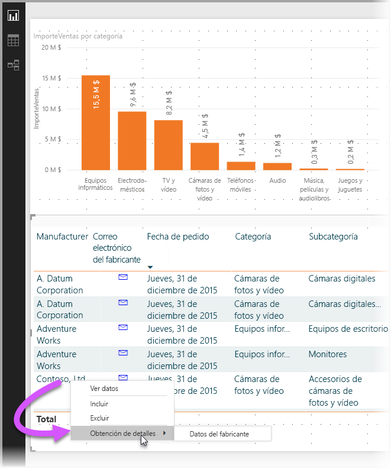
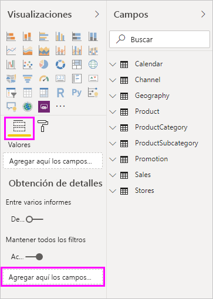
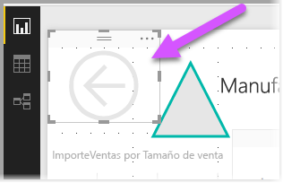
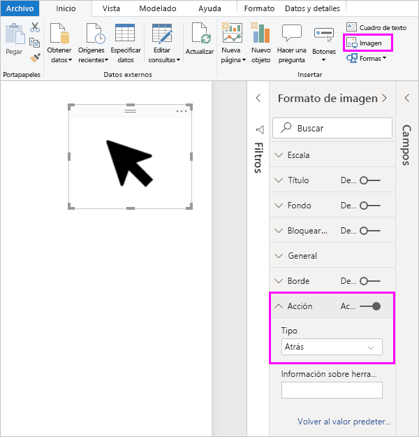
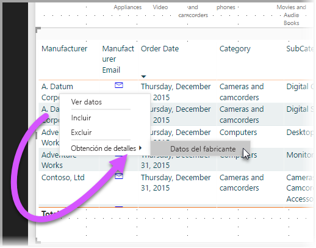
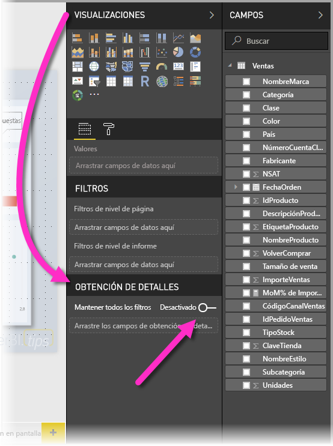
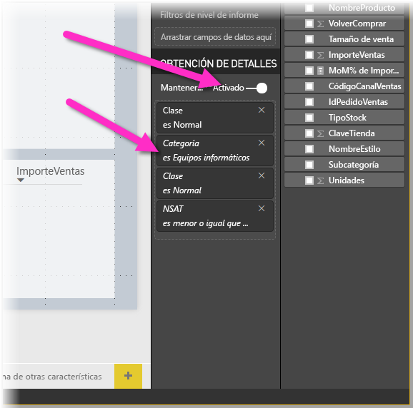
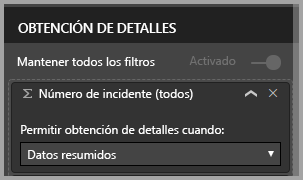

# Uso de la obtención de detalles en Power BI Desktop
Con la **obtención de detalles** en **Power BI Desktop**, puede crear una página en el informe que se centra en una entidad específica, como un proveedor, un cliente o un fabricante. Con el foco en esa página del informe, los usuarios pueden hacer clic con el botón derecho en un punto de datos en otras páginas del informe y obtener detalles de la página que tiene el foco, filtrados en ese contexto.

## Uso de la obtención de detalles
1. Para usar la **obtención de detalles**, cree una página del informe que contenga los objetos visuales que le gustaría ver para el tipo de entidad en la que proporciona obtención de detalles. 

    Por ejemplo, si está interesado en proporcionar obtención de detalles para fabricantes, podría crear una página de obtención de detalles con objetos visuales que muestren las ventas totales, el total de unidades enviadas, las ventas por categoría y por región, y así sucesivamente. De este modo, cuando se realiza la obtención de detalles mediante esa página, los objetos visuales serán específicos para el fabricante que haya seleccionado.

2. A continuación, en esa página de obtención de detalles, en la sección **Campos** del panel **Visualizaciones**, arrastre el campo sobre el que desea obtener detalles al área **Filtros de obtención de detalles**.

    

    Cuando se agrega un campo al área **Filtros de obtención de detalles**, **Power BI Desktop** crea automáticamente un objeto visual de botón *Volver*. Ese objeto visual se convierte en un botón en los informes publicados y permite que los usuarios que están consumiendo el informe en el **servicio Power BI** puedan volver fácilmente a la página del informe de la que venían (la página en la que se ha seleccionado la obtención de detalles).

    

## Uso de su propia imagen para un botón Atrás    
 Puesto que el botón Atrás es una imagen, puede reemplazar la imagen de ese objeto visual por cualquier imagen que desee y seguirá funcionando como botón Atrás para que los consumidores del informe puedan volver a la página original.

1. En la pestaña **Inicio**, haga clic en **Imagen**, encuentre la imagen y colóquela en la página de obtención de detalles.
2. Seleccione la imagen nueva en la página de obtención de detalles y, en la sección Formato de image, establezca el control deslizante **Vínculo** en Activado y el **tipo** en **Atrás**. Ahora su imagen funciona como botón Atrás.

    

    Al completarse la página de **obtención de detalles** y hacer clic con el botón derecho los usuarios en un punto de datos del informe que usa el campo que colocó en el área **Filtros de obtención de detalles**, aparece un menú contextual que admite la obtención de detalles mediante esa página.

    

    Cuando los consumidores del informe eligen la obtención de detalles, la página se filtra para mostrar información acerca del punto de datos en el que se hizo clic con el botón derecho. Por ejemplo, si los usuarios hacen clic con el botón derecho en un punto de datos de Contoso (un fabricante) y seleccionan obtener detalles, la página de obtención de detalles que se les muestra está filtrada para Contoso.

## Pasar todos los filtros a la obtención de detalles

A partir de la versión de mayo de 2018 de **Power BI Desktop**, todos los filtros aplicados se podrán pasar a la ventana de obtención de detalles. Por ejemplo, puede que haya seleccionado solo una determinada categoría de productos y los objetos visuales que se filtran en esa categoría y, luego, selecciona la obtención de detalles. Puede que le interese saber cuál será el aspecto de esa obtención de detalles con todos los filtros aplicados.

Para mantener todos los filtros aplicados, en la **obtención de detalles** sección de la **visualizaciones** panel, basta con establecer la **pasar todos los filtros** alternar a **en**. 

En las versiones de **Power BI Desktop** antes de 2018 de mayo, el comportamiento equivale a tener esta opción establecida en **desactivar**.

Cuando se obtienen detalles sobre un objeto visual, puede ver los filtros que se han aplicado como resultado de la aplicación de filtros temporales en el objeto visual de origen. En la ventana de obtención de detalles, los filtros transitorios se muestran en cursiva. 

Cabe decir que esto podría hacerse con páginas de información sobre herramientas, pero la experiencia sería desigual (daría la impresión de que la información sobre herramientas no está funcionando correctamente), de modo que no se recomienda hacerlo con información sobre herramientas.

## Agregar una medida para la obtención de detalles

Además de pasar todos los filtros a la ventana de obtención de detalles, puede agregar una medida (o una columna numérica de resumen) al área sometida a la obtención de detalles. Para aplicarla, solo tiene que arrastrar el campo de obtención de detalles a la tarjeta Obtención de detalles. 

Al agregar una medida (o una columna numérica de resumen), si usa el campo en el área *Valor* de un objeto visual, puede obtener detalles relativos a la página.

Y eso es todo lo necesario para usar la **obtención de detalles** en los informes. Es una excelente manera de obtener una vista expandida de la información de la entidad que se seleccione para el filtro de obtención de detalles.

## Pasos siguientes

Puede que también esté interesado en los siguientes artículos:

* [Uso de segmentaciones de datos en Power BI Desktop](desktop-slicers.md)

