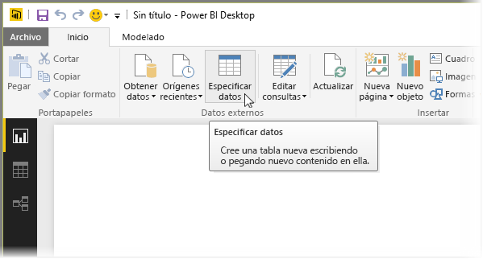
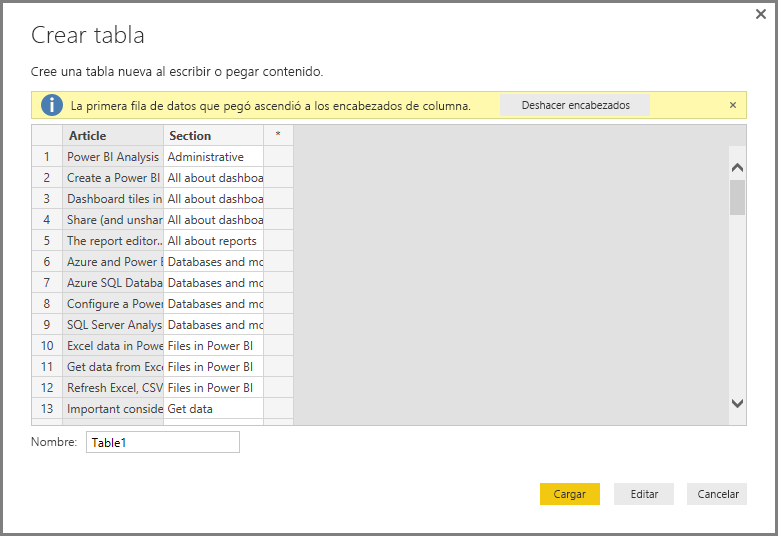
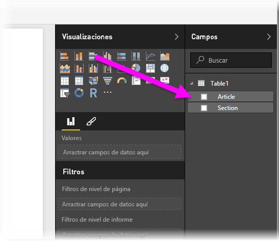

# Especificar datos directamente en Power BI Desktop
Con Power BI Desktop, puede escribir datos directamente y usar esos datos en los informes y visualizaciones. Por ejemplo, puede copiar partes de un libro o página web y después pegarlas en Power BI Desktop.

Para escribir los datos directamente, seleccione **Especificar datos** en la cinta **Inicio**.

Power BI Desktop puede intentar realizar pequeñas transformaciones en los datos, cuando sea posible, al igual que al cargar datos desde cualquier origen. Por ejemplo, en el siguiente caso, ha promovido la primera fila de datos como encabezados.

Si quiere dar forma a los datos especificados (o pegados), puede seleccionar el botón Editar para que aparezca el **Editor de consultas**, donde puede dar forma y transformar los datos antes de ponerlos en Power BI Desktop. O puede seleccionar el botón **Cargar** para importar los datos tal y como aparecen.

Al seleccionar **Cargar**, Power BI Desktop crea una nueva tabla a partir de los datos y hace que esté disponible en el panel **Campos**. En la siguiente imagen, Power BI Desktop muestra la nueva tabla, denominada *Table1* de forma predeterminada, y los dos campos de esa tabla que se han creado.

Eso es todo, es así de fácil especificar datos en Power BI Desktop.

Ahora está preparado para usar los datos en Power BI Desktop para crear objetos visuales, informes, o para interactuar con cualquier otro dato con el que quiera conectarse e importar, como libros de Excel, bases de datos o cualquier otro origen de datos.

### Pasos siguientes
Hay todo tipo de datos a los que puede conectarse con Power BI Desktop. Para obtener más información sobre orígenes de datos, consulte los siguientes recursos:

* [Introducción a Power BI Desktop](desktop-getting-started.md)
* [Orígenes de datos en Power BI Desktop](desktop-data-sources.md)
* [Combinar datos y darles forma con Power BI Desktop](desktop-shape-and-combine-data.md)
* [Connect to Excel workbooks in Power BI Desktop (Conectarse a libros de Excel en Power BI Desktop)](desktop-connect-excel.md)   
* [Conectarse a archivos CSV en Power BI Desktop](desktop-connect-csv.md)   

