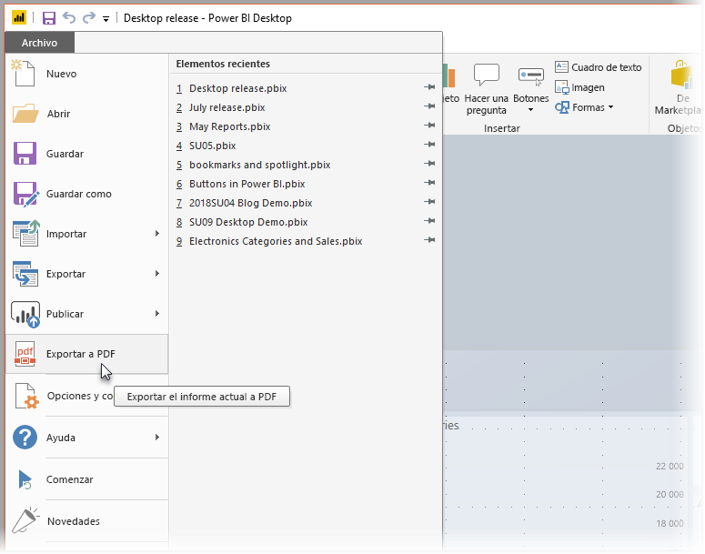
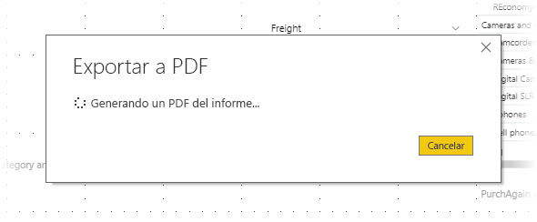

# Exportar informes a PDF desde Power BI Desktop
En **Power BI Desktop**, puede exportar informes a un archivo PDF y, por tanto, compartirlos o imprimirlos fácilmente desde ese PDF.

El proceso de exportación del informe de **Power BI Desktop** a un PDF para que pueda imprimir o compartir el PDF con otros usuarios es sencillo. Solo tiene que seleccionar **Archivo > Exportar a PDF** desde Power BI Desktop.

El proceso de **Exportar a PDF** exportará todas las páginas *visibles* del informe, y cada una de ellas se exportará a una sola página en el PDF. Las páginas del informe que no estén visibles, como cualquier información sobre herramientas o páginas ocultas, no se exportan al archivo PDF. 

Al seleccionar **Archivo > Exportar a PDF**, se inicia la exportación y aparece un cuadro de diálogo que muestra que el proceso de exportación está en curso. El cuadro de diálogo permanece en la pantalla hasta que se complete el proceso de exportación. Durante el proceso de exportación, se deshabilita toda la interacción con el informe que se está exportando. La única forma de interactuar con el informe es esperar a que se complete el proceso de exportación, o bien cancelar la exportación. 

Cuando finalice la exportación, el PDF se carga en el visor de PDF predeterminado del equipo. 

## Consideraciones y limitaciones
Hay algunas consideraciones que se deben tener en cuenta con la característica **Exportar a PDF**.

* La característica **Exportar a PDF** solo está disponible con **Power BI Desktop** y no está disponible actualmente en el **servicio Power BI**.
* La característica exporta objetos visuales personalizados, pero *no* exporta ningún papel tapiz que haya aplicado al informe.

Puesto que no se exporta el papel tapiz al PDF, debe prestar especial atención a los informes que usen un papel tapiz oscuro. Si el texto del informe es blanco o claro, para que destaque en el papel tapiz oscuro, será difícil de leer o no se podrá leer en el proceso de exportación a PDF puesto que no se exportará el papel tapiz con el resto del informe. 

## Pasos siguientes
Hay muchos elementos visuales y características interesantes de **Power BI Desktop**. Para obtener más información, vea los siguientes recursos:

* [Uso de elementos visuales para mejorar los informes de Power BI](desktop-visual-elements-for-reports.md)
* [¿Qué es Power BI Desktop?](desktop-what-is-desktop.md)

