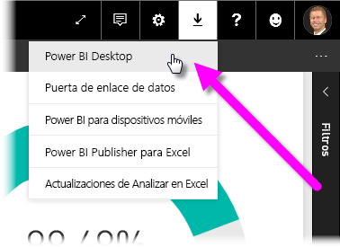
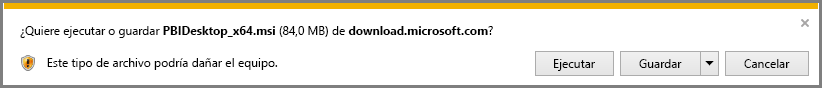
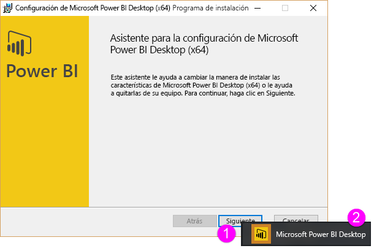
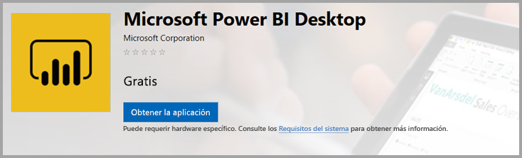
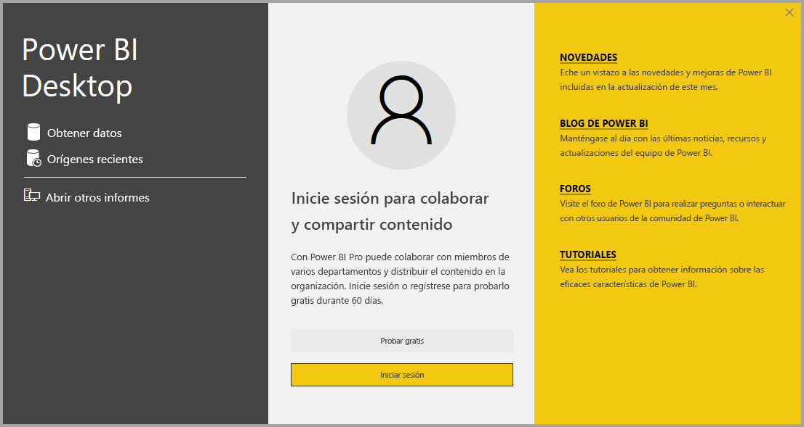

# Obtener Power BI Desktop
**Power BI Desktop** le permite crear consultas, modelos e informes avanzados para visualizar datos. Con **Power BI Desktop**, puede crear modelos de datos, crear informes y compartir su trabajo mediante su publicación en el servicio Power BI.  La descarga de **Power BI Desktop** es gratuita.

Puede obtener **Power BI Desktop** de dos maneras, que se describen en las secciones siguientes:

* **Descargar** directamente (un paquete que se descarga y se instala en el equipo)
* Instalar como una aplicación desde **Microsoft Store**

Con cualquiera de ellos tendrá la versión más reciente de **Power BI Desktop** en el equipo, pero hay algunas diferencias que hay que tener en cuenta y que se describen en las secciones siguientes.

## Descargar Power BI Desktop
Para descargar la versión más reciente de **Power BI Desktop**, seleccione el icono de descarga situado en la esquina superior derecha del servicio Power BI y, después, elija **Power BI Desktop**.

También puede obtener la última versión de Power BI Desktop en la siguiente página de descarga:

* [**Descargar Power BI Desktop** (versiones de 32 y 64 bits)](https://powerbi.microsoft.com/desktop).
  
  

Con independencia de la opción que elija, una vez que se descargue **Power BI Desktop**, se le pedirá que ejecute el archivo de instalación:

A partir de la versión de julio de 2019, **Power BI Desktop** se distribuye como un único paquete de instalación .exe que contiene todos los idiomas admitidos. Hay archivos .exe independientes para las versiones de 32 y 64 bits. Los paquetes .msi dejarán de usarse tras la versión de septiembre de 2019, y después tendrá que usar el archivo ejecutable .exe para la instalación. Este enfoque hace que la distribución, las actualizaciones y la instalación (especialmente para los administradores) sean mucho más fáciles y cómodas. También puede usar parámetros de línea de comandos para personalizar el proceso de instalación, como se describe en la sección [Uso de opciones de línea de comandos durante la instalación](#using-command-line-options-during-installation) más adelante en este artículo.

Después de iniciar el paquete de instalación, **Power BI Desktop** se instala como una aplicación y se ejecuta en el escritorio.

> [!NOTE]
> No se puede instalar la versión descargada (MSI) y la versión de **Microsoft Store** de **Power BI Desktop** en el mismo equipo (lo que a veces se denomina instalación *en paralelo*).
> 
> 

## Instalar como una aplicación desde Microsoft Store
Para obtener **Power BI Desktop** en Microsoft Store, use el siguiente vínculo:

* [Instale **Power BI Desktop** desde **Microsoft Store**](http://aka.ms/pbidesktopstore)

  

Hay algunas ventajas si obtiene **Power BI Desktop** desde Microsoft Store:

* **Actualizaciones automáticas**: Windows descarga de forma automática la versión más reciente en segundo plano en cuanto esté disponible, por lo que su versión siempre estará actualizada.
* **Descargas de menor tamaño**: **Microsoft Store** garantiza que solo los componentes que hayan cambiado de cada actualización se descargarán en el equipo, lo cual permite conseguir unas descargas de menor tamaño en cada actualización.
* **No se necesitan privilegios de administrador**: cuando se descarga y se instala directamente el paquete, debe ser administrador para completar la instalación de forma correcta. Cuando se obtiene **Power BI Desktop** en Microsoft Store, *no* se necesitan privilegios de administrador.
* **Habilitado para lanzamiento de TI**: la versión de **Microsoft Store** puede implementarse más fácilmente, o *lanzarse*, a todas las personas de su organización para que **Power BI Desktop** esté disponible en **Microsoft Store para la empresa**.
* **Detección de idioma**: en la versión de **Microsoft Store** se incluyen todos los idiomas admitidos y se comprueba el idioma que se usa en el equipo cada vez que se inicie. Esto afecta también a la localización de los modelos creados en **Power BI Desktop**; por ejemplo, las jerarquías de fechas integradas coincidirán con el idioma que **Power BI Desktop** utilizaba cuando se creó el archivo .pbix.

Para instalar **Power BI Desktop** desde Microsoft Store, hay algunas limitaciones y aspectos a tener en cuenta, entre otros:

* Si usa el conector de SAP, puede que necesite mover los archivos del controlador de SAP a la carpeta *Windows\System32*.
* La instalación de **Power BI Desktop** desde Microsoft Store no copia la configuración de usuario de la versión .exe. Puede que tenga que volver a conectarse con los orígenes de datos recientes y volver a escribir las credenciales de origen de datos. 

> [!NOTE]
> No se puede instalar la versión descargada (MSI) y la versión de **Microsoft Store** de **Power BI Desktop** en el mismo equipo (lo que a veces se denomina instalación *en paralelo*). Debe desinstalar manualmente **Power BI Desktop** antes de descargarlo de **Microsoft Store**
> 
> [!NOTE]
> La versión de Power BI Report Server de **Power BI Desktop** es una instalación distinta e independiente de las versiones descritas en este artículo. Para más información sobre la versión de Report Server de **Power BI Desktop**, vea [Creación de un informe de Power BI para Power BI Report Server](report-server/quickstart-create-powerbi-report.md).
> 
> 

## Uso de Power BI Desktop
Cuando inicie **Power BI Desktop**, aparecerá una pantalla de *bienvenida*.

Si ésta es la primera vez que usa **Power BI Desktop** (si la instalación no es una actualización), se le pedirá que rellene un formulario y responda a algunas preguntas o que inicie sesión en el **servicio Power BI** antes de poder continuar.

En ella, puede comenzar a crear modelos de datos o informes y compartirlos después con otros usuarios en el servicio Power BI. Consulte los vínculos de la sección **Más información** situada al final de este artículo para acceder a una serie de guías que pueden serle de ayuda a la hora de comenzar a utilizar **Power BI Desktop**.

## Requisitos mínimos
En la siguiente lista, se describen los requisitos mínimos para ejecutar **Power BI Desktop**:

* Windows 7 y Windows Server 2008 R2 o posterior
* .NET 4.5
* Internet Explorer 10 o posterior
* **Memoria (RAM):** Al menos 1 GB disponible; se recomienda 1,5 GB o más.
* **Pantalla:** Se recomienda al menos 1440 x 900 o 1600 x 900 (16:9). No se recomiendan las resoluciones inferiores a 1024 x 768 o 1280 x 800, ya que ciertos controles (por ejemplo, para cerrar la pantalla de inicio) solo se muestran en resoluciones superiores a esta.
* **Configuración de la pantalla de Windows:** Si la configuración de pantalla está establecida para cambiar el tamaño del texto, las aplicaciones u otros elementos en más de 100 %, quizás no vea ciertos cuadros de diálogo que deben cerrarse o en los que debe actuar para continuar usando **Power BI Desktop**. Si se produce este problema, compruebe la **configuración de su pantalla** en **Configuración > Sistema > Pantalla** en Windows, y use el control deslizante para devolver la configuración de pantalla al 100 %.
* **CPU:** 1 gigahercio (GHz) o superior; se recomienda un procesador de x86 o x64 bits.

## Consideraciones y limitaciones

Nuestra intención es que su experiencia con Power BI Desktop siempre sea magnífica. Pueden darse ocasiones en las que surja algún problema con Power BI Desktop y, por ello, en esta sección, se incluyen soluciones o sugerencias para solucionar los problemas que pueden surgir. 

### Uso de opciones de línea de comandos durante la instalación 

Al instalar Power BI Desktop, puede establecer propiedades y opciones con modificadores de la línea de comandos. Esto es especialmente útil para los administradores que administran o facilitan la instalación de Power BI Desktop entre organizaciones. Estas opciones se aplican a las instalaciones .msi y .exe. 

|Opción de línea de comandos  |Comportamiento  |
|---------|---------|
|-q, -quiet, -s, -silent     |Instalación silenciosa         |
|-passive     |Solo se muestra la barra de progreso durante la instalación         |
|-norestart     |Se suprime el requisito de reinicio del equipo         |
|-forcerestart     |Se reinicia el equipo después de la instalación sin preguntar         |
|-promptrestart     |Se pregunta al usuario si es necesario reiniciar el equipo (valor predeterminado)         |
|-l<>, -log<>     |Se registra la instalación en un archivo concreto, con el archivo especificado en <>         |
|-uninstall     |Se desinstala Power BI Desktop         |
|-repair     |Se repara la instalación (o se instala si no está instalada actualmente)         |
|-package, -update     |Se instala Power BI Desktop (valor predeterminado, siempre y cuando no se especifique -uninstall o -repair)         |

### Problemas al usar versiones anteriores de Power BI Desktop

Algunos usuarios detectan un error similar al siguiente al usar una versión no actualizada de **Power BI Desktop**: 

    "We weren't able to restore the saved database to the model" 

Si se actualiza a la versión actual de Power BI Desktop, normalmente se soluciona este problema.

### Deshabilitar las notificaciones
Se recomienda actualizar a la versión de Power BI Desktop más reciente para aprovechar los avances en las características, el rendimiento, la estabilidad y otras mejoras. Puede que algunas organizaciones no deseen que los usuarios actualicen a cada nueva versión. Puede deshabilitar las notificaciones modificando el registro con los pasos siguientes:

1. Con el Editor del Registro, vaya a *HKEY_LOCAL_MACHINE\SOFTWARE\Microsoft\Microsoft Power BI Desktop*.
2. Cree una nueva entrada con la configuración siguiente: *REG_DWORD : DisableUpdateNotification*
3. Establezca el valor de esa nueva entrada en **1**.

Necesitará reiniciar el equipo para que el cambio surta efecto.

### Power BI Desktop se carga con una pantalla parcial

En determinadas circunstancias, incluidas determinadas configuraciones de resolución de pantalla, algunos usuarios pueden ver que Power BI Desktop representa el contenido con áreas negras extensas. Suele ser el resultado de las actualizaciones del sistema operativo recientes que afectan a cómo se representan los elementos, en lugar de un resultado directo de cómo Power BI Desktop presenta el contenido. No obstante, las áreas negras extensas no son tan atractivas como los grandes objetos visuales, así que, para resolver este problema, realice los pasos siguientes:

1. Presione la tecla Inicio y escriba la palabra *borrosa* en la barra de búsqueda que aparece.
2. En el cuadro de diálogo que aparece, seleccione la opción: *Corregir las aplicaciones que están borrosas.*
3. Reinicie Power BI Desktop.

Este problema puede resolverse tras la publicación de las actualizaciones de Windows posteriores. 
 

## Pasos siguientes
Una vez que haya instalado **Power BI Desktop**, puede consultar el contenido siguiente, que le servirá de ayuda para ponerse en marcha rápidamente:

* [¿Qué es Power BI Desktop?](desktop-what-is-desktop.md)
* [Información general sobre consultas con Power BI Desktop](desktop-query-overview.md)
* [Orígenes de datos en Power BI Desktop](desktop-data-sources.md)
* [Conectarse a los datos en Power BI Desktop](desktop-connect-to-data.md)
* [Combinar datos y darles forma con Power BI Desktop](desktop-shape-and-combine-data.md)
* [Tareas de consultas comunes en Power BI Desktop](desktop-common-query-tasks.md)   

