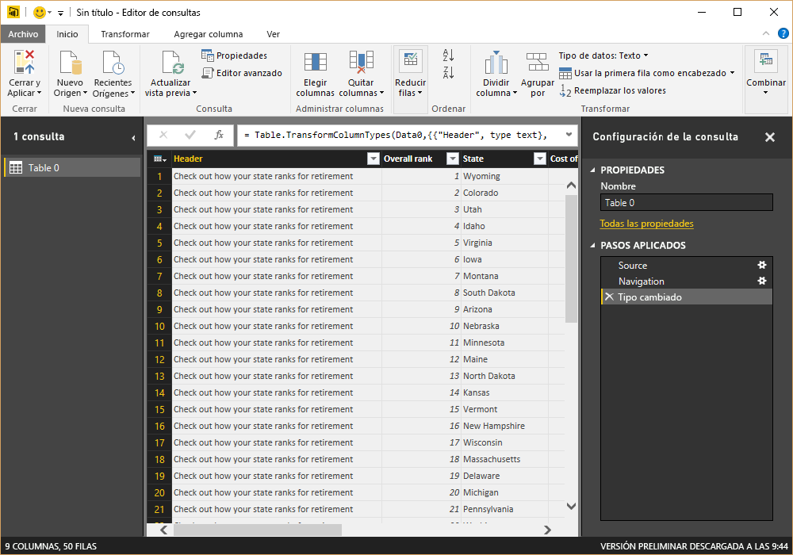
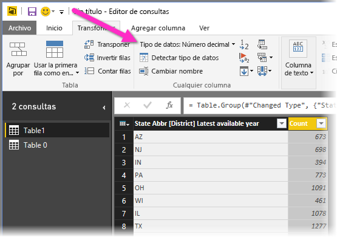
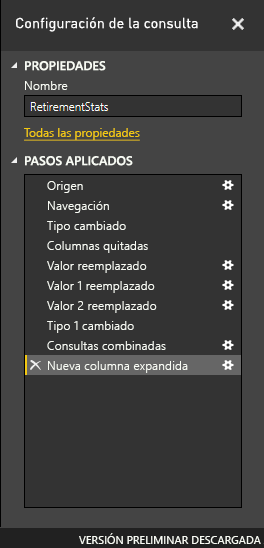

# Introducción a Power BI Desktop
Bienvenido a la guía de introducción de Power BI Desktop. En este paseo se muestra cómo funciona Power BI Desktop, lo que puede hacer y cómo crear modelos de datos eficaces e informes increíbles para ampliar la inteligencia empresarial.

Para obtener una visión general rápida del funcionamiento de Power BI Desktop y cómo usarlo, puede examinar las pantallas de esta guía en solo unos minutos. Para obtener una descripción más completa, puede leer cada sección, realizar los pasos descritos y crear un archivo de Power BI Desktop propio para publicarlo en el [servicio Power BI](https://app.powerbi.com/) y compartirlo con otros usuarios.

También puede ver el vídeo [Introducción a Power BI Desktop](https://www.youtube.com/watch?v=Qgam9M8I0xA) y descargar el libro de Excel [Ejemplo financiero](https://go.microsoft.com/fwlink/?LinkID=521962) para seguirlo junto al vídeo.

## Funcionamiento de Power BI Desktop
Con Power BI Desktop, puede:
1. Conectarse a datos, incluidos varios orígenes de datos.
1. Dar forma a los datos con consultas que generan modelos de datos atractivos e interesantes.
1. Usar los modelos de datos para crear visualizaciones e informes. 
1. Compartir los archivos de informe para que otros usuarios puedan aprovecharlos, ampliarlos y compartirlos. Puede compartir los archivos *.pbix* de Power BI Desktop como cualquier otro archivo, pero el método más atractivo consiste en cargarlos en el [servicio Power BI](https://preview.powerbi.com/). 

Power BI Desktop integra tecnologías probadas del motor de consultas de Microsoft, modelado de datos y visualización. Los analistas de datos y otros usuarios pueden crear colecciones de consultas, conexiones de datos, modelos e informes, y compartirlos fácilmente con otros. A través de la combinación de Power BI Desktop y el servicio Power BI, es más fácil modelar, compilar, compartir y extender nuevas conclusiones del mundo de los datos.

Power BI Desktop centraliza, simplifica y agiliza lo que de otro modo podría ser un proceso de diseño y creación de repositorios e informes de inteligencia empresarial disperso, arduo y desconectado.
¿Listo para probarlo? Empecemos.

> [!NOTE]
> Para los datos e informes que deben permanecer en el entorno local hay una versión de Power BI independiente y especializada denominada [Power BI Report Server](report-server/get-started.md). Power BI Report Server usa una versión independiente y especializada de Power BI Desktop llamada Power BI Desktop para Power BI Report Server, que solo funciona con la versión Report Server de Power BI. En este artículo se describe la versión estándar de Power BI Desktop.

## Instalar y ejecutar Power BI Desktop
Para descargar Power BI Desktop, vaya a la [página de descarga de Power BI Desktop](https://powerbi.microsoft.com/desktop) y seleccione **Descarga gratuita**. O, para las opciones de descarga, seleccione [Consulte las opciones de descarga o idiomas disponibles](https://www.microsoft.com/download/details.aspx?id=58494). 

También puede descargar Power BI Desktop desde el servicio Power BI. Seleccione el icono **Descargar** en la barra de menús superior y, después, seleccione **Power BI Desktop**.

En la página de Microsoft Store, seleccione **Obtener** y siga las indicaciones para instalar Power BI Desktop en el equipo. Inicie Power BI Desktop desde el menú **Inicio** de Windows o desde el icono de la barra de tareas de Windows.

La primera vez que se inicia Power BI Desktop, se muestra la pantalla de **bienvenida**.

En la pantalla de **bienvenida**, puede **obtener datos**, ver **orígenes recientes**, abrir informes recientes, **abrir otros informes**o seleccionar otros vínculos. También puede elegir si quiere mostrar siempre la pantalla de **bienvenida** durante el inicio. Seleccione el icono Cerrar para cerrar la pantalla de **bienvenida**.

En el lado izquierdo de Power BI Desktop aparecen iconos para las tres vistas de Power BI Desktop: **Informe**, **Datos**y **Relaciones**, de arriba a abajo. La vista actual se indica mediante la barra amarilla situada a la izquierda y puede cambiar de vista si selecciona cualquiera de los iconos. 

La vista **Informe** es la predeterminada. 

Power BI Desktop también incluye el **Editor de Power Query**, que se abre en una ventana independiente. En el **Editor de Power Query**, puede crear consultas y transformar datos, y después cargar el modelo de datos refinados en Power BI Desktop para crear informes.

## Conectar a datos
Con Power BI Desktop instalado, está listo para conectarse con el mundo de los datos en continua expansión. Para ver los numerosos tipos de orígenes de datos disponibles, seleccione **Obtener datos** > **Más** en la pestaña **Inicio** de Power BI Desktop y, en la ventana **Obtener datos**, desplácese por la lista **Todo** de orígenes de datos. En este paseo rápido, se conectará a dos orígenes de datos **web** diferentes.

Imagine que es un analista de datos que trabaja para un distribuidor de gafas de sol. Quiere ayudar al cliente a que dirija la venta de gafas de sol a zonas donde siempre brille el sol. La página sobre [los mejores y peores estados para jubilarse](https://www.bankrate.com/retirement/best-and-worst-states-for-retirement/) en Bankrate.com contiene datos interesantes al respecto.

En la pestaña **Inicio** de Power BI Desktop, seleccione **Obtener datos** > **Web** para conectarse a un origen de datos web. 

En el cuadro de diálogo **De web**, pegue la dirección *https:\//www.bankrate.com/retirement/best-and-worst-states-for-retirement/* en el campo **Dirección URL** y seleccione **Aceptar**. 

Si se le solicita, en la pantalla **Acceder a contenido web**, seleccione **Conectar** para usar el acceso anónimo. 

La funcionalidad de consulta de Power BI Desktop entra en acción y contacta con el recurso web. En la ventana **Navegador** se devuelve lo que se ha encontrado en la página web, en este caso, una tabla denominada **Clasificación de los mejores y peores estados para jubilarse** y un documento. Como le interesa la tabla, selecciónela para ver una vista previa.

En este momento, puede seleccionar **Cargar** para cargar la tabla, o bien **Transformar datos** para realizar cambios en la tabla antes de cargarlos.

Al seleccionar **Transformar datos**, se inicia el Editor de Power Query, con una vista representativa de la tabla. El panel **Configuración de la consulta** está a la derecha, o bien puede mostrarlo si selecciona **Configuración de la consulta** en la pestaña **Vista** del Editor de Power Query. 

Para obtener más información sobre cómo conectarse a los datos, vea [Conectarse a los datos en Power BI Desktop](desktop-connect-to-data.md).

## Dar forma a los datos
Ahora que se ha conectado a un origen de datos, puede ajustar los datos según sea necesario. Para *dar forma* a los datos, proporcione al Editor de Power Query instrucciones paso a paso para ajustar los datos mientras los carga y presenta. La operación de dar forma no afecta al origen de datos original, solo a esta vista concreta de los datos. 

> [!NOTE]
> Es posible que los datos de la tabla que se usan en esta guía cambien con el tiempo. Por eso, los pasos que debe seguir pueden variar, por lo que tendrá que ser creativo y ajustar los pasos o los resultados; esto es parte de la diversión del aprendizaje. 

El modelado puede significar *transformar* los datos, como cambiar el nombre de columnas o tablas, quitar filas o columnas, o cambiar tipos de datos. El Editor de Power Query captura estos pasos secuencialmente en **Pasos aplicados** en el panel **Configuración de la consulta**. Cada vez que esta consulta se conecte al origen de datos, se ejecutan esos pasos, para que los datos siempre tengan la forma especificada. Este proceso se produce siempre que se usa la consulta en Power BI Desktop, o bien cuando alguien más use la consulta compartida, como en el servicio Power BI. 

Tenga en cuenta que en **Pasos aplicados** en **Configuración de la consulta** ya se incluyen algunos pasos. Puede seleccionar cada paso para ver su efecto en el Editor de Power Query. En primer lugar, ha especificado un origen web y, después, ha visto una vista previa de la tabla en la ventana **Navegador**. En el tercer paso, **Tipo cambiado**, Power BI ha reconocido datos de número entero al importarlos y ha cambiado de forma automática el *Tipo de datos* **Texto** web original a **Números enteros**. 

Si tiene que cambiar un tipo de datos, seleccione la columna o columnas que quiera cambiar. Mantenga presionada la tecla **Mayús** para seleccionar varias columnas adyacentes o la tecla **Ctrl** para seleccionar columnas no adyacentes. Haga clic con el botón derecho en un encabezado de columna, seleccione **Tipo cambiado**, elija un nuevo tipo de datos en el menú, o bien, en la lista desplegable situada junto a **Tipo de datos** en el grupo **Transformación** de la pestaña **Inicio**, seleccione un tipo de datos nuevo.

> [!NOTE]
> El Editor de Power Query de Power BI Desktop usa la cinta de opciones o los menús contextuales para las tareas disponibles. La mayor parte de las tareas que puede seleccionar en las pestañas **Inicio** o **Transformar** también están disponibles en el menú que aparece al hacer clic con el botón derecho en un elemento y realizar una selección en el menú que aparece.

Ahora puede aplicar cambios y transformaciones propios a los datos y verlos en **Pasos aplicados**. 

Por ejemplo, en el caso de las ventas de gafas de sol, lo que más le interesa es la clasificación meteorológica, por lo que decide ordenar la tabla por la columna **Weather** (Tiempo) en lugar de **Overall rank** (Clasificación general). Baje la flecha situada junto al encabezado **Weather** y seleccione **Orden ascendente**. Ahora los datos aparecen ordenados por clasificación meteorológica y el paso **Filas ordenadas** aparece en **Pasos aplicados**. 

No le interesa mucho vender gafas de sol en los estados con peor clima, por lo que decide quitarlos de la tabla. En el grupo **Reducir filas** de la pestaña **Inicio**, seleccione **Quitar filas** > **Quitar filas inferiores**. En el cuadro de diálogo **Quitar filas inferiores**, escriba *10* y, después, seleccione **Aceptar**. 

Se quitan de la tabla las 10 filas inferiores con el peor clima y el paso **Filas inferiores quitadas** aparece en **Pasos aplicados**.

Decide que la tabla tiene demasiada información adicional para sus necesidades y quita las columnas **Affordability** (Asequibilidad), **Crime** (Delitos), **Culture** (Cultura) y **Wellness** (Bienestar). Seleccione el encabezado de cada columna que quiera quitar. Mantenga presionada la tecla **Mayús** para seleccionar varias columnas adyacentes o la tecla **Ctrl** para seleccionar columnas no adyacentes. 

Después, en el grupo **Administrar columnas** de la pestaña **Inicio**, seleccione **Quitar columnas**. También puede hacer clic con el botón derecho en uno de los encabezados de columna seleccionados y seleccionar **Quitar columnas** en el menú. Se quitan las columnas seleccionadas y el paso **Columnas quitadas** aparece en **Pasos aplicados**.

Pensándolo mejor, **Affordability** podría ser relevante para las ventas de gafas de sol. Le gustaría volver a recuperar esa columna. Puede deshacer fácilmente el último paso del panel **Pasos aplicados** si selecciona el icono Eliminar **X** situado junto al paso. Ahora rehaga el paso, y seleccione solo las columnas que quiera eliminar. Para mayor flexibilidad, puede eliminar cada columna en un paso independiente. 

Puede hacer clic con el botón derecho en cualquier paso del panel **Pasos aplicados** para eliminarlo, cambiarle el nombre, subirlo o bajarlo en la secuencia, o agregar o eliminar pasos después de este. En el caso de los pasos intermedios, Power BI Desktop le avisará si el cambio puede afectar a los pasos posteriores e interrumpir la consulta.  

Por ejemplo, si ya no quiere ordenar la tabla por **Weather**, podría intentar eliminar el paso **Filas ordenadas**. Power BI Desktop le advierte de que la eliminación de este paso podría interrumpir la consulta. Ha quitado las 10 filas inferiores después de ordenar por condiciones meteorológicas, por lo que si quita el orden, se quitarán otras filas. También recibirá una advertencia si selecciona el paso **Filas ordenadas** e intenta agregar un nuevo paso intermedio en ese punto.  

Por último, cambie el título de la tabla para que haga referencia a ventas de gafas de sol y no a la jubilación. En **Propiedades** en el panel **Configuración de la consulta**, reemplace el título anterior por *Mejores estados para ventas de gafas de sol*.

La consulta finalizada para los datos moldeados tiene el aspecto siguiente:

Para obtener más información sobre cómo dar forma a los datos, vea [Combinar datos y darles forma en Power BI Desktop](desktop-shape-and-combine-data.md).

## Combinar datos
Los datos sobre diferentes estados resultan interesantes y serán útiles para crear otras consultas y análisis. Pero hay un problema: la mayoría de los datos usa abreviaturas de dos letras para los códigos de estado, no el nombre completo de los estados. Para usar esos datos, se necesita una manera de asociar las abreviaturas con los nombres de los estados.

Está de suerte. Otro origen de datos público hace justamente eso, pero los datos necesitarán una importante cantidad de modelado antes de poder *combinarlos* con la tabla de gafas de sol.

Para importar los datos de las abreviaturas de estados en el Editor de Power Query, seleccione **Nuevo origen** > **Web** en el grupo **Nueva consulta** de la pestaña **Inicio** de la cinta. 

En el cuadro de diálogo **De web**, escriba la dirección URL del sitio de las abreviaturas de estado: *https:\//en.wikipedia.org/wiki/List_of_U.S._state_abbreviations*.

En la ventana **Navegador**, seleccione la tabla **Codes and abbreviations for U.S. states, federal district, territories, and other regions** (Códigos y abreviaturas de estados de EE. UU., Distrito Federal, territorios y otras regiones) y, después, seleccione **Aceptar**. La tabla se abre en el Editor de Power Query.

Quite todas las columnas excepto **Name and status of region** (Nombre y estado de la región), **Name and status of region2** (Nombre y estado de la región 2) y **ANSI**. Para conservar solo estas columnas, mantenga presionada la tecla **Ctrl** y selecciónelas. Después, haga clic con el botón derecho en uno de los encabezados de columna y seleccione **Quitar otras columnas**, o bien, en el grupo **Administrar columnas** de la pestaña **Inicio**, seleccione **Quitar otras columnas**. 

Haga clic en la flecha desplegable situada junto a la columna **Name and status of region2** y seleccione **Filtros** > **Es igual a**. En el cuadro de diálogo **Filtrar filas**, haga clic en el campo desplegable **Escribir o seleccionar un valor** situado junto a **es igual a** y seleccione **State**. 

Seleccione **o** y junto al segundo campo **es igual a**, seleccione **State ("Commonwealth")** . Seleccione **Aceptar**. 

Después de quitar valores adicionales como **Federal district** (Distrito Federal) e **island** (isla), ahora tiene una lista de los 50 estados y sus abreviaturas oficiales de dos letras. Puede cambiar el nombre de las columnas para que tengan más sentido, por ejemplo **Nombre del estado**, **Estado** y **Abreviatura** si hace clic con el botón derecho en los encabezados de columna y selecciona **Cambiar el nombre**.

Tenga en cuenta que todos estos pasos se registran en **Pasos aplicados** en el panel **Configuración de la consulta**.

Ahora la tabla moldeada tiene este aspecto:

Cambie el título de la tabla por *Códigos de estado* en el campo **Propiedades** de **Configuración de la consulta**. 

Después de dar forma a la tabla **Códigos de estado**, puede *combinar* estas dos tablas en una. Como las tablas que ahora tiene son el resultado de las consultas aplicadas a los datos, también se denominan *consultas*. Existen dos formas principales de combinar consultas: *combinar* y *anexar*. 

Cuando tiene una o más columnas que quiere agregar a otra consulta, las consultas se *combinan*. Cuando tiene filas de datos adicionales que quiere agregar a una consulta existente, la consulta se *anexa*.

En este caso, quiere *combinar* la consulta **Códigos de estado** con la consulta **Mejores estados para las ventas de gafas de sol**. Para combinar las consultas, cambie a la consulta **Mejores estados para las ventas de gafas de sol** seleccionándola en el panel **Consultas** del lado izquierdo del Editor de Power Query. Después, seleccione **Combinar consultas** en el grupo **Combinar** de la pestaña **Inicio** de la cinta.

En la ventana **Combinar**, haga clic en el campo desplegable para seleccionar **Códigos de estado** en las otras consultas disponibles. Seleccione la columna que debe coincidir en cada tabla; en este caso **Estado** en la consulta **Mejores estados para las ventas de gafas de sol** y **Nombre de estado** en la consulta **Códigos de estado**. 

Si aparece un cuadro de diálogo **Niveles de privacidad**, seleccione **Ignorar las comprobaciones de los niveles de privacidad de este archivo** y, después, seleccione **Guardar**. Seleccione **Aceptar**. 

Aparecerá una nueva columna denominada **Códigos de estado** a la derecha de la tabla **Mejores estados para la venta de gafas de sol**. Contiene la consulta de código de estado que ha combinado con la consulta de mejores estados para la venta de gafas de sol. Todas las columnas de la tabla combinada se condensan en la columna **Códigos de estado**. Puede *expandir* la tabla combinada e incluir solo las columnas que quiera. 

Para expandir la tabla combinada y seleccionar qué columnas se van a incluir, seleccione el icono **Expandir** del encabezado de columna. En el cuadro de diálogo **Expandir**, seleccione solo la columna **Abreviatura**. Desactive **Usar el nombre de columna original como prefijo** y, después, seleccione **Aceptar**. 

> [!NOTE]
> Puede experimentar para ver cómo incorporar la tabla **Códigos de estado**. Experimente un poco y, si no le gustan los resultados, elimine ese paso de la lista **Pasos aplicados** en el panel **Configuración de la consulta**. Es una segunda oportunidad, que puede realizar tantas veces como sea necesario hasta que el proceso de expansión tenga la apariencia que busca.

Para obtener una descripción más completa de los pasos para dar forma a los datos y combinarlos, vea [Combinar datos y darles forma en Power BI Desktop](desktop-shape-and-combine-data.md).

Ahora tiene una única tabla de consulta con dos orígenes de datos combinados, a los que se les ha dado forma para adecuarlos a sus necesidades. Esta consulta puede servir como base para una gran cantidad de conexiones de datos interesantes adicionales, como datos demográficos, niveles de bienestar y oportunidades de ocio en los estados.

Por ahora, tiene datos suficientes para crear un informe interesante en Power BI Desktop. Como se trata de un hito, aplique los cambios en el **Editor de Power Query** y, para cargarlos en Power BI Desktop, seleccione **Cerrar y aplicar** en la pestaña **Inicio** de la cinta. También puede seleccionar simplemente **Aplicar** para mantener abierta la consulta en el Editor de Power Query mientras trabaja en Power BI Desktop. 

Puede realizar más cambios en una tabla después de cargarla en Power BI Desktop y volver a cargar el modelo para aplicar los cambios que realice. Para volver a abrir el **Editor de Power Query** desde Power BI Desktop, seleccione **Editar consultas** en la pestaña **Inicio** de la cinta de Power BI Desktop. 

## Elaborar informes
En la vista **Informe** de Power BI Desktop, puede crear visualizaciones e informes. La vista **Informe** tiene seis áreas principales:

1. La cinta en la parte superior, en la que se muestran las tareas comunes asociadas con los informes y las visualizaciones.
2. El área de lienzo en el centro, donde se crean y se organizan las visualizaciones.
3. El área de pestañas de página en la parte inferior, que permite seleccionar o agregar páginas del informe.
4. El panel **Filtros**, donde puede filtrar las visualizaciones de datos.
5. El panel **Visualizaciones**, donde puede agregar, cambiar o personalizar visualizaciones, y aplicar la obtención de detalles.
6. El panel **Campos**, donde se muestran los campos disponibles en las consultas. Puede arrastrar estos campos al lienzo o a los paneles **Filtros** o **Visualizaciones** para crear o modificar visualizaciones.

Puede expandir y contraer los paneles **Filtros**, **Visualizaciones** y **Campos** si selecciona las flechas situadas en la parte superior de los paneles. Al contraer los paneles se proporciona más espacio en el lienzo para crear visualizaciones interesantes. 

Para crear una visualización simple, seleccione cualquier campo de la lista de campos, o bien arrástrelo desde la lista **Campos** hasta el lienzo. Por ejemplo, arrastre el campo **Estado** desde **Mejores estados para las ventas de gafas de sol** hasta el lienzo y vea lo que sucede.

Preste atención. Power BI Desktop ha reconocido que el campo **State** contiene datos de geolocalización y ha creado de forma automática una visualización basada en un mapa. La visualización muestra los puntos de datos de los 40 estados del modelo de datos. 

En el panel **Visualizaciones** se muestra información sobre la visualización y le permite modificarla. 

1. Los iconos muestran el tipo de visualización creado. Puede cambiar el tipo de una visualización seleccionada si selecciona otro icono, o bien crear una visualización si selecciona un icono sin ninguna visualización existente seleccionada. 
2. La opción **Campos** del panel **Visualización** permite arrastrar campos de datos a **Leyenda** y otras áreas de campos del panel. 
3. La opción **Formato** permite aplicar formato y otros controles a las visualizaciones. 

Las opciones disponibles en las áreas **Campos** y **Formato** dependen del tipo de visualización y de los datos que tenga.

Quiere que la visualización del mapa muestre solo los 10 primeros estados con mejor clima. Para mostrar solo los 10 primeros estados, en el panel **Filtros**, mantenga el mouse sobre **State is (All)** (El estado es (Todos)) y expanda la flecha que aparece. En la lista desplegable **Tipo de filtro**, seleccione **N principales**. En **Mostrar elementos**, seleccione **Inferior**, porque quiere mostrar los elementos con los rangos numéricos más bajos, y escriba *10* en el campo siguiente.

Arrastre el campo **Weather** (Tiempo) desde el panel **Campos** hasta el campo **Por valor** y, después, seleccione **Aplicar filtro**. 

Ahora solo verá los 10 estados principales con mejor clima en la visualización de mapa. 

Para cambiar el título de la visualización, seleccione el icono **Formato** en el panel **Visualización**, seleccione **Título** y escriba *10 estados principales con mejor clima* en **Texto del título**. 

Para agregar una visualización que muestre los nombres de los 10 estados principales con mejor clima y sus clasificaciones de 1 a 10, seleccione un área en blanco del lienzo y después el icono **Gráfico de columnas** en el panel **Visualización**. En el panel **Campos**, seleccione **State** y **Weather**. En un gráfico de columnas se muestran los 40 estados de la consulta, clasificados numéricamente de mayor a menor, o de peor a mejor clima. 

Para cambiar el orden de clasificación de modo que el número 1 aparezca en primer lugar, seleccione los puntos suspensivos **Más opciones** en la esquina superior derecha de la visualización y seleccione **Orden ascendente** en el menú. 

Para limitar la tabla a los 10 estados principales, aplique el mismo filtro de los 10 inferiores como ha hecho en la visualización del mapa. 

Cambie el título de la visualización de la misma forma que para la visualización del mapa. Además, en la sección **Formato** del panel **Visualización**, cambie **Eje Y** > **Título del eje** de **Weather** a *Clasificación meteorológica* para que sea más descriptivo. Después, establezca el selector **Eje Y** en **Desactivado** y **Etiquetas de datos** en **Activado**. 

Ahora, los 10 estados principales con mejor clima aparecen en orden de clasificación junto con sus clasificaciones numéricas. 

Puede crear visualizaciones similares o distintas para los campos **Affordability** y **Overall ranking**, o bien combinar varios campos en una visualización. Hay todo tipo de informes y visualizaciones interesantes que puede crear. En estas visualizaciones de **Tabla** y **Gráfico de líneas y columnas agrupadas** se muestran los 10 estados principales con mejor clima junto con su asequibilidad y clasificaciones generales:

Puede mostrar otras visualizaciones en otras páginas del informe. Para agregar una página nueva, seleccione el símbolo **+** situado junto a las páginas existentes en la barra de páginas, o bien seleccione **Insertar** > **Nueva página** en la pestaña **Inicio** de la cinta. Para cambiar el nombre de una página, haga doble clic en el nombre de la página en la barra de páginas, o bien haga clic con el botón derecho y seleccione **Cambiar nombre de página** y escriba el nombre nuevo. Para ir a otra página del informe, selecciónela en la barra de páginas. 

Puede agregar cuadros de texto, imágenes y botones a las páginas del informe desde el grupo **Insertar** de la pestaña **Inicio**. Para establecer opciones de formato para las visualizaciones, seleccione una visualización y después el icono **Formato** en el panel **Visualizaciones**. Para configurar tamaños de página, fondos y otra información de la página, seleccione el icono **Formato** sin la visualización seleccionada.

Cuando termine de crear las páginas y las visualizaciones, seleccione **Archivo** > **Guardar** y guarde el informe. 

Para más información sobre los informes, consulte [Vista de informes en Power BI Desktop](desktop-report-view.md).

## Compartir su trabajo
Ahora que tiene un informe de Power BI Desktop, puede compartirlo con otros usuarios. Hay varias maneras de compartir el trabajo. Puede distribuir el archivo *.pbix* del informe como cualquier otro archivo, cargar el archivo *.pbix* desde el servicio Power BI, o bien publicar directamente desde Power BI Desktop en el servicio Power BI. Debe tener una cuenta de Power BI para poder publicar o cargar informes en el servicio Power BI. 

Para publicar en el **servicio Power BI** desde Power BI Desktop, seleccione **Publicar** en la pestaña **Inicio** de la cinta.

Es posible que se le pida que inicie sesión en Power BI o que seleccione un destino.

Cuando finalice el proceso de publicación, verá el cuadro de diálogo siguiente:

Al seleccionar el vínculo para abrir el informe en Power BI, el informe se abre en el sitio de Power BI en **Mi área de trabajo** > **Informes**. 

Otra manera de compartir su trabajo es realizar la carga desde el servicio **Power BI** . Vaya a *https:\//app.powerbi.com* para abrir Power BI en un explorador. En la página **Inicio** de Power Bi, seleccione **Obtener datos** en la esquina inferior izquierda para iniciar el proceso de carga del informe de Power BI Desktop.

En la página siguiente, seleccione **Obtener** en la sección **Archivos**.

En la página siguiente, seleccione **Archivo local**. Busque y seleccione el archivo *.pbix* Power BI Desktop y seleccione **Abrir**. 

Después de que se importe el archivo, verá que aparece en **Mi área de trabajo** > **Informes** en el panel izquierdo del servicio Power BI.

Al seleccionar el archivo, aparece la primera página del informe. Puede seleccionar otras páginas en las pestañas situadas a la izquierda del informe. 

Puede realizar cambios en un informe del servicio **Power BI** si selecciona **Más opciones** > **Editar** en la parte superior del lienzo de informe. Para guardar los cambios, seleccione **Guardar una copia**.

Puede crear todo tipo de objetos visuales interesantes desde el informe en el servicio **Power BI**, que puede anclar a un *panel*. Para más información sobre los paneles del servicio **Power BI**, vea [Sugerencias para diseñar un panel de Power BI fantástico](service-dashboards-design-tips.md). Para más información sobre cómo crear, compartir y modificar los paneles, consulte [Compartir un panel con compañeros y otros usuarios](service-share-dashboards.md).

Para compartir un informe o un panel, seleccione **Compartir** en la parte superior de la página del informe o panel abierto, o bien seleccione el icono **Compartir** situado junto al nombre del informe o panel en las listas **Mi área de trabajo** > **Informes** o **Mi área de trabajo** > **Paneles**.

Complete la pantalla **Compartir informe** o **Compartir panel** para enviar un correo electrónico u obtener un vínculo para compartir el informe o el panel con otros usuarios. 

Hay muchas mezclas y visualizaciones atractivas relacionadas con los datos que puede realizar con Power BI Desktop y el servicio Power BI. 

## Pasos siguientes
Power BI Desktop admite la conexión a un puerto de diagnóstico. El puerto de diagnóstico permite que otras herramientas se conecten y realicen seguimientos con fines de diagnóstico. Cuando se usa el puerto de diagnóstico, *no se permite realizar ningún cambio en el modelo. Los cambios en el modelo pueden provocar daños y la pérdida de los datos.*

Para más información sobre las numerosas funciones de Power BI Desktop, consulte los recursos siguientes:

* [Información general sobre consultas en Power BI Desktop](desktop-query-overview.md)
* [Orígenes de datos en Power BI Desktop](desktop-data-sources.md)
* [Conectarse a los datos en Power BI Desktop](desktop-connect-to-data.md)
* [Tutorial: Combinar datos y darles forma con Power BI Desktop](desktop-shape-and-combine-data.md)
* [Tareas de consultas comunes en Power BI Desktop](desktop-common-query-tasks.md)   