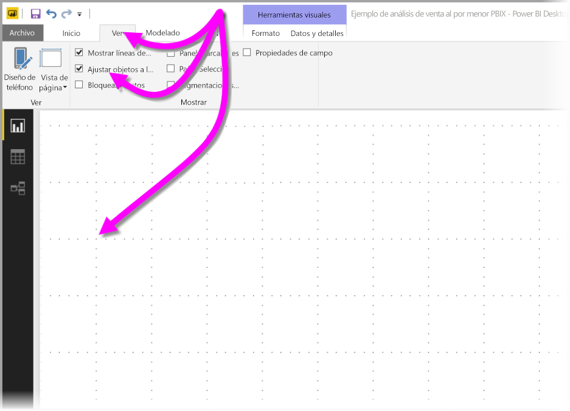
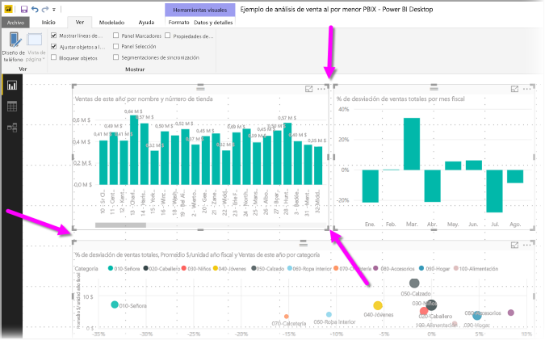
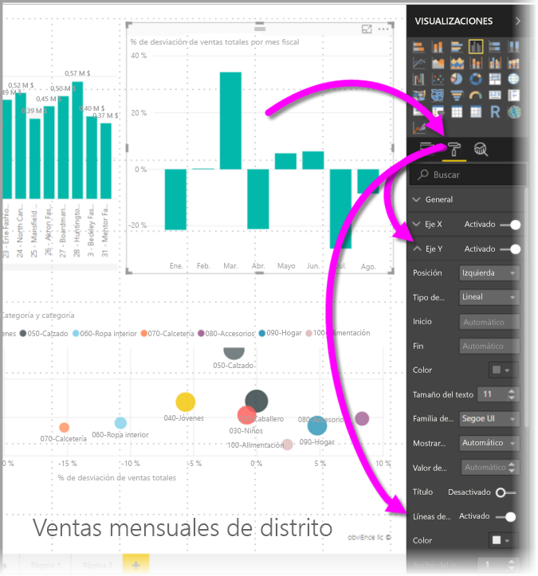
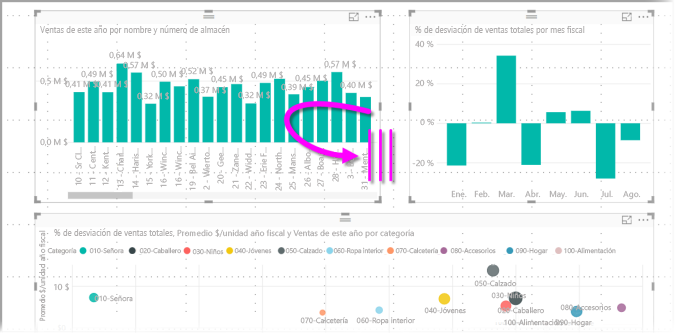
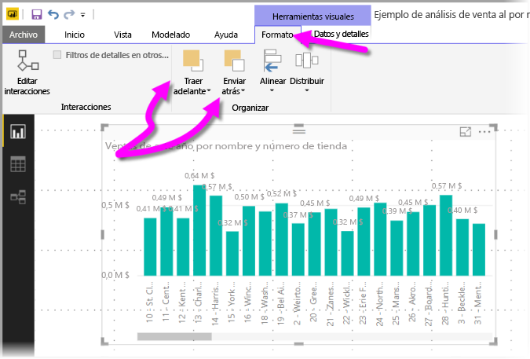
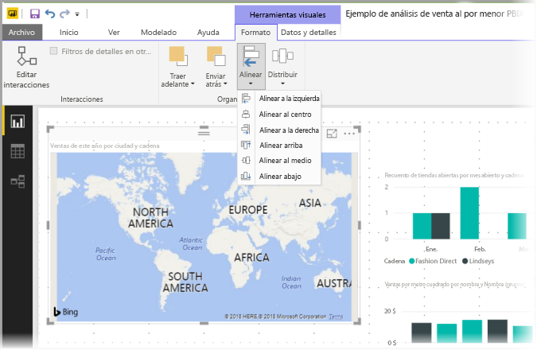
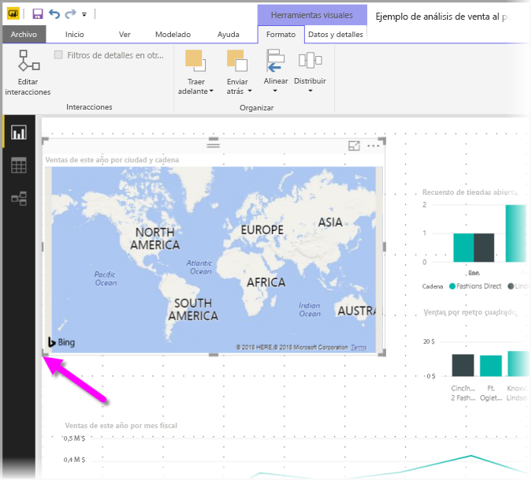
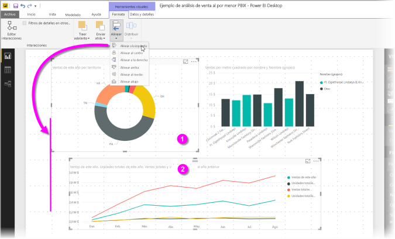
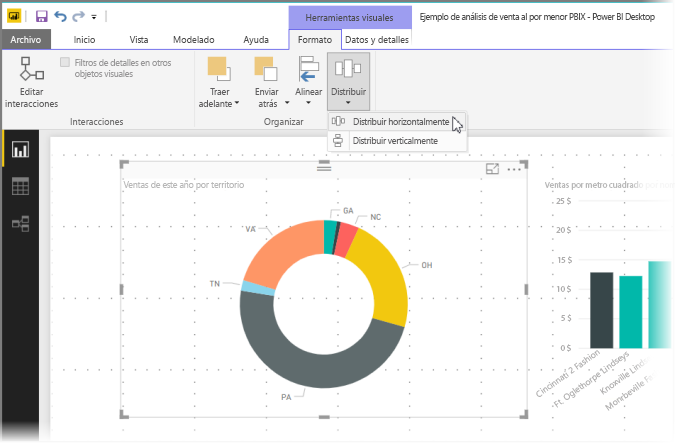

# Usar líneas de cuadrícula y ajustar a la cuadrícula en los informes de Power BI Desktop
El lienzo de informe de **Power BI Desktop** proporciona líneas de cuadrícula que permiten alinear perfectamente objetos visuales en una página de informe y usar la función de ajustar a la cuadrícula para objetos visuales; de este modo sus informes podrán tener un buen aspecto, estar alineados y disponer de un espaciado uniforme.

En **Power BI Desktop** también puede ajustar el orden Z (traer adelante, enviar hacia atrás) de objetos en un informe y alinear o distribuir uniformemente los objetos visuales seleccionados en el lienzo.

### Habilitar líneas de cuadrícula y ajustar a la cuadrícula
Para habilitar las líneas de cuadrícula y ajustar la cuadrícula, seleccione la cinta **Vista** y, después, habilite las casillas **Mostrar líneas de la cuadrícula** y **Ajustar objetos a la cuadrícula**. Puede seleccionar una o ambas opciones, ya que funcionan de forma independiente.

> [!NOTE]
> Si las opciones **Mostrar líneas de cuadrícula** y **Ajustar objetos a la cuadrícula** están deshabilitadas, conéctese a cualquier origen de datos y se habilitarán.
> 
> 

### Uso de las líneas de cuadrícula
Las líneas de cuadrícula son guías visibles que sirven para alinear los objetos visuales. Si está intentando determinar si dos (o más) objetos visuales están alineados horizontal o verticalmente, use las líneas de cuadrícula para determinar si se alinean sus bordes.

Puede usar Ctrl+clic para seleccionar más de un objeto visual a la vez. Se mostrarán los bordes de todos los objetos visuales y si estos están alineados correctamente.

#### Uso de líneas de cuadrícula dentro de objetos visuales
En Power BI también hay líneas de cuadrícula dentro de objetos visuales que sirven de guía visual para comparar los valores y los puntos de datos. A partir de la versión de septiembre de 2017 de **Power BI Desktop**, las líneas de cuadrícula de los objetos visuales se pueden administrar desde las tarjetas **Eje X** o **Eje Y** (como corresponda en función del tipo de objeto visual), que se encuentran en la sección **Formato** del panel **Visualizaciones**. Se pueden administrar los siguientes elementos de las líneas de cuadrícula de un objeto visual:

* Activar o desactivar la líneas de cuadrícula
* Cambiar el color de las líneas de cuadrícula
* Ajustar el trazo (el ancho) de las líneas de cuadrícula
* Seleccione el estilo de línea de las líneas de cuadrícula en el objeto visual, por ejemplo, sólido, con guiones o con puntos

La modificación de determinados elementos de las líneas de cuadrícula puede resultar especialmente útil en los informes en que se usan fondos oscuros para los objetos visuales. En esta imagen se muestra la sección **Líneas de cuadrícula** de la tarjeta **Eje Y**.

### Uso de ajustar a la cuadrícula
Al habilitar **Ajustar objetos a la cuadrícula**, todos los objetos visuales del lienzo de **Power BI Desktop** que mueve (o cambia de tamaño) se alinean automáticamente en el eje de cuadrícula más cercano, de modo que es mucho más fácil garantizar que dos o más objetos visuales se alinean en la misma ubicación horizontal o vertical, o el mismo tamaño.

Esto es todo lo relacionado con el uso de **líneas de cuadrícula** y **ajustar a la cuadrícula** para asegurarse de que los objetos visuales de los informes se alinean a la perfección.

### Uso del orden Z, alinear y distribuir
Puede administrar el orden de delante hacia atrás de los objetos visuales de un informe, lo que suele conocerse como el *orden Z* de elementos. Esta característica permite superponer objetos visuales de la manera que quiera y luego ajustar el orden de delante hacia atrás de cada uno de ellos. Para establecer el orden de los objetos visuales, use los botones **Traer al frente** y **Enviar atrás** que se encuentran en la sección **Organizar** de la cinta de opciones **Formato**. La cinta de opciones **formato** aparece en cuanto selecciona uno o más objetos visuales en la página.

La cinta de opciones **Formato** permite alinear los objetos visuales de muchas maneras diferentes, lo que garantiza que los objetos visuales se mostrarán en la alineación mejor convenga.

El botón **Alinear** alinea un objeto visual hacia el borde (o el centro) del lienzo del informe, como se muestra en esta siguiente.

Cuando hay dos o más objetos visuales seleccionados, se alinean entre sí y usan el límite alineado existente de los objetos visuales para su alineación. Por ejemplo, si selecciona dos objetos visuales y elige la opción **Alinear a la izquierda**, los objetos visuales se alinean hacia el extremo izquierdo de todos los objetos visuales.

También puede distribuir los objetos visuales uniformemente en el lienzo del informe, ya sea vertical u horizontalmente. Simplemente use el botón **Distribuir** de la cinta **Formato**.

Con la selección de algunas de estas líneas de cuadrícula, la alineación y las herramientas de distribución, los informes tendrán la apariencia que busca.

