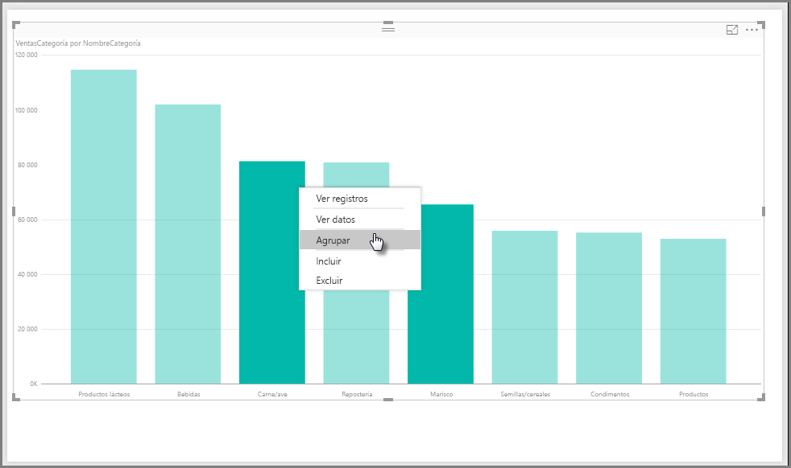
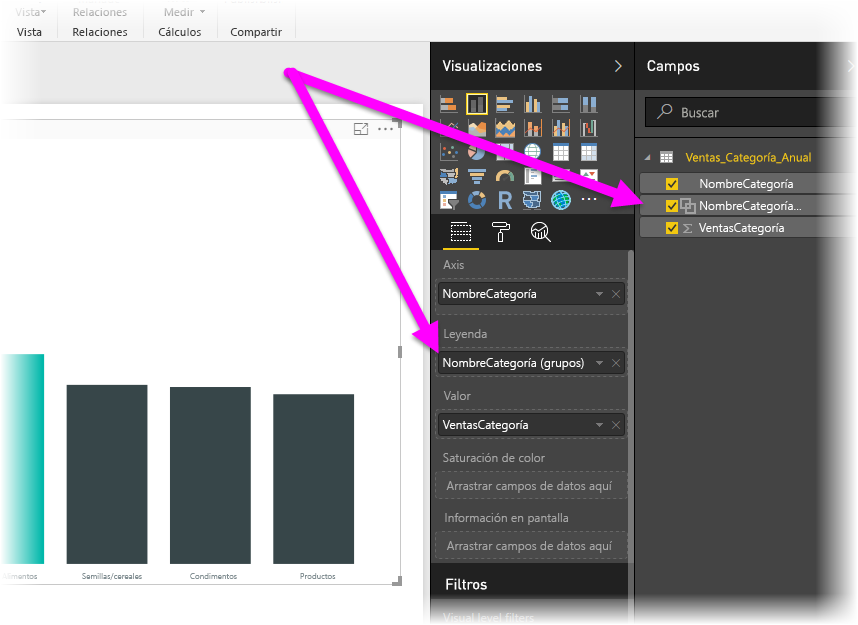
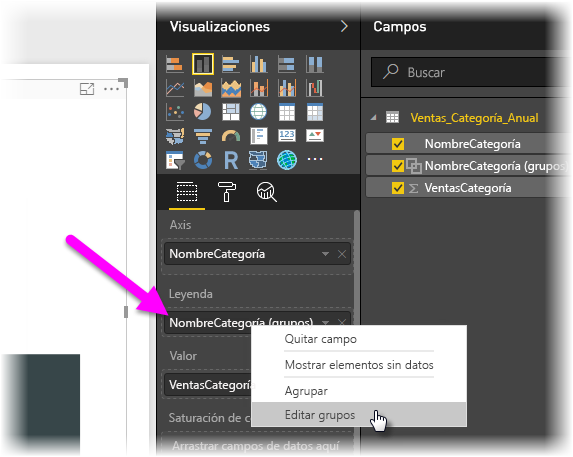
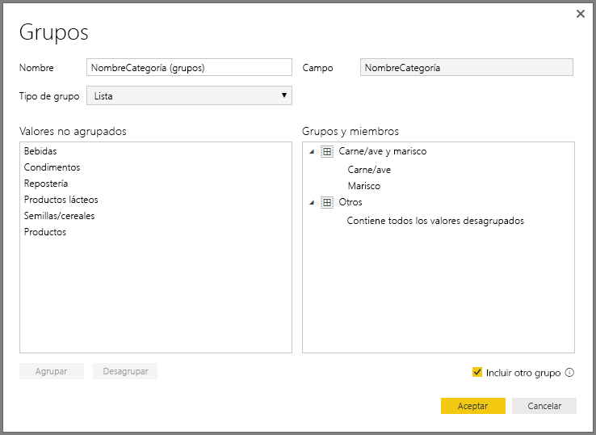
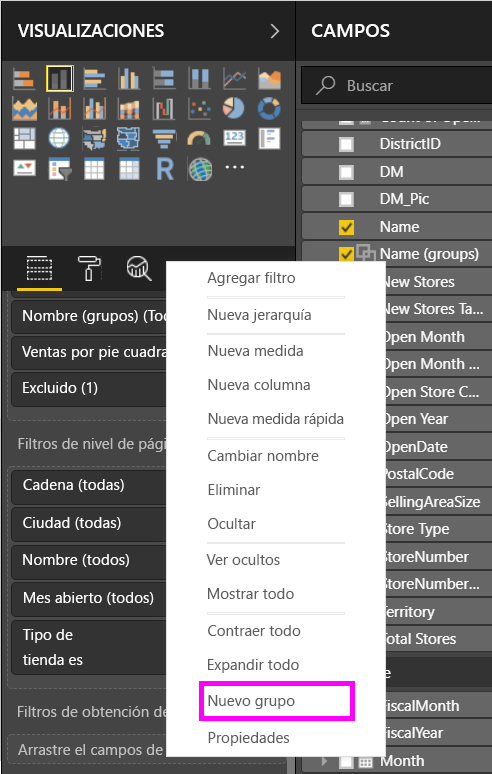
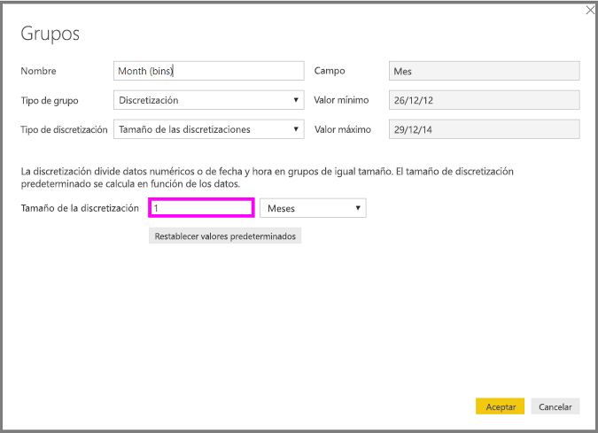
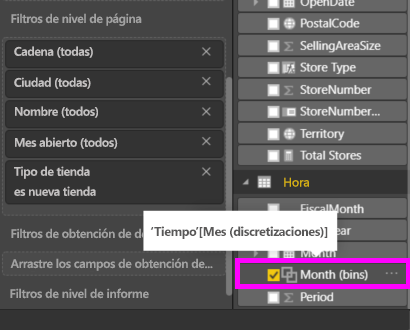

# Usar la agrupación y la discretización en Power BI Desktop
Cuando **Power BI Desktop** crea objetos visuales, agrega los datos en fragmentos (o grupos) en función de los valores que se encuentran en los datos subyacentes. A menudo esto es suficiente, pero puede haber ocasiones en las que quiera refinar la manera en que se presentan los fragmentos. Por ejemplo, tal vez le interese colocar tres categorías de productos en una categoría mayor (un *grupo*). También podría querer ver las cifras de ventas en tamaños de discretización de 1 000 000 dólares, en lugar de 923 983 dólares divididos uniformemente.

En Power BI Desktop, puede **agrupar** puntos de datos para ver, analizar y explorar más claramente datos y tendencias en los objetos visuales. También puede definir la opción **Tamaño de la discretización**, que a menudo se denomina *discretización*, para colocar los valores en grupos de igual tamaño que le permitan visualizar los datos de manera coherente.

## Usar la agrupación
Para usar la agrupación, seleccione dos o más elementos de un objeto visual mediante Ctrl + clic. Después, haga clic con el botón derecho en uno de los elementos seleccionados y elija **Grupo** en el menú que aparece.

Una vez creado, el grupo se agrega al cubo **Leyenda** del objeto visual y también aparece en la lista **Campos**.

Una vez que tenga un grupo, puede editar fácilmente los miembros de ese grupo. Para ello, haga clic con el botón derecho en el campo del cubo **Leyenda**, o de la lista **Campos**, y seleccione **Editar grupos**.

En la ventana **Grupos** que aparece, puede crear grupos o modificar grupos existentes. Si quiere *cambiar el nombre* de un grupo, haga doble clic en el título del grupo en el cuadro **Grupos y miembros** y escriba un nuevo nombre.

Se puede hacer de todo con los grupos. Los elementos de la lista **Valores no agrupados** se pueden agregar a un grupo nuevo o a uno de los grupos existentes. Para crear un grupo nuevo, seleccione dos o más elementos (con Ctrl + clic) en el cuadro **Valores no agrupados** y, después, haga clic en el botón **Grupo** que está debajo de ese cuadro.

Puede agregar un valor no agrupado a un grupo existente: simplemente seleccione el valor no agrupado, luego seleccione el grupo existente al que desee agregarlo y haga clic en el botón **Grupo**. Para quitar un elemento de un grupo, selecciónelo en el cuadro **Grupos y miembros** y luego haga clic en **Desagrupar**. También puede seleccionar si las categorías sin agrupar deben colocarse en el grupo **Otros** o permanecer sin agrupar.

> [!NOTE]
> Puede crear grupos para cualquier campo del área **Campos** sin necesidad de realizar una selección múltiple en un objeto visual existente. Basta con que haga clic con el botón derecho en el campo y que seleccione **Nuevo grupo** en el menú que aparece.

## Usar la discretización
Puede establecer el tamaño de discretización de campos numéricos y de tiempo en **Power BI Desktop.** Puede usar la discretización para ajustar el tamaño de los datos que **Power BI Desktop** muestra.

Para aplicar un tamaño de discretización, haga clic con el botón derecho en un **Campo** y seleccione **Nuevo grupo**.

En la ventana **Grupos**, establezca el **Tamaño de la discretización** hasta el tamaño que quiera.

Cuando seleccione **Aceptar**, observará que aparece un campo nuevo en el panel **Campos** con *(ubicaciones)* anexado. Después, puede arrastrar ese campo al lienzo para usar el tamaño de discretización en un objeto visual.

Para ver la **discretización** en acción, eche un vistazo a este [vídeo](https://www.youtube.com/watch?v=BRvdZSfO0DY).

Esto es todo lo que necesita saber para usar la **agrupación** y la **discretización** para asegurarse de que en los objetos visuales de los informes se muestran los datos tal y como usted quiere.

