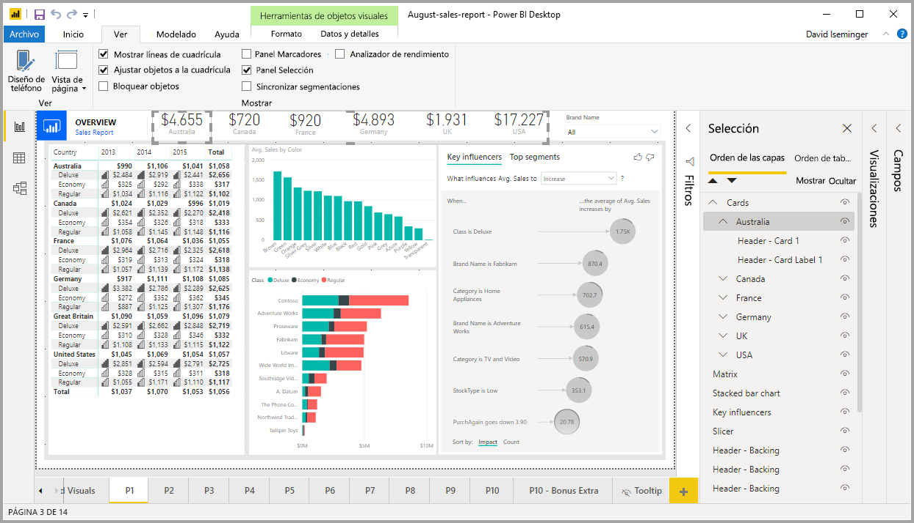
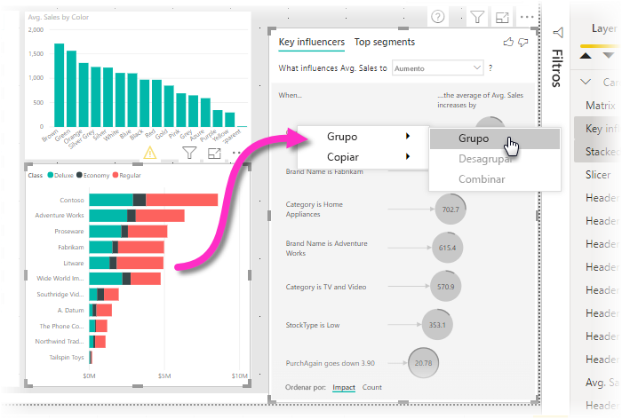
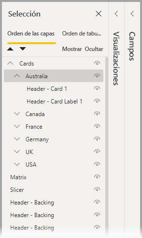
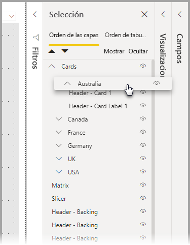
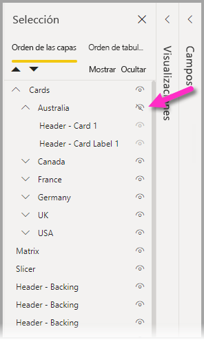
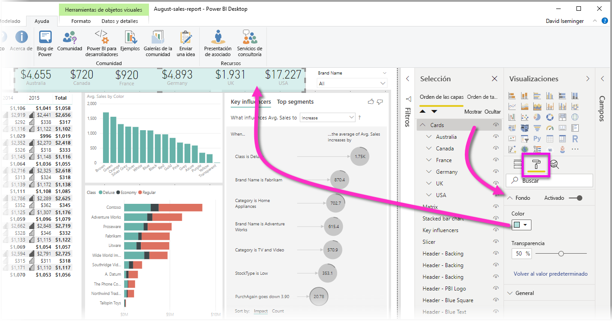

# Agrupación de objetos visuales en informes de Power BI Desktop
Con la **agrupación** de **Power BI Desktop**, puede agrupar objetos visuales en el informe, como botones, cuadros de texto, imágenes de formas y cualquier objeto visual que cree, de la misma manera que agrupa elementos en PowerPoint. La agrupación de objetos visuales en un informe permite tratar el grupo como un solo objeto, lo que hace que el movimiento, el cambio de tamaño y el trabajo con capas del informe sean más sencillos, rápidos e intuitivos.

## Creación de grupos

Para crear un grupo de objetos visuales en Power BI Desktop, seleccione el primer objeto visual del lienzo, mantenga presionado el botón CTRL, haga clic en uno o varios objetos visuales adicionales que quiera en el grupo, haga clic con el botón derecho en la colección de objetos visuales y seleccione **Agrupar** en el menú que aparece.

Los grupos se muestran en el panel **Selección**. Puede tener todos los grupos de objetos visuales que necesite el informe y también puede anidar grupos de objetos visuales. En la imagen siguiente, el grupo *Australia* está anidado bajo el grupo *Tarjetas*. Para expandir un grupo, seleccione el símbolo de intercalación situado junto al nombre del grupo y, para contraerlo, vuelva a seleccionar el símbolo de intercalación. 

En el panel **Selección**, también puede arrastrar y colocar objetos visuales individuales para incluirlos en un grupo, quitarlos de un grupo, anidar un grupo o quitar un grupo o un objeto visual individual de una anidación. Simplemente arrastre el objeto visual que pretende ajustar y colóquelo donde quiera. La disposición en capas de objetos visuales, si hay superposición, viene determinada por su orden en la lista *Orden de las capas*.

Para desagrupar, simplemente seleccione el grupo, haga clic con el botón derecho y seleccione **Desagrupar** en el menú que aparece.

## Ocultar y mostrar objetos visuales o grupos

Puede ocultar o mostrar grupos fácilmente mediante el panel **Selección**. Para ocultar un grupo, seleccione el botón de ojo situado junto al nombre del grupo (o cualquier objeto visual individual) para alternar entre la visualización u ocultación del objeto visual o el grupo. En la imagen siguiente, el grupo *Australia* está oculto, mientras que se muestran el resto de los grupos anidados en el grupo *Tarjetas*.

Cuando se oculta un grupo, se ocultan todos los objetos visuales de ese grupo, lo que se indica porque el botón de ojo aparece atenuado (no disponible para activar o desactivar, ya que todo el grupo está oculto). Para ocultar solo ciertos objetos visuales de un grupo, solo tiene que alternar el botón de ojo situado junto a ese objeto visual, y solo se oculta ese objeto visual del grupo.

## Selección de objetos visuales en un grupo

Hay varias maneras de examinar y seleccionar los elementos de un grupo de objetos visuales. En la lista siguiente se describe el comportamiento:

* Al hacer clic en un espacio vacío dentro de un grupo (por ejemplo, un espacio en blanco entre objetos visuales) no se selecciona nada
* Al hacer clic en un objeto visual dentro de un grupo se selecciona todo el grupo, un segundo clic selecciona el objeto visual individual
* Al seleccionar un grupo y luego otro objeto del lienzo del informe, y seleccionar **Agrupar** en el menú contextual, se crea un grupo anidado
* Al seleccionar dos grupos y hacer clic con el botón derecho, se muestra una opción para combinar los grupos seleccionados, en lugar de anidarlos

## Aplicar color de fondo

También puede aplicar un color de fondo a un grupo mediante la sección **Formato** del panel **Visualizaciones**, como se muestra en la siguiente imagen. 

Una vez aplicado un color de fondo, al hacer clic en el espacio entre objetos visuales del grupo, se selecciona el grupo (comparado con hacer clic en el espacio en blanco entre los objetos visuales de un grupo, que no selecciona el grupo). 

## Pasos siguientes
Para obtener más información sobre la agrupación, vea el siguiente vídeo:

* [Agrupación en Power BI Desktop: vídeo](https://youtu.be/sf4n7VXoQHY?t=10)

Puede que también esté interesado en los siguientes artículos:

* [Uso de la obtención de detalles de varios informes en Power BI Desktop](desktop-cross-report-drill-through.md)
* [Uso de segmentaciones de datos en Power BI Desktop](visuals/power-bi-visualization-slicers.md)

