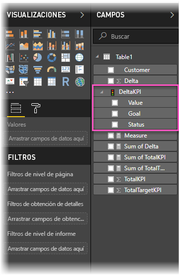
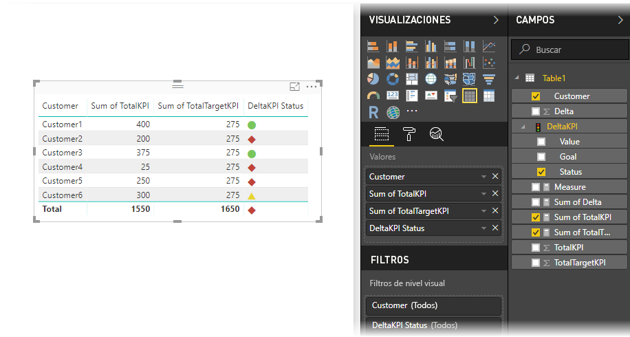

# Importar y mostrar KPI en Power BI
Con **Power BI Desktop**, puede importar y mostrar los KPI en tablas, matrices y tarjetas.

Siga estos pasos para importar y mostrar los KPI.

1. Comience con un libro de Excel que tenga un modelo de Power Pivot y KPI. En este ejercicio se usa un libro denominado *KPI*.

1. Importe el libro de Excel en Power BI, mediante **Archivo -> Importar -> Contenido de libro de Excel**. También puede [obtener información sobre cómo importar libros](desktop-import-excel-workbooks.md). 

1. Después de la importación en Power BI, aparecerá el KPI en el panel **Campos**, marcado con el icono de . Para usar un KPI en el informe, asegúrese de expandir su contenido, exponiendo los campos **Valor**, **Objetivo** y **Estado**.

    

1. Los KPI importados son útiles en los tipos de visualización estándar, como el tipo **Tabla**. Power BI también incluye el tipo de visualización **KPI**, que solo se debe usar para crear nuevos KPI.
   
    

Y eso es todo. Puede usar los KPI para resaltar tendencias, el progreso u otros indicadores importantes.
