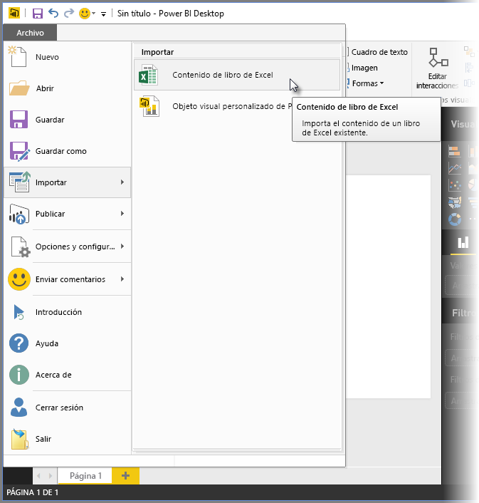
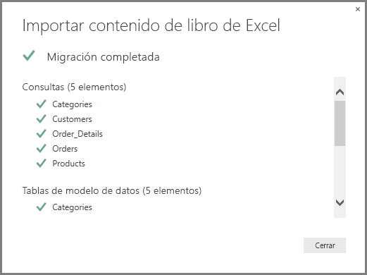
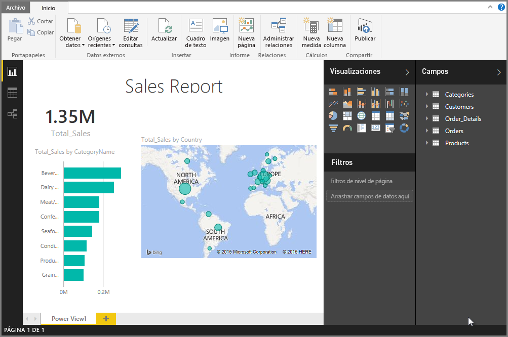

# Importación de libros de Excel en Power BI Desktop
Si usa Power BI Desktop, puede importar fácilmente a él libros de Excel que contienen consultas de Power Query, modelos de Power Pivot y hojas de cálculo de Power View. Power BI Desktop crea automáticamente informes y visualizaciones basados en libros de Excel. Una vez importados los libros, puede seguir mejorándolos y perfeccionándolos con Power BI Desktop, usando las características ya existentes o las nuevas que se publican con cada actualización mensual de Power BI Desktop.

## ¿Cómo puedo importar un libro de Excel?
1. Para importar un libro de Excel a Power BI Desktop, seleccione **Archivo** > **Importar** > **Power Query, Power Pivot, Power View**.

   

2. En la ventana **Abrir**, seleccione el libro de Excel que quiera importar. 

   Si bien a día de hoy no existe ninguna limitación en el tamaño o el número de objetos en el libro, Power BI Desktop tarda más en analizar e importar los libros más grandes.

   > [!NOTE]
   > Para cargar o importar archivos de Excel de carpetas compartidas de OneDrive para la Empresa o de carpetas del grupo de Office 365, use la dirección URL del archivo de Excel y escríbala en el origen de datos web en Power BI Desktop. Existen algunos pasos que hay que seguir para aplicar el formato correcto a la dirección URL de OneDrive para la Empresa; para más información y conocer los pasos correctos necesarios, vea [Usar vínculos de OneDrive para la Empresa en Power BI Desktop](desktop-use-onedrive-business-links.md).
   > 
   > 

3. En el cuadro de diálogo de importación que se abre, seleccione **Iniciar**.

   

   Power BI Desktop analiza el libro y lo convierte en un archivo de Power BI Desktop (.pbix). Esta acción es un evento único; una vez creado el archivo de Power BI Desktop con estos pasos, dicho archivo no dependerá del libro original de Excel y se podrá modificar, guardar y compartir sin que ello afecte al libro original.

   Una vez finalizada la importación, aparecerá una página de resumen donde se describen los elementos que se han convertido y se muestran también aquellos que no han podido importarse.

   

4. Haga clic en **Cerrar**. 

   Power BI Desktop importa el libro de Excel y carga un informe en función del contenido del libro.

   

Una vez importado el libro, puede seguir trabajando en el informe. Puede crear otras visualizaciones, agregar datos o crear más páginas de informe con cualquiera de las características y capacidades incluidas en Power BI Desktop.

## ¿Qué elementos del libro se importan?
Power BI Desktop puede importar los siguientes elementos, a los que se conoce normalmente como *objetos*en Excel.

| Objeto en un libro de Excel | Resultado final en el archivo de Power BI Desktop |
| --- | --- |
| Consultas de Power Query |Todas las consultas de Power Query de Excel se convierten en consultas en Power BI Desktop. Si hay grupos de consultas definidos en el libro de Excel, se replicará la misma organización en Power BI Desktop. Se cargarán todas las consultas, a no ser que estén establecidas en **Crear solo conexión** en el cuadro de diálogo de Excel **Importar datos**. Para personalizar el comportamiento de carga, seleccione **Propiedades** en la pestaña **Inicio** del Editor de consultas en Power BI Desktop. |
| Conexiones a datos externos de Power Pivot |Todas las conexiones a datos externos de Power Pivot se convierten en consultas en Power BI Desktop. |
| Tablas vinculadas o tablas de libros actuales |Si hay una tabla de hojas de cálculo de Excel vinculada al modelo de datos o a una consulta (a través de la opción *Desde tabla* o la función *Excel.CurrentWorkbook()* en M), existirá la posibilidad de hacer lo siguiente: <ol><li><b>Importar la tabla al archivo de Power BI Desktop</b>. Esta tabla es una instantánea de un solo uso de los datos, tras la cual los datos serán de solo lectura en la tabla en Power BI Desktop. Las tablas creadas con esta opción presentan un límite de tamaño de 1 millón de caracteres (en total, combinando todos los encabezados de columna y las celdas).</li><li><b>Mantener una conexión con el libro original</b>. También puede mantener una conexión con el libro de Excel original y Power BI Desktop recuperará el contenido más reciente de esta tabla con cada actualización, igual que cualquier otra consulta creada en un libro de Excel en Power BI Desktop.</li></ul> |
| Relaciones, categorías de datos, KPI, medidas y columnas calculadas de modelo de datos |Estos objetos de modelo de datos se convierten en los objetos equivalentes en Power BI Desktop. Tenga en cuenta que existen determinadas categorías de datos que no están disponibles en Power BI Desktop, como Imagen. En estos casos, se restablece la información de la categoría de datos de las columnas en cuestión. |
| Hojas de cálculo de Power View |Se crea una nueva página de informe para cada hoja de cálculo de Power View en Excel. El nombre y el orden de estas páginas de informe coinciden con el libro de Excel original. |

## ¿Existen limitaciones para la importación de un libro?
Existen algunas limitaciones a la hora de importar un libro en Power BI Desktop:

* **Conexiones externas a modelos tabulares de SQL Server Analysis Services:** en Excel 2013, es posible crear una conexión a modelos tabulares de SQL Server Analysis Services y crear informes de Power View encima de estos modelos sin necesidad de importar los datos. Este tipo de conexión no se admite actualmente como parte de la importación de libros de Excel a Power BI Desktop. Como solución alternativa, debe volver a crear estas conexiones externas en Power BI Desktop.
* **Jerarquías:** este tipo de objeto de modelo de datos no es compatible actualmente con Power BI Desktop. Por lo tanto, las jerarquías se omiten como parte de la importación de un libro de Excel a Power BI Desktop.
* **Columnas de datos binarios:** este tipo de columna de modelo de datos no es compatible actualmente con Power BI Desktop. Las columnas de datos binarios se quitan de la tabla resultante en Power BI Desktop.
* **Elementos de Power View no compatibles:** existen algunas características de Power View que no están disponibles en Power BI Desktop, como los temas o determinados tipos de visualizaciones (gráfico de dispersión con eje de reproducción, comportamientos de obtención de detalles, etc.). Estas visualizaciones no compatibles provocan mensajes de *Visualización no compatible* en sus correspondientes ubicaciones en el informe de Power BI Desktop, que puede eliminar o volver a configurar según sea necesario.
* **Rangos con nombre que usan** ***Desde tabla*** **en Power Query o** ***Excel.CurrentWorkbook*** **en M:** la importación de estos datos de rangos con nombre a Power BI Desktop no es compatible actualmente, pero es una actualización prevista. Actualmente, estos rangos con nombre se cargan en Power BI Desktop como una conexión al libro de Excel externo.
* **Power Pivot para SSRS:** las conexiones externas de Power Pivot para SQL Server Reporting Services (SSRS) no son compatibles actualmente, ya que el origen de datos no está disponible actualmente en Power BI Desktop.

