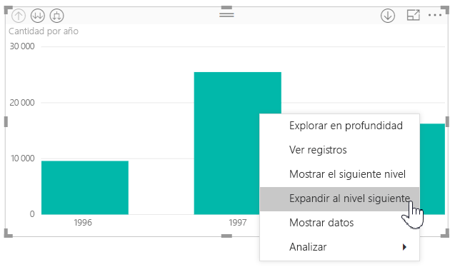
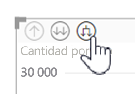
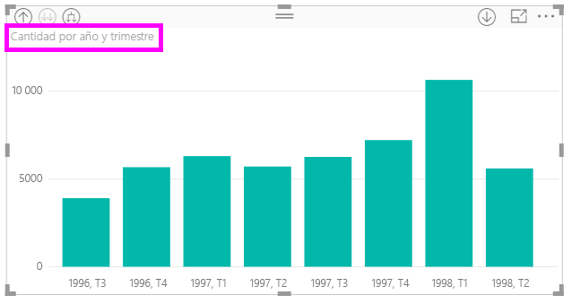
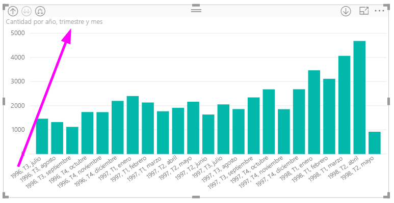
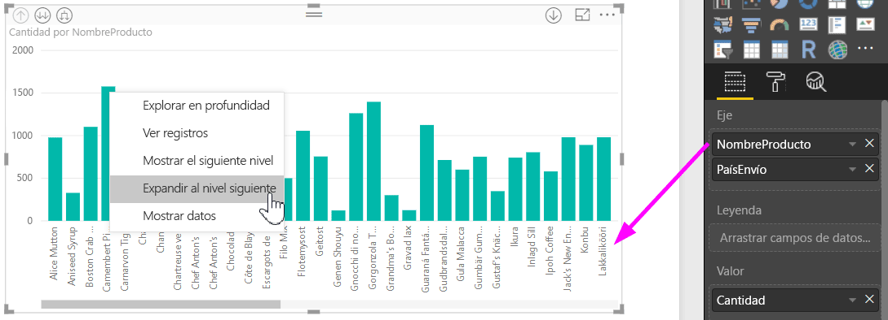
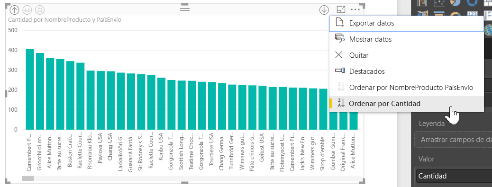
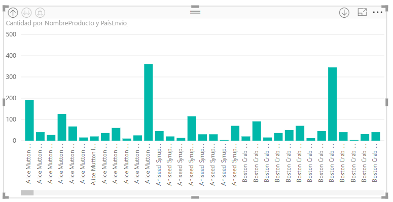

# Uso de etiquetas de jerarquía alineadas en Power BI Desktop
**Power BI Desktop** admite el uso de las **etiquetas de jerarquía alineadas**, que es la primera de las dos características diseñadas para explorar mejor la jerarquía. La segunda característica, que actualmente está en desarrollo, es la capacidad de usar etiquetas de jerarquía anidadas (esté atento, porque las actualizaciones se realizan con frecuencia).   

## Funcionamiento de las etiquetas de jerarquía alineadas
Con las etiquetas de jerarquía alineadas, puede ver las etiquetas de jerarquía cuando expande los objetos visuales con la característica **Expandir todo**. Una gran ventaja de ver estas etiquetas de jerarquía es que también puede optar por **ordenar** según estas distintas etiquetas de jerarquía cuando expande los datos jerárquicos.

### Uso de la característica integrada Expandir (sin ordenar por etiquetas de jerarquía)
Antes de ver en acción las etiquetas de jerarquía en línea, revisemos el comportamiento predeterminado de la característica **Expandir al nivel siguiente**. Esto nos ayudará a comprender (y apreciar) la utilidad que pueden llegar a tener las etiquetas de jerarquía alineadas.

La imagen siguiente muestra un objeto visual de gráfico de barras correspondiente a las ventas anuales. Al hacer clic con el botón derecho en una barra, puede seleccionar **Expandir al nivel siguiente**.

> [!NOTE]
> En vez de hacer clic con el botón derecho en una barra, puede seleccionar el botón *Expandir* en la parte superior izquierda de la visualización.

  

Una vez que haya seleccionado **Expandir al nivel siguiente**, el objeto visual expandirá la jerarquía de fechas de *Año* a *Trimestre*, tal como se muestra en la imagen siguiente.

Observe que las etiquetas *Año* y *Trimestre* se muestran alineadas y juntas. Este esquema de etiquetado continúa si selecciona **Expandir todo** hacia la parte inferior de la jerarquía.

Este es el comportamiento de la jerarquía *Fecha*, asociada con campos que tienen un tipo de datos de *fecha y hora*. Vamos a la sección siguiente, donde veremos qué diferencia tiene la nueva característica de etiquetas de jerarquía alineadas.

### Uso de las etiquetas de jerarquía alineadas
Ahora, veamos un gráfico distinto que usa datos que incluyen jerarquías informales. En el siguiente objeto visual, tenemos un gráfico de barras con **Cantidad** que usa *ProductName* como eje. En estos datos, *ProductName* y *ShipCountry* forman una jerarquía informal. Aquí, puede seleccionar nuevamente *Expandir al nivel siguiente* para explorar en profundidad la jerarquía.

Si selecciona **Expandir al nivel siguiente**, se muestra el nivel siguiente con la visualización en línea de las etiquetas de jerarquía. De manera predeterminada, las jerarquías en línea se ordenan según el valor de la medida, en este caso, **Cantidad**. Con las etiquetas de jerarquía en línea habilitadas, puede optar por ordenar estos datos también según la jerarquía. Para ello, seleccione los puntos suspensivos que se encuentran en la esquina superior derecha (**…**) y, luego, seleccione **Ordenar por ProductName ShipCountry**, tal como se muestra en la imagen siguiente.

Una vez que se selecciona **ShipCountry**, los datos se ordenan según la selección de jerarquía informal, tal como aparece en la imagen siguiente.

> [!NOTE]
> La característica de etiqueta de jerarquía alineada todavía no permite que la jerarquía de tiempo integrada se ordene por valor; solo se ordena por el orden de la jerarquía.
> 
> 

## Solución de problemas
Puede que los objetos visuales se bloqueen en un estado de nivel de jerarquía alineada expandido. En algunos casos, puede que encuentre que algunos de sus objetos visuales están bloqueados en el modo en que se expandieron; en ese caso, la exploración no funcionará. Esto puede ocurrir si lleva a cabo estos pasos (*debajo* de los pasos puede ver cómo corregir este problema):

Pasos que pueden bloquear los objetos visuales en un estado expandido:

1. Habilita la característica de **etiqueta de jerarquía alineada**.
2. Crear algunos objetos visuales con jerarquías.
3. Luego, selecciona **Expandir todo** y guarda el archivo.
4. A continuación, *deshabilita* la característica de **etiqueta de jerarquía en línea** y reinicia Power BI Desktop.
5. Luego, vuelve a abrir el archivo.

Si hizo los pasos anteriores y los objetos visuales están bloqueados en el modo expandido, puede solucionar el problema si hace lo siguiente:

1. Vuelva a habilitar la característica de **etiqueta de jerarquía alineada** y, luego, reinicie Power BI Desktop.
2. Vuelva a abrir el archivo y vuelva a explorar la parte superior de los objetos visuales afectados.
3. Guarde el archivo.
4. Deshabilite la característica **etiqueta de jerarquía alineada** y, luego, reinicie Power BI Desktop.
5. Vuelva a abrir el archivo.

O bien, puede simplemente eliminar el objeto visual y volver a crearlo.

