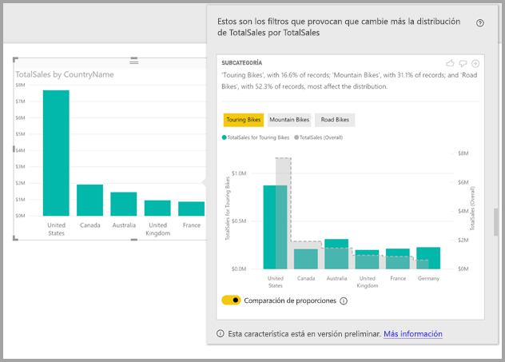
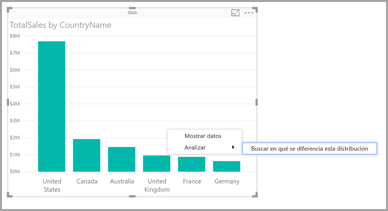

# Usar información detallada en Power BI Desktop para descubrir en qué se diferencia una distribución (versión preliminar)

En ocasiones verá un punto de datos en los objetos visuales y podría preguntarse si la distribución será igual para las distintas categorías. Con la **información detallada** en **Power BI Desktop**, puede averiguarlo con unos pocos clics.

Tenga en cuenta el siguiente objeto visual, que muestra las *ventas totales* por *país*. Como se muestra en el gráfico, la mayoría de las ventas proceden de los Estados Unidos, ya que suponen el 57% del total, mientras que las contribuciones procedentes de los demás países son menores. En estos casos, es interesante investigar si se daría esa misma distribución para subpoblaciones diferentes. Por ejemplo, ¿sucede lo mismo para todos los años, todos los canales de ventas y todas las categorías de productos?  Aunque podría aplicar filtros diferentes y comparar los resultados visualmente, esto puede llevar mucho tiempo y ser propenso a errores. 

Puede indicarle a **Power BI Desktop** que busque en qué se diferencia una distribución para obtener un análisis rápido, automatizado y detallado de los datos. Solo tiene que hacer clic con el botón derecho en un punto de datos y seleccionar **Analyze > Find where the distribution is different** (Analizar > Buscar en qué se diferencia esta distribución) y se le proporcionará información detallada en una ventana fácil de usar.

En este ejemplo, el análisis automático muestra rápidamente que para las *bicicletas de paseo*, la proporción de ventas en Estados Unidos y Canadá es menor, mientras que la proporción procedente de los demás países es mayor.   

> [!NOTE]
> Esta característica está en su versión preliminar y está sujeta a cambios. La característica de información detallada está habilitada y activa de forma predeterminada (no es necesario activar ninguna casilla de vista previa para habilitarla) a partir de la versión de septiembre de 2017 de **Power BI Desktop**.
> 
> 

## Uso de la información detallada
Para usar información detallada a fin de descubrir en qué se diferencian las distribuciones vistas en gráficos, basta con que haga clic con el botón derecho en cualquier punto de datos (o en el objeto visual en su conjunto) y que seleccione **Analyze > Find where the distribution is different** (Analizar > Buscar en qué se diferencia esta distribución).

Después, **Power BI Desktop** ejecuta sus algoritmos de aprendizaje automático sobre los datos y rellena una ventana con un objeto visual y una descripción que muestra qué categorías (columnas) y qué valores de dichas columnas producen la distribución más significativamente diferente. La información detallada se proporciona como un gráfico de columnas, como se muestra en la siguiente imagen. 

Los valores con el filtro seleccionado aplicado se muestran en el color predeterminado normal. Los valores totales, igual que en el objeto visual de inicio original, se muestran en gris para facilitar la comparación. Se pueden incluir hasta tres filtros diferentes (*bicicletas de paseo*, *bicicletas de montaña* y *bicicletas de carretera* en este ejemplo). Para elegir los distintos filtros, hay que hacer clic en ellos (o usar CTRL+clic para seleccionar varios).

Para las medidas de adición simples, como las *ventas totales* en este ejemplo, la comparación se basa en valores relativos, en vez de absolutos. Por lo tanto, mientras que las ventas de bicicletas de paseo son claramente inferiores a las ventas totales de todas las categorías, el objeto visual usa de forma predeterminada un eje de dual para permitir la comparación entre la proporción de ventas en los distintos países para las bicicletas de paseo frente a todas las categorías de bicicletas.  Al cambiar el botón de alternancia situado debajo del objeto visual, los dos valores se muestran en el mismo eje, lo que permite comparar fácilmente los valores absolutos (como se muestra en la imagen siguiente).    

El texto descriptivo también ofrece indicaciones sobre el grado de importancia que podría haberse asignado a un valor de filtro, al mostrar el número de registros que coinciden con el filtro. En este ejemplo puede ver que, aunque la distribución para *bicicletas de paseo* podría ser significativamente diferente, suponen tan solo el 16,6 % de los registros.

Los iconos de *pulgar hacia arriba* y *pulgar hacia abajo* de la parte superior de la página se incluyen para que pueda proporcionar comentarios sobre el objeto visual y la característica. Si lo hace, efectivamente aporta comentarios, pero no entrena el algoritmo para que influya en los resultados que se devuelvan la próxima vez que use la característica.

Y lo que es más importante, el botón **+** situado en la parte superior del objeto visual le permite agregar el objeto visual seleccionado al informe, como si lo hubiera creado manualmente. A continuación, puede aplicar formato o ajustar de cualquier forma el objeto visual agregado al igual que lo haría con cualquier otro objeto visual del informe. Solo puede agregar un objeto visual seleccionado de información detallada cuando vaya a editar un informe en **Power BI Desktop**.

Puede usar la información detallada si el informe está en modo de lectura o de edición, lo cual lo hace muy versátil a la hora de analizar datos o de crear objetos visuales que puede agregar fácilmente a los informes.

## Detalles de los resultados devueltos
Considere que el algoritmo toma todas las demás columnas del modelo, y en el caso de todos los valores de esas columnas, aplíquelos como filtros al objeto visual original para ver cuál de los valores de filtro produce el resultado más *diferente* con respecto al original.

Naturalmente, es probable que se pregunte qué significa *diferente*. Por ejemplo, supongamos que el reparto de ventas total entre los Estados Unidos y Canadá es el siguiente:

|País  |Ventas (M de $)|
|---------|----------|
|EE. UU.      |15        |
|Canadá   |5         |

Para una categoría de producto determinada (*bicicleta de carretera*), el reparto de ventas podría ser el siguiente:

|País  |Ventas (M de $)|
|---------|----------|
|EE. UU.      |3        |
|Canadá   |1         |

Aunque los números son diferentes en cada una de estas tablas, los valores relativos entre Estados Unidos y Canadá son idénticos (75 % y 25 % en total y para las bicicletas de carretera). Por este motivo, no se consideran diferentes. Para las medidas de adición simples como esta, el algoritmo busca las diferencias en el valor *relativo*.  

Por el contrario, considere una medida como un margen, que se calcula como el beneficio/coste. Imagine que los márgenes totales de los Estados Unidos y Canadá son los siguientes.

|País  |Margen (%)|
|---------|----------|
|EE. UU.      |15        |
|Canadá   |5         |

Para una categoría de producto determinada (*bicicleta de carretera*), el reparto de ventas podría ser el siguiente:

|País  |Margen (%)|
|---------|----------|
|EE. UU.      |3        |
|Canadá   |1         |

Dada la naturaleza de dichas medidas, esto *sí* se considera diferente. Para las medidas que no son de adición, como este ejemplo de margen, el algoritmo busca las diferencias en el valor absoluto.

Por lo tanto, los objetos visuales que se muestran están diseñados para indicar claramente las diferencias que se encuentran entre la distribución total (como se ve en el objeto visual original) y el valor con el filtro particular aplicado.  

Para las medidas de adición, como las *ventas* del ejemplo anterior, se usa un gráfico de columnas y líneas, donde el uso de un eje de dual con el escalado adecuado permite comparar fácilmente los valores relativos. Las columnas muestran el valor con el filtro aplicado, mientras que la línea muestra el valor total (con el eje de columna a la izquierda y el eje de línea a la derecha, como es habitual). La línea se muestra con un estilo *escalonado* con una línea discontinua, rellena de color gris. Para el ejemplo anterior, si el valor máximo del eje de columna es 4 y el valor máximo del eje de línea es 20, se podrían comparar fácilmente los valores relativos entre los Estados Unidos y Canadá para los valores filtrados y totales. 

Del mismo modo, para las medidas que no son de adición, como el *margen* en el ejemplo anterior, se usa un gráfico de columnas y líneas, donde el uso de un eje único permite comparar fácilmente los valores absolutos. De nuevo, la línea (rellena de color gris) muestra el valor total. Tanto si se comparan números reales o relativos, la determinación del grado en el que son diferentes dos distribuciones no se reduce a una cuestión de calcular la diferencia entre los valores. Por ejemplo:

* El tamaño de la población se tiene en cuenta, ya que una diferencia es menos significativa estadísticamente y menos interesante cuando se aplica a una proporción menor de la población total. Por ejemplo, la distribución de las ventas entre países puede ser muy diferente para un producto en particular. Esto no se consideraría interesante si hay miles de productos y, por lo tanto, ese producto en concreto solo supone un pequeño porcentaje de las ventas totales.

* Las diferencias de las categorías en las que los valores originales son muy altos o muy cercanos a cero tienen una ponderación superior a otras. Por ejemplo, si un país aporta en total solo un 1 % de las ventas, pero en un tipo de producto determinado aporta un 6 %, esto es más significativo estadísticamente y, por lo tanto, se considera más interesante que un país cuya contribución cambie del 50 % al 55 %. 

* Se emplean diferentes heurísticas para seleccionar los resultados más significativos, por ejemplo, al tener en cuenta otras relaciones entre los datos.
     
Después de examinar las distintas columnas y los valores de cada una de estas columnas, se elige el conjunto de valores que ofrecen las mayores diferencias. Para facilitar la comprensión, los resultados se agrupan por columna, con la columna cuyos valores proporcionan la diferencia más importante en primer lugar. Se muestran hasta tres valores por columna, pero podrían mostrarse menos si hay menos de tres valores con un gran efecto o si algunos valores son mucho más importantes que otros. 

No necesariamente todas las columnas del modelo se examinarán en el tiempo disponible, por lo que no se garantiza que se muestren las columnas y los valores más impactantes. Aun así, se emplean diferentes heurísticas para asegurarse de que se examinen primero las columnas más probables. Por ejemplo, supongamos que después de examinar todas las columnas, se determina que las columnas o los valores siguientes tienen el mayor impacto en la distribución, mostrados de mayor a menor impacto:

    Subcategory = Touring Bikes
    Channel = Direct
    Subcategory = Mountain Bikes
    Subcategory = Road Bikes
    Subcategory = Kids Bikes
    Channel = Store

Estos aparecerían en la columna en el orden siguiente:

    Subcategory: Touring Bikes, Mountain Bikes, Road Bikes (only three listed, with the text including “...amongst others” to indicate that more than three have a significant impact) 

    Channel = Direct (only Direct listed, if it’s level of impact was much greater than Store)

## Consideraciones y limitaciones
La siguiente lista es una recopilación de los escenarios que actualmente no son compatibles para la característica de **información detallada**:

* Filtros TopN
* Filtros de medidas
* Medidas no numéricas
* Uso de "Mostrar valor como"
* Medidas filtradas: las medidas filtradas son cálculos de nivel visual con un filtro específico aplicado (por ejemplo, *Total de ventas en Francia*) y se usan en algunos de los objetos visuales creados por la característica de conclusiones

Además, los siguientes orígenes de datos y tipos de modelos no se admiten para la característica de información detallada:

* DirectQuery
* Live connect
* Reporting Services local
* Inserción

## Pasos siguientes
Para más información acerca de **Power BI Desktop** y cómo empezar a trabajar, consulte los siguientes artículos.

* [¿Qué es Power BI Desktop?](desktop-what-is-desktop.md)
* [Información general sobre consultas con Power BI Desktop](desktop-query-overview.md)
* [Orígenes de datos en Power BI Desktop](desktop-data-sources.md)
* [Conectarse a los datos en Power BI Desktop](desktop-connect-to-data.md)
* [Combinar datos y darles forma con Power BI Desktop](desktop-shape-and-combine-data.md)
* [Tareas de consultas comunes en Power BI Desktop](desktop-common-query-tasks.md)   

