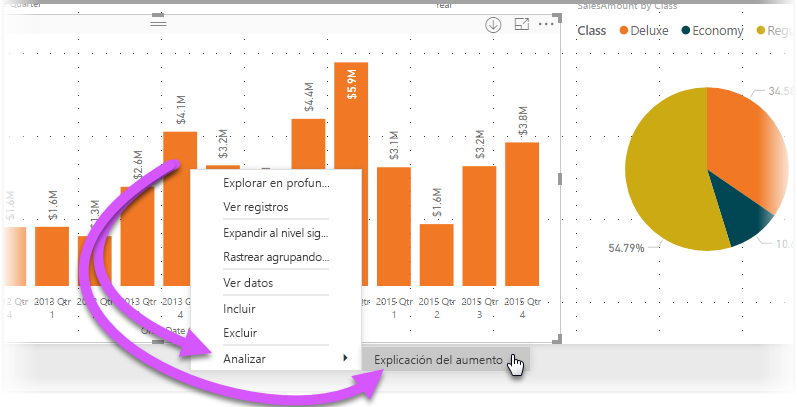
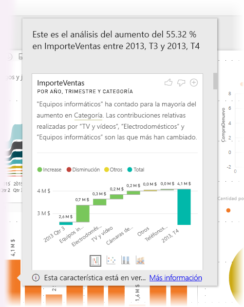
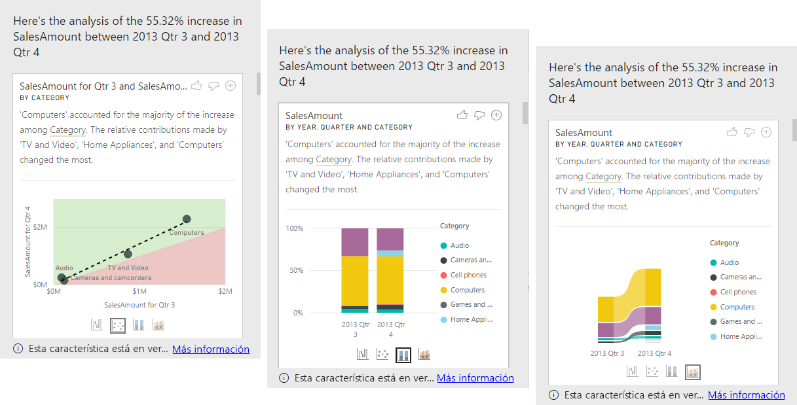

# Uso de conclusiones en Power BI Desktop para explicar los aumentos y las disminuciones que hay en objetos visuales (versión preliminar)

A menudo, en los objetos visuales ve un gran aumento y después un descenso brusco en los valores y se pregunta cuál es la causa de esas fluctuaciones. Con las **conclusiones** de **Power BI Desktop**, puede conocer las causas con unos pocos clics.

Por ejemplo, fíjese en el siguiente objeto visual que muestra el *Importe de venta* por *Año* y *País*. En 2014 se produce una gran disminución en las ventas, con un descenso drástico en las ventas entre el *T1* y el *T2*. En tales casos, puede explorar los datos para ayudar a explicar el cambio que se ha producido. 

Puede indicarle a **Power BI Desktop** que explique los aumentos o disminuciones en los gráficos, ver los factores de distribución en los gráficos y obtener un análisis rápido, automatizado y detallado sobre los datos. Solo tiene que hacer clic con el botón derecho en un punto de datos y seleccionar **Analizar > Explicación de la disminución** (o del aumento, si la barra anterior era inferior), o **Analizar > Buscar en qué se diferencia esta distribución** y se le proporcionará una información detallada en una ventana fácil de usar.

La característica de información detallada es contextual y se basa en el punto de datos inmediatamente anterior como, por ejemplo, la barra o columna anterior.

> [!NOTE]
> Esta característica está en su versión preliminar y está sujeta a cambios. La característica de información detallada está habilitada y activa de forma predeterminada (no es necesario activar ninguna casilla de vista previa para habilitarla) a partir de la versión de septiembre de 2017 de **Power BI Desktop**.

## Uso de la información detallada
Para usar información detallada para explicar los aumentos o las disminuciones en los gráficos solo tiene que hacer clic con el botón derecho en cualquier punto de datos de un gráfico de líneas o barras y seleccionar **Analizar > Explicación del aumento**, o *Explicación de la disminución*, ya que toda la información detallada se basa en el cambio con respecto al punto de datos anterior.

A continuación, **Power BI Desktop** ejecuta sus algoritmos de aprendizaje automático sobre los datos y rellena una ventana con un objeto visual y una descripción que muestra qué categorías influyeron más en el aumento o disminución. De forma predeterminada, se proporciona la información detallada como un objeto visual de *cascada*, como se muestra en la siguiente imagen.

Si selecciona los pequeños iconos situados en la parte inferior del objeto visual de cascada, puede elegir si la información detallada se muestra como un gráfico de dispersión, un gráfico de columnas apiladas o un gráfico de la barra de herramientas.

Los iconos de *pulgar hacia arriba* y *pulgar hacia abajo* de la parte superior de la página se incluyen para que pueda proporcionar comentarios sobre el objeto visual y la característica. Si lo hace, efectivamente aporta comentarios, pero no entrena el algoritmo para que influya en los resultados que se devuelvan la próxima vez que use la característica.

Y lo que es más importante, el botón **+** situado en la parte superior del objeto visual le permite agregar el objeto visual seleccionado al informe, como si lo hubiera creado manualmente. A continuación, puede aplicar formato o ajustar de cualquier forma el objeto visual agregado al igual que lo haría con cualquier otro objeto visual del informe. Solo puede agregar un objeto visual seleccionado de información detallada cuando vaya a editar un informe en **Power BI Desktop**.

Puede usar la información detallada si el informe está en modo de lectura o de edición, lo cual lo hace muy versátil a la hora de analizar datos o de crear objetos visuales que puede agregar fácilmente a los informes.

## Detalles de los resultados devueltos

Los detalles que devuelven las conclusiones están destinados a destacar las diferencias entre los dos períodos, para ayudarle a comprender el cambio entre ellos.  

Por ejemplo, si las *Ventas* se han incrementado de forma general un 55 % del *T3* al *T4*, y esto se aplica igualmente en cada *Categoría* de producto (las ventas de equipos informáticos aumentaron un 55 %, al igual que las de audio, etc.), y también se aplica a todos los países y todos los tipos de cliente, entonces se puede identificar muy poco en los datos para ayudar a explicar el cambio. En cambio, esta situación no suele ser el caso y normalmente podemos encontrar diferencias en lo que ha sucedido. Por ejemplo, entre esas categorías, *Equipos informáticos* y *Electrodomésticos* han crecido un 63 %, mientras que *TV y audio* ha crecido solo un 23 % y, por tanto, *Equipos informáticos* y *Electrodomésticos* han contribuido más al total del *T4* que al del *T3*.  Dado este ejemplo, una explicación razonable del aumento sería: *ventas particularmente eficaces de los equipos informáticos y de TV y audio*. 

Por tanto, el algoritmo no devuelve simplemente los valores que significan la mayor suma del cambio. Por ejemplo, si la inmensa mayoría (98 %) de las ventas procede de Estados Unidos, entonces lo normal sería que la mayoría del aumento también viniera de Estados Unidos. Pero, a menos que Estados Unidos u otros países hayan tenido un cambio significativo en su contribución relativa al total, el *País* no se consideraría interesante en este contexto.  

En resumen, se puede considerar el algoritmo de la siguiente forma: se toman todas las demás columnas del modelo y se calcula el desglose por esa columna para los períodos de tiempo de *antes* y *después*, se determina el cambio que se ha producido en ese desglose y después se devuelven las columnas con el mayor cambio. Por ejemplo, en el ejemplo anterior se ha seleccionado la *Categoría*, ya que la contribución realizada por *TV y vídeo* ha caído un 7 %, del 33 % al 26 %, mientras que la contribución de *Electrodomésticos* ha crecido de cero a más de un 6 %. 

Para cada columna devuelta, se pueden mostrar cuatro objetos visuales. Tres de esos objetos visuales están diseñados para destacar el cambio de la contribución entre los dos períodos. Por ejemplo, en el caso de la explicación del aumento del *T2* al *T3*.

### Gráfico de dispersión

El objeto visual del gráfico de dispersión muestra el valor de la medida en el primer período (en el eje X) con respecto al valor de la medida en el segundo período (en el eje Y) para cada valor de la columna (*Categoría* en este caso). Por tanto, tal como se muestra en la siguiente imagen, los puntos de datos están en la región de color verde si aumenta el valor y en la región de color rojo si disminuye. 

La línea de puntos muestra la mejor opción y, por tanto, los puntos de datos situados encima de esta línea han aumentado más que la tendencia general y los que están situados debajo, menos.  

Tenga en cuenta que los elementos de datos cuyo valor estaba en blanco en cualquier período no aparecerán en el gráfico de dispersión (por ejemplo, *Electrodomésticos* en este caso).

### Gráfico de columnas 100 % apiladas

El objeto visual del gráfico de columnas 100 % apiladas muestra el valor de la medida antes y después por la columna seleccionada, y se muestra como una columna 100 % apilada. Esto permite una comparación en paralelo de la contribución de antes y después. La información sobre herramientas muestra la contribución real del valor seleccionado.

### Gráfico de la barra de herramientas

El gráfico de la barra de herramientas también muestra el valor de la medida antes y después. Resulta especialmente útil para mostrar los cambios de las contribuciones cuando en estas ha cambiado la *ordenación* de colaboradores (por ejemplo, si los *Equipos informáticos* eran el primer colaborador antes, pero después pasaron a ser el tercero). 

### Gráfico de cascada

El cuarto objeto visual es un gráfico de cascada, que muestra los principales aumentos y disminuciones reales entre los períodos. Este objeto visual muestra con claridad los cambios reales, pero no indica los cambios en el nivel de contribución que señalan realmente por qué se ha elegido la columna como interesante. 

Cuando se clasifica la columna con respecto a cuál tiene las mayores diferencias en las contribuciones relativas, se contempla lo siguiente: 

* La cardinalidad se tiene en cuenta, ya que una diferencia es menos significativa estadísticamente y menos interesante cuando una columna tiene una gran cardinalidad. 

* Las diferencias de las categorías en las que los valores originales son muy altos o muy cercanos a cero tienen una ponderación superior a otras. Por ejemplo, si una categoría solo ha contribuido con un 1 % a las ventas y esto ha cambiado al 6 %, esto es más significativo estadísticamente y, por tanto, se considera más interesante que una categoría cuya contribución ha cambiado del 50 % al 55 %. 

* Se emplean diferentes heurísticas para seleccionar los resultados más significativos, por ejemplo, al tener en cuenta otras relaciones entre los datos.
 
Después de examinar diferentes columnas, aquellas que muestran el mayor cambio en la contribución relativa son las que se eligen y se muestran. Para cada una de ellas, se indican en la descripción los valores que han tenido el cambio más significativo en la contribución. Además, también se indican los valores que han tenido los mayores aumentos y disminuciones reales.

## Consideraciones y limitaciones
Como estas conclusiones se basan en los cambios que se han producido desde el punto de datos anterior, estas no estarán disponibles al seleccionar el primer punto de datos de un objeto visual. 

La siguiente lista es una recopilación de los escenarios que no se admiten actualmente para **explicar el aumento o la disminución**:

* Filtros TopN
* Filtros de inclusión o exclusión
* Filtros de medidas
* Medidas no numéricas
* Uso de "Mostrar valor como"
* Medidas filtradas: las medidas filtradas son cálculos de nivel visual con un filtro específico aplicado (por ejemplo, *Total de ventas en Francia*) y se usan en algunos de los objetos visuales creados por la característica de conclusiones
* Columnas de categorías en el eje X a menos que defina una ordenación por columna que sea escalar. Si usa una jerarquía, todas las columnas de la jerarquía activa deben coincidir con esta condición

Además, los siguientes orígenes de datos y tipos de modelos no se admiten para la característica de información detallada:

* DirectQuery
* Live connect
* Reporting Services local
* Inserción

## Pasos siguientes
Para más información acerca de **Power BI Desktop** y cómo empezar a trabajar, consulte los siguientes artículos.

* [¿Qué es Power BI Desktop?](desktop-what-is-desktop.md)
* [Información general sobre consultas con Power BI Desktop](desktop-query-overview.md)
* [Orígenes de datos en Power BI Desktop](desktop-data-sources.md)
* [Conectarse a los datos en Power BI Desktop](desktop-connect-to-data.md)
* [Combinar datos y darles forma con Power BI Desktop](desktop-shape-and-combine-data.md)
* [Tareas de consultas comunes en Power BI Desktop](desktop-common-query-tasks.md)   

