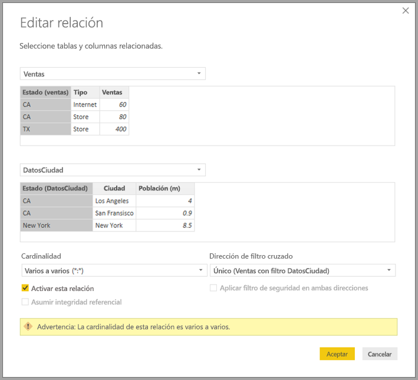

# Relaciones con una cardinalidad de varios a varios en Power BI Desktop

Con la característica *relaciones con una cardinalidad de varios a varios* en Power BI Desktop, puede combinar las tablas en las que se usa una cardinalidad de *varios a varios*. Puede crear modelos de datos que contengan dos o más orígenes de datos de forma más fácil e intuitiva. La característica de *relaciones con una cardinalidad de varios a varios* forma parte del conjunto de funcionalidades de los *modelos compuestos* de Power BI Desktop.

La funcionalidad *relaciones con una cardinalidad de varios a varios* de Power BI Desktop es una de tres características relacionadas:

* **Modelos compuestos**: esta característica permite que un informe tenga dos o varias conexiones de datos, incluidas conexiones DirectQuery o Importación, en cualquier combinación. Para obtener más información, vea [Modelos compuestos en Power BI Desktop](desktop-composite-models.md).

* **Relaciones con una cardinalidad de varios a varios**: con los *modelos compuestos*, puede establecer *relaciones con una cardinalidad de varios a varios* entre las tablas. Este enfoque elimina los requisitos de valores únicos en tablas. También permite descartar las soluciones alternativas anteriores, como el hecho de presentar nuevas tablas solo para establecer relaciones. La característica se describe más detalladamente en este artículo.

* **Modo de almacenamiento**: ahora puede especificar los objetos visuales que requieren una consulta a los orígenes de datos back-end. Los objetos visuales que no requieran una consulta se importarán incluso aunque estén basados en DirectQuery. Esta característica permite mejorar el rendimiento y reducir la carga de back-end. Anteriormente, incluso los objetos visuales simples, como las segmentaciones, iniciaban consultas que se enviaban a los orígenes de back-end. Para obtener más información, vea [Modo de almacenamiento en Power BI Desktop (versión preliminar)](desktop-storage-mode.md).

## Qué resuelven las *relaciones con una cardinalidad de varios a varios*

Antes de que la característica *relaciones con una cardinalidad de varios a varios* estuviese disponible, la relación entre dos tablas se definía en Power BI. Al menos una de las columnas de las tablas implicadas en la relación tenía que contener valores únicos. No obstante, a menudo ninguna columna contiene valores únicos. 

Por ejemplo, dos tablas podían tener una columna etiquetada como *País*, pero los valores de *País* no eran únicos en ninguna tabla. Para unir dichas tablas, era necesario crear una solución alternativa. Una solución de este tipo sería introducir en el modelo tablas adicionales con los valores únicos necesarios. Con la característica *relaciones con una cardinalidad de varios a varios*, puede combinar estas tablas directamente mediante una relación con una cardinalidad de **varios a varios**.  

## Uso de *relaciones con una cardinalidad de varios a varios*

Cuando define una relación entre dos tablas de Power BI, debe definir la cardinalidad de la relación. Por ejemplo, la relación entre *ProductSales* y *Product*, usando las columnas *ProductSales [ProductCode]* y *Product[ProductCode]*, se definiría como de *varios a uno*. La relación se define de esta manera porque hay muchas ventas para cada producto y la columna *(ProductCode)* en la tabla *Producto* es única. Al definir la cardinalidad de la relación como de *varios a uno*, *uno a varios* o *uno a uno*, Power BI la valida para ayudar a garantizar que la cardinalidad que seleccione coincida con los datos reales.

Por ejemplo, echemos un vistazo al modelo simple que aparece en la imagen siguiente:

Ahora, imagine que la tabla *Product* solo muestra dos filas, como se muestra a continuación:

Imagine también que la tabla *Ventas* solo tiene cuatro filas, incluida una fila para un producto C. Debido a un error de integridad referencial, la fila de producto C no existe en la tabla *Producto*.

El *ProductName* y *Precio* (de la tabla *Producto*), junto con la *Cantidad* total de cada producto (de la tabla *ProductSales*) se mostraría como la imagen que aparece a continuación: 

Como puede ver en la imagen anterior, hay una fila *ProductName* en blanco que está asociada a las ventas del producto C. Esta fila en blanco cuenta para lo siguiente:

* Cualquier fila de la tabla *ProductSales* para la que no existe ninguna fila correspondiente en la tabla *Producto*. Hay un problema de integridad referencial, como vemos para el producto *C* en este ejemplo.

* Cualquier fila de la tabla *ProductSales* para la que la columna de clave externa es NULL. 

Por estas razones, en ambos casos la fila en blanco se contabiliza para las ventas en las que no se conoce el valor de *ProductName* ni de *Precio*.

A veces se da el caso de que las tablas se combinan mediante dos columnas, si bien ninguna de estas es única. Por ejemplo, considere las dos tablas siguientes:

* La tabla *Ventas* contiene los datos de ventas por *Estado* y cada fila contiene el importe de ventas para el tipo de ventas de este estado. Los estados incluyen CA, WA y TX. 

    

* La tabla *CityData* contiene datos sobre las ciudades, incluida la población y el estado (incluidos CA, WA y Nueva York).

    

Si bien hay una columna para *Estado* en ambas tablas y es razonable querer informar las ventas totales por estado y de la población total de cada estado, existe un problema: la columna *Estado* no es exclusiva de ninguna de las tablas. 

## Solución anterior

En versiones anteriores a la de julio de 2018 de Power BI Desktop, los usuarios no podían crear una relación directa entre estas tablas. Una solución alternativa era hacer lo siguiente:

* Crear una tercera tabla que solo incluía los identificadores únicos de *Estado*. La tabla podría ser cualquiera de los elementos siguientes, o incluso todos:
  * Tabla calculada (definida mediante el uso de expresiones de análisis de datos [DAX]).
  * Tabla basada en una consulta que se define en el Editor de consultas, que puede mostrar los identificadores únicos procedentes de una de las tablas.
  * Conjunto combinado completo.

* Relacionar las dos tablas originales con esa tabla nueva, mediante el uso de relaciones comunes de *varios a uno*.

Podría dejar visible la tabla de la solución alternativa u ocultarla para que no aparezca en la lista **Campos**. Si oculta la tabla, las relaciones de *varios a uno* se establecerán normalmente para filtrarse en ambas direcciones y podrá usar el campo *Estado* de cualquiera de las tablas. El filtrado cruzado posterior se propagará a la otra tabla. Este enfoque se muestra en la siguiente imagen:

Un objeto visual que muestra *Estado* (desde la tabla *CityData*) junto con el valor de *Población* y *Ventas* totales sería como aparece a continuación:

> [!NOTE]
> Dado que se usa el estado desde la tabla *CityData* en esta solución alternativa, solo se muestran los estados de esa tabla y, por tanto, no se incluye TX. Además, a diferencia de las relaciones de *varios a uno*, si bien la fila total incluye todas las *Ventas* (incluidas las de TX), los detalles no incluyen una fila en blanco que abarca esas filas no coincidentes. Del mismo modo, no habría ninguna fila en blanco abarcando *Ventas* para la que hubiera un valor NULL para *Estado*.

Si también agrega *Ciudad* a ese objeto visual, aunque conocemos la población por *Ciudad*, las *Ventas* que se muestran para *Ciudad* simplemente repiten las *Ventas* del *Estado* correspondiente. Esto suele suceder cuando la agrupación en una columna está relacionada con alguna medida de agregado, como se muestra en la siguiente imagen:

Si se define la nueva tabla *Ventas* como la combinación de todos los *Estados* en esta solución alternativa y se hace que aparezca en la lista **Campos**, el mismo objeto visual mostrará el  *Estado* (en la nueva tabla) y el total de *Población* y *Ventas*, tal y como se muestra en la siguiente imagen:

Como puede ver, tanto *TX*, que tiene datos de *Ventas*, pero del que se desconoce la *Población*, como *Nueva York*, del que se conocen los datos de *Población*, pero no los de *Ventas*, estarían incluidos. Esta solución no es óptima y presenta muchos problemas. Con la creación de las relaciones con una cardinalidad de varios a varios, estos problemas se abordan como se describe en la sección siguiente.

## Uso de *relaciones con una cardinalidad de varios a varios*  en lugar de la solución alternativa

A partir de la versión de julio de 2018 de Power BI Desktop, puede relacionar directamente las tablas, como las que se han descrito anteriormente, sin tener que recurrir a soluciones alternativas similares. Ahora es posible establecer la cardinalidad de la relación como de *varios a varios*. Este valor indica que ninguna tabla contiene valores únicos. Para dichas relaciones, todavía tiene el control de qué tabla filtra la otra tabla o puede aplicar el filtrado bidireccional, donde ambas tablas se filtran entre sí.  

En Power BI Desktop, la cardinalidad se establece de manera predeterminada en *Varios a varios* cuando se determina que ninguna tabla contiene valores únicos para las columnas de la relación. En tales casos se muestra una advertencia para confirmar que esa configuración de relación es el comportamiento deseado, en lugar de ser el efecto no deseado de un problema de datos. 

Por ejemplo, al crear una relación directamente entre *CityData* y *Ventas*, donde los filtros deben fluir desde *CityData* hasta *Ventas*, Power BI Desktop muestra la ventana **Editar relación** tal como aparece en la siguiente imagen:

La vista de **relaciones** resultante mostrará la relación de varios a varios directa entre las dos tablas. La apariencia de las tablas en la lista **Campos**, así como su comportamiento posterior al crear los objetos visuales, es similar al de la aplicación de la solución. En la solución alternativa, la tabla adicional que muestra los distintos datos de *Estado* no se hace visible. Por ejemplo, como se describe en la sección anterior, un objeto visual que muestre datos de *Estado*, *Población* y *Ventas* se mostraría como sigue:

Las principales diferencias entre las *relaciones con una cardinalidad de varios a varios*  y las relaciones de *varios a uno* más típicas son las siguientes:

* Los valores mostrados no incluyen una fila en blanco dedicada a las filas que no coinciden en la otra tabla. Tampoco tienen en cuenta los valores de las filas donde la columna usada en la relación en la otra tabla es NULL.
* No es posible usar la función `RELATED()`, ya que se podría relacionar más de una fila.
* Usar la función `ALL()` en una tabla no quita los filtros aplicados a otras tablas relacionadas con una relación de varios a varios. En el ejemplo anterior, una medida definida como se muestra en el siguiente script no quitaría los filtros de las columnas en la tabla *CityData* relacionada:

    

    Un objeto visual que muestra datos de *Estado*, *Ventas* y *Total de ventas* resultaría en lo siguiente:

    

Teniendo en cuenta las diferencias anteriores, asegúrese de que los cálculos que usen `ALL(\<Table>)`, como *Porcentaje del total general*, devuelvan los resultados deseados. 

## Limitaciones y consideraciones

Existen algunas limitaciones para esta versión de las *relaciones con una cardinalidad de varios a varios* y los modelos compuestos.

Los orígenes de Live Connect (multidimensionales) siguientes no se pueden usar con los modelos compuestos:

* SAP HANA
* SAP Business Warehouse
* SQL Server Analysis Services
* Conjuntos de datos de Power BI
* Azure Analysis Services

Al conectarse a esos orígenes multidimensionales mediante DirectQuery, no se puede conectar a otro origen de DirectQuery ni combinar con los datos importados.

Las limitaciones existentes del uso de DirectQuery se siguen aplicando cuando se utilizan las *relaciones con una cardinalidad de varios a varios*. Muchas de esas limitaciones son ahora por tabla, en función del modo de almacenamiento de la tabla. Por ejemplo, una columna calculada en una tabla importada puede hacer referencia a otras tablas, pero una columna calculada en una tabla DirectQuery puede hacer referencia solo a columnas de la misma tabla. Otras limitaciones se aplican al modelo como un todo, si cualquiera de las tablas dentro del modelo son DirectQuery. Por ejemplo, las características Conclusiones rápidas y Preguntas y respuestas no están disponibles en un modelo si cualquiera de las tablas dentro del mismo tiene un modo de almacenamiento de DirectQuery. 

## Pasos siguientes

Para obtener más información sobre los modelos compuestos y DirectQuery, consulte los siguientes artículos:
* [Modelos compuestos en Power BI Desktop](desktop-composite-models.md)
* [Modo de almacenamiento en Power BI Desktop (versión preliminar)](desktop-storage-mode.md)
* [Usar DirectQuery en Power BI Desktop](desktop-directquery-about.md)
* [Orígenes de datos admitidos por DirectQuery en Power BI](desktop-directquery-data-sources.md)
