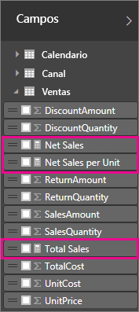
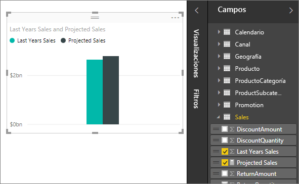
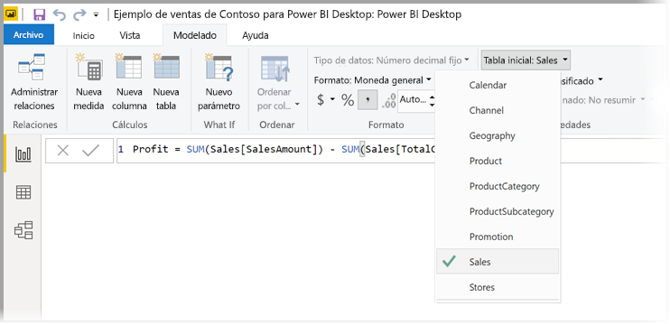
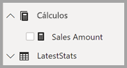

# Medidas en Power BI Desktop

**Power BI Desktop** le ayuda a crear información sobre sus datos en unos cuantos clics. Pero a veces los datos simplemente no incluyen todo lo que necesita para responder algunas de las preguntas más importantes. En esos casos, las medidas pueden ser de ayuda.

Las medidas se usan en algunos de los análisis de datos más comunes. Los resúmenes simples, como sumas, promedios, mínimo, máximo y recuentos, se pueden establecer a través de la lista de campos. Los resultados calculados de las medidas cambian constantemente en respuesta a la interacción con los informes, lo que permite la exploración rápida y dinámica de datos ad hoc. Analicemos la cuestión más detenidamente. Para más información, vea [Creación de medidas calculadas](/learn/modules/model-data-power-bi/4b-create-calculated-measures).

## Descripción de las medidas

En **Power BI Desktop**, las medidas se crean y muestran en **Vista de informes** o **Vista de datos**. Las medidas que cree aparecerán en la lista de campos con un icono de calculadora. Puede asignar el nombre que desee a las medidas y agregarlas a una visualización nueva o existente como cualquier otro campo.

> [!NOTE]
> Quizá también esté interesado en las **medidas rápidas**, medidas listas para usar que puede seleccionar en los cuadros de diálogo. Son una buena manera de crear medidas rápidamente y de aprender a usar la sintaxis DAX, ya que sus fórmulas DAX creadas automáticamente están disponibles para revisar. Vea el artículo sobre [medidas rápidas](desktop-quick-measures.md).
> 
> 

## Expresiones de análisis de datos

Las medidas calculan un resultado a partir de una fórmula de expresiones. Al crear sus propias medidas, debe usar el lenguaje de fórmulas de [expresiones de análisis de datos](https://msdn.microsoft.com/library/gg413422.aspx) (DAX). DAX incluye una biblioteca de más de 200 funciones, operadores y construcciones. Su biblioteca ofrece una gran flexibilidad al momento de crear medidas para calcular los resultados de casi cualquier necesidad de análisis de datos.

Las fórmulas DAX son muy similares a las fórmulas de Excel. DAX incluso tiene muchas de las mismas funciones que Excel, como FECHA, SUMA e IZQUIERDA. Sin embargo, las funciones de DAX están diseñadas para trabajar con datos relacionales como los que tenemos en Power BI Desktop.

## Veamos un ejemplo
Jan es jefa de ventas de Contoso. Le han pedido que presente los pronósticos de ventas de los revendedores para el próximo año fiscal. Jan decide que basará las estimaciones en las cifras de ventas del año pasado, agregando un seis por ciento anual, resultante de las distintas promociones programadas para los próximos seis meses.

Para informar de las estimaciones, Jan importa datos de las ventas del año pasado en Power BI Desktop. Busca el campo SalesAmount de la tabla Ventas de revendedor. Debido a que los datos importados únicamente contienen los importes de las ventas del año pasado, Jan cambia el nombre del campo SalesAmount a Last Years Sales (Ventas del año pasado). Después, Jan arrastra el campo Ventas de los últimos años al lienzo del informe. Aparece en una visualización de gráfico como un valor único, que es la suma de las ventas de todos los distribuidores durante el año pasado.

Jan se da cuenta de que, aunque no ha especificado un cálculo, se ha proporcionado uno automáticamente. Power BI Desktop creó su propia medida con la suma de todos los valores de las ventas de los últimos años.

Sin embargo, Jan necesita una medida para calcular las previsiones de ventas para el año siguiente, que se basarán en las ventas del año anterior multiplicadas por 1,06 para tener en cuenta el aumento del 6 % previsto en los negocios. Para este cálculo, Jan creará su propia medida. Con la característica “Nueva medida”, crea una medida y, después, agrega la siguiente fórmula DAX:

    Projected Sales = SUM('Sales'[Last Years Sales])*1.06

Después Jan arrastra hacia el gráfico la nueva medida Ventas previstas.

Rápidamente y con el mínimo esfuerzo, ahora Jan tiene una medida para calcular las ventas previstas. Jan puede analizar con más detalle los pronósticos al filtrar por revendedores específicos o agregar otros campos al informe.

## Categorías de datos de medidas

También puede elegir categorías de datos de medidas. 

Entre otras cosas, esto le permite usar medidas para crear direcciones URL de forma dinámica y marcar la categoría de datos como una URL web. 

Puede crear tablas que muestren las medidas como URL web y en las que pueda hacer clic en la dirección URL que se crea según su selección. Esto es especialmente útil si quiere vincular a otros informes de Power BI con [parámetros de filtro de URL](service-url-filters.md).

## Organización de las medidas

Las medidas tienen una tabla *Inicio* que define dónde se encuentran en la lista de campos. Puede cambiar su ubicación eligiendo una ubicación de las tablas en el modelo.

También puede organizar los campos de una tabla en *carpetas para mostrar*. Seleccione **Vista de modelo** en el lado izquierdo de la ventana de Power BI Desktop y luego seleccione el campo que desea mover de la lista de campos disponibles que se muestra en el lienzo. En el panel de propiedades aparece un cuadro de texto para **Carpeta para mostrar**. Al escribir un nombre en el campo **Carpeta para mostrar**, se crea la carpeta y se mueve el campo seleccionado a esa carpeta.

Puede crear subcarpetas mediante un carácter de barra diagonal inversa. Por ejemplo *Finance\Currencies* crea una carpeta *Finance* y, dentro de ella, una carpeta *Currencies*.

Puede hacer que un campo aparezca en varias carpetas mediante un punto y coma para separar los nombres de carpeta. Por ejemplo, *Products\Names;Departments* hace que el campo aparezca en una carpeta *Departments*, así como en una carpeta *Names* dentro de una carpeta *Products*.

Por último, puede crear una tabla especial que contenga solo las medidas que siempre aparecen en la parte superior de **Lista de campos**. Para ello, cree una tabla con una sola columna. Puede usar **Especificar datos** para crear esa tabla. Luego, mueva las medidas a esa tabla. Por último, oculte la columna (no la tabla) que creó. Deberá cerrar y volver a abrir **Lista de campos** para que Power BI Desktop la muestre correctamente; para ello haga clic en el botón de contenido adicional de la parte superior de **Lista de campos**.

## Más información
Por ahora, solamente le dimos una rápida introducción a las medidas, pero hay mucho más información que puede ayudarle a aprender a crear sus propios. Asegúrese de consultar el [Tutorial: Crear medidas propias en Power BI Desktop](desktop-tutorial-create-measures.md), donde puede descargar un archivo de ejemplo y obtener lecciones paso a paso sobre cómo crear más medidas.  

Para profundizar un poco más en DAX, asegúrese de revisar [Aspectos básicos de DAX en Power BI Desktop](desktop-quickstart-learn-dax-basics.md). La [referencia de expresiones de análisis de datos](https://msdn.microsoft.com/library/gg413422.aspx) proporciona artículos detallados sobre cada una de las funciones, la sintaxis, los operadores y las convenciones de nomenclatura. DAX lleva varios años en Power Pivot en Excel y SQL Server Analysis Services, por lo que hay muchos otros recursos estupendos que también están disponibles. Asegúrese de revisar el [wiki del centro de recursos de DAX](http://social.technet.microsoft.com/wiki/contents/articles/1088.dax-resource-center.aspx), donde miembros destacados de la comunidad de BI comparten sus conocimientos sobre DAX.

