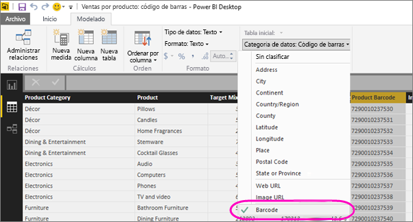

# Etiquetado de códigos de barras en Power BI Desktop para su uso en las aplicaciones móviles

En Power BI Desktop, puede [clasificar datos](desktop-data-categorization.md) en una columna, de modo que Power BI Desktop sepa cómo tratar los valores en objetos visuales en un informe. También puede clasificar una columna como **Código de barras**. Cuando usted o sus compañeros [escaneen un código de barras en un producto con la aplicación Power BI](consumer/mobile/mobile-apps-scan-barcode-iphone.md) en su iPhone, verán cualquier informe que incluya ese código de barras. Cuando abra el informe en la aplicación móvil, Power BI filtra automáticamente el informe con los datos relacionados con ese código de barras.

1. En Power BI Desktop, cambie a Vista de datos.
2. Seleccione una columna con datos de código de barras. Vea la lista de [formatos de código de barras admitidos](#supported-barcode-formats) a continuación.
3. En la pestaña **Modelado**, seleccione **Categoría de datos** > **Código de barras**.
   
    
4. En la vista Informes, agregue este campo a los objetos visuales que quiera filtrar por el código de barras.
5. Guarde el informe y publíquelo en el servicio Power BI.

Ahora, cuando abra el escáner en la [aplicación Power BI para iPhone](consumer/mobile/mobile-iphone-app-get-started.md) y escanee un código de barras, verá este informe en la lista de informes. Al abrir el informe, los objetos visuales se filtran por el código de barras del producto que ha escaneado.

## Formatos de código de barras admitidos
Estos son los códigos de barras que Power BI reconoce si los puede etiquetar en un informe de Power BI: 

* UPCECode 
* Code39Code  
* A39Mod43Code 
* EAN13Code 
* EAN8Code  
* 93Code  
* 128Code 
* PDF417Code 
* Interleaved2of5Code 
* ITF14Code 

## Pasos siguientes
* [Scan a barcode from the Power BI app on your iPhone (Digitalización de un código de barras desde Power BI en su iPhone)](consumer/mobile/mobile-apps-scan-barcode-iphone.md)
* [Problemas al digitalizar códigos de barras en un iPhone](consumer/mobile/mobile-apps-scan-barcode-iphone.md#issues-with-scanning-a-barcode)
* [Categorización de datos en Power BI Desktop](desktop-data-categorization.md)  
* ¿Tiene alguna pregunta? [Pruebe a preguntar a la comunidad de Power BI](https://community.powerbi.com/)

