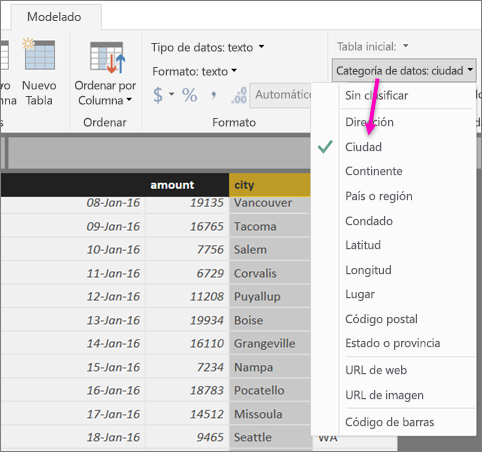
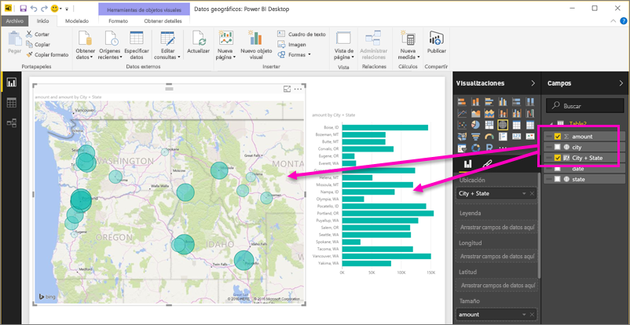
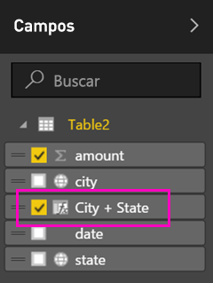
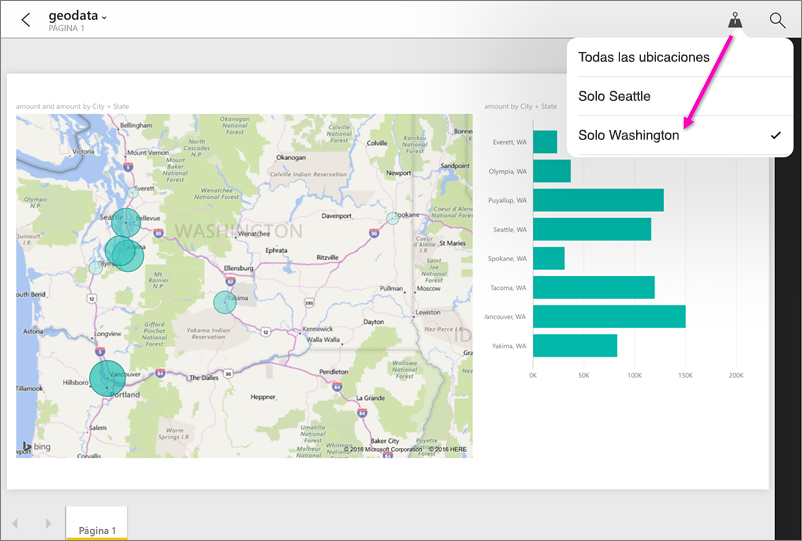

# Establecimiento del filtrado geográfico en Power BI Desktop para su uso en las aplicaciones móviles
En Power BI Desktop, puede [clasificar datos geográficos](desktop-data-categorization.md) para una columna, de modo que Power BI Desktop sepa cómo tratar los valores en objetos visuales en un informe. Como ventaja adicional, si usted o sus compañeros ven el informe en la aplicación móvil de Power BI, este proporciona automáticamente filtros geográficos que coinciden con su ubicación. 

Por ejemplo, usted es un director de ventas que viaja para reunirse con clientes y quiere filtrar rápidamente el total de ventas e ingresos del cliente específico que va a visitar. Quiere dividir los datos para la ubicación actual, ya sea por estado, ciudad o una dirección real. Más adelante, si le queda tiempo, le gustaría visitar a otros clientes que se encuentren cerca. Puede [filtrar el informe por su ubicación para encontrar esos clientes](consumer/mobile/mobile-apps-geographic-filtering.md).

> [!NOTE]
> Solo puede filtrar por ubicación en la aplicación móvil si los nombres geográficos en el informe están en inglés; por ejemplo, "New York City" o "Germany".
> 
> 

## Identificar datos geográficos en el informe
1. En Power BI Desktop, pase a Vista de datos .
2. Seleccione una columna con datos geográficos; por ejemplo, una columna Ciudad.
   
    
3. En la pestaña **Modelado**, seleccione **Categoría de datos** y después la categoría correcta, en este ejemplo, **Ciudad**.
   
    
4. Siga estableciendo categorías de datos geográficos de los demás campos en el modelo. 
   
   > [!NOTE]
   > Puede establecer varias columnas para cada categoría de datos en un modelo, pero, si lo hace, el modelo no se puede filtrar geográficamente en la aplicación móvil de Power BI. Para usar el filtrado geográfico en las aplicaciones móviles, establezca solo una columna para cada categoría de datos; por ejemplo, solo una columna **Ciudad**, una columna **Estado o provincia** y una columna **País**. 
   > 
   > 

## Crear objetos visuales con datos geográficos
1. Cambie a la vista Informe y cree objetos visuales que utilicen los campos geográficos de los datos. 
   
    
   
    En este ejemplo, el modelo también contiene una columna calculada que aúna la ciudad y el estado en una única columna. Obtenga información acerca de cómo [crear columnas calculadas en Power BI Desktop](desktop-calculated-columns.md).
   
    
2. Publique el informe en el servicio Power BI.

## Ver el informe en la aplicación móvil de Power BI
1. Abra el informe en cualquiera de las [aplicaciones móviles de Power BI](consumer/mobile/mobile-apps-for-mobile-devices.md).
2. Si está en una ubicación geográfica con datos en el informe, puede filtrarlo automáticamente por su ubicación.
   
    

Obtenga más información sobre cómo [filtrar un informe por ubicación en las aplicaciones móviles de Power BI](consumer/mobile/mobile-apps-geographic-filtering.md).

## Pasos siguientes
* [Categorización de datos en Power BI Desktop](desktop-data-categorization.md)  
* ¿Tiene alguna pregunta? [Pruebe a preguntar a la comunidad de Power BI](https://community.powerbi.com/)

