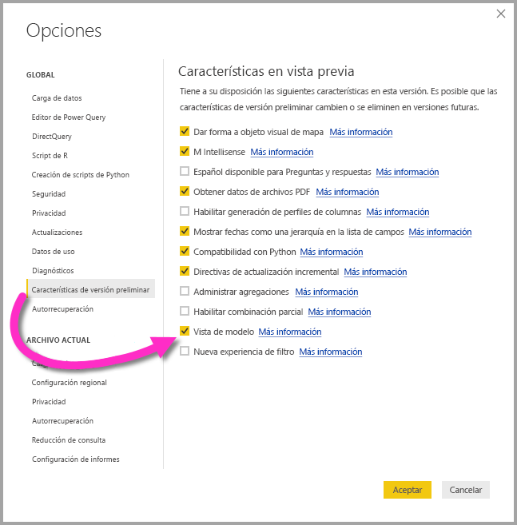
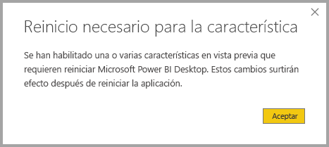

# Vista de modelo en Power BI Desktop (versión preliminar)

Con la característica **Vista de modelo** de **Power BI Desktop**, puede ver y trabajar con conjuntos de datos complejos que contienen muchas tablas. Con Vista de modelo, puede hacer lo siguiente:

## Habilitación de la característica Vista de modelo en versión preliminar

La característica Vista de modelo se encuentra en versión preliminar y debe estar habilitada en **Power BI Desktop**. Para habilitar Vista de modelo, seleccione **Archivo > Opciones y configuración > Opciones > Características de versión preliminar** y, luego, active la casilla **Vista de modelo**, como se muestra en la imagen siguiente.

Se le indicará que es necesario reiniciar **Power BI Desktop** para habilitar la característica en versión preliminar. 

## Uso de Vista de modelo

Para acceder a Vista de modelo, seleccione el icono correspondiente que se encuentra a la izquierda de **Power BI Desktop**, como se muestra en la imagen siguiente.

## Creación de diagramas independientes

Con Vista de modelo, puede crear diagramas de su modelo que contengan solo un subconjunto de las tablas del modelo. Esto puede ayudar a proporcionar una visión más clara de las tablas con las que desea trabajar y a facilitar el trabajo con conjuntos de datos complejos. Para crear un diagrama con solo un subconjunto de las tablas, haga clic en el signo **+** junto a la pestaña **Todas las tablas** en la parte inferior de la ventana de Power BI Desktop.

A continuación, puede arrastrar una tabla desde la lista **Campos** hasta la superficie del diagrama. Haga clic con el botón derecho en la tabla y, luego, seleccione **Agregar tablas relacionadas** en el menú que aparece.

Al hacerlo, las tablas que están relacionadas con la tabla original se muestran en el nuevo diagrama. En la imagen siguiente se ilustra cómo se muestran las tablas relacionadas tras seleccionar la opción de menú **Agregar tablas relacionadas**.

## Definición de las propiedades comunes

Puede seleccionar varios objetos a la vez en Vista de modelo; para ello, mantenga presionada la tecla **CTRL** y haga clic en varias tablas. Al seleccionar varias tablas, se resaltan en esta vista. Cuando varias tablas están resaltadas, los cambios aplicados en el panel **Propiedades** se aplican a todas las tablas seleccionadas.

Por ejemplo, podría cambiar el [modo de almacenamiento](desktop-storage-mode.md) para varias tablas en la vista de diagrama; para ello, mantendría presionada la tecla **CTRL**, seleccionaría las tablas y, luego, cambiaría la opción de modo de almacenamiento en el panel  **Propiedades**.

## Pasos siguientes

En los artículos siguientes se proporciona más información sobre los modelos de datos y también se describe DirectQuery de forma detallada.

* [Agregaciones en Power BI Desktop (versión preliminar)](desktop-aggregations.md)
* [Modelos compuestos en Power BI Desktop (versión preliminar)](desktop-composite-models.md)
* [Modo de almacenamiento en Power BI Desktop (versión preliminar)](desktop-storage-mode.md)
* [Relaciones de varios a varios en Power BI Desktop (versión preliminar)](desktop-many-to-many-relationships.md)

Artículos sobre DirectQuery:

* [Uso de DirectQuery en Power BI](desktop-directquery-about.md)
* [Orígenes de datos admitidos por DirectQuery en Power BI](desktop-directquery-data-sources.md)
