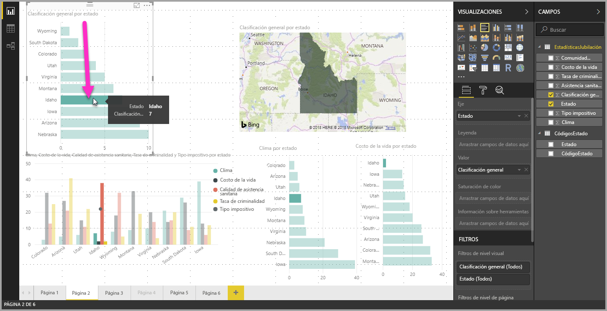
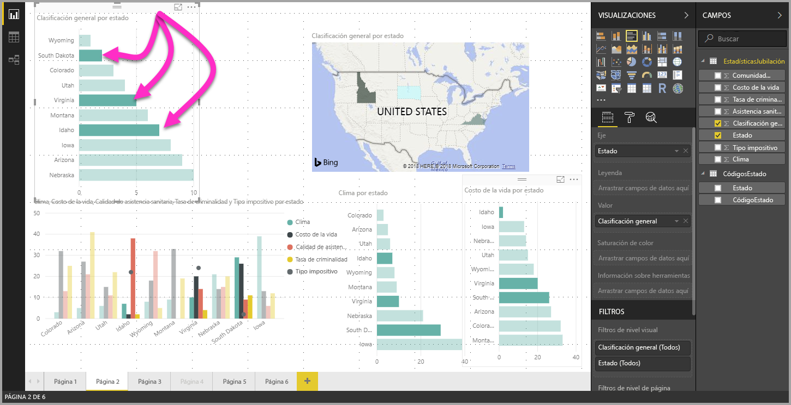

# Selección múltiple de elementos de datos en objetos visuales con Power BI Desktop

En **Power BI Desktop** puede resaltar un punto de datos en un objeto visual determinado simplemente haciendo clic en el punto de datos del objeto visual. Por ejemplo, si tiene una barra o un elemento de gráfico importante y desea que otros objetos visuales de la página del informe resalten los datos en función de su selección, puede hacer clic en el elemento de datos de un objeto visual y ver los resultados reflejados en otros objetos visuales de la página. Esto se conoce como el resaltado básico o de selección única. En la siguiente imagen se muestra el resaltado básico. 

Con la selección múltiple, ahora puede seleccionar más de un punto de datos en su página de informe de **Power BI Desktop** y resaltar los resultados en todos los objetos visuales de la página. Esto equivale a la instrucción o funcionalidad **and**, como en "resaltar datos para Idaho **and** Virginia". Para seleccionar múltiples puntos de datos en objetos visuales, basta con usar **CTRL + clic**. En la imagen siguiente se muestran **múltiples puntos de datos** seleccionados (selección múltiple).

Esto parece una funcionalidad sencilla, pero genera todo tipo de oportunidades al crear, compartir e interactuar con informes. 

## Pasos siguientes

Puede que también esté interesado en los siguientes artículos:

* [Usar líneas de cuadrícula y ajustar a la cuadrícula en los informes de Power BI Desktop](desktop-gridlines-snap-to-grid.md)
* [Filtros y resaltado en informes de Power BI](power-bi-reports-filters-and-highlighting.md)

