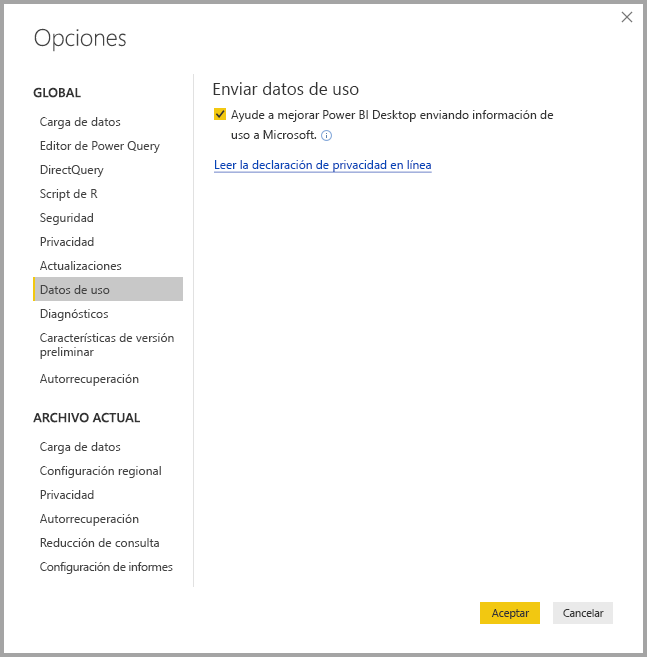

# Privacidad de Power BI Desktop

En Microsoft, nos esforzamos por proteger su privacidad, a la vez que desarrollamos productos que proporcionan el rendimiento, la potencia y la comodidad que necesita. Microsoft recopila determinada información sobre el uso de Power BI Desktop para diagnosticar mejor los problemas y mejorar el producto. Para más información sobre las prácticas de privacidad de Microsoft, vea la declaración de privacidad de Microsoft. Se aplica a los datos que recopilamos de su uso de **Power BI Desktop**.
 
La información que recopilamos de los usuarios de **Power BI Desktop** puede incluir datos sobre el sistema operativo, información de Power BI Desktop y versiones de Internet Explorer. 
 
Si no quiere permitir que se realice esta recopilación de datos, puede hacerlo desde **Archivo > Opciones y configuración > Opciones** y, en la pestaña **Datos de uso**, desactive la casilla **Enviar datos de uso**, como se muestra en esta imagen.

## Enviar información adicional

Si la aplicación se bloquea o tiene otro tipo de problemas, puede optar por enviar informes de errores e información adicional que será útil para solucionar el problema en una versión futura. También recopilamos información sobre el estado del archivo de **Power BI Desktop** con el que estaba trabajando, como la configuración regional, las características de vista previa que están habilitadas y el modo de almacenamiento de archivo. Esto puede incluir capturas de pantalla, mensajes de error y fórmulas del modelo. Estos elementos podrían incluir el contenido de los archivos que estaba usando cuando se produjo un error, por lo que debe revisarlos antes de enviarlos. Le recordamos que, antes de enviarlos, puede elegir qué información se envía a Microsoft.  
 
Si no quiere enviar esta información, puede hacer clic en **Cerrar** cuando se produce un error o dejar de enviar datos de uso, como ya hemos explicado. 

