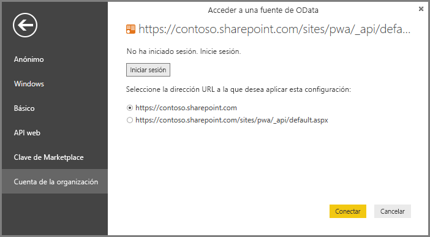

# Project Online: conexión a los datos a través de Power BI Desktop
Puede conectarse a los datos en Project Online a través de Power BI Desktop.

## Paso 1: Descargar Power BI Desktop
1. [Descargue Power BI Desktop](http://go.microsoft.com/fwlink/?LinkID=521662) y, después, ejecute el instalador para obtener **Power BI Desktop** en el equipo.

## Paso 2: Conexión a Project Online con OData
1. Abra **Power BI Desktop**.
2. En la pantalla de *bienvenida*, seleccione **Obtener datos**.
3. Elija **Fuente de OData** y seleccione **Conectar**.
4. Escriba la dirección de su fuente de OData en el cuadro de la dirección URL y, a continuación, haga clic en Aceptar.
   
   Si la dirección del sitio de Project Web App se parece a https://\<nombreinquilino\>.sharepoint.com/sites/pwa, la dirección que especifique para la fuente de OData será https://\<nombreinquilino\>.sharepoint.com/sites/pwa/\_api/Projectdata.
   
   En nuestro ejemplo, estamos usando https://contoso.sharepoint.com/sites/pwa/default.aspx
5. Power BI Desktop le solicitará que realice la autenticación con su cuenta de Office 365. Seleccione la cuenta de la organización y, a continuación, escriba sus credenciales.
   
   

Tenga en cuenta que la cuenta usada para conectarse a la fuente de OData debe tener como mínimo acceso de Visor de carteras al sitio de Project Web App. 

Desde aquí, puede elegir a qué tablas le gustaría conectarse y crear una consulta.  ¿Desea una idea de cómo comenzar?  La siguiente entrada de blog muestra cómo crear un gráfico de evolución a partir de los datos de Project Online.  La entrada de blog se refiere al uso de Power Query para conectarse a Project Online, pero esto se aplica también a Power BI Desktop.

[Creación de gráficos de evolución para Project con PowerPivot y Power Query](http://blogs.office.com/2014/03/24/creating-burndown-charts-for-project-using-power-pivot-and-power-query/)

