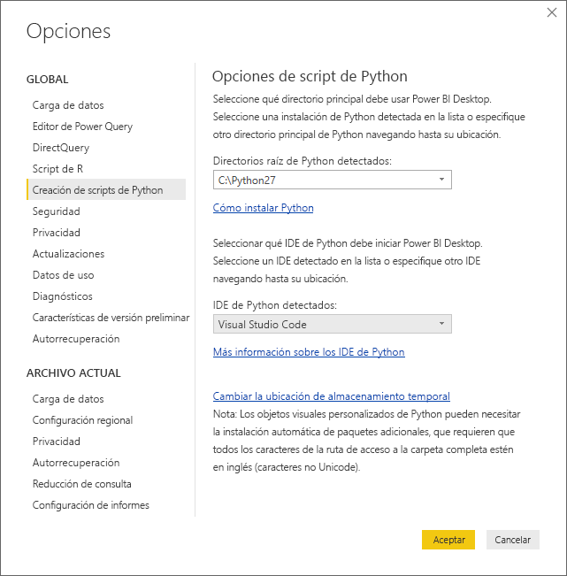
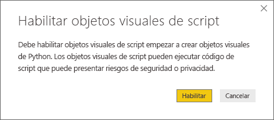
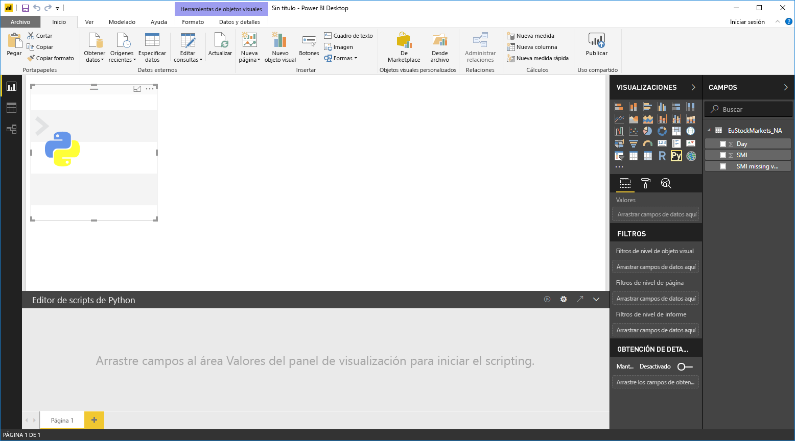
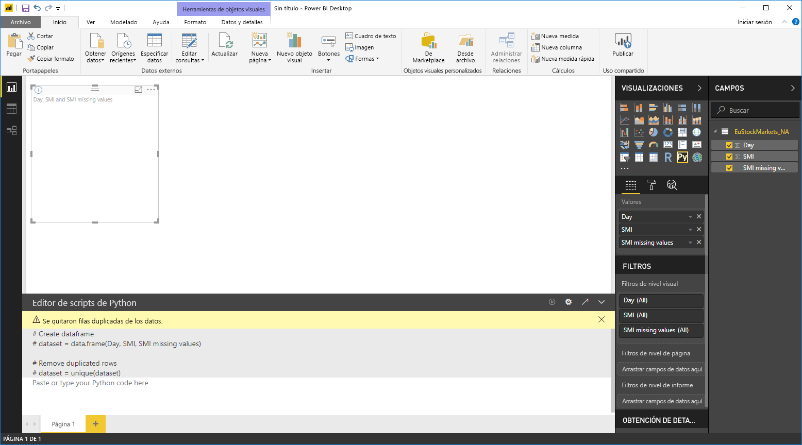
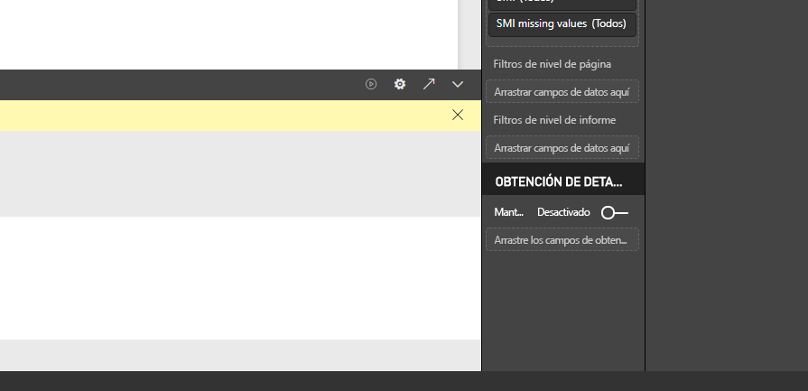
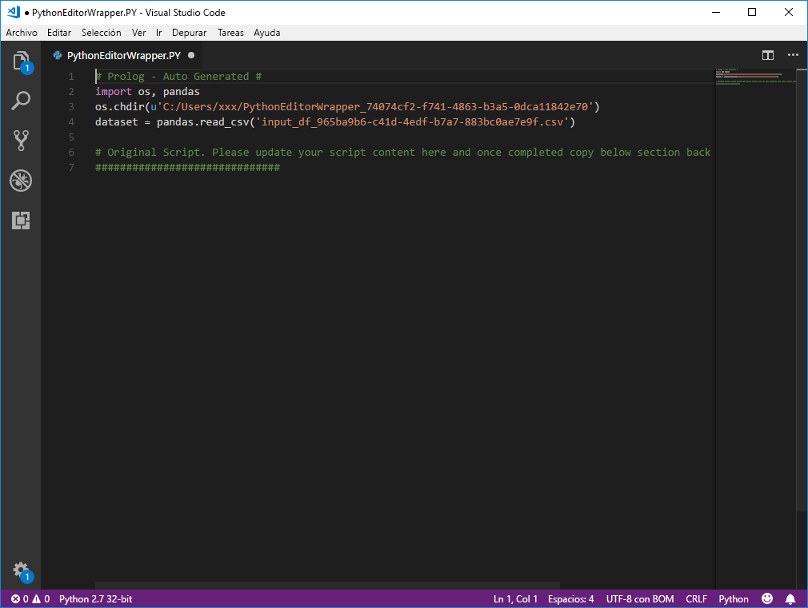

# Uso de un IDE externo de Python con Power BI
Con **Power BI Desktop**, puede usar un IDE (entorno de desarrollo integrado) de Python externo para crear y perfeccionar los scripts de Python, y después usarlos en Power BI.

## Habilitación de un IDE de Python externo
Puede iniciar el IDE de Python externo desde **Power BI Desktop** y hacer que los datos se importen y aparezcan de forma automática en el IDE de Python. Desde allí, puede modificar el script en ese IDE de Python externo y después volver a pegarlo en **Power BI Desktop** para crear objetos visuales e informes de Power BI.

Puede especificar qué IDE de Python le gustaría usar e iniciarlo de forma automática desde **Power BI Desktop**.

### Requisitos
Para usar esta función, debe instalar un **IDE de Python** en el equipo local. **Power BI Desktop** no incluye, implementa ni instala el motor de Python, por lo que debe instalar **Python** por separado en el equipo local. Puede elegir qué IDE de Python se va a usar, con las opciones siguientes:

* Puede instalar su IDE de Python favorito, muchos de los cuales están disponibles de forma gratuita, como la [página de descarga de Visual Studio Code](https://code.visualstudio.com/download/).
* **Power BI Desktop** también admite **Visual Studio**.
* También puede instalar otro IDE de Python y que **Power BI Desktop** inicie ese **IDE de Python** siguiendo estos pasos:
  
  * Puede asociar los archivos **.PY** con el IDE externo que quiere que inicie **Power BI Desktop**.
  * Puede especificar el archivo .exe que **Power BI Desktop** debe iniciar si hace clic en *Otros* en la sección **Opciones de Script de Python** del cuadro de diálogo **Opciones**. Puede poner en funcionamiento el cuadro de diálogo **Opciones** yendo a **Archivo > Opciones y configuración > Opciones**.
    
    

Si tiene varios IDE de Python instalados, puede especificar cuál se iniciará si lo selecciona en el cuadro desplegable *IDE de Python detectados* del cuadro de diálogo **Opciones**.

De forma predeterminada, **Power BI Desktop** iniciará **Visual Studio Code** como el IDE de Python externo si está instalado en el equipo local; si **Visual Studio Code** no está instalado y tiene **Visual Studio** en su lugar, es el que se iniciará. Si ninguno de estos IDE de Python está instalado, se iniciará la aplicación asociada a los archivos **.PY**.

Y si no hay ninguna asociación de archivos **.PY**, es posible especificar una ruta de acceso a un IDE personalizado en la sección *Navegue hasta el IDE de Python que prefiera* del cuadro de diálogo **Opciones**. También puede iniciar otro IDE de Python si hace clic en el icono de engranaje **Configuración** situado junto al icono de flecha **Iniciar IDE de Python** en **Power BI Desktop**.

## Inicio de un IDE de Python desde Power BI Desktop
Para iniciar un IDE de Python desde **Power BI Desktop**, siga estos pasos:

1. Cargue los datos en **Power BI Desktop**.
2. Seleccione algunos campos del panel **Campos** con los que quiera trabajar. Si no ha habilitado los objetos visuales de scripts, se le pedirá que lo haga.
   
   
3. Al habilitar los objetos visuales de scripts, puede seleccionar un objeto visual de Python en el panel **Visualizaciones**, que crea un objeto visual de Python en blanco que está listo para mostrar los resultados del script. También aparece el panel **Editor de script de Python**.
   
   
4. Ahora puede seleccionar los campos que quiera usar en el script de Python. Al seleccionar un campo, el campo **Editor de script de Python** crea de forma automática el código de script según el campo o campos seleccionados. Puede crear (o pegar) el script de Python directamente en el panel **Editor de script de Python** o puede dejarlo vacío.
   
   
   
   > [!NOTE]
   > El tipo de agregación predeterminado para los objetos visuales de Python es *No resumir*.
   > 
   > 
5. Ahora puede iniciar el IDE de Python directamente desde **Power BI Desktop**. Haga clic en el botón **Launch Python IDE** (Iniciar IDE de Python) que se encuentra en la parte derecha de la barra de título **Editor de script de Python**, como se muestra a continuación.
   
   
6. Power BI Desktop inicia el IDE de Python especificado, como se muestra en la imagen siguiente (en esta imagen, **Visual Studio Code** es el IDE de Python predeterminado).
   
   
   
   > [!NOTE]
   > **Power BI Desktop** agrega las tres primeras líneas del script para poder importar los datos desde **Power BI Desktop** una vez que ejecute el script.
   > 
   > 
7. Cualquier script creado en el **panel Editor de script de Python** de **Power BI Desktop** aparece a partir de la línea 4 en el IDE de Python. En este momento puede crear el script de Python en el IDE de Python. Una vez que esté completo el script de Python en el IDE de Python, deberá copiarlo y pegarlo en el panel **Editor de script de Python** de **Power BI Desktop**, *excepto* las tres primeras líneas del script que **Power BI Desktop** ha generado de forma automática. No vuelva a copiar las tres primeras líneas del script en **Power BI Desktop**, esas líneas solo se han usado para importar los datos en el IDE de Python desde **Power BI Desktop**.

### Limitaciones conocidas
Iniciar un IDE de Python directamente desde Power BI Desktop tiene algunas limitaciones:

* No se admite la exportación automática del script desde el IDE de Python en **Power BI Desktop**.

## Pasos siguientes
Eche un vistazo a la siguiente información adicional sobre Python en Power BI.

* [Ejecución de scripts de Python en Power BI Desktop](desktop-python-scripts.md)
* [Creación de objetos visuales de Power BI con Python](desktop-python-visuals.md)

