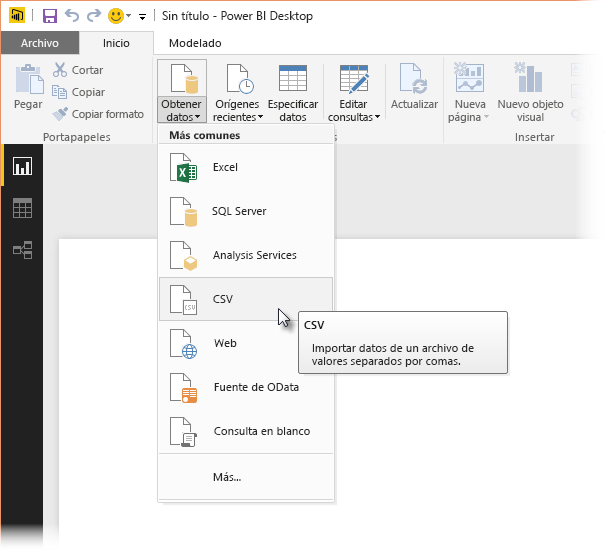
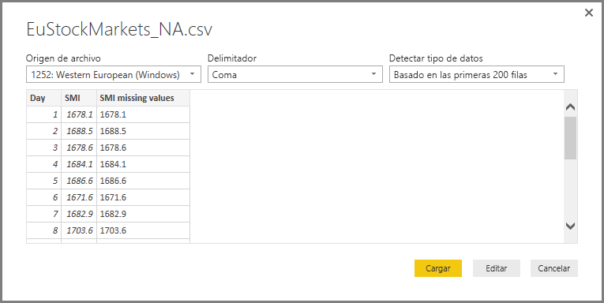
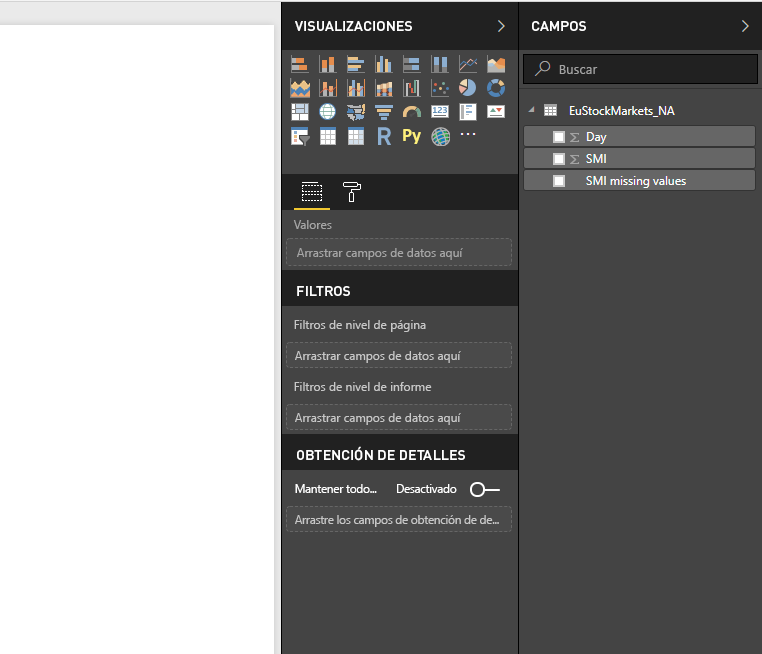
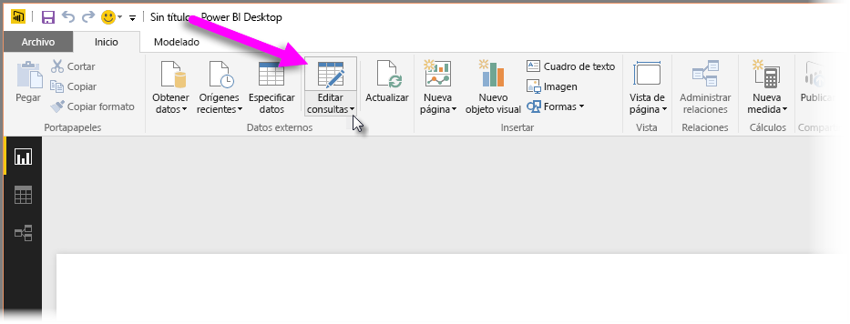
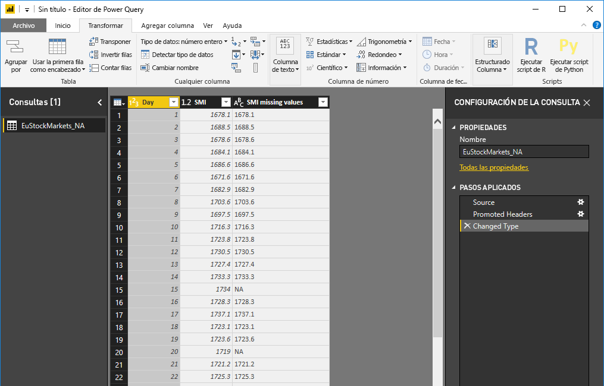
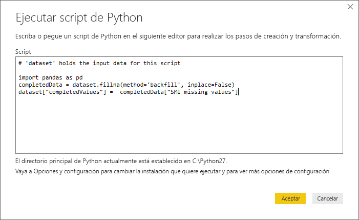
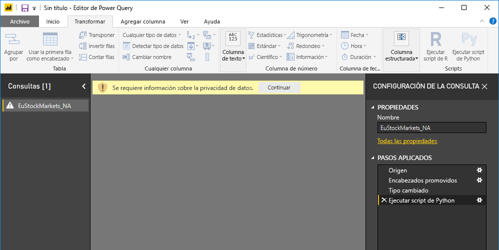
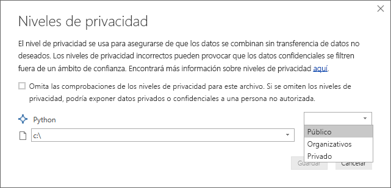
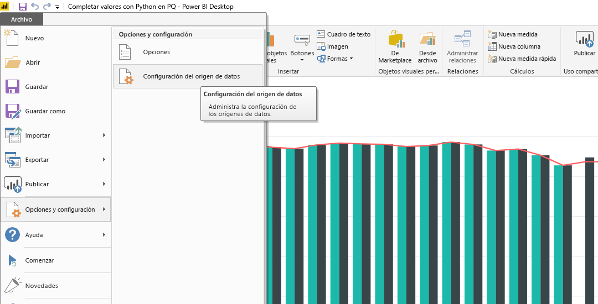
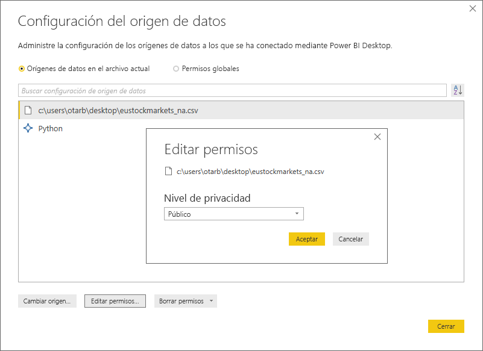

# Uso de Python en el Editor de consultas
En el **Editor de consultas** de Power BI Desktop, puede usar **Python**, un lenguaje de programación usado ampliamente por estadistas, científicos de datos y analistas de datos. Esta integración de Python en el **Editor de consultas** permite limpiar datos con Python y realizar acciones avanzadas, como analizar y dar forma a los datos en conjuntos de datos, incluida la operación de completar datos que faltan, las predicciones y la agrupación en clústeres, por nombrar algunas. **Python** es un lenguaje eficaz y se puede usar en el **Editor de consultas** para preparar el modelo de datos y crear informes.

## Instalación de Python
Para usar **Python** en el **Editor de consultas** de Power BI Desktop, debe instalar **Python** en el equipo local. Puede descargar e instalar **Python** gratuitamente desde varias ubicaciones, incluida la [página de descargas oficial de Python](https://www.python.org/) y [Anaconda](https://anaconda.org/anaconda/python/).

## Uso de Python en el Editor de consultas
Para mostrar cómo se usa **Python** en el **Editor de consultas**, vea este ejemplo de un conjunto de datos de la bolsa, basado en un archivo .CSV que puede [descargar aquí](http://download.microsoft.com/download/F/8/A/F8AA9DC9-8545-4AAE-9305-27AD1D01DC03/EuStockMarkets_NA.csv), y siga a partir de ahí. Los pasos de este ejemplo son los siguientes:

1. En primer lugar, cargue los datos en **Power BI Desktop**. En este ejemplo, cargue el archivo *EuStockMarkets_NA.csv* y seleccione **Obtener datos > CSV** en la cinta de opciones **Inicio** de **Power BI Desktop**.
   
   
2. Seleccione primero el archivo y, después, **Abrir** para que el archivo .csv se muestre en el cuadro de diálogo **Archivo CSV**.
   
   
3. Una vez cargados los datos, los verá en el panel **Campos** de Power BI Desktop.
   
   
4. En **Power BI Desktop**, seleccione **Editar consultas** en la pestaña **Inicio** para abrir el **Editor de consultas**.
   
   
5. En la pestaña **Transformar**, haga clic en **Ejecutar script de Python** para que aparezca el editor de **Ejecutar script de Python** (se muestra en el paso siguiente). Tenga en cuenta que en las filas 15 y 20 faltan datos, al igual que en otras filas que no se ven en la siguiente imagen. En los pasos siguientes se muestra cómo Python completa los datos que faltan en esas filas.
   
   
6. En este ejemplo, escriba el siguiente código de script:
   
       import pandas as pd
       completedData = dataset.fillna(method='backfill', inplace=False)
       dataset["completedValues"] =  completedData["SMI missing values"]
   
   > [!NOTE]
   > Para que el código de script anterior funcione correctamente, debe tener instalada la biblioteca *pandas* en el entorno de Python. Para instalar pandas, ejecute el comando siguiente en la instalación de Python: |      > pip install pandas
   > 
   > 
   
   Cuando se incluye en el cuadro de diálogo **Ejecutar script de Python**, el código es similar al siguiente:
   
   
7. Después de seleccionar **Aceptar**, el **Editor de consultas** muestra una advertencia sobre la privacidad de datos.
   
   
8. Para que los scripts de Python funcionen correctamente en el servicio Power BI, todos los orígenes de datos se deben establecer como *públicos*. Para obtener más información sobre la configuración de privacidad y sus implicaciones, consulte [Niveles de privacidad](desktop-privacy-levels.md).
   
   
   
   Observe que en el panel **Campos** hay una columna nueva denominada *completedValues*. Observe que algunos elementos de datos faltan, como en las filas 15 y 18. Vea cómo Python lo aborda en la sección siguiente.
   

Con solo cinco líneas de script de Python, el **Editor de consultas** ha rellenado los valores que faltaban con un modelo predictivo.

## Creación de objetos visuales a partir de los datos del script de Python
Ahora se puede crear un objeto visual para ver cómo el código de script de Python, mediante la biblioteca *pandas*, ha completado los valores que faltaban, como se muestra en la imagen siguiente:

Una vez completado ese objeto visual, y cualquier otro que quiera crear con **Power BI Desktop**, puede guardar el archivo de **Power BI Desktop** (que se guarda con el formato .pbix) y, después, usar el modelo de datos, incluidos los scripts de Python que forman parte del mismo, en el servicio Power BI.

> [!NOTE]
> ¿Quiere ver un archivo .pbix finalizado con estos pasos completados? Está de suerte: puede descargar [desde aquí](http://download.microsoft.com/download/A/B/C/ABCF5589-B88F-49D4-ADEB-4A623589FC09/Complete%20Values%20with%20Python%20in%20PQ.pbix) el archivo de **Power BI Desktop** finalizado que se ha usado en estos ejemplos.

Una vez que haya cargado el archivo .pbix en el servicio Power BI, son necesarios dos pasos más para habilitar la actualización de datos (en el servicio) y de objetos visuales en el servicio (para que los objetos visuales se actualicen, los datos deben acceder a Python). Los pasos adicionales son los siguientes:

* **Habilitar la actualización programada del conjunto de datos**: para habilitar la actualización programada del libro que contiene el conjunto de datos con scripts de Python, vea [Configuración de la actualización programada](refresh-scheduled-refresh.md), que también incluye información sobre **la puerta de enlace personal**.
* **Instalar la puerta de enlace personal**: debe tener una **puerta de enlace personal** instalada en el equipo en el que se encuentra el archivo y donde está instalado Python; el servicio Power BI debe acceder a ese libro y volver a representar los objetos visuales actualizados. Puede obtener más información sobre cómo [instalar y configurar Personal Gateway](personal-gateway.md).

## Limitaciones
Existen algunas limitaciones para las consultas que incluyen scripts de Python creadas en el **Editor de consultas**:

* La configuración de origen de datos de Python se debe establecer en *Pública*, y todos los demás pasos de una consulta creada en el **Editor de consultas** también deben ser públicos. Para obtener la configuración de origen de datos en **Power BI Desktop**, seleccione **Archivo > Opciones y configuración > Configuración de origen de datos**.
  
  
  
  Asegúrese de que el **Nivel de privacidad** esté establecido en *Público* y, desde el cuadro de diálogo **Configuración de origen de datos**, seleccione primero los orígenes de datos, o solo uno, y, después, **Editar permisos...**.
  
      
* Para habilitar la actualización programada de los objetos visuales o del conjunto de datos de Python, debe habilitar **Actualización programada** y tener **puerta de enlace personal** instalada en el equipo que hospeda el libro y la instalación de Python. Para obtener más información sobre ambos, consulte la sección anterior de este artículo y siga los vínculos que se proporcionan.
* En la actualidad, no se admiten las tablas anidadas (tabla de tablas) 

Con Python y las consultas personalizadas puede hacer todo tipo de cosas; por tanto, explore y dé forma a los datos de la manera que quiera que aparezcan.

