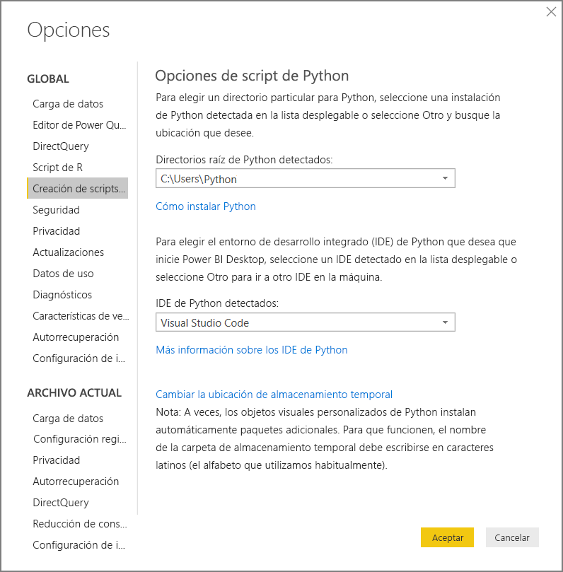
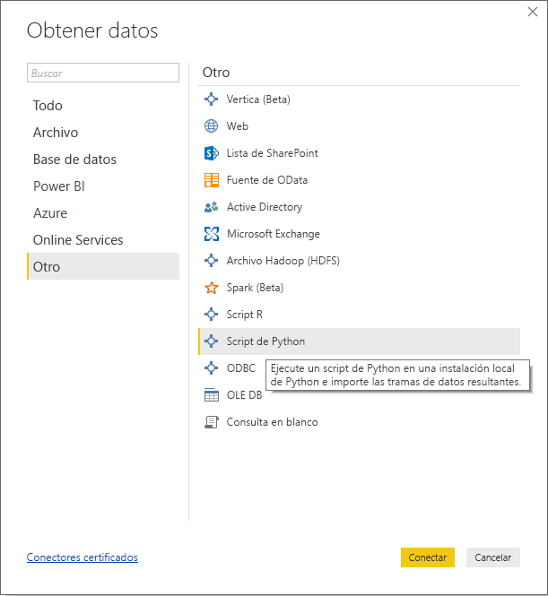
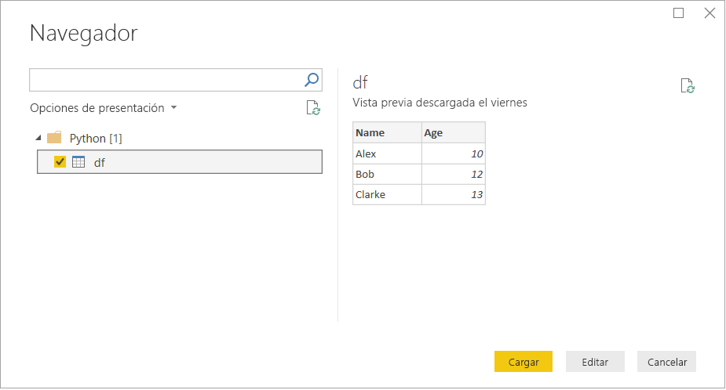
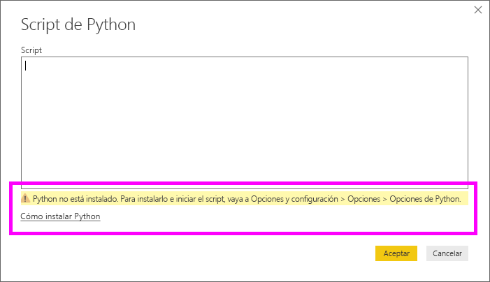

# <a name="run-python-scripts-in-power-bi-desktop"></a>Ejecución de scripts de Python en Power BI Desktop

Puede ejecutar scripts de Python directamente en **Power BI Desktop** e importar los conjuntos de datos resultantes en un modelo de datos de Power BI Desktop.

## <a name="install-python"></a>Instalación de Python

Para ejecutar scripts de Python en Power BI Desktop, deberá instalar **Python** en el equipo local. Puede descargar **Python** desde la [página de descarga oficial de Python](https://www.python.org/). La versión actual de scripting de Python admite caracteres Unicode y espacios en la ruta de instalación.

### <a name="install-required-python-packages"></a>Instalación de los paquetes de Python necesarios

Para integrar Python con Power BI, es necesario instalar dos paquetes de Python:

- [Pandas](https://pandas.pydata.org/): biblioteca de software para manipular y analizar datos. Ofrece operaciones y estructuras de datos para manipular series temporales y tablas numéricas. Los datos importados deben estar en una [trama de datos de Pandas](https://www.tutorialspoint.com/python_pandas/python_pandas_dataframe.htm). Una trama de datos es una estructura de datos bidimensional. Por ejemplo, los datos se alinean de manera tabular en filas y columnas.
- [Matplotlib](https://matplotlib.org/): biblioteca de trazado para Python y su extensión matemática numérica [NumPy](https://www.numpy.org/). Proporciona una API orientada a objetos para insertar trazados en aplicaciones mediante kits de herramientas de GUI de uso general (por ejemplo, Tkinter, wxPython, Qt o GTK+).

1. En una consola o un shell, use la herramienta de línea de comandos [pip](https://pip.pypa.io/en/stable/) para instalar los dos paquetes. La herramienta pip está empaquetada con las versiones más recientes de Python.

```CMD
pip install pandas
pip install matplotlib
```

## <a name="enable-python-scripting"></a>Habilitación de la creación de scripts de Python

Para habilitar la creación de scripts de Python:

1. En Power BI Desktop, seleccione **Archivo** > **Opciones y configuración** > **Opciones** > **Creación de scripts de Python**. Aparece la página Opciones de script de Python.

   

1. Si es necesario, especifique la ruta de instalación de Python local en el cuadro de texto **Directorios raíz de Python detectados:** . 

   En la imagen anterior, la ruta de instalación local de Python es **C:\Python**. Asegúrese de que la ruta sea de la instalación local de Python que quiere que use Power BI Desktop.

1. Seleccione **Aceptar**.

Después de especificar la instalación de Python, ya puede empezar a ejecutar scripts de Python en Power BI Desktop.

## <a name="run-python-scripts"></a>Ejecución de scripts de Python

En unos pocos pasos, puede ejecutar scripts de Python y crear un modelo de datos. A partir de este modelo, puede crear informes y compartirlos en el servicio Power BI.

### <a name="prepare-a-python-script"></a>Preparación de un script de Python
En primer lugar, cree un script en el entorno de desarrollo local de Python y asegúrese de que se ejecuta correctamente. Por ejemplo, este es un script de Python sencillo que importa pandas y usa una trama de datos:

```python
import pandas as pd
data = [['Alex',10],['Bob',12],['Clarke',13]]
df = pd.DataFrame(data,columns=['Name','Age'],dtype=float)
print (df)
```
Cuando se ejecuta, aparece:

```python
     Name   Age
0    Alex  10.0
1     Bob  12.0
2  Clarke  13.0
```

A la hora de preparar y ejecutar un script de Python en Power BI Desktop, hay algunas limitaciones:

* Solo se importan tramas de datos de Pandas, por lo que asegúrese de que los datos que quiere importar a Power BI se representan en una trama de datos.
* Los scripts de Python que se ejecutan durante más de 30 minutos agotan el tiempo de espera
* Las llamadas interactivas en el script de Python, por ejemplo, esperar la entrada del usuario, detienen la ejecución del script
* Al establecer el directorio de trabajo en el script de Python, *debe* definir una ruta de acceso completa al directorio de trabajo, en lugar de una ruta de acceso relativa
* Actualmente, no se admiten las tablas anidadas 

### <a name="run-your-python-script-and-import-data"></a>Ejecución del script de Python e importación de los datos

Para ejecutar el script de Python en Power BI Desktop:

1. En la cinta Inicio, seleccione **Obtener datos** > **Más...**
   
1. Seleccione **Otro** > **Script de Python** como se muestra en la siguiente imagen:

   
   
1. Seleccione **Conectar**. Se selecciona la versión más reciente de Python instalada en el equipo local como motor de Python. Copie el script en el cuadro de diálogo del script de Python que aparece. Aquí, especificamos el script de Python sencillo que se ha mostrado anteriormente.

   

1. Seleccione **Aceptar**. Si el script se ejecuta correctamente, aparecerá el cuadro de diálogo del navegador y podrá cargar los datos y usarlos. En el ejemplo, active la casilla **df**, tal como se muestra en la imagen y, después, seleccione **Cargar**.

    

### <a name="troubleshooting"></a>Solución de problemas

Si Python no está instalado o identificado, se muestra una advertencia. También puede ver una advertencia si tiene varias instalaciones en el equipo local. Vuelva a consultar y revise las secciones anteriores Instalación de Python y Habilitación de la creación de scripts de Python.



### <a name="refresh"></a>Actualizar

Puede actualizar un script de Python en Power BI Desktop. Para actualizarlo, vaya a la cinta **Inicio** y seleccione **Actualizar**. Al actualizar un script de Python, Power BI Desktop vuelve a ejecutarlo.

## <a name="next-steps"></a>Pasos siguientes

Eche un vistazo a la siguiente información adicional sobre Python en Power BI.

* [Creación de objetos visuales de Python en Power BI Desktop](desktop-python-visuals.md)
* [Uso de un IDE externo de Python con Power BI](desktop-python-ide.md)
