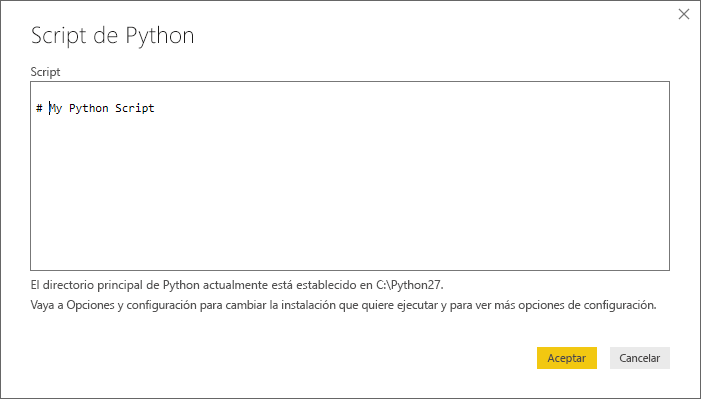
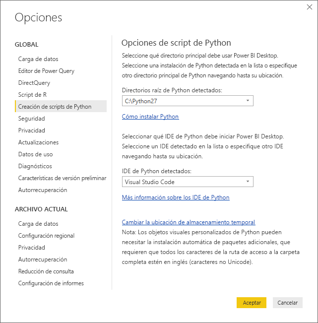

# Ejecución de scripts de Python en Power BI Desktop
Puede ejecutar scripts de Python directamente en **Power BI Desktop** e importar los conjuntos de datos resultantes en un modelo de datos de Power BI Desktop.

## Instalación de Python
Para ejecutar scripts de Python en Power BI Desktop, deberá instalar **Python** en el equipo local. Puede descargar e instalar **Python** gratuitamente desde varias ubicaciones, incluida la [página de descargas oficial de Python](https://www.python.org/) y [Anaconda](https://anaconda.org/anaconda/python/). La versión actual de Scripting de Python en Power BI Desktop admite caracteres Unicode, así como espacios (caracteres vacíos) en la ruta de instalación.

## Ejecución de scripts de Python
Con unos pocos pasos en Power BI Desktop, puede ejecutar scripts de Python y crear un modelo de datos, desde el que podrá crear informes y compartirlos en el servicio Power BI.

### Preparación de un script de Python
Para ejecutar un script de Python en Power BI Desktop, créelo en el entorno de desarrollo de Python local y asegúrese de que se ejecuta correctamente.

Para ejecutar el script en Power BI Desktop, asegúrese de que este se ejecuta correctamente en un área de trabajo nueva y sin modificar. Esto significa que todos los paquetes y dependencias deben cargarse y ejecutarse explícitamente.

A la hora de preparar y ejecutar un script de Python en Power BI Desktop, hay algunas limitaciones:

* Solo se importan tramas de datos de Pandas, por lo que asegúrese de que los datos que quiere importar a Power BI se representan en una trama de datos.
* Los scripts de Python que se ejecutan durante más de 30 minutos agotan el tiempo de espera
* Las llamadas interactivas en el script de Python, por ejemplo, esperar la entrada del usuario, detienen la ejecución del script
* Al establecer el directorio de trabajo en el script de Python, *debe* definir una ruta de acceso completa al directorio de trabajo, en lugar de una ruta de acceso relativa
* En la actualidad, no se admiten las tablas anidadas (tabla de tablas) 

### Ejecución del script de Python e importación de los datos
1. En Power BI Desktop, el conector de datos de script de Python se encuentra en **Obtener datos**. Para ejecutar el script de Python, seleccione **Obtener datos &gt; Más...** y, luego, seleccione **Otros &gt; Script de Python** como se muestra en la siguiente imagen:
   
   
2. Si Python está instalado en el equipo local, se selecciona la versión instalada más reciente como motor de Python. Solo tiene que copiar el script en la ventana de script y seleccionar **Aceptar**.
   
   
3. Si Python no está instalado, no se identifica o si existen varias instalaciones en el equipo local, se mostrará una advertencia.
   
   
   
   La configuración de la instalación de Python está centralizada en la sección Scripting de Python del cuadro de diálogo Opciones. Para especificar la configuración de instalación de Python, seleccione **Archivo > Opciones y configuración** y, luego, **Opciones > Scripting de Python**. Si hay varias instalaciones de Python disponibles, aparece un menú desplegable que permite seleccionar la instalación que se va a usar. También puede hacer clic en **Otros** y proporcionar una ruta de acceso personalizada.
   
   
4. Haga clic en **Aceptar** para ejecutar el script de Python. Cuando el script se ejecuta correctamente, puede elegir las tramas de datos resultantes para agregar al modelo de Power BI.

### Actualizar
Puede actualizar un script de Python en Power BI Desktop. Al actualizar un script de Python, Power BI Desktop lo vuelve a ejecutar en el entorno de Power BI Desktop.

## Pasos siguientes
Eche un vistazo a la siguiente información adicional sobre Python en Power BI.

* [Creación de objetos visuales de Python en Power BI Desktop](desktop-python-visuals.md)
* [Uso de un IDE externo de Python con Power BI](desktop-python-ide.md)