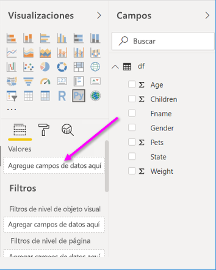
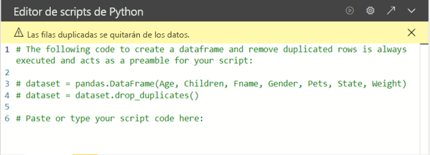
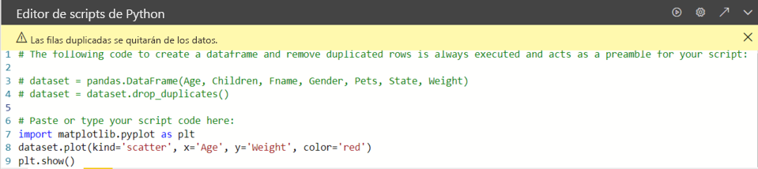

# <a name="create-power-bi-visuals-by-using-python"></a>Creación de objetos visuales de Power BI con Python

Con *Power BI Desktop*, puede usar Python para visualizar los datos.

## <a name="prerequisites"></a>Requisitos previos

Siga los pasos del tutorial [Ejecución de scripts de Python en Power BI Desktop](desktop-python-scripts.md) con el siguiente script de Python:

```python
import pandas as pd 
df = pd.DataFrame({ 
    'Fname':['Harry','Sally','Paul','Abe','June','Mike','Tom'], 
    'Age':[21,34,42,18,24,80,22], 
    'Weight': [180, 130, 200, 140, 176, 142, 210], 
    'Gender':['M','F','M','M','F','M','M'], 
    'State':['Washington','Oregon','California','Washington','Nevada','Texas','Nevada'],
    'Children':[4,1,2,3,0,2,0],
    'Pets':[3,2,2,5,0,1,5] 
}) 
print (df) 
```

En el artículo [Ejecución de scripts de Python en Power BI Desktop](desktop-python-scripts.md) se muestra cómo instalar Python en la máquina local y habilitarla para el scripting de Python en Power BI Desktop. En este tutorial se usan datos del script anterior para ilustrar la creación de objetos visuales de Python.

## <a name="create-python-visuals-in-power-bi-desktop"></a>Creación de objetos visuales de Python en Power BI Desktop

1. Seleccione el icono **Objeto visual de Python** en el panel **Visualizaciones**.

   

1. En el cuadro de diálogo **Habilitar objetos visuales de script** que aparece, seleccione **Habilitar**.

    Al agregar un objeto visual de Python a un informe, Power BI Desktop lleva a cabo las siguientes acciones:

    - Aparece una imagen de marcador de posición de objeto visual de Python en el lienzo del informe.

    - Aparece el **editor de scripts de Python** en la parte inferior del panel central.

    

1. Después, arrastre los campos **Age**, **Children**, **Fname**, **Gender**, **Pets**, **State** y **Weight** a la sección **Valores**, donde aparece "**Agregar campos de datos aquí**.

    

   El script de Python solo puede usar los campos agregados a la sección **Valores**. Puede agregar o quitar campos de la sección **Valores** mientras trabaja en el script de Python. Power BI Desktop detecta automáticamente los cambios en los campos.

   > [!NOTE]
   > El tipo de agregación predeterminado para los objetos visuales de Python es *No resumir*.
   > 
   > 

1. Ahora puede usar los datos seleccionados para crear un trazado.

    Al seleccionar o quitar campos, el código auxiliar del editor de scripts de Python se genera o elimina de forma automática. 

    En función de lo que seleccione, el editor de scripts de Python genera el siguiente código de enlace.

    - El editor ha creado una trama de datos del *conjunto de datos* con los campos que ha agregado.
    - La agregación predeterminada es: *No resumir*.
    - De forma similar a los objetos visuales de tabla, los campos se agrupan y las filas duplicadas aparecen solo una vez.

    

     > [!TIP]
     > En ciertos casos, puede que no quiera que se produzca una agrupación automática o que quiera que aparezcan todas las filas, incluso las duplicadas. De ser así, puede agregar un campo de índice al conjunto de datos que haga que todas las filas se consideren únicas y que evite la agrupación.

   Puede acceder a las columnas del conjunto de datos con sus respectivos nombres. Por ejemplo, puede codificar `dataset["Age"]` en el script de Python para acceder al campo de edad.

1. Con la trama de datos generada automáticamente por los campos seleccionados, ya puede escribir un script de Python que genere un trazado en el dispositivo predeterminado de Python. Cuando el script esté completo, seleccione **Ejecutar** en la barra de título del **editor de scripts de Python**.

   Power BI Desktop vuelve a trazar el objeto visual si se produce alguno de los siguientes eventos:

   - Al hacer clic en **Ejecutar** en la barra de título del **editor de scripts de Python**
   - Siempre que se produce un cambio de datos, debido a la actualización, filtrado o resaltado de datos

   Al ejecutar un script de Python que genera un error, el objeto visual de Python no se traza y se muestra un mensaje de error en el lienzo. Para consultar los detalles del error, seleccione **Ver detalles** en el mensaje.

   Para obtener una vista mayor de las visualizaciones, puede minimizar el **editor de scripts de Python**.

Vamos a crear algunos objetos visuales.

## <a name="create-a-scatter-plot"></a>Creación de un gráfico de dispersión

Vamos a crear un gráfico de dispersión para ver si hay una correlación entre la edad y el peso.

1. En **Pegue o escriba aquí el código de script**, escriba este código:

   ```python
   import matplotlib.pyplot as plt 
   dataset.plot(kind='scatter', x='Age', y='Weight', color='red')
   plt.show() 
   ```  

   El panel del editor de scripts de Python debería tener el siguiente aspecto:

   

   Se importa la biblioteca **matplotlib** para trazar y crear los objetos visuales.

1. Al seleccionar el botón **Ejecutar script**, se genera el siguiente gráfico de dispersión en la imagen del objeto visual de Python de marcador de posición.

   

## <a name="create-a-line-plot-with-multiple-columns"></a>Creación de un gráfico de líneas con varias columnas

 Vamos a crear un gráfico de líneas para cada persona que muestre el número de hijos y mascotas. Quite o comente el código que aparece debajo de **Pegue o escriba aquí el código de script** y escriba este código de Python:

 ```python
 import matplotlib.pyplot as plt 
ax = plt.gca() 
dataset.plot(kind='line',x='Fname',y='Children',ax=ax) 
dataset.plot(kind='line',x='Fname',y='Pets', color='red', ax=ax) 
plt.show() 
```

Al seleccionar el botón **Ejecutar script**, se genera el siguiente gráfico de líneas con varias columnas.


## <a name="create-a-bar-plot"></a>Creación de un gráfico de barras

Vamos a crear un gráfico de barras para la edad de cada persona. Quite o comente el código que aparece debajo de **Pegue o escriba aquí el código de script** y escriba este código de Python:

```python
import matplotlib.pyplot as plt 
dataset.plot(kind='bar',x='Fname',y='Age') 
plt.show() 
```

Al seleccionar el botón **Ejecutar script**, se genera el siguiente gráfico de barras:

 

## <a name="security"></a>Seguridad

> [!IMPORTANT] 
> **Seguridad de scripts de Python:** los objetos visuales de Python se crean a partir de scripts de Python, que podrían contener código que presente riesgos para la seguridad o la privacidad. Al intentar ver o interactuar con un objeto visual de Python por primera vez, un usuario recibe un mensaje de advertencia de seguridad. Habilite los objetos visuales de Python únicamente si confía en el autor y en el origen, o bien tras revisar el script de Python y asegurarse de que lo comprende.
>  

## <a name="more-information-about-plotting-with-matprolib-pandas-and-python"></a>Más información sobre el trazado con Matprolib, Pandas y Python

Este tutorial está diseñado para ayudarle a empezar a crear objetos visuales con Python en Power BI Desktop. Es apenas una muestra de las muchas opciones y funcionalidades para crear informes visuales mediante Python, Pandas y la biblioteca de Matprolib. Hay mucha más información disponible; aquí tiene algunos vínculos que le ayudarán a empezar.

- Documentación en el sitio web de [Matplotlib](https://matplotlib.org/). 
- [Matplotlib Tutorial: A Basic Guide to Use Matplotlib with Python](https://www.datasciencelearner.com/matplotlib-tutorial-complete-guide-to-use-matplotlib-with-python/) (Tutorial de Matplotlib: una guía básica para usar Matplotlib con Python) 
- [Matplotlib Tutorial – Python Matplotlib Library with Examples](https://www.edureka.co/blog/python-matplotlib-tutorial/) (Tutorial de Matplotlib: biblioteca de Matplotlib de Python con ejemplos) 
- [Pandas API Reference](https://pandas.pydata.org/pandas-docs/stable/reference/index.html) (Referencia de la API de Pandas) 
- [Visualizaciones de Python en el servicio Power BI](https://powerbi.microsoft.com/blog/python-visualizations-in-power-bi-service/) 
- [Using Python Visuals in Power BI ](https://www.absentdata.com/how-to-user-python-and-power-bi/) (Uso de objetos visuales de Python en Power BI)

## <a name="known-limitations"></a>Limitaciones conocidas

Los objetos visuales de Python en Power BI Desktop tienen algunas limitaciones:

- Limitaciones del tamaño de datos. Los datos que usa el objeto visual de Python para el trazado están limitados a 150 000 filas. Si se seleccionan más de 150.000 filas, solo se usan las primeras 150.000 y se muestra un mensaje en la imagen.
- Resolución. Todos los objetos visuales de Python se muestran a 72 ppp.
- Límite de tiempo de cálculo. Si el cálculo de un objeto visual de Python supera los cinco minutos, se agota el tiempo de espera de ejecución y se genera un error.
- Relaciones. Al igual que con otros objetos visuales de Power BI Desktop, si se seleccionan campos de datos de tablas diferentes sin ninguna relación definida entre ellos, se produce un error.
- Los objetos visuales de Python se actualizan al actualizar, filtrar y resaltar datos. En cambio, la imagen en sí no es interactiva y no puede ser el origen del filtro cruzado.
- Los objetos visuales de Python responden al resaltado de otros objetos visuales, pero no puede hacer clic en elementos del objeto visual de Python para aplicar un filtro cruzado a otros elementos.
- Solo los trazados que se trazan con el dispositivo de pantalla predeterminado de Python se muestran correctamente en el lienzo. Evite usar explícitamente otro dispositivo de pantalla de Python.

## <a name="next-steps"></a>Pasos siguientes

Eche un vistazo a la siguiente información adicional sobre Python en Power BI.

- [Ejecución de scripts de Python en Power BI Desktop](desktop-python-scripts.md)
- [Uso de un IDE externo de Python con Power BI](desktop-python-ide.md)

