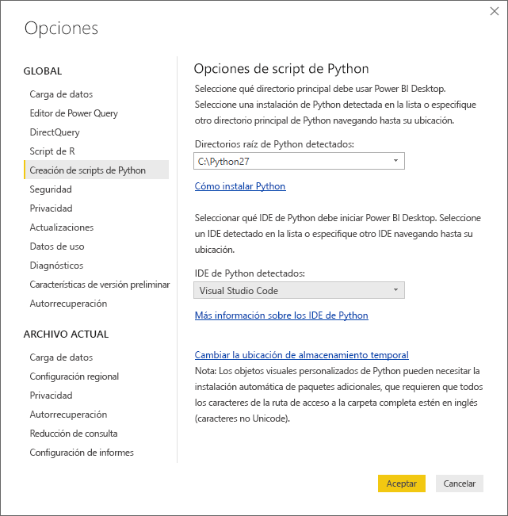
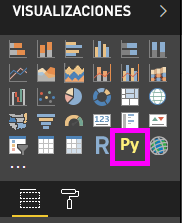
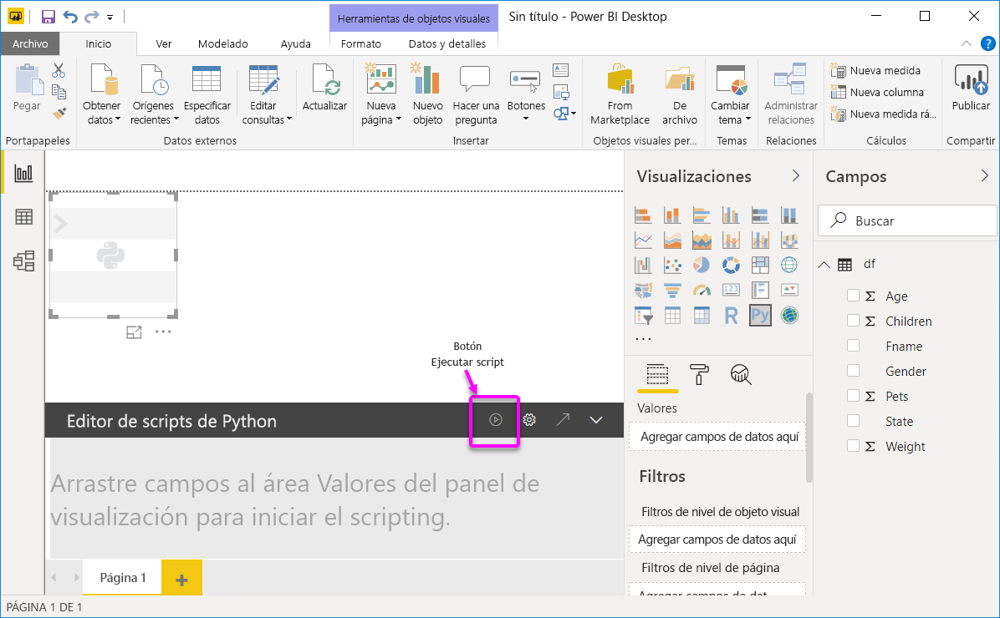
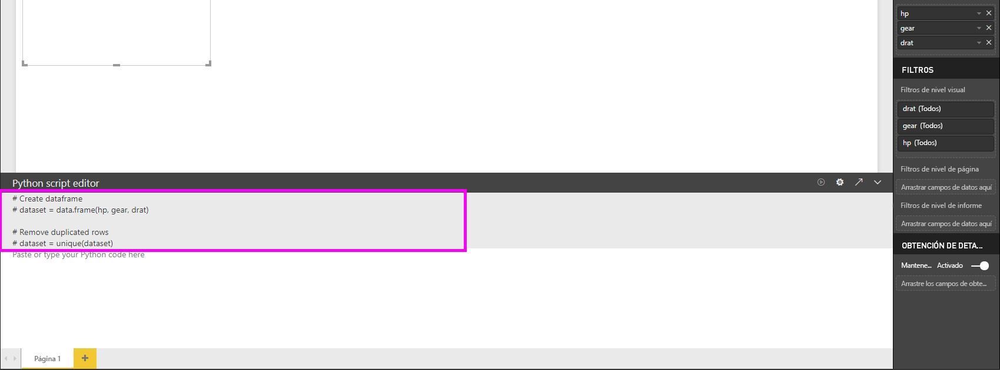
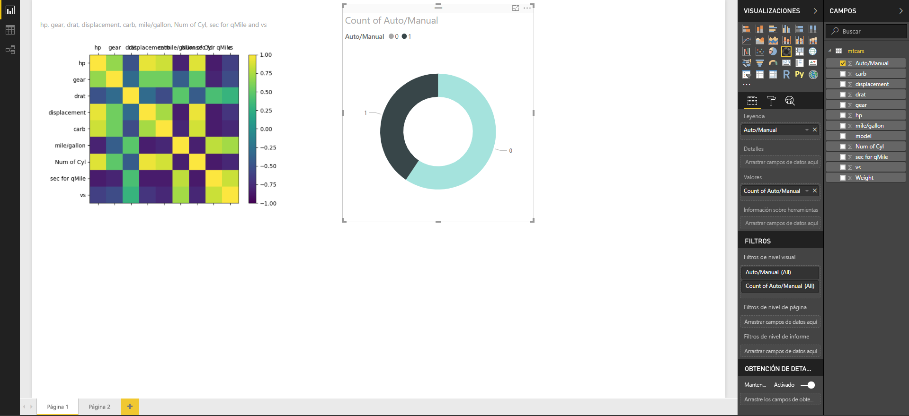
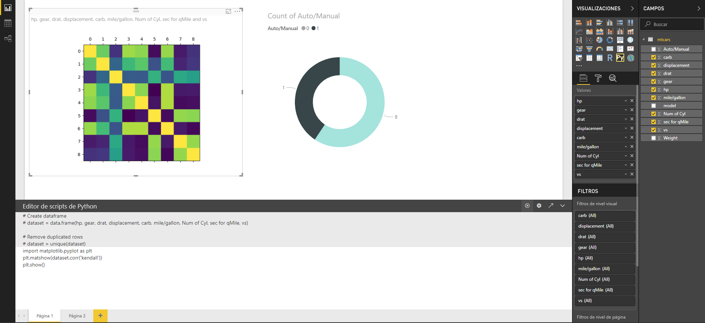
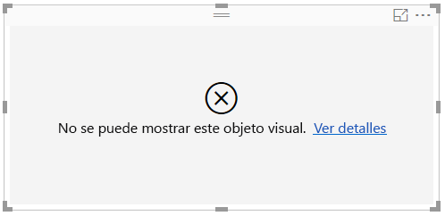

# Creación de objetos visuales de Power BI con Python
Con **Power BI Desktop**, puede usar **Python** para visualizar los datos.

## Instalación de Python
**Power BI Desktop** no incluye, implementa ni instala el motor de **Python**. Para ejecutar scripts de Python en **Power BI Desktop**, deberá instalar **Python** en el equipo local por separado. Puede descargar e instalar **Python** gratuitamente desde varias ubicaciones, incluida la [página de descargas oficial de Python](https://www.python.org/) y [Anaconda](https://anaconda.org/anaconda/python/). La versión actual de Scripting de Python en Power BI Desktop admite caracteres Unicode, así como espacios (caracteres vacíos) en la ruta de instalación.

## Habilitación de objetos visuales de Python
Para habilitar los objetos visuales de Python, seleccione **Archivo > Opciones y configuración > Opciones** y, en la página **Opciones** que aparece, asegúrese de que la instalación local de Python esté especificada en la sección **Scripting de Python** de la ventana **Opciones**, como se muestra en la imagen siguiente. En la imagen siguiente, la instalación local de la ruta de acceso de Python es **C:\Python27**, que se proporciona de forma explícita en el cuadro de texto. Asegúrese de que la ruta de acceso que se muestra refleja correctamente la instalación local de Python que quiere que use **Power BI Desktop**.
   
   

Después de especificar la instalación de Python, ya está listo para empezar a crear objetos visuales de Python.

## Creación de objetos visuales de Python en Power BI Desktop
1. Haga clic en el icono de **objeto visual de Python** en el panel **Visualización** como se muestra en la siguiente imagen, para agregar un objeto visual de Python.
   
   

   Al agregar un objeto visual de Python a un informe, **Power BI Desktop** hace lo siguiente:
   
   - Aparece una imagen de marcador de posición de objeto visual de Python en el lienzo del informe.
   
   - Aparece el **editor de scripts de Python** en la parte inferior del panel central.
   
   

2. A continuación, agregue los campos que quiera usar en el script de Python a la sección **Valores** de **Campos**, como lo haría con cualquier otro objeto visual de **Power BI Desktop**. 
    
    Solo los campos que se hayan agregado al área **Campos** estarán disponibles para el script de Python. Puede agregar campos nuevos o quitar los campos innecesarios del área **Campos** mientras trabaja en el script de Python en el **editor de scripts de Python de Power BI Desktop**. **Power BI Desktop** detecta automáticamente los campos que agrega o quita.
   
   > [!NOTE]
   > El tipo de agregación predeterminado para los objetos visuales de Python es *No resumir*.
   > 
   > 
   
3. Ahora puede usar los datos seleccionados para crear un trazado. 

    Al seleccionar los campos, el **editor de scripts de Python** genera un código de enlace de scripts de Python auxiliar en función de las selecciones realizadas en la sección de color gris de la parte superior del panel del editor. Al seleccionar o quitar campos adicionales, el código auxiliar del editor de scripts de Python se genera o elimina de forma automática según corresponda.
   
   En el ejemplo que se muestra en la imagen siguiente, se seleccionaron tres campos: hp, gear y drat. Como resultado de esas selecciones, el editor de scripts de Python generó el código de enlace siguiente:
   
   * Se creó una trama de datos llamada **dataset** .
     * Esa trama de datos consta de los distintos campos seleccionados por el usuario
   * La agregación predeterminada es *No resumir*
   * De forma similar a los objetos visuales de tabla, los campos se agrupan y las filas duplicadas aparecen solo una vez
   
   
   
   > [!TIP]
   > En ciertos casos, puede que no quiera que se produzca una agrupación automática o que quiera que aparezcan todas las filas, incluso las duplicadas. En ese caso, puede agregar un campo de índice al conjunto de datos que haga que todas las filas se consideren únicas y evite la agrupación.
   > 
   > 
   
   La trama de datos generada se denomina **dataset**, y puede acceder a las columnas seleccionadas a través de sus respectivos nombres. Por ejemplo, para acceder al campo gear, escriba *dataset["gear"]* en el script de Python.

4. Con la trama de datos generada automáticamente por los campos seleccionados, ya puede escribir un script de Python que genere un trazado en el dispositivo predeterminado de Python. Al finalizar el script, haga clic en **Ejecutar** en la barra de título del **editor de scripts de Python** (**Ejecutar** se encuentra en el lado derecho de la barra de título).
   
    Al seleccionar **Ejecutar**, **Power BI Desktop** identifica el trazado y lo presenta en el lienzo. Como el proceso se ejecuta en la instalación local de Python, asegúrese de que estén instalados los paquetes necesarios.
   
   **Power BI Desktop** vuelve a trazar los objetos visuales cuando se produce alguno de los siguientes eventos:
   
   * Al hacer clic en **Ejecutar** en la barra de título del **editor de scripts de Python**
   * Siempre que se produce un cambio de datos, debido a la actualización, filtrado o resaltado de datos

    La imagen siguiente muestra un ejemplo del código de trazado de correlación y traza las correlaciones entre atributos de distintos tipos de automóviles.

    

5. Para obtener una vista mayor de las visualizaciones, puede minimizar el **editor de scripts de Python**. Por supuesto, al igual que con otros objetos visuales de **Power BI Desktop**, puede aplicar un filtro cruzado al trazado de correlación. Para ello, seleccione solo los automóviles deportivos en el objeto visual de anillo (el objeto visual redondo de la derecha, en la imagen de ejemplo anterior).

    

6. También puede modificar el script de Python para personalizar el objeto visual y aprovechar el potencial de Python mediante la adición de parámetros al comando de trazado.

    El comando de trazado original era el siguiente:

    plt.matshow(dataset.corr("pearson"))

    Con unos pocos cambios en el script de Python, el comando es ahora el siguiente:

    plt.matshow(dataset.corr("kendall"))

    Como resultado, el objeto visual de Python ahora se traza con el coeficiente de correlación Kendall Tau, como se muestra en la imagen siguiente.

    

    Al ejecutar un script de Python que genera un error, el objeto visual de Python no se traza y se muestra un mensaje de error en el lienzo. Para obtener información sobre el error, haga clic en **Ver detalles** en el error del objeto visual de Python del lienzo.

    

    > **Seguridad de scripts de Python:** los objetos visuales de Python se crean a partir de scripts de Python, que podrían contener código que presente riesgos para la seguridad o la privacidad. Al intentar ver o interactuar con un objeto visual de Python por primera vez, un usuario recibe un mensaje de advertencia de seguridad. Habilite los objetos visuales de Python únicamente si confía en el autor y en el origen, o bien tras revisar el script de Python y asegurarse de que lo comprende.
    > 
    > 

## Limitaciones conocidas
Los objetos visuales de Python en **Power BI Desktop** tienen algunas limitaciones:

* Limitaciones de tamaño de datos: los datos que usa el objeto visual de Python para el trazado están limitados a 150 000 filas. Si se seleccionan más de 150.000 filas, solo se usan las primeras 150.000 y se muestra un mensaje en la imagen.
* Límite de tiempo de cálculo: si el cálculo de un objeto visual de Python supera los cinco minutos, se agota el tiempo de espera de ejecución y se genera un error.
* Relaciones: al igual que con otros objetos visuales de Power BI Desktop, si se seleccionan campos de datos de tablas diferentes sin ninguna relación definida entre ellos, se produce un error.
* Los objetos visuales de Python se actualizan al actualizar, filtrar y resaltar datos. Sin embargo, la imagen en sí no es interactiva y no puede ser el origen del filtro cruzado.
* Los objetos visuales de Python responden al resaltado de otros objetos visuales, pero no puede hacer clic en elementos del objeto visual de Python para aplicar un filtro cruzado a otros elementos.
* Solo los trazados que se trazan con el dispositivo de pantalla predeterminado de Python se muestran correctamente en el lienzo. Evite usar explícitamente otro dispositivo de pantalla de Python.

## Pasos siguientes
Eche un vistazo a la siguiente información adicional sobre Python en Power BI.

* [Ejecución de scripts de Python en Power BI Desktop](desktop-python-scripts.md)
* [Uso de un IDE externo de Python con Power BI](desktop-python-ide.md)

