# Información general sobre consultas en Power BI Desktop
Power BI Desktop le permite conectarse con el mundo de los datos, crear informes básicos y atractivos y compartir sus esfuerzos con otros usuarios, quienes a su vez podrán basarse en el trabajo que comparte con ellos y expandir sus propios esfuerzos de inteligencia empresarial.

Power BI Desktop tiene tres vistas:

* **Vista de informes** : donde usa las consultas que crea para generar visualizaciones atractivas, que se ordenan como quiere que aparezcan, y con varias páginas, que puede compartir con los demás
* **Vista de datos** : vea los datos en el informe en el formato de modelo de datos, donde puede agregar medidas, crear nuevas columnas y administrar relaciones
* **Vista de relaciones** : obtenga una representación gráfica de las relaciones que se han establecido en el modelo de datos y adminístrelas o modifíquelas según corresponda.

Acceda a estas vistas seleccionando uno de los tres iconos situados en el lado izquierdo de Power BI Desktop. En la siguiente imagen, la vista **Informe** está seleccionada y se indica mediante la banda de color amarillo situada junto al icono.  

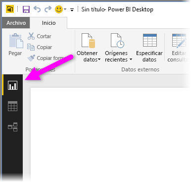

Power BI Desktop incluye también el Editor de Power Query. Use el Editor de Power Query para conectarse a uno o varios orígenes de datos, dar forma a los datos y transformarlos para que se ajusten a sus necesidades. Luego, puede cargar ese modelo en Power BI Desktop.

En este documento se ofrece información general sobre el funcionamiento de los datos en el Editor de Power Query, pero queda mucho por aprender. Al final de este documento encontrará vínculos a instrucciones detalladas sobre los tipos de datos admitidos. También encontrará instrucciones sobre cómo conectarse a datos, darles forma, crear relaciones y empezar a trabajar.

Pero, primero, vamos a familiarizarnos con el Editor de Power Query.

## Editor de Power Query
Para obtener el Editor de Power Query, seleccione **Editar consultas** en la pestaña **Inicio** de Power BI Desktop.  

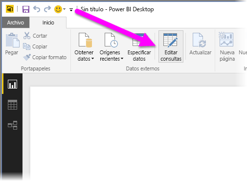

Si no existe ninguna conexión de datos, el Editor de Power Query aparece como un panel en blanco listo para mostrar datos.  

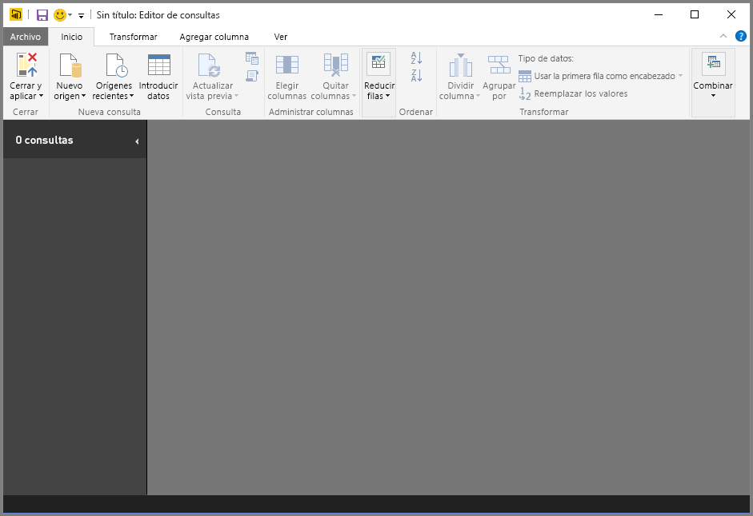

Una vez que se carga una consulta, el Editor de Power Query resulta más interesante. Si se conecta al siguiente origen de datos web, el Editor de Power Query carga información sobre los datos, a los que puede comenzar a dar forma:

[*https://www.bankrate.com/retirement/best-and-worst-states-for-retirement/*](https://www.bankrate.com/retirement/best-and-worst-states-for-retirement/)

Aquí se muestra la apariencia del Editor de Power Query una vez establecida la conexión de datos:

1. En la cinta aparecen muchos botones activos que permiten interactuar con los datos de la consulta.
2. En el panel izquierdo se muestran las consultas y están disponibles para su selección, visualización y conformación.
3. En el panel central se muestran los datos de la consulta seleccionada, disponibles para darles forma.
4. Aparece la ventana **Configuración de consulta**, con una lista de las propiedades de la consulta y los pasos aplicados.  
   
   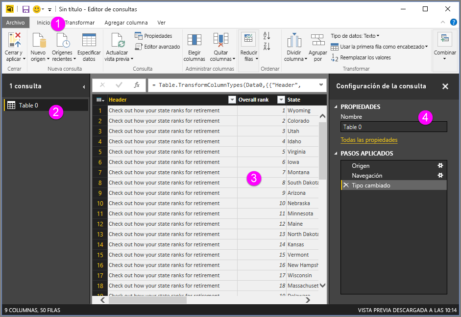

Analizaremos cada una de estas cuatro áreas: la cinta, el panel Consultas, la vista Datos y el panel Configuración de consulta.

## La cinta de opciones de consulta
La cinta del Editor de Power Query consta de cuatro pestañas: **Inicio**, **Transformar**, **Agregar columna** y **Ver**.

La pestaña **Inicio** contiene las tareas de consulta comunes.

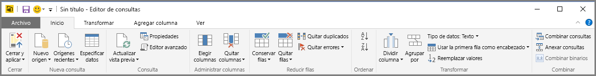

Para conectarse a los datos y comenzar el proceso de creación de la consulta, seleccione **Nuevo origen**. Aparece un menú que proporciona los orígenes de datos más comunes.  

Para obtener más información acerca de los orígenes de datos disponibles, consulte **Orígenes de datos**. Para obtener información sobre cómo conectarse a datos, con ejemplos y pasos a seguir, consulte **Conectar a datos**.

La pestaña **Transformar** proporciona acceso a tareas comunes de transformación de datos, tales como:

* Adición o eliminación de columnas
* Cambio de tipos de datos 
* División de columnas 
* Otras tareas controladas por datos

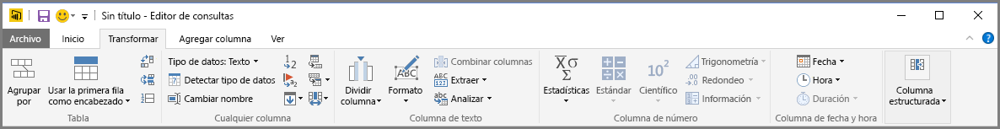

Para obtener más información sobre la transformación de datos, incluidos ejemplos, consulte [Tutorial: Combinar datos y darles forma en Power BI Desktop](https://docs.microsoft.com/power-bi/desktop-shape-and-combine-data).

La pestaña **Agregar columna** proporciona tareas adicionales relacionadas con agregar una columna, aplicar formato a los datos de una columna y agregar columnas personalizadas. La siguiente imagen muestra la pestaña **Agregar columna** .  

La pestaña **Vista** de la cinta de opciones se usa para alternar si se muestran determinados paneles o ventanas. También sirve para mostrar el Editor avanzado. La siguiente imagen muestra la pestaña **Vista**.  

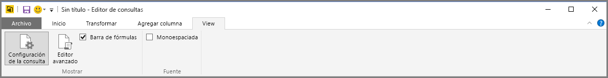

Resulta útil saber que muchas de las tareas disponibles en la cinta también están disponibles haciendo clic en una columna u otros datos, en el panel central.

## Panel izquierdo (Consultas)
El panel izquierdo, o panel **Consultas**, muestra el número de consultas activas, así como el nombre de cada consulta. Cuando selecciona una consulta en el panel izquierdo, los datos se muestran en el panel central, donde se les puede dar forma y transformar según sea necesario. La siguiente imagen muestra el panel izquierdo con una consulta.  

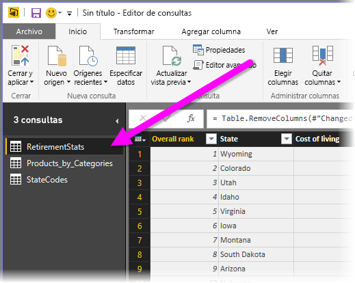

## Panel central (Datos)
En el panel central, o panel **Datos**, se muestran los datos de la consulta seleccionada. Aquí es donde se realiza gran parte del trabajo de la vista **Consulta**.

En la imagen siguiente se muestra la conexión de datos web establecida anteriormente. Se selecciona la columna **Product** y se hace clic con el botón derecho en el encabezado para mostrar los elementos de menú disponibles. Tenga en cuenta que muchos de estos elementos de menú contextual son los mismos que los botones que se encuentran en las fichas de la cinta.  

Cuando se selecciona un elemento de menú contextual (o un botón de la cinta), en la vista de consultas se aplica el paso a los datos. También se guarda el paso como parte de la propia consulta. Los pasos se registran en el panel **Configuración de consulta** en orden secuencial, como se describe en la sección siguiente.  

## Panel derecho (Configuración de consulta)
En el panel derecho, o panel **Configuración de consulta**, es donde se muestran todos los pasos asociados a una consulta. Por ejemplo, en la imagen siguiente, la sección **Pasos aplicados** del panel **Configuración de consulta** refleja el hecho de que se acaba de cambiar el tipo de la columna **Puntuación general** .

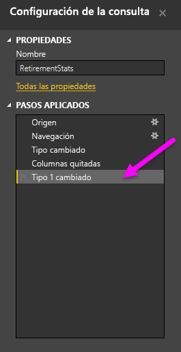

A medida que se aplican más pasos de conformación a la consulta, estos se capturan en la sección **Pasos aplicados**.

Es importante saber que los datos subyacentes *no* cambian. En su lugar, el Editor de Power Query ajusta la vista de los datos y le da forma. También lo hace con la vista de cualquier interacción con los datos subyacentes que se produzca según la vista conformada y modificada de esos datos del Editor de Power Query.

En el panel **Configuración de consulta** , puede eliminar pasos y cambiar el nombre o el orden de estos como considere oportuno. Para ello, haga clic en el paso en la sección **Pasos aplicados** y, a continuación, elija la opción deseada del menú que aparece. Todos los pasos de consulta se llevan a cabo en el orden en que aparecen en el panel **Pasos aplicados**.

## Editor avanzado
El **Editor avanzado** le permite ver el código que el Editor de Power Query crea con cada paso. También le permite crear su propio código de conformación. Para iniciar el editor avanzado, seleccione **Vista** desde la cinta de opciones y después seleccione **Editor avanzado**. Aparecerá una ventana que muestra el código de la consulta actual.  
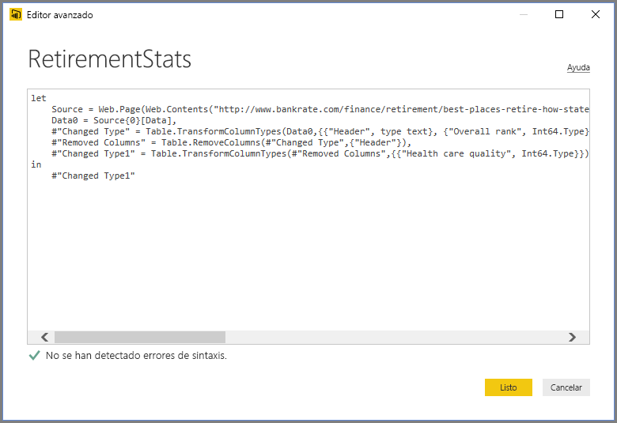

Puede modificar directamente el código en la ventana **Editor avanzado** . Para cerrar la ventana, seleccione el botón **Listo** o el botón **Cancelar** .  

## Guardar el trabajo
Cuando la consulta esté donde usted quiera, seleccione **Cerrar y aplicar** en el menú **Archivo** del Editor de Power Query. Esta acción aplica los cambios y cierra el editor.  
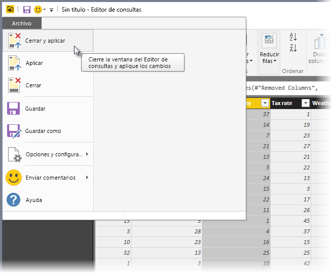

Como la operación avanza, Power BI Desktop proporciona un cuadro de diálogo para mostrar su estado.  
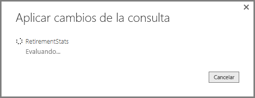

Cuando esté a punto, Power BI Desktop puede guardar su trabajo en forma de archivo *.pbix*.

Para guardar el trabajo, seleccione **Archivo** \> **Guardar** (o **Archivo** \> **Guardar como**), tal y como se muestra en la siguiente imagen.  
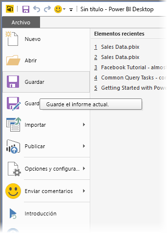

## Pasos siguientes
Se puede hacer todo tipo de cosas con Power BI Desktop. Para obtener más información sobre sus capacidades, consulte los siguientes recursos:

* [¿Qué es Power BI Desktop?](desktop-what-is-desktop.md)
* [Orígenes de datos en Power BI Desktop](desktop-data-sources.md)
* [Conectarse a los datos en Power BI Desktop](desktop-connect-to-data.md)
* [Tutorial: Combinar datos y darles forma con Power BI Desktop](desktop-shape-and-combine-data.md)
* [Realización de tareas de consultas comunes en Power BI Desktop](desktop-common-query-tasks.md)   

