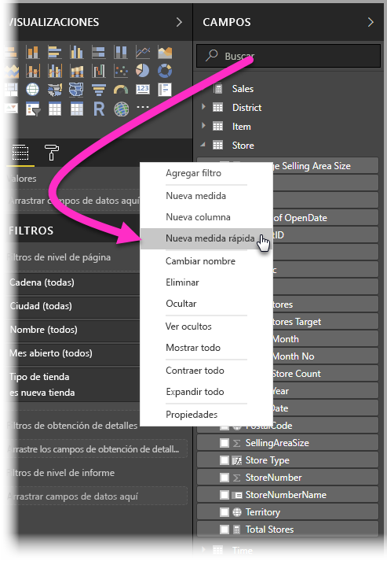
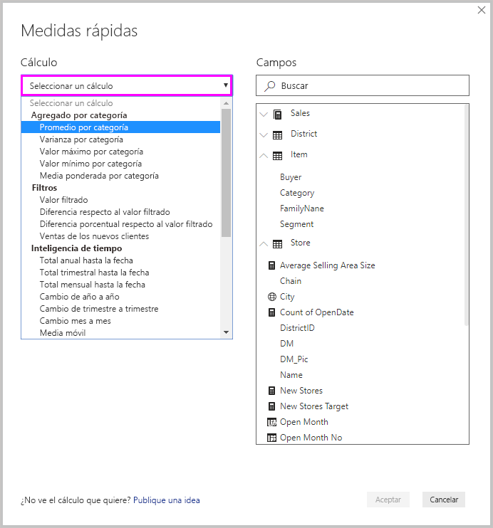
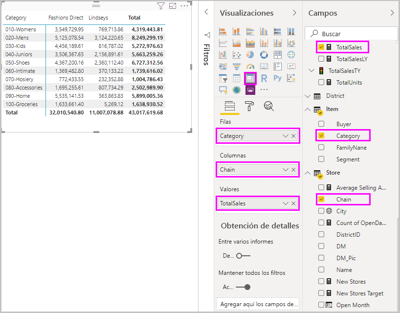
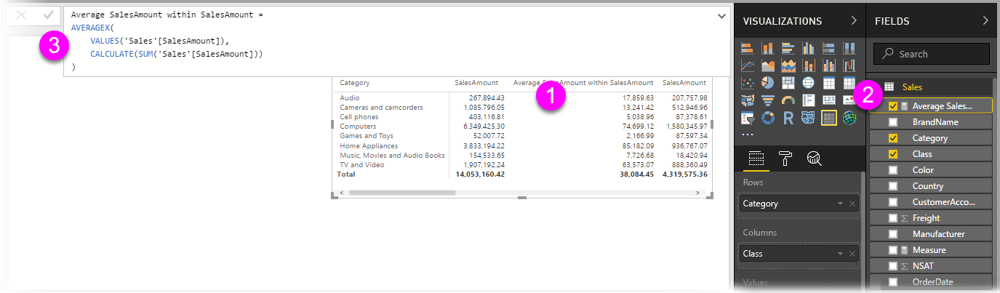
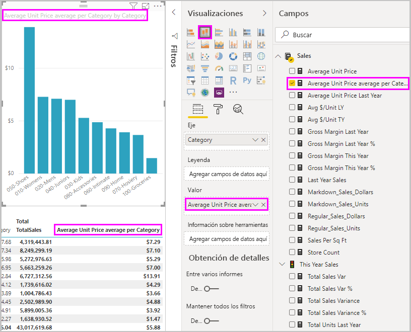
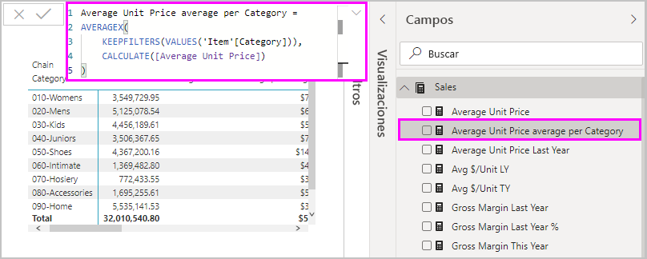
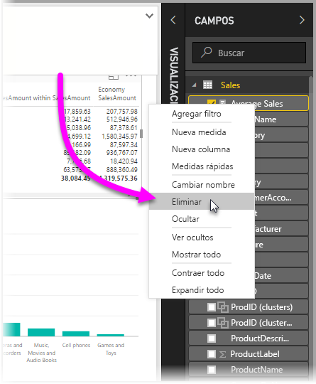

# Uso de medidas rápidas para cálculos comunes
Puede usar *medidas rápidas* para realizar fácilmente cálculos eficaces y comunes. Una medida rápida ejecuta un conjunto de comandos de Expresiones de análisis de datos (DAX) en segundo plano y, después, presenta los resultados para que los use en el informe. No tiene que escribir DAX, ya que se realiza de forma automática en función de la entrada proporcionada en un cuadro de diálogo. Hay muchas categorías disponibles de cálculos, y formas de modificarlos para ajustarlo a sus necesidades. Y posiblemente lo mejor de todo es que puede ver la fórmula DAX que ejecuta la medida rápida y empezar a poner en práctica los conocimientos sobre DAX, o ampliarlos.

## Creación de una medida rápida

Para crear una medida rápida en Power BI Desktop, haga clic con el botón derecho o seleccione los puntos suspensivos **...** junto a cualquier elemento del panel **Campos** y seleccione **Nueva medida rápida** en el menú que aparece. 

También puede hacer clic con el botón derecho o seleccionar la flecha desplegable situada junto a cualquier valor del área **Valores** de un objeto visual existente y seleccionar **Nueva medida rápida** en el menú. 

Al seleccionar **Nueva medida rápida**, aparece la ventana **Medidas rápidas**, en la que puede seleccionar el cálculo deseado y los campos en los que se va a ejecutar. 

Seleccione el campo **Seleccionar un cálculo** para ver una larga lista de medidas rápidas disponibles. 

Los cinco tipos de cálculo de medida rápida, con sus cálculos, son los siguientes:

* **Agregado por categoría**
  * Promedio por categoría
  * Varianza por categoría
  * Valor máximo por categoría
  * Valor mínimo por categoría
  * Media ponderada por categoría
* **Filtros**
  * Valor filtrado
  * Diferencia respecto al valor filtrado
  * Diferencia porcentual respecto al valor filtrado
  * Ventas de los nuevos clientes
* **Inteligencia de tiempo**
  * Total anual hasta la fecha
  * Total trimestral hasta la fecha
  * Total mensual hasta la fecha
  * Cambio de año a año
  * Cambio de trimestre a trimestre
  * Cambio mes a mes
  * Media móvil
* **Totales**
  * Total acumulado
  * Total por categoría (con filtros aplicados)
  * Total por categoría (sin filtros aplicados)
* **Operaciones matemáticas**
  * Suma
  * Resta
  * Multiplicación
  * División
  * Diferencia porcentual
  * Coeficiente de correlación
* **Texto**
  * Clasificación por estrellas
  * Lista de valores concatenados

Para enviar ideas sobre las nuevas medidas rápidas que le gustaría ver, las fórmulas DAX subyacentes u otras ideas de medidas rápidas para tener en cuenta, vea el final de este artículo.

> [!NOTE]
> Al usar las conexiones dinámicas de SQL Server Analysis Services (SSAS), hay algunas medidas rápidas disponibles. Power BI Desktop muestra solo las medidas rápidas que son compatibles con la versión de SSAS a la que se conecta. Si está conectado a un origen de datos dinámico de SSAS y no ve determinadas medidas rápidas en la lista, se debe a que la versión de SSAS a la que está conectado no admite los comandos de DAX usados para implementar esas medidas rápidas.

Después de seleccionar los cálculos y los campos que quiere para la medida rápida, seleccione **Aceptar**. La nueva medida rápida aparece en el panel **Campos** y la fórmula DAX subyacente en la barra de fórmulas. 

## Ejemplo de medida rápida
A continuación se analizará una medida rápida en acción.

El siguiente objeto visual de matriz muestra una tabla de ventas de distintos productos. Es una tabla básica que incluye el total de ventas de cada categoría.

Con el objeto visual de matriz seleccionado, seleccione la flecha de lista desplegable situada junto a **TotalSales** en la sección **Valores** y seleccione **Nueva medida rápida**. 

En la ventana **Medidas rápidas**, en **Cálculo**, seleccione **Promedio por categoría**. 

Arrastre **Promedio de precio unitario** desde el panel **Campos** hasta el campo **Valor base**. Deje **Categoría** en el campo **Categoría** y seleccione **Aceptar**. 

Al seleccionar **Aceptar**, se producen varias cosas interesantes.

1. El objeto visual de matriz tiene una nueva columna en la que se muestra el **Promedio de precio unitario por categoría** calculado.
   
2. La fórmula DAX para la nueva medida rápida aparece en la barra de fórmulas. Vea la [sección siguiente](#learn-dax-by-using-quick-measures) para obtener más información sobre la fórmula DAX.
   
3. La nueva medida rápida aparece seleccionada y resaltada en el panel **Campos**. 

La nueva medida rápida está disponible para cualquier objeto visual del informe, no solo para el que se ha creado. En la imagen siguiente se muestra un objeto visual de gráfico de columnas rápido creado mediante el nuevo campo de medida rápida.

## Aprendizaje de DAX mediante el uso de medidas rápidas
Una gran ventaja de las medidas rápidas es que muestran la fórmula DAX que implementa la medida. Al seleccionar una medida rápida en el panel **Campos**, aparece la **barra de fórmulas**, con la fórmula DAX que Power BI ha creado para implementar la medida.

La barra de fórmulas no solo muestra la fórmula subyacente a la medida, sino que probablemente lo más importante es que permite ver cómo crear las fórmulas DAX subyacentes a las medidas rápidas.

Imagine que tiene que realizar un cálculo interanual, pero no sabe muy bien cómo estructurar la fórmula DAX, o bien no sabe por dónde empezar. En lugar de desesperarse, puede crear una medida rápida mediante el cálculo **Cambio año a año** y ver cómo aparece en el objeto visual y cómo funciona la fórmula DAX. Después, puede realizar cambios directamente en la fórmula DAX, o bien crear una medida similar que satisfaga sus necesidades y expectativas. Es como tener un profesor que responde inmediatamente a las preguntas condicionales que le formula con unos pocos clics. 

Si no le gustan, siempre puede eliminar medidas rápidas del modelo. Es tan sencillo como hacer clic con el botón derecho o seleccionar **...** junto a la medida y, después, seleccionar **Eliminar**. También puede cambiar el nombre de una medida rápida por el que prefiera si selecciona **Cambiar nombre** en el menú. 

## Limitaciones y consideraciones
Hay algunas limitaciones y consideraciones que debe tener en cuenta.

- Puede usar las medidas rápidas agregadas al panel **Campos** con cualquier objeto visual del informe.
- Siempre puede ver la fórmula DAX asociada con una medida rápida si la selecciona en la lista **Campos** y la examina en la barra de fórmulas.
- Las medidas rápidas solo están disponibles si puede modificar el modelo. Este no es el caso cuando se trabaja con algunas conexiones dinámicas. Se admiten las conexiones dinámicas tabulares de SSAS, como se ha descrito antes.
- No se pueden crear medidas rápidas de inteligencia de tiempo cuando se trabaja en el modo DirectQuery. Las funciones DAX que se usan en estas medidas rápidas conllevan implicaciones de rendimiento cuando se convierten en las instrucciones T-SQL que se envían al origen de datos.

> [!IMPORTANT]
> Las instrucciones DAX para las medidas rápidas solo usan comas para los separadores de argumentos. Si la versión de Power BI Desktop está en un idioma en el que se usan comas como separador de decimales, las medidas rápidas no funcionarán correctamente.

### Inteligencia de tiempo y medidas rápidas
Puede usar tablas de fechas personalizadas propias con medidas rápidas de inteligencia de tiempo. Si va a usar un modelo tabular externo, asegúrese de que al compilar el modelo, la columna de fecha principal de la tabla se haya marcado como una tabla de fechas, como se describe en [Especificación de Marcar como tabla de fechas para su uso en la inteligencia de tiempo](https://docs.microsoft.com/sql/analysis-services/tabular-models/specify-mark-as-date-table-for-use-with-time-intelligence-ssas-tabular). Si va a importar una tabla de fechas propia, asegúrese de marcarla como una tabla de fechas, como se describe en [Configuración y uso de tablas de fechas en Power BI Desktop](desktop-date-tables.md).

### Información adicional y ejemplos
¿Tiene alguna idea para una medida rápida que todavía no se haya proporcionado? Magnífico. Consulte la página [Ideas de Power BI](https://go.microsoft.com/fwlink/?linkid=842906) y envíe las ideas y fórmulas DAX para medidas rápidas que le gustaría ver en Power BI Desktop. Consideraremos la posibilidad de agregarlas a la lista de medidas rápidas en una versión futura.

