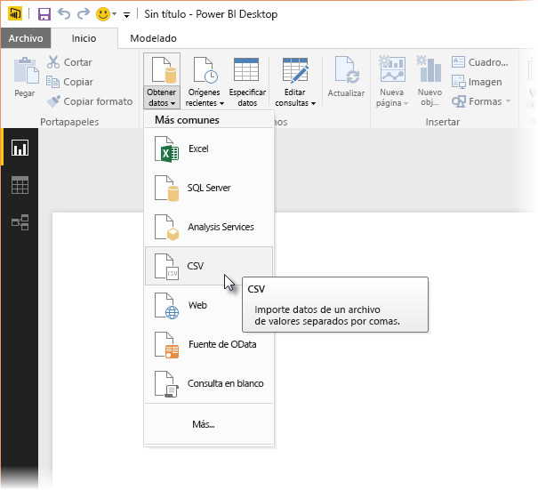
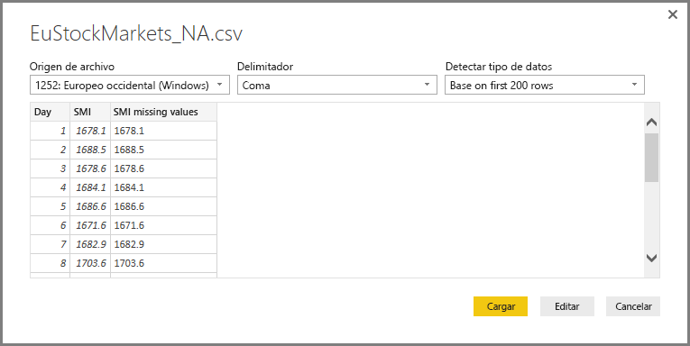
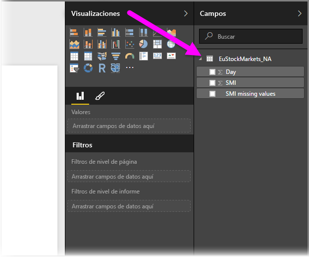
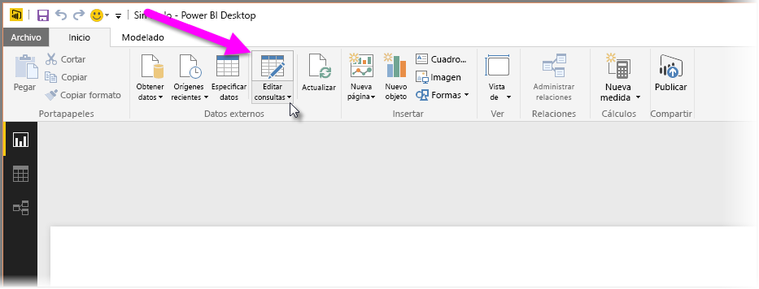
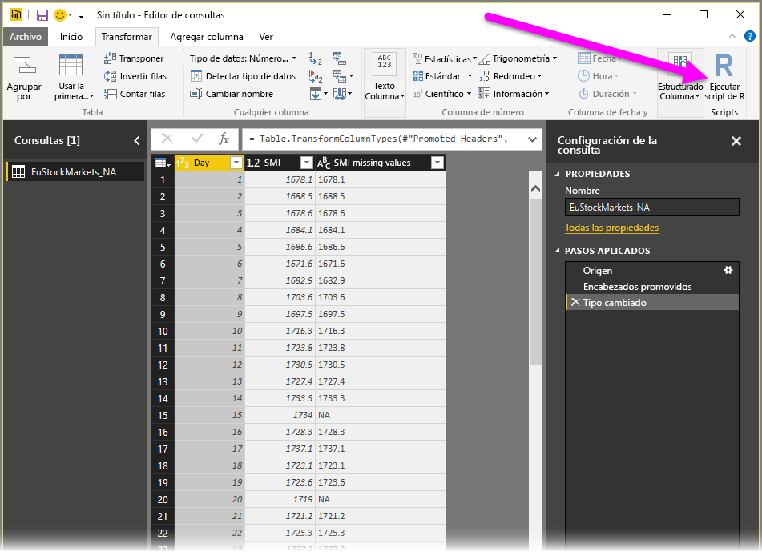
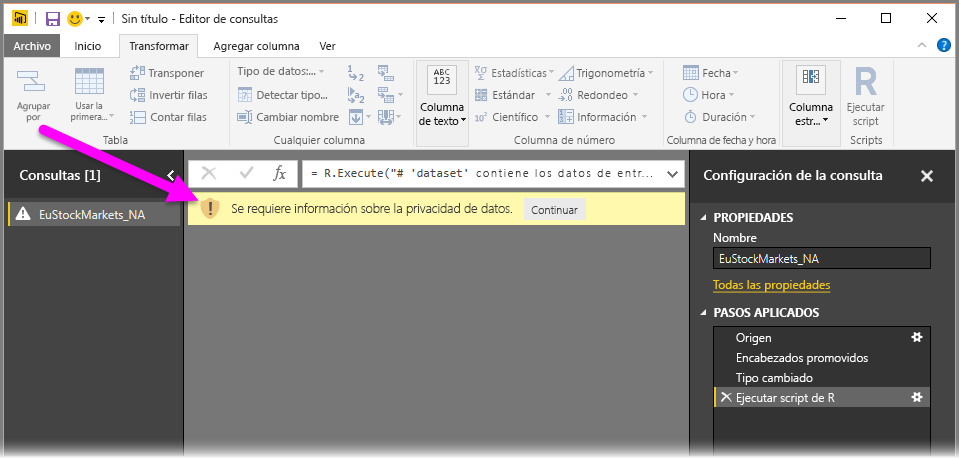
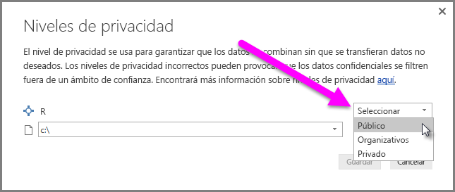
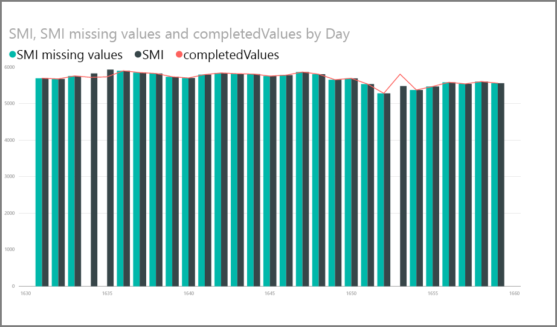
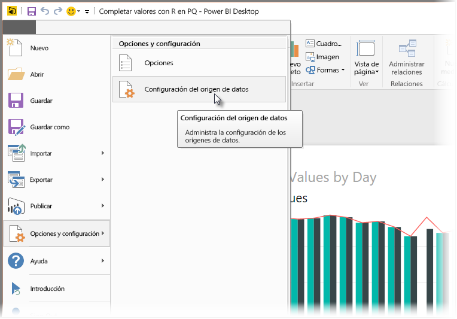
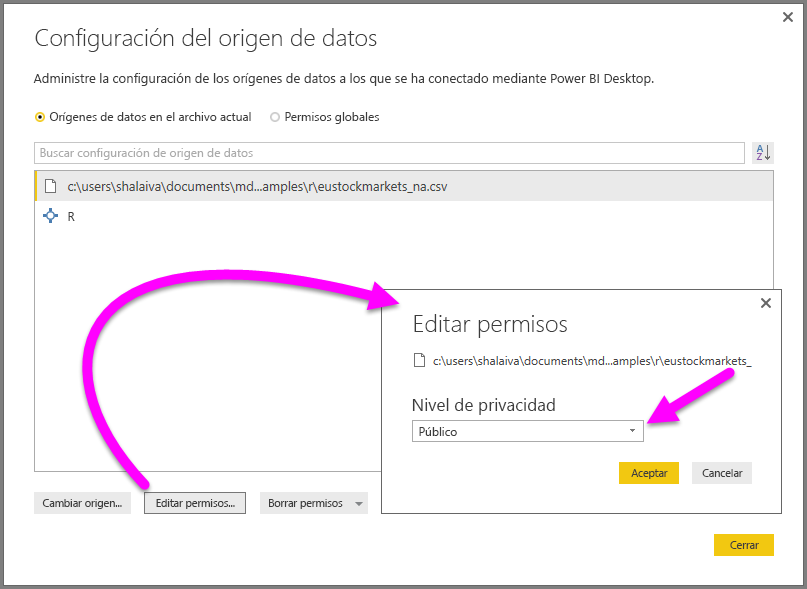

# <a name="use-r-in-query-editor"></a>Uso de R en el Editor de consultas

[**R**](https://mran.microsoft.com/documents/what-is-r) es un lenguaje de programación eficaz que usan muchos estadísticos, científicos de datos y analistas de datos. Puede usar **R** en el **Editor de consultas** de Power BI Desktop para:

* Preparar modelos de datos

* Crear informes

* Realizar limpieza de datos, modelado de datos avanzado y análisis de conjuntos de datos, que incluyen la finalización de datos que faltan, predicciones, agrupación en clústeres, etc.  

## <a name="install-r"></a>Instalar R

Puede descargar **R** de forma gratuita desde la [página de descarga de Revolution Open](https://mran.revolutionanalytics.com/download/) y el [repositorio de CRAN](https://cran.r-project.org/bin/windows/base/).

### <a name="install-mice"></a>Instalación de mice

Debe tener instalada la [biblioteca **mice**](https://www.rdocumentation.org/packages/mice/versions/3.5.0/topics/mice) en el entorno de R. Sin **mice**, el código de script de ejemplo no funcionará correctamente. El paquete **mice** implementa un método para solucionar el problema de los datos que faltan.

Para instalar **mice**:

1. Inicie el programa R.exe (por ejemplo, C:\Archivos de programa\Microsoft\R Open\R-3.5.3\bin\R.exe).  

2. Ejecute el comando install:

   ``` 
   >  install.packages('mice') 
   ```

## <a name="use-r-in-query-editor"></a>Uso de R en el Editor de consultas

Para demostrar el uso de **R** en el **Editor de consultas**, se usará un conjunto de datos del mercado de valores de ejemplo en un archivo .csv y se realizarán los pasos siguientes:

1. [Descargue el archivo **EuStockMarkets_NA.csv**](http://download.microsoft.com/download/F/8/A/F8AA9DC9-8545-4AAE-9305-27AD1D01DC03/EuStockMarkets_NA.csv). Recuerde dónde lo ha guardado.

1. Cargue el archivo en **Power BI Desktop**: en la cinta **Inicio**, seleccione **Obtener datos > Texto o CSV**.

   

1. Seleccione el archivo y después **Abrir**. Los datos CSV se muestran en el cuadro de diálogo **Archivo de texto/CSV**.

   

1. Una vez que se hayan cargado los datos, los puede ver en el panel **Campos**.

   

1. Para abrir el **Editor de consultas**, seleccione **Editar consultas** en la cinta **Inicio**.

   

1. En la cinta **Transformar**, seleccione **Ejecutar script de R**. Se abrirá el editor **Ejecutar script de R**.  

   Las filas 15 y 20 tienen datos que faltan, al igual que otras filas que no se pueden ver en la imagen. En los pasos siguientes se muestra cómo R completa esas filas de forma automática.

   

1. En este ejemplo, escriba el código de script siguiente. Asegúrese de reemplazar "&lt;Ruta de acceso al archivo&gt;" por la ruta de acceso a **EuStockMarkets_NA. csv** en el sistema de archivos local, por ejemplo, C:/Usuarios/John Doe/Documentos/Microsoft/EuStockMarkets_NA.csv.

    ```r
       dataset <- read.csv(file="<Your File Path>/EuStockMarkets_NA.csv", header=TRUE, sep=",")
       library(mice)
       tempData <- mice(dataset,m=1,maxit=50,meth='pmm',seed=100)
       completedData <- complete(tempData,1)
       output <- dataset
       output$completedValues <- completedData$"SMI missing values"
    ```

7. Después de seleccionar **Aceptar**, el **Editor de consultas** muestra una advertencia sobre la privacidad de datos.

   
8. Para que los scripts de R funcionen correctamente en el servicio Power BI, debe establecer como **públicos** todos los orígenes de datos. Para obtener más información sobre la configuración de privacidad y sus implicaciones, consulte [Niveles de privacidad](desktop-privacy-levels.md).

   

   Después de seleccionar **Guardar** se ejecuta el script. Observe que en el panel **Campos** hay una columna nueva denominada **completedValues**. Observe que algunos elementos de datos faltan, como en las filas 15 y 18. Vea cómo R lo aborda en la sección siguiente.

   Con solo cinco líneas de script de R, el **Editor de consultas** ha rellenado los valores que faltaban con un modelo predictivo.

## <a name="create-visuals-from-r-script-data"></a>Creación de objetos visuales a partir de los datos del script de R

Ahora podemos crear un objeto visual para ver cómo el código de script de R, mediante la biblioteca **mice**, ha completado los valores que faltaban, como se muestra en la siguiente imagen:



Puede guardar todos los objetos visuales completados en un archivo .pbix de **Power BI Desktop** y usar el modelo de datos y sus scripts de R en el servicio Power BI.

> [!NOTE]
> Puede [descargar un archivo .pbix](http://download.microsoft.com/download/F/8/A/F8AA9DC9-8545-4AAE-9305-27AD1D01DC03/Complete%20Values%20with%20R%20in%20PQ.pbix) con todos estos pasos completados.

Una vez que haya cargado el archivo .pbix en el servicio Power BI, tendrá que realizar pasos adicionales para habilitar la actualización de datos de servicio y los objetos visuales actualizados:  

* **Habilitar la actualización programada del conjunto de datos**: para habilitar la actualización programada del libro que contiene el conjunto de datos con scripts de R, vea [Configuración de la actualización programada](refresh-scheduled-refresh.md), que también incluye información sobre **Puerta de enlace personal**.

* **Instalar la puerta de enlace personal**: necesita una **puerta de enlace personal** instalada en el equipo donde se encuentran el archivo y **R**. El servicio Power BI accede a ese libro y vuelve a representar los objetos visuales actualizados. Para más información, vea [Instalación y configuración de puertas de enlace personales](service-gateway-personal-mode.md).

## <a name="limitations"></a>Limitaciones

Existen algunas limitaciones para las consultas, que incluyen los scripts de R creados en el **Editor de consultas**:

* Toda la configuración del origen de datos de R se debe establecer en **Pública**. El resto de los pasos de una consulta del **Editor de consultas** también deben ser públicos. Para obtener la configuración del origen de datos en **Power BI Desktop**, seleccione **Archivo > Opciones y configuración > Configuración de origen de datos**.

  

  En el cuadro de diálogo **Configuración de origen de datos**, seleccione los orígenes de datos y, después, **Editar permisos...** .  Establezca el **Nivel de privacidad** en **Público**.

      
* Para habilitar la actualización programada de los objetos visuales o del conjunto de datos de R, debe habilitar **Actualización programada** y tener una **Puerta de enlace personal** instalada en el equipo que contiene el libro y **R**. Para obtener más información sobre ambos, consulte la sección anterior de este artículo y siga los vínculos que se proporcionan.

Con R y las consultas personalizadas puede hacer todo tipo de cosas; por tanto, explore y dé forma a los datos de la manera que quiera que aparezcan.

## <a name="next-steps"></a>Pasos siguientes

* [Introducción a R](https://mran.microsoft.com/documents/what-is-r) 

* [Ejecución de scripts de R en Power BI Desktop](desktop-r-scripts.md) 

* [Usar una IDE de R externa con Power BI](desktop-r-ide.md) 

* [R packages in the Power BI service](service-r-packages-support.md) (Paquetes de R en el servicio Power BI)
