# Uso de objetos visuales de Power BI con tecnología de R en Power BI

En **Power BI Desktop** y el **servicio Power BI**, puede usar objetos visuales de Power BI con tecnología de R sin tener que aprender a usar R ni a crear scripting de R. Esto le permite aprovechar el poder analítico y visual de objetos visuales y scripts de R sin que tenga que aprender a usar R ni a programarlo.

Para usar elementos visuales de Power BI con tecnología R, primero seleccione y descargue los objetos visuales personalizados de R que quiere usar desde la galería de [**AppSource**](https://appsource.microsoft.com/marketplace/apps?product=power-bi-visuals&page=1) de **objetos visuales de Power BI** para Power BI.

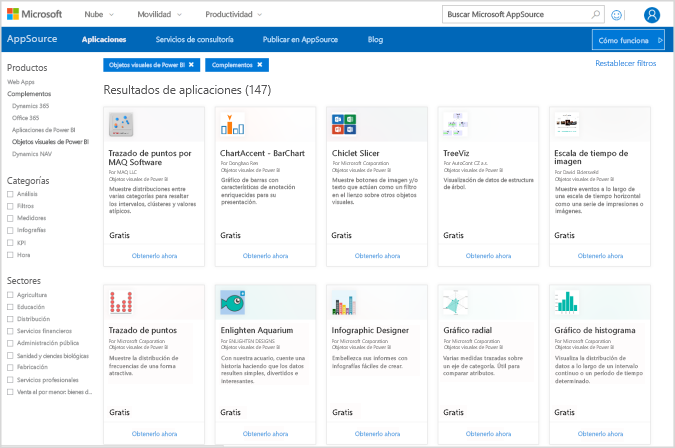

Las secciones siguientes describen cómo seleccionar, cargar y usar elementos visuales con tecnología de R en **Power BI Desktop**.

## Uso de objetos visuales de Power BI con tecnología de R

Para usar objetos visuales de Power BI con tecnología de R, descargue cada objeto visual de la biblioteca de **objetos visuales de Power BI** y después use el objeto visual como cualquier otro tipo de objeto visual en **Power BI Desktop**. Hay dos maneras de obtener objetos visuales de Power BI: puede descargarlos desde el sitio de **AppSource** en línea o buscarlos en **Power BI Desktop**. 

### Obtención de objetos visuales de Power BI desde AppSource

Estos son los pasos para buscar y seleccionar objetos visuales en el sitio de **AppSource** en línea:

1. Vaya a la biblioteca de objetos visuales de Power BI, que se encuentra en [https://appsource.microsoft.com](https://appsource.microsoft.com/). Seleccione la casilla *Power BI apps* (Aplicaciones de Power BI) en *Restringir por producto* y, a continuación, seleccione el vínculo **Ver todo**.

   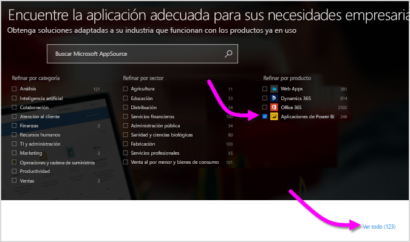

2. En la página de la biblioteca [Objetos visuales de Power BI](https://appsource.microsoft.com/marketplace/apps?product=power-bi-visuals&page=1), seleccione **Objetos visuales de Power BI** en la lista de complementos en el panel izquierdo.

   

3. En la galería, seleccione el **objeto visual** que desea usar y se abrirá la página con la descripción del objeto visual. Seleccione el botón **Obtenerla ahora** para descargarlo.

   > [!NOTE]
    > Para crear **Power BI Desktop**, necesita tener R instalado en su equipo local. Pero cuando los usuarios quieren ver un objeto visual con tecnología R en el **servicio Power BI**, no necesitan tener instalado R localmente.

   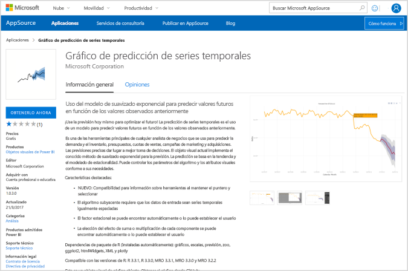

   No es necesario que instale R para usar objetos visuales de Power BI con tecnología de R en el **servicio Power BI**. Sin embargo, si quiere usar objetos visuales de Power BI con tecnología de R en **Power BI Desktop**, *debe* instalar R en la máquina local. Puede descargar R en las siguientes ubicaciones:

   * [CRAN](https://cran.r-project.org/)
   * [MRO](https://mran.microsoft.com/)

4. Una vez descargado el objeto visual (que es como descargar un archivo desde el explorador), vaya a **Power BI Desktop**, haga clic en los puntos suspensivos (...) en el panel **Visualizaciones** y seleccione **Importar desde archivo**.

   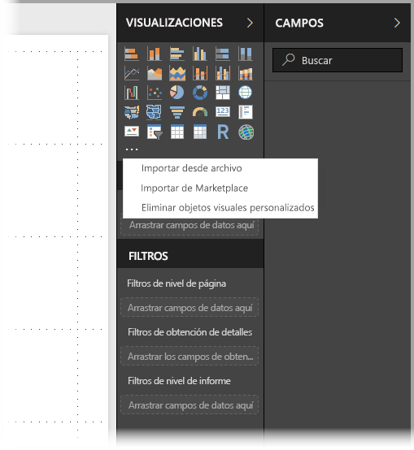
5. Se le advierte de la importación de objetos visuales personalizados, como se muestra en la siguiente imagen:

   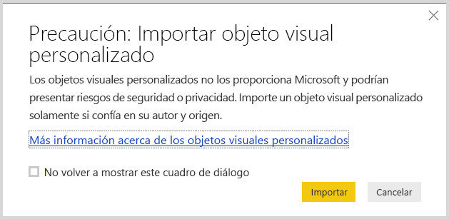
6. Vaya al lugar en que guardó el archivo de objetos visuales y, después, seleccione el archivo. Las visualizaciones personalizadas de **Power BI Desktop** tienen la extensión .pbiviz.

   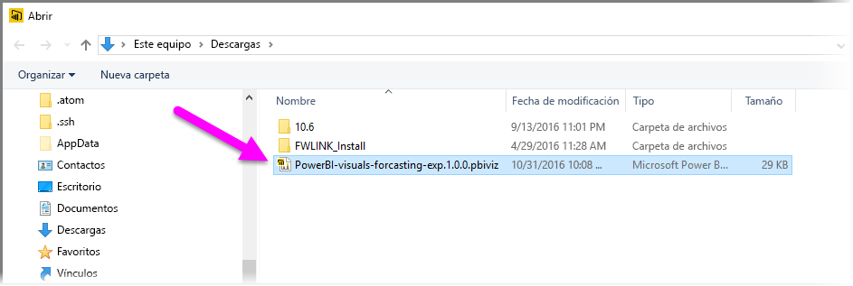
7. Cuando vuelva a Power BI Desktop, podrá ver el nuevo tipo de objeto visual en el panel **Visualizaciones**.

   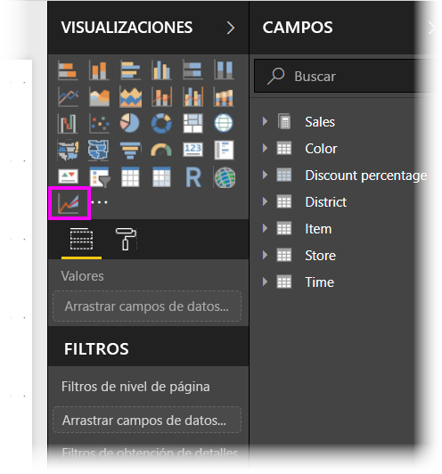
8. Cuando se importa un nuevo objeto visual o se abre un informe que contiene un objeto visual personalizado con tecnología R, **Power BI Desktop** instala los paquetes de R necesarios.

   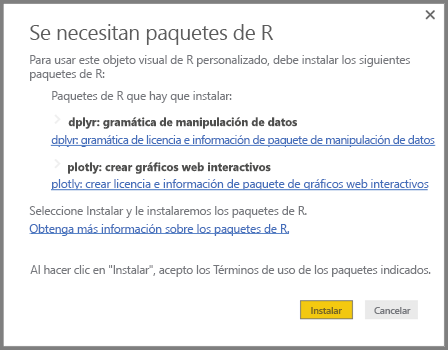

9. En ese momento puede agregar datos al objeto visual igual que haría con cualquier otro objeto visual de **Power BI Desktop**. Cuando haya finalizado, podrá ver el objeto visual terminado en el lienzo. En el siguiente objeto visual, el objeto visual con tecnología de R **Previsión** se usó con proyecciones de la tasa de natalidad de las Naciones Unidas (ONU) (objeto visual de la izquierda).

    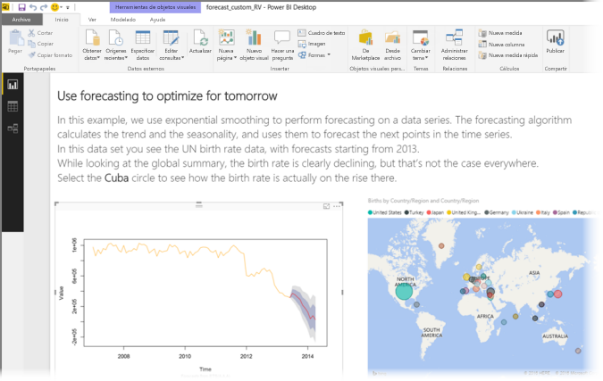

    Como cualquier otro objeto visual de **Power BI Desktop**, puede publicar este informe con sus objetos visuales con tecnología R en el **servicio Power BI** y compartirlo con otros usuarios.

    Consulte la biblioteca con frecuencia, ya que se agregan nuevos objetos visuales constantemente.

### Obtención de objetos visuales de Power BI desde **Power BI Desktop**

1. También se pueden obtener objetos visuales de Power BI desde **Power BI Desktop**. En **Power BI Desktop** haga clic en los puntos suspensivos (...), en el panel **Visualizaciones**, y seleccione **Import from marketplace** (Importar desde marketplace).

   

2. Al hacerlo, aparece el cuadro de diálogo **Objetos visuales de Power BI**, donde puede desplazarse por los objetos visuales de Power BI disponibles y seleccionar el que quiera. Puede buscar por nombre, seleccionar una categoría o, simplemente, desplazarse por los objetos visuales disponibles. Cuando esté listo, seleccione **Agregar** para agregar el objeto visual personalizado a **Power BI Desktop**.

   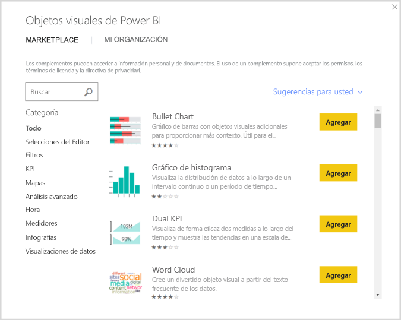

## Contribución de objetos visuales de Power BI con tecnología de R

Si crea sus propios objetos visuales de R para usarlos en informes, puede aportarlos a **galería de objetos visuales de Power BI** para compartirlos con otros usuarios de todo el mundo. Las contribuciones se realizan a través de GitHub y el proceso se describe en la siguiente ubicación:

* [Contribución a la galería de objetos visuales de Power BI con tecnología de R](https://github.com/Microsoft/PowerBI-visuals#building-r-powered-custom-visual-corrplot)

## Solucionar problemas de objetos visuales de Power BI con tecnología de R

Los objetos visuales de Power BI con tecnología de R tienen ciertas dependencias que deben cumplirse para que los objetos visuales funcionen correctamente. Cuando los objetos visuales de Power BI con tecnología de R no se ejecutan o se cargan correctamente, suele deberse a uno de los problemas siguientes:

* Falta el motor de R.
* Hay errores en el script de R en el que se basa el objeto visual.
* Faltan paquetes de R o no están actualizados.

En la sección siguiente se describen los pasos que puede llevar a cabo para solucionar los problemas que puedan surgir.

### Faltan paquetes de R o no están actualizados

Al tratar de instalar un objeto visual personalizado con tecnología R, pueden producirse errores si faltan paquetes de R o están obsoletos. Esto se debe a uno de los siguientes motivos:

* La instalación de R es incompatible con el paquete de R.
* La configuración del firewall, del software antivirus o del proxy impide que R se conecte a Internet.
* La conexión a Internet es lenta o hay un problema de conexión a Internet.

El equipo de Power BI está trabajando activamente para mitigar estos problemas de modo que no le afecten y en la siguiente versión de Power BI Desktop se incorporarán actualizaciones para resolverlos. Hasta entonces, puede llevar a cabo uno o varios de los pasos siguientes para mitigar los problemas:

1. Quite el objeto visual personalizado e instálelo de nuevo. De este modo, se inicia una reinstalación de los paquetes de R.
2. Si la instalación de R no es actual, actualícela y, después, quite y reinstale el objeto visual personalizado como se describe en el paso anterior.

   Las versiones de R admitidas se muestran en la descripción de cada objeto visual personalizado con tecnología R, como se muestra en la imagen siguiente.

     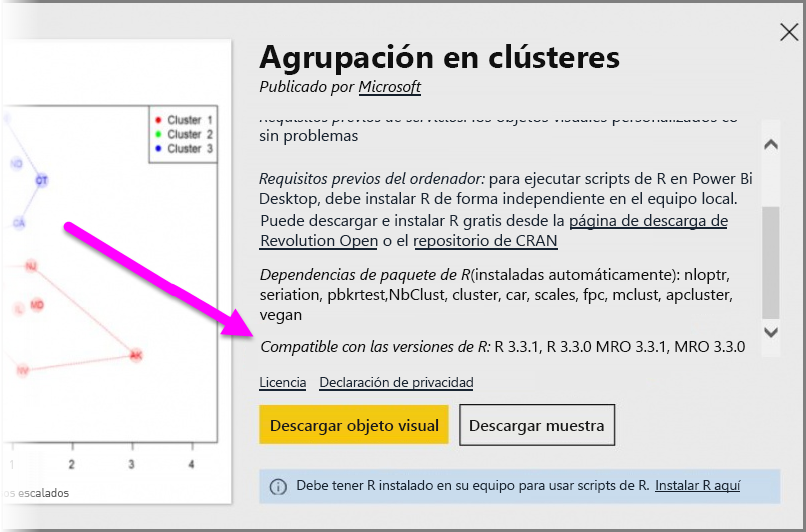
    > [!NOTE]
    > Puede conservar la instalación de R original y asociar únicamente Power BI Desktop con la versión actual que instale. Vaya a **Archivo > Opciones y configuración > Opciones > Scripting de R**.

3. Instale los paquetes de R manualmente mediante cualquier consola de R. Los pasos de este enfoque son los siguientes:

   a.  Descargue el script de instalación de objeto visual con tecnología R y guarde el archivo en una unidad local.

   b.  Desde la consola de R, ejecute lo siguiente:

       source(“C:/Users/david/Downloads/ScriptInstallPackagesForForecastWithWorkarounds.R”)

   Las típicas ubicaciones de instalación predeterminadas son las siguientes:

       c:\Program Files\R\R-3.3.x\bin\x64\Rterm.exe (for CRAN-R)
       c:\Program Files\R\R-3.3.x\bin\x64\Rgui.exe (for CRAN-R)
       c:\Program Files\R\R-3.3.x\bin\R.exe (for CRAN-R)
       c:\Program Files\Microsoft\MRO-3.3.x\bin\R.exe (for MRO)
       c:\Program Files\Microsoft\MRO-3.3.x\bin\x64\Rgui.exe (for MRO)
       c:\Program Files\RStudio\bin\rstudio.exe (for RStudio)
4. Si los pasos anteriores no funcionan, pruebe lo siguiente:

   a. Use **R Studio** y siga el paso que se describe en el punto 3.b. anterior (ejecute la línea de script desde la consola de R).

   b. Si el paso anterior no funciona, cambie **Herramientas > Opciones globales > Paquetes** en **R Studio** y active la casilla **Use Internet Explorer library/proxy for HTTP** (Usar la biblioteca/proxy de Internet Explorer para HTTP). Después, repita el proceso el paso 3.b. anterior.

## Pasos siguientes

Eche un vistazo a la siguiente información adicional sobre R en Power BI.

* [Galería de objetos visuales de Power BI](https://app.powerbi.com/visuals/)
* [Ejecución de scripts R en Power BI Desktop](desktop-r-scripts.md)
* [Crear objetos visuales de R en Power BI Desktop](desktop-r-visuals.md)
* [Usar una IDE de R externa con Power BI](desktop-r-ide.md)
