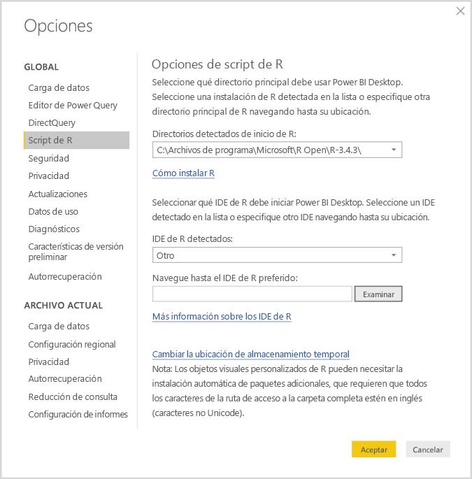
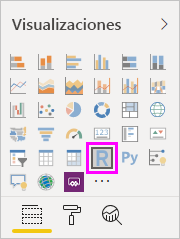
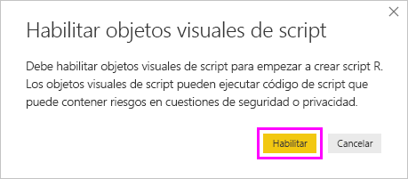
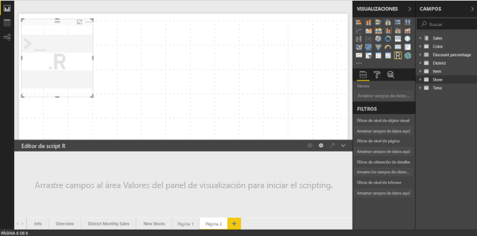
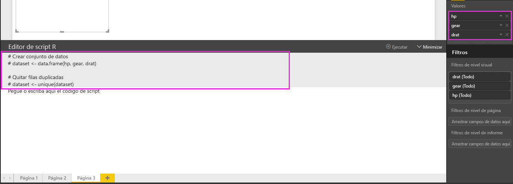
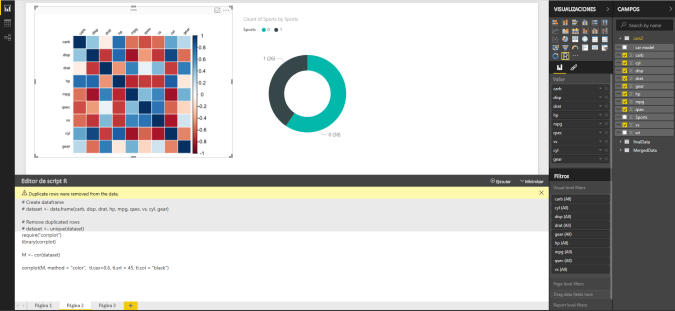
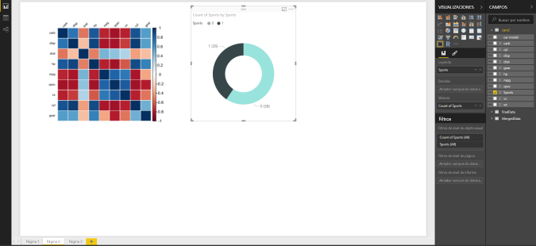
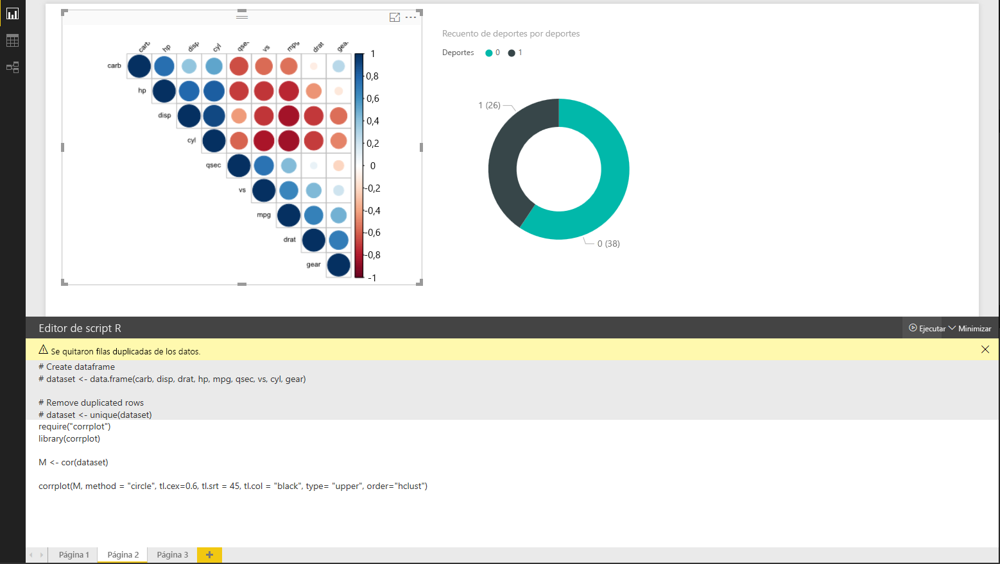
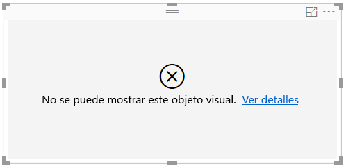

# <a name="create-power-bi-visuals-using-r"></a>Crear objetos visuales de Power BI con R
Con Power BI Desktop, puede usar *R* para visualizar los datos. [R](https://mran.revolutionanalytics.com/documents/what-is-r) es un entorno y lenguaje para cálculos estadísticos y gráficos.

## <a name="install-r"></a>Instalar R
De forma predeterminada, Power BI Desktop no incluye, implementa ni instala el motor de R. Para ejecutar scripts de R en Power BI Desktop, tendrá que instalar R en el equipo local por separado. Puede descargar e instalar R de forma gratuita desde varias ubicaciones, incluida la [página de descarga de Revolution Open](https://mran.revolutionanalytics.com/download/) y el [repositorio de CRAN](https://cran.r-project.org/bin/windows/base/). La versión actual de Scripting de R en Power BI Desktop admite caracteres Unicode, así como espacios (caracteres vacíos) en la ruta de instalación.

## <a name="enable-r-visuals-in-power-bi-desktop"></a>Habilitación de objetos visuales de R en Power BI Desktop
Después de instalar R, Power BI Desktop lo habilita de forma automática. Para comprobar que Power BI Desktop ha habilitado R en la ubicación correcta, siga estos pasos: 

1. Desde el menú de Power BI Desktop, seleccione **Archivo** > **Opciones y configuración** > **Opciones**. 

2. En el lado izquierdo de la página **Opciones**, en **Global**, seleccione **Script de R**. 

3. En **Opciones de script de R**, compruebe que la instalación local de R esté especificada en **Directorios detectados de inicio R** y que refleje correctamente la instalación local de R que quiera usar en Power BI Desktop. En la imagen siguiente, la ruta de acceso de la instalación local de R es **C:\Archivos de programa\R Open\R-3.5.3\\** .
   
   

Después de comprobar la instalación de R, ya está listo para empezar a crear objetos visuales de R.

## <a name="create-r-visuals-in-power-bi-desktop"></a>Crear objetos visuales de R en Power BI Desktop
1. Seleccione el icono **Objeto visual de R** en el panel **Visualizaciones** para agregar un objeto visual de R.
   
   

2. En la ventana **Habilitar objetos visuales de script** que aparece, seleccione **Habilitar**.

   

   Al agregar un objeto visual de R a un informe, Power BI Desktop realiza los cambios siguientes:
   
   - Una imagen de marcador de posición de objeto visual de R aparece en el lienzo de informes.
   
   - El **editor de scripts de R** aparece en la parte inferior del panel central.
   
   

3. En la sección **Valores** del panel **Visualización**, agregue los campos desde el panel **Campos** que quiera consumir en el script de R, como lo haría con cualquier otro objeto visual de Power BI Desktop. También puede seleccionar los campos directamente en el panel **Campos**.
    
    Solo los campos que haya agregado a la sección **Valores** estarán disponibles para el script de R. Puede agregar nuevos campos o quitar los campos innecesarios de la sección **Valores** mientras trabaja en el script de R en el **Editor de script de R**. Power BI Desktop detecta automáticamente los campos que ha agregado o quitado.
   
   > [!NOTE]
   > El tipo de agregación predeterminado para objetos visuales de R es *No resumir*.
   > 
   > 
   
4. Ahora puede usar los datos seleccionados para crear un trazado: 

    - Al seleccionar los campos, el **editor de scripts de R** genera un código de enlace de scripts de R auxiliar para esos campos en la sección de color gris de la parte superior del panel del editor.
    - Si quita un campo, el **editor de scripts de R** quita de forma automática el código auxiliar para ese campo.
   
   En el ejemplo que se muestra en la imagen siguiente, se han seleccionado tres campos: hp, gear y drat. Como resultado de esas selecciones, el editor de scripts de R genera código de enlace, que se resume de esta forma:
   
   * Crea una trama de datos denominada **dataset**, que consta de los distintos campos seleccionados por el usuario.
   * La agregación predeterminada es *No resumir*.
   * De forma similar a los objetos visuales de tabla, los campos se agrupan y las filas duplicadas aparecen solo una vez.
   
   
   
   > [!TIP]
   > En ciertos casos, puede que no quiera que se produzca una agrupación automática o que quiera que aparezcan todas las filas, incluso las duplicadas. En ese caso, agregue un campo de índice al conjunto de datos, para que todas las filas se consideren únicas y se evite la agrupación.
   > 
   > 
   
   La trama de datos generada se denomina **dataset**, y se accede a las columnas seleccionadas a través de sus respectivos nombres. Por ejemplo, para acceder al campo gear, agregue *dataset$gear* al script de R. Para los campos con espacios o caracteres especiales, use comillas simples.

5. Con la trama de datos generada automáticamente por los campos seleccionados, ya puede escribir un script de R, que Power BI Desktop representa en el dispositivo predeterminado de R. Una vez completado el script, seleccione **Ejecutar script** en el lado derecho de la barra de título del **Editor de script de R**.
   
    Al seleccionar **Ejecutar script**, Power BI Desktop identifica el trazado y lo presenta en el lienzo. Como el proceso se ejecuta en la instalación local de R, asegúrese de que estén instalados los paquetes de R necesarios.
   
   Power BI Desktop vuelve a trazar los objetos visuales cuando se produce alguno de los siguientes eventos:
   
   * Al seleccionar **Ejecutar script** en la barra de título del **editor de script de R**.
   * Se produce un cambio de datos debido a la actualización, filtrado o resaltado de datos.

     En la imagen siguiente se muestra un ejemplo del código de trazado de correlación, que traza las correlaciones entre atributos de distintos tipos de automóviles.

     

6. Para obtener una vista mayor de las visualizaciones, minimice el **editor de script de R**. Como sucede con otros objetos visuales de Power BI Desktop, puede aplicar un filtro cruzado al trazado de correlación si selecciona una sección concreta (por ejemplo automóviles deportivos) en el objeto visual de anillo (el objeto visual redondo de la derecha).

    

7. Modifique el script de R para personalizar el objeto visual y aprovechar el potencial de R mediante la adición de parámetros al comando de trazado.

    El comando de trazado original es el siguiente:

    ```
    corrplot(M, method = "color",  tl.cex=0.6, tl.srt = 45, tl.col = "black")
    ```

    Cambie el script de R para que el comando de trazado sea el siguiente:

    ```
    corrplot(M, method = "circle", tl.cex=0.6, tl.srt = 45, tl.col = "black", type= "upper", order="hclust")
    ```

    Como resultado, ahora el objeto visual de R traza círculos, solo tiene en cuenta la mitad superior y reordena la matriz para agrupar en clúster los atributos correlacionados.

    

    Al ejecutar un script de R que genera un error, se muestra un mensaje de error en el lienzo, en lugar del trazado del objeto visual de R. Para obtener más información sobre el error, seleccione **Ver detalles** en el error del objeto visual de R.

    

## <a name="r-scripts-security"></a>Seguridad de scripts R 
Los objetos visuales de R se crean a partir de scripts de R, que podrían contener código que presente riesgos para la seguridad o la privacidad. Al intentar ver o interactuar con un objeto visual de R por primera vez, un usuario recibe un mensaje de advertencia de seguridad. Habilite los objetos visuales de R únicamente si confía en el autor y en el origen, o bien tras revisar el script R y asegurarse de que lo comprende.


## <a name="known-limitations"></a>Limitaciones conocidas
Los objetos visuales de R en Power BI Desktop tienen las limitaciones siguientes:

* Tamaños de datos: los datos que usa un objeto visual de R para el trazado están limitados a 150 000 filas. Si se seleccionan más de 150.000 filas, solo se usan las primeras 150.000 y se muestra un mensaje en la imagen.

* Tiempos de cálculo: si un cálculo de objeto visual de R supera los cinco minutos, se produce un error de tiempo de espera.

* Relaciones: como sucede con otros objetos visuales de Power BI Desktop, si se seleccionan campos de datos de tablas diferentes sin ninguna relación definida entre ellos, se produce un error.

* Actualizaciones: Los objetos visuales de R se actualizan en las actualizaciones de datos, el filtrado y el resaltado. En cambio, la imagen en sí no es interactiva y no puede ser el origen del filtro cruzado.

* Resaltados: los objetos visuales de R responden si se resaltan otros objetos visuales, pero no puede seleccionar elementos del objeto visual de R para aplicar un filtro cruzado a otros elementos.

* Dispositivos de pantalla: Solo los trazados que se trazan con el dispositivo de pantalla predeterminado de R se muestran correctamente en el lienzo. Evite usar explícitamente un dispositivo de pantalla de R diferente.

* Instalaciones de RRO: en esta versión, la versión de 32 bits de Power BI Desktop no identifica de forma automática las instalaciones de RRO; tendrá que proporcionar manualmente la ruta de acceso al directorio de instalación de R en **Opciones y configuración** >  **Opciones** > **Script de R**.

## <a name="next-steps"></a>Pasos siguientes
Para más información sobre R en Power BI, vea los artículos siguientes:

* [Ejecución de scripts R en Power BI Desktop](desktop-r-scripts.md)
* [Usar una IDE de R externa con Power BI](desktop-r-ide.md)

