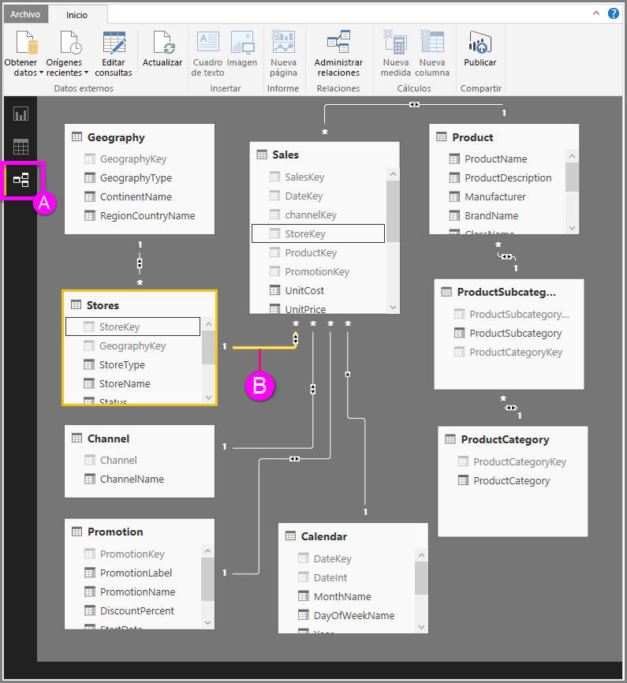

# Vista de relaciones en Power BI Desktop
La **vista de relaciones** muestra todas las tablas, columnas y relaciones en el modelo. Esto puede resultar especialmente útil cuando el modelo tiene relaciones complejas entre muchas tablas.

Echemos un vistazo.

**A.**  Icono de vista de relaciones: haga clic para mostrar el modelo en la vista de relaciones

**B.** Relación: puede situar el cursor sobre una relación para ver las columnas usadas. Haga doble clic en una relación para abrirla en el cuadro de diálogo **Editar relación**. 

En la ilustración anterior, puede ver que la tabla *Stores* tiene una columna *StoreKey* que está relacionada con la tabla *Sales*, que también tiene una columna *StoreKey*. Vemos que se trata de una relación de *varios a uno* (\*:1) y el icono en la parte central de la línea muestra la dirección del filtro cruzado establecido en *Ambos*. La flecha del icono muestra la dirección del flujo de contexto del filtro.

Para obtener más información sobre las relaciones, consulte [Crear y administrar relaciones en Power BI Desktop](desktop-create-and-manage-relationships.md).

