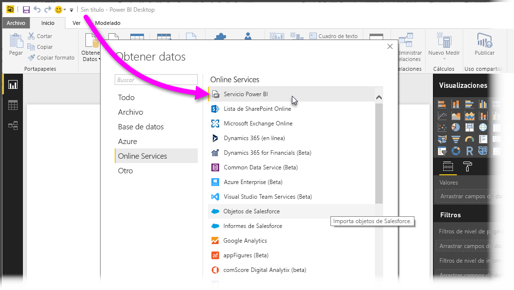
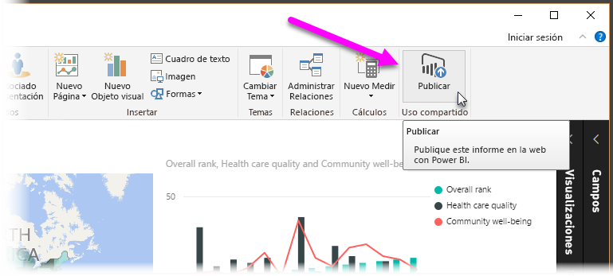
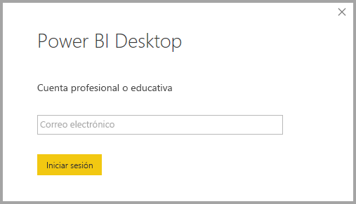
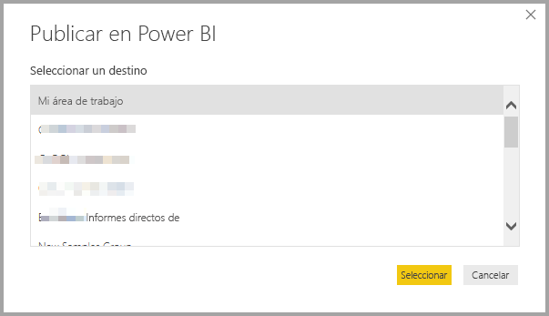
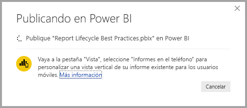
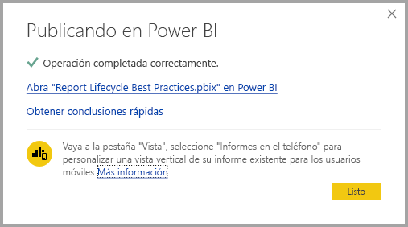
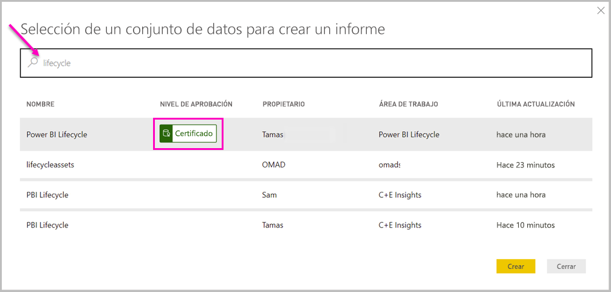
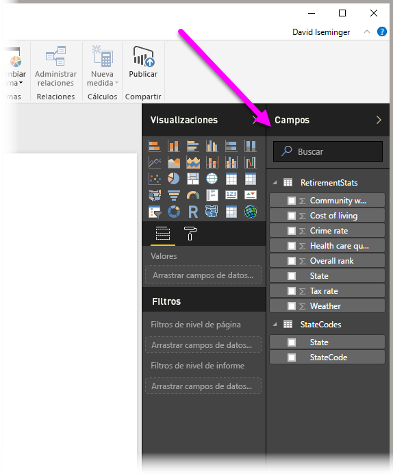

# Conexión a conjuntos de datos del servicio Power BI desde Power BI Desktop

Puede establecer una conexión dinámica a un conjunto de datos compartido en el *servicio Power BI* y crear muchos informes diferentes del mismo conjunto de datos. Puede crear el modelo de datos perfecto en Power BI Desktop y publicarlo en el servicio Power BI. A continuación, usted y otros usuarios pueden crear varios informes diferentes en archivos *.pbix* independientes a partir de ese modelo de datos común y guardarlos en distintas áreas de trabajo. Esta característica se denomina *Conexión dinámica al servicio Power BI*.

Esta característica tiene muchísimas ventajas, como los procedimientos recomendados, que explicaremos a lo largo de este artículo. Le recomendamos revisar las [consideraciones y limitaciones](#limitations-and-considerations) de esta característica.

## Uso de una conexión dinámica al servicio Power BI para administrar el ciclo de vida de los informes

Una de las dificultades que presenta la popularidad de Power BI es la proliferación de informes, paneles y sus modelos de datos subyacentes. Es fácil crear informes atractivos en Power BI Desktop y, luego, [publicarlos](desktop-upload-desktop-files.md) en el servicio Power BI, así como crear paneles excelentes a partir de esos conjuntos de datos. Como muchas personas hacen esto, a menudo usando los mismos (o prácticamente los mismos) conjuntos de datos, saber qué informe está basado en qué conjunto de datos (y qué tan actual podría ser cada conjunto de datos) se podría convertir en todo un reto. La característica Conexión dinámica al servicio Power BI aborda este reto y convierte la creación, el uso compartido, y la ampliación de paneles e informes de conjuntos de datos comunes en unos procesos más sencillos y coherentes.

### Creación de un conjunto de datos para que todos los usuarios puedan usarlo y compartirlo

Supongamos que Ana es analista de negocios de su equipo. Ana tiene experiencia en la creación de buenos modelos de datos, a menudo denominados como conjuntos de datos. Ana puede crear un conjunto de datos y un informe y, a continuación, compartir dicho informe en el servicio Power BI.

A todos les encanta el informe y el conjunto de datos de Ana. Aquí es donde se iniciará el problema. Todos los miembros del equipo de Ana intentarían crear *su propia versión* de ese conjunto de datos y, luego, compartir esos informes con el equipo. De repente, habría una gran cantidad de informes de diferentes conjuntos de datos en el área de trabajo del equipo del servicio Power BI. ¿Cuál era el más reciente? ¿Eran iguales, o casi iguales, los conjuntos de datos? ¿Cuáles eran las diferencias? Con la característica Conexión dinámica al servicio Power BI, todo esto puede cambiar para mejor. En la siguiente sección, veremos cómo otros usuarios pueden usar el conjunto de datos publicado de Ana para sus propios informes en sus propias áreas de trabajo y de cómo permitir que todos puedan emplear el mismo conjunto de datos publicado, coherente e investigado para generar informes únicos.

### Conexión a un conjunto de datos del servicio Power BI mediante una conexión dinámica

Ana crea un informe y crea el conjunto de datos en el que se basa. Lo publica en el servicio Power BI. El informe se muestra en el área de trabajo del equipo en el servicio Power BI. Si Ana lo guarda en una *nueva experiencia de área de trabajo*, puede establecer la opción *Permiso de compilación* para que esté disponible para que todos los usuarios, dentro y fuera de su área de trabajo, lo puedan ver y usar.

Para más información sobre las áreas de trabajo de la nueva experiencia, consulte las [áreas de trabajo](service-new-workspaces.md).

Los demás miembros dentro y fuera del área de trabajo de Ana ahora pueden establecer una conexión dinámica con el modelo de datos compartido de Ana mediante la característica de conexión dinámica al servicio Power BI. Pueden crear sus propios informes únicos, a partir de *su conjunto de datos original*, en *sus propias experiencias de áreas de trabajo*.

En la imagen siguiente, verá cómo Ana crea un informe de Power BI Desktop y lo publica (lo que incluye su modelo de datos) al servicio Power BI. Después, otros usuarios pueden conectarse al modelo de datos de Ana mediante la conexión dinámica al servicio Power BI y crear sus propios informes únicos en sus propias áreas de trabajo, basados en el conjunto de datos de Ana.

> [!NOTE]
> Si guarda el conjunto de datos en un [área de trabajo compartida clásica](service-create-workspaces.md), solo los miembros del área de trabajo pueden crear informes basados en el conjunto de datos. Para establecer una conexión dinámica del servicio Power BI, el conjunto de datos al que se conecta debe estar en un área de trabajo compartida de la que sea miembro.
> 
> 

## Instrucciones paso a paso para usar la conexión dinámica al servicio Power BI

Ahora que sabemos lo útil que es la conexión dinámica al servicio Power BI y cómo puede usarse como enfoque de procedimiento recomendado para administrar el ciclo de vida de los informes, vamos a seguir los pasos que convirtieron un excelente informe y conjunto de datos de Ana en un conjunto de datos compartido que pueden usar los compañeros de equipo de Power BI.

### Publicación de un informe y un conjunto de datos de Power BI

El primer paso para administrar el ciclo de vida de los informes mediante una conexión dinámica al servicio Power BI es tener un informe y un conjunto de datos que los compañeros de equipo quieran utilizar. Por tanto, Ana debe *publicar* primero el informe desde Power BI Desktop. Seleccione **Publicar** en la cinta de opciones **Inicio** de Power BI Desktop.

Si Ana no ha iniciado sesión en la cuenta del servicio Power BI, Power BI le pedirá que lo haga.

Desde esa pantalla, Ana puede elegir el destino del área de trabajo donde se va a publicar el informe y el conjunto de datos. Recuerde que, si Ana lo guarda en un área de trabajo de la nueva experiencia, cualquier persona que tenga permiso de compilación podrá acceder a ese conjunto de datos. El permiso de creación se establece en el servicio Power BI, después de la publicación. Si el trabajo se guarda en un área de trabajo clásica, solo los miembros que tienen acceso al área de trabajo donde se publica un informe pueden acceder a su conjunto de datos mediante una conexión dinámica al servicio Power BI.

Comienza el proceso de publicación y Power BI Desktop muestra el progreso.

Cuando termina, Power BI Desktop indica que se ha realizado correctamente y proporciona un par de vínculos para que pueda acceder al informe mismo en el servicio Power BI, además de un vínculo para obtener información sobre el informe.

Ahora que el informe con su conjunto de datos está en el servicio Power BI, también puede *promocionarlo*. La promoción significa que atestigua su calidad y confiabilidad. Incluso puede solicitar que sea *certificado* por una autoridad central del inquilino de Power BI. Con cualquiera de estas promociones, el conjunto de datos siempre aparece en el tema de la lista cuando los usuarios buscan conjuntos de datos. Para más información, consulte [Promoción del conjunto de datos](service-datasets-promote.md).

El último paso es establecer el permiso de compilación para el conjunto de datos en el que se basa el informe. El permiso de creación determina quién puede ver y usar el conjunto de datos. Se puede establecer en el área de trabajo propiamente dicha o cuando se comparte una aplicación desde el área de trabajo. Para más información, consulte [Permiso de compilación para conjuntos de datos compartidos](service-datasets-build-permissions.md).

A continuación, vamos a ver cómo otros compañeros de equipo que tienen acceso al área de trabajo donde el informe y el conjunto de datos se publicaron pueden conectarse al conjunto de datos y generar sus propios informes.

### Establecimiento de una conexión dinámica al servicio Power BI al conjunto de datos publicado

Para establecer una conexión al informe publicado y crear uno propio basado en el conjunto de datos publicado, seleccione **Obtener datos** en la cinta de opciones **Inicio** de Power BI Desktop, seleccione **Power Platform** en el panel izquierdo y, a continuación, seleccione **Conjuntos de datos de Power BI**.

Si no ha iniciado sesión, Power BI le pedirá que lo haga. Una vez iniciada la sesión, Power BI muestra las áreas de trabajo de las que es miembro. Puede seleccionar qué área de trabajo contiene el conjunto de datos en el que quiere establecer una conexión dinámica al servicio Power BI.

Los conjuntos de datos de la lista son todos los conjuntos de datos compartidos para los que tiene permiso de creación, en cualquier área de trabajo. Puede buscar un conjunto de datos específico y ver su nombre, propietario, el área de trabajo donde reside y cuándo se actualizó por última vez. También puede ver si los conjuntos de datos, ya sean certificados o promocionados, están **aprobados** en la parte superior de la lista.

Al seleccionar **Crear**, establece una conexión dinámica al conjunto de datos seleccionado. Power BI Desktop carga los campos y sus valores que se ven en Power BI Desktop en tiempo real.

Ahora tanto usted como otros usuarios pueden crear y compartir informes personalizados, todo ello desde el mismo conjunto de datos. Este enfoque es una excelente manera para que una persona con conocimientos cree un conjunto de datos con el formato correcto, tal como lo hace Ana. Muchos compañeros de equipo pueden usar ese conjunto de datos compartido para crear sus propios informes.

## Limitaciones y consideraciones

Cuando usa la conexión dinámica al servicio Power BI, hay algunas limitaciones y consideraciones que debe tener en cuenta.

* Solo los usuarios con permiso de creación para un conjunto de datos pueden conectarse a un conjunto de datos publicado mediante la conexión dinámica al servicio Power BI.
* Los usuarios de la versión gratuita solo verán los conjuntos de datos de **Mi área de trabajo** y de las áreas de trabajo basadas en Premium.
* Como esta conexión es una conexión dinámica, se deshabilitan el panel de navegación de la izquierda y el modelado. Solo puede conectarse a un conjunto de datos en cada informe. Este comportamiento es similar al comportamiento al conectarse a *SQL Server Analysis Services*.
* Como esta conexión es una conexión dinámica, se aplica la seguridad de nivel de fila (RLS) y otros comportamientos de conexión de este tipo. Esto es igual que cuando se conecta a SQL Server Analysis Services.
* Si el propietario modifica el archivo original compartido *.pbix*, se sobrescriben el conjunto de datos y el informe que se comparten en el servicio Power BI. Los informes basados en ese conjunto de datos no se sobrescriben, pero los cambios realizados en el conjunto de datos se reflejan en el informe.
* Los miembros de un área de trabajo no pueden reemplazar el informe compartido originalmente. Si intenta hacerlo, recibirá una advertencia que le pide que cambie el nombre del archivo y lo publique.
* Si elimina el conjunto de datos compartido en el servicio Power BI, otros informes basados en él no funcionarán correctamente ni mostrarán sus objetos visuales.
* En lo que respecta a los paquetes de contenido, primero debe crear una copia de un paquete de contenido antes de usarlo como punto de partida para compartir un informe *.pbix* y un conjunto de datos en el servicio Power BI.
* En el caso de los paquetes de contenido de *Mi organización*, una vez copiados, no se podrá reemplazar el informe creado en el servicio ni ningún informe creado como parte de la copia de un paquete de contenido con una conexión dinámica. Si intenta hacerlo, recibirá una advertencia que le pide que cambie el nombre del archivo y lo publique. En esta situación, solo se pueden reemplazar los informes publicados en conexiones dinámicas.
* La eliminación de un conjunto de datos compartido en el servicio Power BI significa que ya nadie puede acceder a ese conjunto de datos desde Power BI Desktop.
* Los informes que comparten un conjunto de archivos en el servicio Power BI no admiten implementaciones automatizadas mediante la API REST de Power BI.
