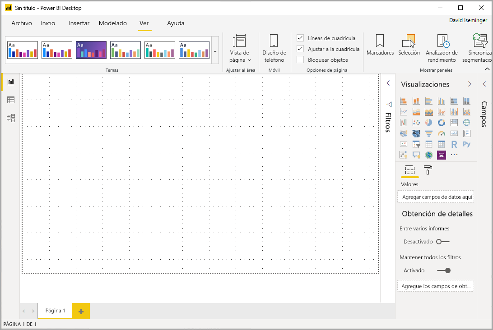
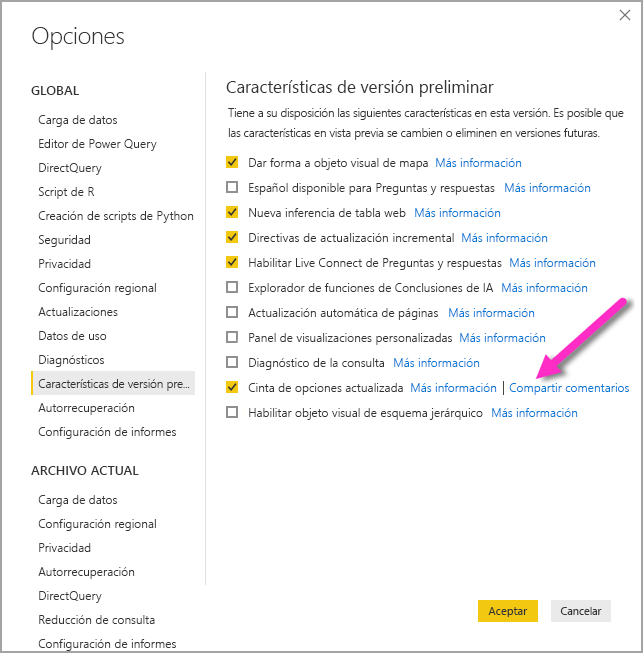
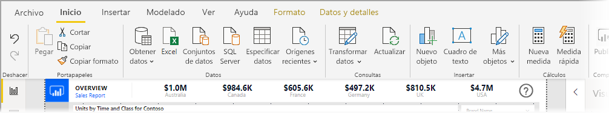
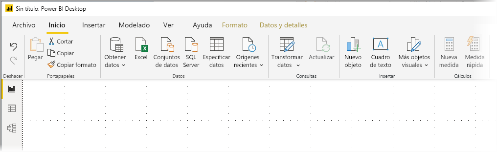
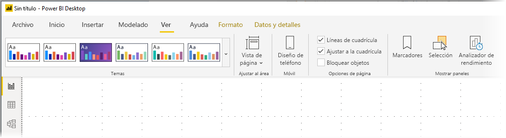
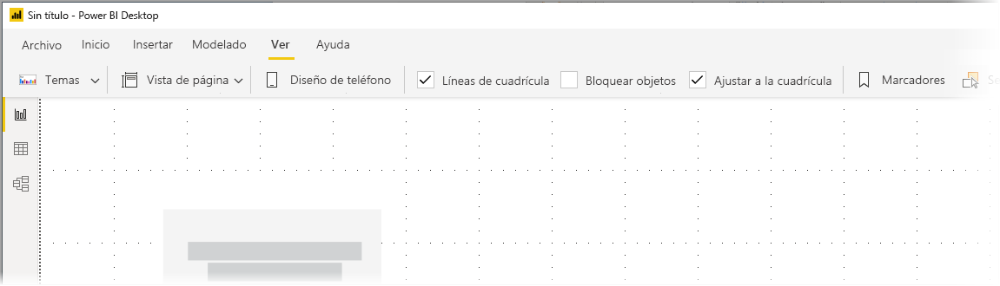

# Uso de la cinta actualizada en Power BI Desktop (versión preliminar)

A partir de la actualización de noviembre de 2019, Power BI Desktop está revisando su cinta de opciones para alinear mejor su apariencia y experiencia con otros productos de Microsoft, como Microsoft Office.

La cinta actualizada está en versión preliminar, por lo que podemos recopilar comentarios de usuarios y clientes y garantizar que la experiencia sea excepcional. Prevemos algunos meses de versión preliminar, comentarios y mejoras antes de que se publique la cinta de Power BI Desktop actualizada para disponibilidad general. 

## Habilitación de la cinta actualizada

La cinta actualizada de Power BI es una característica en vista previa (GB) y se debe habilitar. Para habilitarla, seleccione **Archivo > Opciones y configuración > Opciones** y, luego, **Características en vista previa (GB)** en la columna de la izquierda. En el panel derecho hay una selección de **Cinta de opciones actualizada**. Active la casilla junto a **Cinta de opciones actualizada** para habilitar la característica en vista previa (GB). Para que el cambio de la característica en vista previa (GB) se aplique, debe reiniciar Power BI Desktop.

## Características de la nueva cinta de opciones

Las ventajas de actualizar la cinta de opciones están pensadas para que la experiencia de Power BI Desktop, así como otros productos de Microsoft, resulte fácil y familiar. 

Estas ventajas se pueden agrupar en las categorías siguientes:

* **Mejor apariencia y organización**: los iconos y la funcionalidad de la cinta de opciones actualizada de Power BI Desktop están alineados con la apariencia y la organización de los elementos de la cinta de las aplicaciones de Office.

    

* **Una galería intuitiva de temas**: la galería de temas, que se encuentra en la cinta de opciones **Vista**, tiene la apariencia familiar de la galería de temas de PowerPoint. De ese modo, las imágenes de la cinta de opciones muestran cómo se verá el tema si lo aplica al informe, como las fuentes y las combinaciones de colores. 

    

* **Contenido dinámico de la cinta de opciones según su vista**: en la cinta de opciones existente de Power BI Desktop, los iconos o comandos que no estaban disponibles simplemente aparecían atenuados, creando así una experiencia menos que óptima. Con la cinta de opciones actualizada, los iconos se muestran y organizan dinámicamente, por lo que siempre sabrá cuáles son las opciones disponibles según el contexto.

* **Una cinta de opciones de una sola línea que, cuando se contrae, ahorra espacio**: otra ventaja de la cinta de opciones actualizada es la capacidad de contraerse en una sola línea, mostrando de manera dinámica los elementos de la cinta según el contexto. 

    

Además de esos cambios visibles, una cinta de opciones actualizada también nos permite realizar actualizaciones futuras en Power BI Desktop, y en su cinta de opciones, como se muestra a continuación:

* Crear controles más flexibles e intuitivos en la cinta, como la galería de objetos visuales.
* Agregar los temas *Negro* y *Gris oscuro* de Office a Power BI Desktop.
* Mejorar la accesibilidad.

## Pasos siguientes
Hay todo tipo de datos a los que puede conectarse con Power BI Desktop. Para obtener más información sobre orígenes de datos, consulte los siguientes recursos:

* [¿Qué es Power BI Desktop?](desktop-what-is-desktop.md)
* [Orígenes de datos en Power BI Desktop](desktop-data-sources.md)
* [Combinar datos y darles forma con Power BI Desktop](desktop-shape-and-combine-data.md)
* [Connect to Excel workbooks in Power BI Desktop (Conectarse a libros de Excel en Power BI Desktop)](desktop-connect-excel.md)   
* [Especificar datos directamente en Power BI Desktop](desktop-enter-data-directly-into-desktop.md)   

