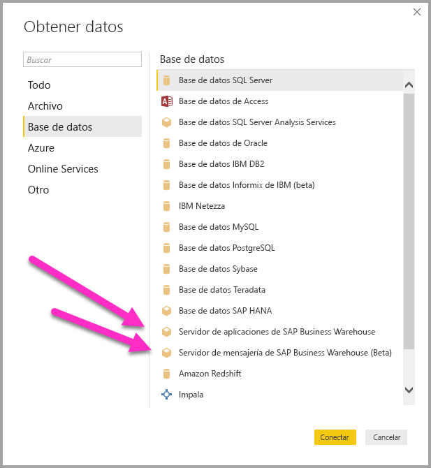
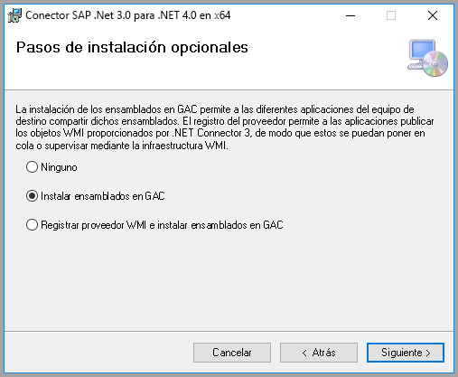
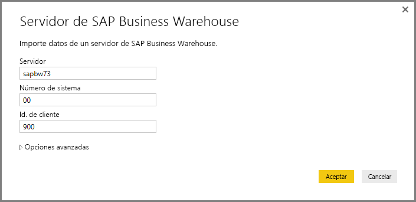
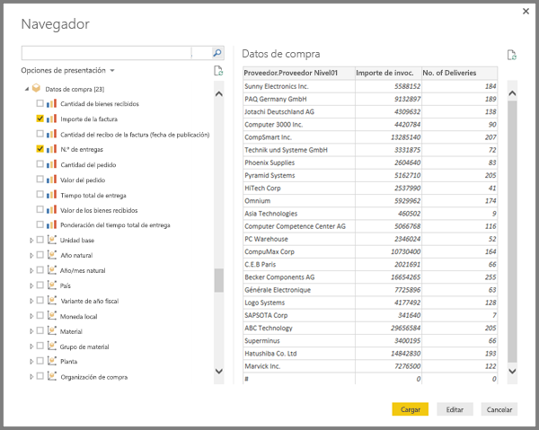
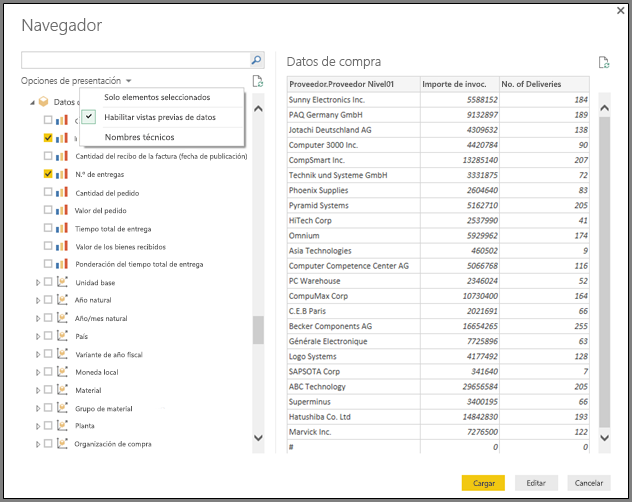
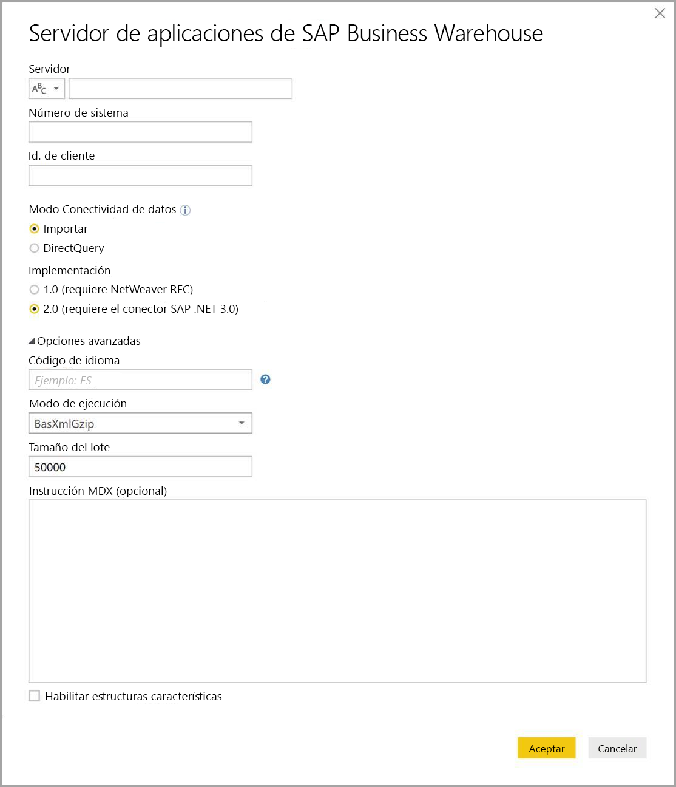
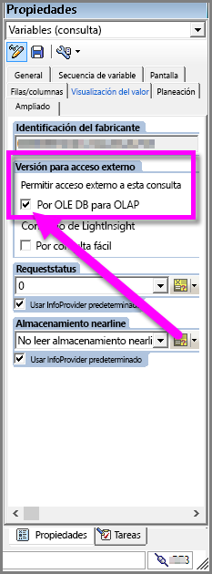

# Uso del conector de SAP BW en Power BI Desktop
Con Power BI Desktop, puede acceder a los datos de **SAP Business Warehouse (BW)**.

Para información sobre cómo los clientes de SAP pueden beneficiarse al conectar Power BI a sus sistemas SAP Business Warehouse (BW) existentes, consulte las [notas del producto de Power BI y SAP BW](https://aka.ms/powerbiandsapbw). Para información detallada sobre el uso de DirectQuery con SAP BW, vea el artículo [DirectQuery y SAP Business Warehouse (BW)](desktop-directquery-sap-bw.md).

A partir de la versión de junio de 2018 de **Power BI Desktop** (y con disponibilidad general con la versión de octubre de 2018), puede usar el conector de SAP BW con una implementación que tiene mejoras significativas en cuanto al rendimiento y las capacidades. Esta versión actualizada del conector de SAP BW fue desarrollada por Microsoft y se llama **Implementation 2.0**. Puede seleccionar la versión 1 (v1) del **conector de SAP BW** o la **implementación 2.0 del conector de SAP**. En las siguientes secciones se describe la instalación de cada versión. Puede elegir uno u otro conector a la hora de conectarse a SAP BW desde Power BI Desktop.

Le recomendamos que use **Implementation 2.0 SAP Connector** siempre que sea posible.

## Instalación de la versión 1 del conector de SAP BW
Se recomienda usar Implementation 2.0 SAP Connector siempre que sea posible (consulte las instrucciones en la siguiente sección). En esta sección se explica cómo instalar la versión 1 del **conector de SAP BW** siguiendo estos pasos:

1. Instale la biblioteca **SAP NetWeaver** en la máquina local. Puede obtener la biblioteca **SAP Netweaver** del administrador de SAP o directamente desde el [Centro de descarga de software de SAP](https://support.sap.com/swdc). Puesto que el **Centro de descarga de software de SAP** cambia su estructura con frecuencia, no hay disponibles instrucciones más específicas para navegar por ese sitio. Normalmente, la biblioteca **SAP Netweaver** se incluye también en la instalación de las herramientas de cliente de SAP.
   
   Puede buscar la *nota de SAP #1025361* para obtener la ubicación de descarga de la versión más reciente. Asegúrese de que la arquitectura de la biblioteca **SAP NetWeaver** (32 o 64 bits) coincida con su instalación de **Power BI Desktop**. Después, instale todos los archivos incluidos en **SAP NetWeaver RFC SDK** según la nota de SAP.
2. El cuadro de diálogo **Obtener datos** incluye una entrada para el **Servidor de aplicaciones de SAP Business Warehouse** y el **Servidor de mensajería de SAP Business Warehouse** en la categoría **Base de datos**.
   
   

## Instalación de Implementation 2.0 SAP Connector

**Implementation 2.0** SAP Connector requiere SAP .NET Connector 3.0. Puede [descargar SAP .NET Connector 3.0](https://support.sap.com/en/product/connectors/msnet.html) en el sitio web de SAP con el siguiente vínculo:

* [SAP .NET Connector 3.0](https://support.sap.com/en/product/connectors/msnet.html)

Para obtener acceso a la descarga se necesita un usuario S válido. Se recomienda que los clientes se pongan en contacto con su equipo de SAP Basis para obtener SAP .NET Connector 3.0. 

El conector se incluye en las versiones de 32 y 64 bits, y los usuarios *deben* elegir la versión que coincida con su instalación de Power BI Desktop. En el momento de redactar este artículo, en el sitio web figuran dos versiones (para .NET 4.0 Framework):

* Conector de SAP para Microsoft .NET 3.0.20.0 para Windows de 32 bits (x86) en un archivo zip (6.896 KB), 16 de enero de 2018
* Conector de SAP para Microsoft .NET 3.0.20.0 para Windows de 64 bits (x64) en un archivo zip (7.180 KB), 16 de enero de 2018

Durante la instalación, en la ventana **Pasos de configuración opcionales**, asegúrese de seleccionar la opción *Install assemblies to GAC* (Instalar ensamblados en GAC), tal y como se muestra en la siguiente imagen.

> [!NOTE]
> La primera versión de la implementación de SAP BW requiere archivos DLL de NetWeaver. Si usa la implementación 2.0 del conector de SAP en vez de la primera versión, los archivos DLL de NetWeaver no son necesarios.

## Características de la versión 1 del conector de SAP BW
La versión 1 del **conector de SAP BW** de Power BI Desktop permite importar datos de los cubos del servidor de **SAP Business Warehouse**, o bien usar DirectQuery. 

Para obtener más información sobre el **conector de SAP BW** y cómo usarlo con DirectQuery, eche un vistazo al artículo [DirectQuery y SAP Business Warehouse (BW)](desktop-directquery-sap-bw.md).

Al establecer la conexión, debe especificar un *servidor*, un *número de sistema* y el *id. de cliente* para establecer la conexión.

También puede especificar otras dos **opciones avanzadas**: código de idioma y una instrucción MDX personalizada para ejecutarla en el servidor especificado.

Si no especificó ninguna instrucción MDX aparecerá la ventana **Navegador**, que le mostrará la lista de los cubos disponibles en el servidor, con la opción para explorar en profundidad y la de seleccionar elementos de los cubos disponibles, incluyendo las dimensiones y las medidas. Power BI muestra las consultas y los cubos que muestran las [BAPI de OLAP de Open Analysis Interface de BW](https://help.sap.com/saphelp_nw70/helpdata/en/d9/ed8c3c59021315e10000000a114084/content.htm).

Al seleccionar uno o varios elementos del servidor, se crea una vista previa de la tabla de salida en función de su selección.

La ventana **Navegador** también proporciona algunas **opciones de presentación** que le permiten hacer lo siguiente:

* **Mostrar *solo los elementos seleccionados* frente a *Todos los elementos* (vista predeterminada):** esta opción es útil para comprobar el conjunto final de los elementos seleccionados. Un enfoque alternativo para ver esto consiste en seleccionar los *nombres de columna* en el área de *vista previa*.
* **Habilitar vistas previas de datos (comportamiento predeterminado):** también puede controlar si se deben mostrar vistas previas de datos en este cuadro de diálogo. Si deshabilita las vistas previas de datos se reducirá la cantidad de llamadas de servidor, puesto que ya no solicita datos para las vistas previas.
* **Nombres técnicos:** SAP BW admite la noción de *nombres técnicos* para objetos dentro de un cubo. Los nombres técnicos permiten al propietario de un cubo mostrar nombres *descriptivos* para los objetos de un cubo, en lugar de mostrar solo los *nombres físicos* para tales objetos.

Después de seleccionar todos los objetos necesarios en el **navegador**, puede decidir qué hacer a continuación seleccionando uno de los siguientes botones en la parte inferior de la ventana del **navegador**:

* Si selecciona **Cargar** comenzará la carga de todo el conjunto de filas de la tabla de salida en el modelo de datos de Power BI Desktop y se le mostrará la vista **Informes**, donde podrá comenzar a visualizar los datos o realizar las modificaciones posteriores mediante las vistas de **datos** o de **relaciones**.
* Si selecciona **Editar** se abrirá el **Editor de consultas**, donde podrá realizar las transformaciones de datos adicionales y los pasos de filtrado antes de poner todo el conjunto de filas en el modelo de datos de Power BI Desktop.

Además de importar datos desde los cubos de **SAP BW**, recuerde que también puede importar datos desde una gran variedad de orígenes en Power BI Desktop y, luego, combinarlos en un único informe. Esto ofrece una amplia gama de escenarios interesantes para los informes y análisis de datos de **SAP BW**.

## Usar Implementation 2.0 del conector de SAP BW

Debe crear una conexión para usar Implementation 2.0 del conector de SAP BW. Siga estos pasos para crear una conexión.

1. En la ventana **Obtener datos**, seleccione **Servidor de aplicaciones de SAP Business Warehouse** o **Servidor de mensajería de SAP Business Warehouse**.

2. Se le mostrará el cuadro de diálogo de nueva conexión, en el que puede seleccionar la implementación. La selección de **Implementation 2.0**, tal y como se muestra en la siguiente imagen, habilita las opciones Modo de ejecución, Tamaño del lote y Habilitar estructuras características.

    

3. Seleccione **Aceptar** para que la experiencia de **Navegador** sea la misma que la que se describe en la sección anterior en relación con la versión 1 del conector de SAP BW. 

### Nuevas opciones de Implementation 2.0 

Implementation 2.0 admite las siguientes opciones:

1. **ExecutionMode**: especifica la interfaz MDX usada para ejecutar consultas en el servidor. Las opciones válidas son las siguientes:

        a. SapBusinessWarehouseExecutionMode.BasXml
        b. SapBusinessWarehouseExecutionMode.BasXmlGzip
        c. SapBusinessWarehouseExecutionMode.DataStream

    El valor predeterminado de esta opción es SapBusinessWarehouseExecutionMode.BasXmlGzip.

    Si se experimenta una latencia elevada en conjuntos de datos de gran tamaño, el uso de *SapBusinessWarehouseExecutionMode.BasXmlGzip* puede mejorar el rendimiento.

2. **BatchSize**: especifica el número máximo de filas que se recuperarán a la vez cuando se ejecute una instrucción MDX. Un número pequeño de filas se traducirá en más llamadas al servidor al recuperar un conjunto de datos grande. Un número elevado de filas puede mejorar el rendimiento, pero podría provocar problemas de memoria en el servidor de SAP BW. El valor predeterminado son 50 000 filas.

3. **EnableStructures**: un valor lógico que indica si se reconocen estructuras de características. El valor predeterminado de esta opción es false. Afecta a la lista de objetos disponibles para la selección. No se admite en el modo de consulta nativa.

La opción **ScaleMeasures** ha quedado en desuso en esta implementación. Ahora, el comportamiento es el mismo que la configuración *ScaleMeasures = false*, que siempre muestra valores sin ajuste de escala.

### Mejoras adicionales en Implementation 2.0 

En la siguiente lista con viñetas se describen algunas de las mejoras adicionales que se incluyen en la nueva implementación:

* Rendimiento mejorado
* Capacidad para recuperar varios millones de filas de datos y ajuste mediante el parámetro de tamaño del lote.
* Capacidad de cambiar los modos de ejecución.
* Compatibilidad con el modo comprimido. Es útil sobre todo en las conexiones de alta latencia o en conjuntos de datos de gran tamaño.
* Detección mejorada de las variables de fecha
* [Experimental] Exposición de las dimensiones Fecha (tipo ABAP DATS) y Hora (tipo ABAP TIMS) como fechas y horas respectivamente, y no como valores de texto.
* Tratamiento de excepciones mejorado. Ahora aparecen errores que se producen en las llamadas BAPI.
* Plegamiento de columnas en los modos BasXml y BasXmlGzip. Por ejemplo, si la consulta MDX generada recupera 40 columnas pero la selección actual solo necesita 10, esta solicitud se pasará al servidor para recuperar un conjunto de datos más pequeño.

### Modificar los informes existentes para usar Implementation 2.0 

La modificación de informes existentes para usar **Implementation 2.0** solo es posible en el modo Importación y, para ello, se deben seguir estos pasos manuales.

1. Abra un informe existente, seleccione **Editar consultas** en la cinta de opciones y, después, seleccione la consulta de SAP Business Warehouse que quiere actualizar.

2. Haga clic con el botón derecho en la consulta y seleccione **Editor avanzado**.

3. En el **Editor avanzado**, cambie la llamada SapBusinessWarehouse.Cubes del siguiente modo: 

    a. Determine si la consulta ya contiene un registro de opciones; por ejemplo, lo que se muestra en el ejemplo siguiente:

    

    b. Si es así, agregue la opción Implementation 2.0 y quite la opción ScaleMeasures (si está presente), tal y como se muestra a continuación:

    

    c. Si la consulta no incluye un registro de opciones, agréguelo. Por ejemplo, si tiene lo siguiente:

    

    d. Modifíquelo por:

    

4. Se ha hecho todo lo posible para que la implementación 2.0 del conector de SAP BW sea compatible con la versión 1 del conector de SAP BW, aunque puede haber algunas diferencias debido a los distintos modos de ejecución MDX de SAP BW. Para resolver cualquier discrepancia, intente cambiar de modo de ejecución.

## Solución de problemas
En esta sección se muestran situaciones de diagnóstico de problemas (y soluciones) para trabajar con el conector de **SAP BW**.

1. Los datos numéricos de **SAP BW** devuelven puntos en lugar de comas. Por ejemplo, 1,000,000 se devuelve como 1.000.000.
   
   **SAP BW** devuelve datos decimales con una *,* (coma) o un *.* (punto) como separador decimal. Para especificar cuál de esas opciones de **SAP BW** se debe usar para el separador decimal, el controlador utilizado por **Power BI Desktop** realiza una llamada a *BAPI_USER_GET_DETAIL*. Esta llamada devuelve una estructura denominada **DEFAULTS**, que tiene un campo denominado *DCPFM* que almacena la *notación de formato decimal*. Puede tomar uno de los tres valores siguientes:
   
       ‘ ‘ (space) = Decimal point is comma: N.NNN,NN
       'X' = Decimal point is period: N,NNN.NN
       'Y' = Decimal point is N NNN NNN,NN
   
   Los clientes que han notificado este problema han detectado que la llamada a *BAPI_USER_GET_DETAIL* genera un error para un usuario determinado (el usuario que muestra los datos incorrectos), con un mensaje de error similar al siguiente:
   
       You are not authorized to display users in group TI:
           <item>
               <TYPE>E</TYPE>
               <ID>01</ID>
               <NUMBER>512</NUMBER>
               <MESSAGE>You are not authorized to display users in group TI</MESSAGE>
               <LOG_NO/>
               <LOG_MSG_NO>000000</LOG_MSG_NO>
               <MESSAGE_V1>TI</MESSAGE_V1>
               <MESSAGE_V2/>
               <MESSAGE_V3/>
               <MESSAGE_V4/>
               <PARAMETER/>
               <ROW>0</ROW>
               <FIELD>BNAME</FIELD>
               <SYSTEM>CLNTPW1400</SYSTEM>
           </item>
   
   Para solucionar este error, los usuarios deben solicitar a su administrador de SAP que conceda al usuario de SAPBW que se usa en Power BI el derecho para ejecutar *BAPI_USER_GET_DETAIL*. También es necesario comprobar que el usuario tiene los valores *DCPFM* necesarios, tal como se ha descrito anteriormente en esta sección de solución de problemas.
   
2. **Conectividad para consultas de SAP BEx**
   
   Puede realizar consultas de **BEx** en Power BI Desktop. Para ello, habilite una propiedad específica, tal y como se muestra en la siguiente imagen:
   
   
   
3. En la ventana **Navegador** no se muestra una vista previa de los datos, proporcionándose en su lugar un mensaje de error *Referencia de objeto no definida a una instancia de un objeto*.
   
   Los usuarios de SAP necesitan acceso a módulos de la función BAPI para obtener metadatos y recuperar datos de InfoProviders de SAP BW. Estas incluyen:
   * BAPI_MDPROVIDER_GET_CATALOGS
   * BAPI_MDPROVIDER_GET_CUBES
   * BAPI_MDPROVIDER_GET_DIMENSIONS
   * BAPI_MDPROVIDER_GET_HIERARCHYS
   * BAPI_MDPROVIDER_GET_LEVELS
   * BAPI_MDPROVIDER_GET_MEASURES
   * BAPI_MDPROVIDER_GET_MEMBERS
   * BAPI_MDPROVIDER_GET_VARIABLES
   * BAPI_IOBJ_GETDETAIL

   Para solucionar este problema, compruebe que el usuario tiene acceso a los diversos módulos *MDPROVIDER*, además de a *BAPI_IOBJ_GETDETAIL*. Para ofrecer más soluciones a este problema, o bien a problemas similares, seleccione *Habilitar seguimiento* en la ventana *Diagnósticos* ubicada en *Opciones* de Power BI Desktop. Intente recuperar datos de SAP BW mientras el seguimiento está activo y examine el archivo de seguimiento para obtener más detalles.

## Compatibilidad con conexiones de SAP BW

En la tabla siguiente se detalla la compatibilidad actual para SAP BW.

|Product  |Modo  |Autenticación  |Conector  |Biblioteca de SNC  |Admitido  |
|---------|---------|---------|---------|---------|---------|
|Power BI Desktop     |Cualquiera         | Usuario / contraseña  | Servidor de aplicaciones | N/D  | Sí  |
|Power BI Desktop     |Cualquiera         | Windows          | Servidor de aplicaciones | sapcrypto + gsskrb5/gx64krb5  | Sí  |
|Power BI Desktop     |Cualquiera         | Windows a través de la suplantación | Servidor de aplicaciones | sapcrypto + gsskrb5/gx64krb5  | Sí  |
|Power BI Desktop     |Cualquiera         | Usuario / contraseña        | Servidor de mensajería | N/D  | Sí  |
|Power BI Desktop     |Cualquiera         | Windows        | Servidor de mensajería | sapcrypto + gsskrb5/gx64krb5  | Sí  |
|Power BI Desktop     |Cualquiera         | Windows a través de la suplantación | Servidor de mensajería | sapcrypto + gsskrb5/gx64krb5  | Sí  |
|Power BI Gateway     |Importar      | Igual que Power BI Desktop |         |   |   |
|Power BI Gateway     |DirectQuery | Usuario / contraseña        | Servidor de aplicaciones | N/D  | Sí  |
|Power BI Gateway     |DirectQuery | Windows a través de la suplantación (usuario fijo, sin SSO) | Servidor de aplicaciones | sapcrypto + gsskrb5/gx64krb5  | Sí  |
|Power BI Gateway     |DirectQuery | Uso de SSO mediante Kerberos para la opción consultas de DirectQuery | Servidor de aplicaciones | *Solo con* gsskrb5/gx64krb5   | Sí  |
|Power BI Gateway     |DirectQuery | Usuario / contraseña        | Servidor de mensajería | N/D  | Sí  |
|Power BI Gateway     |DirectQuery | Windows a través de la suplantación (usuario fijo, sin SSO) | Servidor de mensajería | sapcrypto + gsskrb5/gx64krb5  | Sí  |
|Power BI Gateway     |DirectQuery | Uso de SSO mediante Kerberos para la opción consultas de DirectQuery | Servidor de mensajería | sapcrypto + gsskrb5/gx64krb5  | No  |

## Pasos siguientes
Para obtener más información sobre SAP y DirectQuery, revise los siguientes recursos:

* [DirectQuery y SAP HANA](desktop-directquery-sap-hana.md)
* [DirectQuery y SAP Business Warehouse (BW)](desktop-directquery-sap-bw.md)
* [DirectQuery en Power BI](desktop-directquery-about.md)
* [Orígenes de datos compatibles con DirectQuery](desktop-directquery-data-sources.md)
* [Notas del producto de Power BI y SAP BW](https://aka.ms/powerbiandsapbw)
