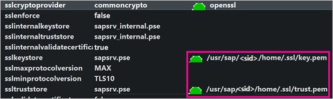
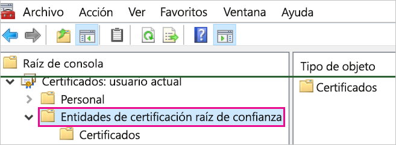
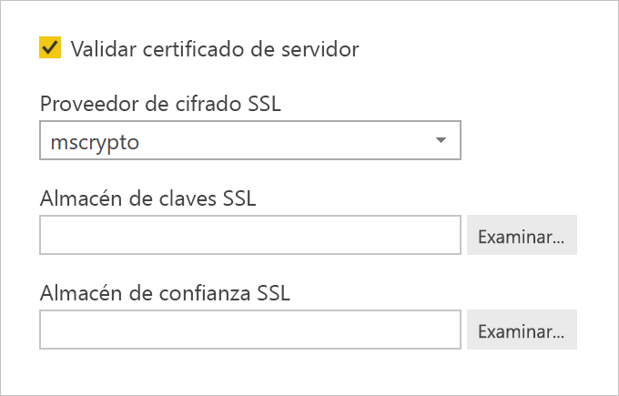
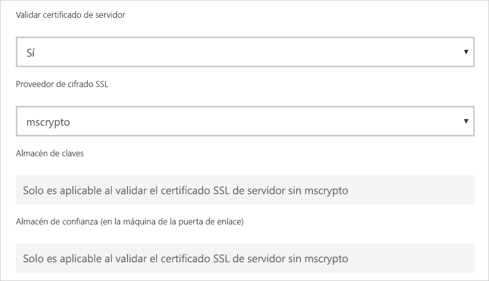

# <a name="enable-encryption-for-sap-hana"></a>Habilitación del cifrado para SAP HANA

Al establecer una conexión con un servidor de SAP HANA desde Power BI Desktop y el servicio Power BI, se recomienda cifrarla. Puede habilitar el cifrado de HANA mediante la biblioteca CommonCryptoLib (anteriormente conocida como sapcrypto) de OpenSSL y SAP. SAP recomienda el uso de CommonCryptoLib, pero las características de cifrado básicas están disponibles con cualquiera de las bibliotecas.

En este artículo se ofrece información general sobre cómo habilitar el cifrado con OpenSSL y se hace referencia a ciertas áreas de la documentación de SAP. Actualizamos el contenido y los vínculos periódicamente, pero, para obtener instrucciones completas y soporte técnico, consulte siempre la documentación oficial de SAP. Si quiere configurar el cifrado con CommonCryptoLib en lugar de OpenSSL, consulte la entrada de blog sobre la [configuración de TLS/SSL en SAP HANA 2.0](https://blogs.sap.com/2018/11/13/how-to-configure-tlsssl-in-sap-hana-2.0/). Para conocer los pasos sobre cómo migrar de OpenSSL a CommonCryptoLib, consulte la [nota 2093286 de SAP ](https://launchpad.support.sap.com/#/notes/2093286) (se requiere s-user).

> [!NOTE]
> Los pasos de configuración del cifrado descritos en este artículo coinciden con los de instalación y configuración del inicio de sesión único de SAML. Independientemente de si elige OpenSSL o CommonCryptoLib como proveedor de cifrado del servidor de HANA, asegúrese de que su elección sea coherente en las configuraciones de cifrado y SAML.

Hay cuatro fases para habilitar el cifrado de SAP HANA con OpenSSL. Abordaremos dichas fases a continuación.  Para obtener más información, consulte la entrada de blog sobre la [protección de la comunicación entre SAP HANA Studio y SAP HANA Server a través de SSL](https://blogs.sap.com/2015/09/28/securing-the-communication-between-sap-hana-studio-and-sap-hana-server-through-ssl/).

## <a name="use-openssl"></a>Uso de OpenSSL

Asegúrese de que el servidor de HANA esté configurado para usar OpenSSL como proveedor de servicios criptográficos. Reemplace la información de la ruta de acceso que falta a continuación por el identificador de servidor (SID) del servidor de HANA.



## <a name="create-a-certificate-signing-request"></a>Creación de una solicitud de firma de certificado

Cree una solicitud de firma de certificado X509 para el servidor de HANA.

1. Con SSH, conéctese a la máquina Linux en la que se ejecute el servidor de HANA como \<sid\>adm.

1. Vaya al directorio particular _/__usr/sap/\<sid\>/home_.

1. Cree un directorio oculto con el nombre _.__ssl_, si todavía no existe ninguno.

1. Ejecute el siguiente comando:

    ```
    openssl req -newkey rsa:2048 -days 365 -sha256 -keyout Server\_Key.pem -out Server\_Req.pem -nodes
    ```

Este comando crea una solicitud de firma de certificado y una clave privada. Una vez firmado, el certificado es válido durante un año (vea el parámetro -days). Cuando se le pida el nombre común (CN), escriba el nombre de dominio completo (FQDN) del equipo en el que esté instalado el servidor de HANA.

## <a name="get-the-certificate-signed"></a>Obtención del certificado firmado

Obtenga el certificado firmado por una entidad de certificación (CA) que sea de confianza para los clientes que se usarán para conectarse al servidor de HANA.

1. Si ya tiene una CA de empresa de confianza (representada por CA\_Cert.pem y CA\_Key.pem en el ejemplo siguiente), firme la solicitud de certificado ejecutando el comando siguiente:

    ```
    openssl x509 -req -days 365 -in Server\_Req.pem -sha256 -extfile /etc/ssl/openssl.cnf -extensions usr\_cert -CA CA\_Cert.pem -CAkey CA\_Key.pem -CAcreateserial -out Server\_Cert.pem
    ```

    Si aún no tiene una CA que pueda usar, puede crear una entidad de certificación raíz siguiendo los pasos descritos en la entrada de blog sobre la [protección de la comunicación entre SAP HANA Studio y SAP HANA Server a través de SSL](https://blogs.sap.com/2015/09/28/securing-the-communication-between-sap-hana-studio-and-sap-hana-server-through-ssl/).

1. Cree la cadena de certificados del servidor de HANA combinando el certificado del servidor, la clave y el certificado de la entidad de certificación (el nombre key.pem es la convención para SAP HANA):

    ```
    cat Server\_Cert.pem Server\_Key.pem CA\_Cert.pem \> key.pem
    ```

1. Cree una copia de CA\_Cert.pem denominada trust.pem (el nombre trust.pem es la convención para SAP HANA):

    ```
    cp CA\_Cert.pem trust.pem
    ```

1. Reinicie el servidor de HANA.

1. Compruebe la relación de confianza entre un cliente y la CA que ha usado para firmar el certificado del servidor de SAP HANA.

    El cliente debe confiar en la CA utilizada para firmar el certificado X509 del servidor de HANA, de modo que se pueda establecer una conexión cifrada con el servidor de HANA desde el equipo del cliente.

    Hay varias maneras de garantizar que esta relación de confianza exista mediante Microsoft Management Console (MMC) o la línea de comandos. Puede importar el certificado X509 de la CA (trust.pem) en la carpeta de **entidades de certificación raíz de confianza** del usuario que establecerá la conexión o, si lo prefiere, en la misma carpeta de la propia máquina cliente.

    

    Para poder importar el certificado en la carpeta de entidades de certificación raíz de confianza, debe convertir trust.pem en un archivo .crt, por ejemplo, mediante la ejecución del siguiente comando de OpenSSL:

    ```
    openssl x509 -outform der -in your-cert.pem -out your-cert.crt
    ```
    
    Para obtener información sobre el uso de OpenSSL para la conversión, consulte la [documentación de OpenSSL](https://www.openssl.org/docs/manmaster/man1/x509.html).

## <a name="test-the-connection"></a>Prueba de la conexión

Pruebe la conexión en Power BI Desktop o en el servicio Power BI.

1. En Power BI Desktop o en la página **Administrar puertas de enlace** del servicio Power BI, asegúrese de que **Validar certificado de servidor** esté habilitado al intentar establecer una conexión con el servidor de SAP HANA. En **Proveedor de cifrado SSL**, seleccione mscrypto si ha seguido los pasos de instalación de OpenSSL, o bien commoncrypto si ha configurado dicha biblioteca como proveedor de cifrado. Deje en blanco los campos Almacén de claves SSL y Almacén de confianza SSL.

    - Power BI Desktop

        

    - Servicio Power BI

        

1. Compruebe que pueda establecer correctamente una conexión cifrada con el servidor con la opción **Validar certificado de servidor** habilitada; para ello, cargue los datos en Power BI Desktop o actualice un informe publicado en el servicio Power BI.
