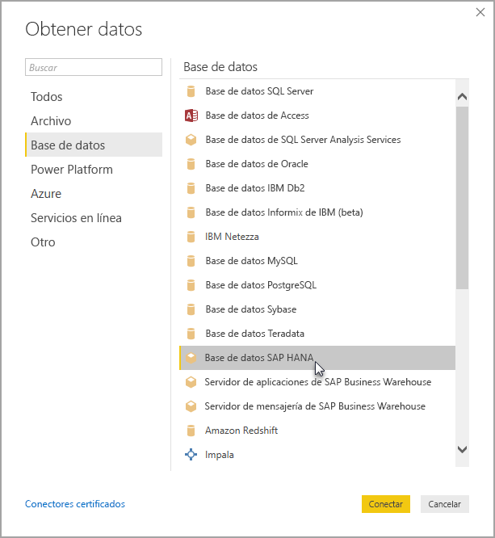

# Usar SAP HANA en Power BI Desktop
Con Power BI Desktop, ahora puede acceder a las bases de datos de **SAP HANA** . Para usar **SAP HANA**, el controlador ODBC de SAP HANA debe instalarse en el equipo cliente local para que la conexión de datos **SAP HANA** de Power BI Desktop funcione correctamente. Puede descargar el controlador ODBC de SAP HANA desde el [Centro de descarga de software de SAP](https://support.sap.com/swdc). Desde allí, busque el CLIENTE de SAP HANA para equipos Windows. Puesto que el **Centro de descarga de software de SAP** cambia su estructura con frecuencia, no hay disponibles instrucciones más específicas para navegar por ese sitio.

Para conectarse a una base de datos **SAP HANA**, seleccione **Obtener datos > Base de datos > Base de datos SAP HANA** tal como se muestra en esta imagen:

Al conectarse a una base de datos SAP HANA, especifique el nombre del servidor y el puerto con el formato *servidor:puerto*. En la imagen siguiente se muestra un ejemplo en un servidor denominado *ServerXYZ* y el puerto *30015*.

En esta versión, la opción **SAP HANA** del modo [DirectQuery](desktop-directquery-sap-hana.md) solo se admite en Power BI Desktop y en el servicio Power BI, mientras que los informes que usen **SAP HANA** en el modo DirectQuery se pueden publicar y cargar en el servicio Power BI. También puede publicar y cargar informes en el servicio Power BI si no usa **SAP HANA** en el modo DirectQuery.

## Características compatibles con SAP HANA
Esta versión tiene muchas funcionalidades para **SAP HANA**, tal como se muestra en la lista siguiente:

* El conector de Power BI para **SAP HANA** usa el controlador ODBC de SAP para proporcionar la mejor experiencia de uso
* **SAP HANA** es compatible con las opciones Importación y DirectQuery
* Power BI admite modelos de información de HANA (como vistas analíticas y de cálculo) y ha optimizado la navegación
* Con **SAP HANA** también puede usar la característica SQL directo para conectarse a las tablas de filas y columnas
* Incluye la navegación optimizada para modelos HANA
* Power BI es compatible con las variables y los parámetros de entrada **SAP HANA**

## Limitaciones de SAP HANA
También existen algunas limitaciones en el uso de **SAP HANA**, como se muestra a continuación:

* Las cadenas NVARCHAR se truncan a la longitud máxima de 4000 caracteres Unicode
* No se admite SMALLDECIMAL
* No se admite VARBINARY
* Las fechas válidas se sitúan entre 12/30/1899 y 31/12/9999

## Pasos siguientes
Para más información acerca de DirectQuery, revise los siguientes recursos:

* [DirectQuery y SAP HANA](desktop-directquery-sap-hana.md)
* [DirectQuery en Power BI](desktop-directquery-about.md)
* [Orígenes de datos compatibles con DirectQuery](desktop-directquery-data-sources.md)

