# Usar Ver datos y Ver registros en Power BI Desktop
En **Power BI Desktop**, puede profundizar en los detalles de una visualización y ver representaciones textuales de los datos subyacentes o de los registros de datos individuales del objeto visual seleccionado. Estas características se conocen a veces como *click-through*, o *drill-through* u *obtención de detalles*.

Puede usar **Ver datos** para ver una versión textual de los valores usados por la visualización seleccionada, o usar **Ver registros** para ver todos los datos de un registro o punto de datos seleccionado. 

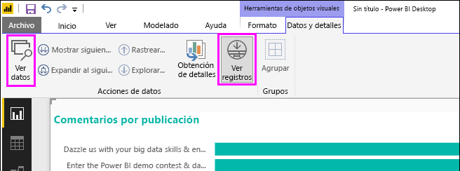

>[!IMPORTANT]
>**Ver datos** y **Ver registros** admiten solo los siguientes tipos de visualización:
>  - Gráfico de barras
>  - Gráfico de columnas
>  - Gráfico de anillos
>  - Mapa coroplético
>  - Embudo
>  - Mapa
>  - Gráfico circular
>  - Gráfico de rectángulos

## Uso de Ver datos en Power BI Desktop

**Ver datos** muestra los datos que subyacen a una visualización. **Ver datos** aparece en la pestaña **Datos y rastreo** en la sección **Visual Tools** de la cinta al seleccionarse una visualización.

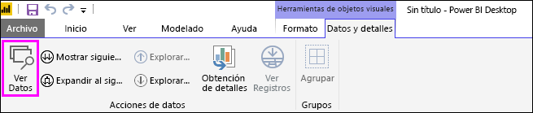

También puede ver los datos haciendo clic con el botón derecho en una visualización y, a continuación, seleccionando **Mostrar datos** en el menú que aparece, o bien seleccionando los puntos suspensivos (...) **Más opciones** en la esquina superior derecha de una visualización y, después, seleccionando **Mostrar datos**.

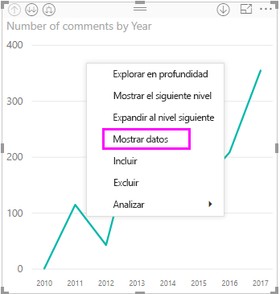&nbsp;&nbsp;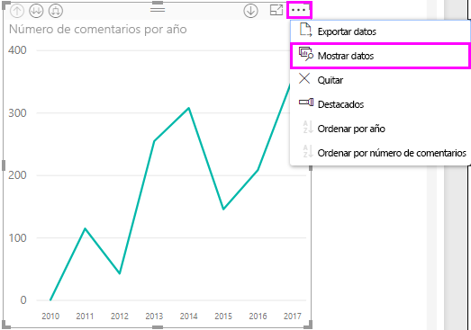

> [!NOTE]
> Debe mantener el puntero sobre un punto de datos del objeto visual para que el menú contextual esté disponible.

Al seleccionar **Ver datos** o **Mostrar datos**, el lienzo de Power BI Desktop muestra tanto la representación visual como la representación textual de los datos. En la *vista horizontal*, el objeto visual se muestra en la mitad superior del lienzo, mientras que los datos aparecen en la mitad inferior. 

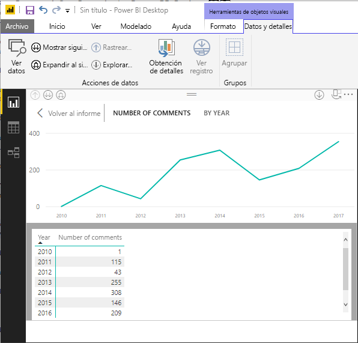

Puede alternar entre la vista horizontal y una *vista vertical* si selecciona el icono en la esquina superior derecha del lienzo.

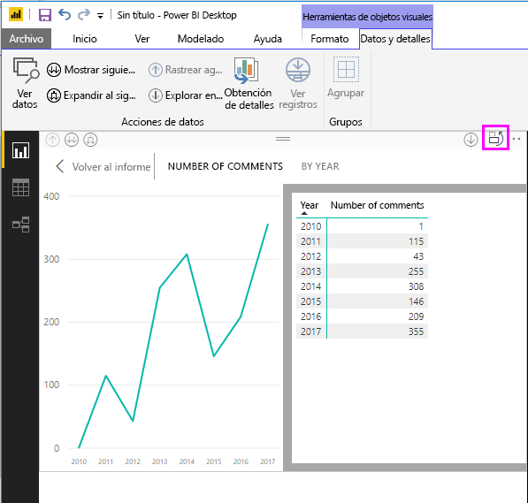

Para volver al informe, seleccione **< Volver al informe** en la esquina superior izquierda del lienzo.

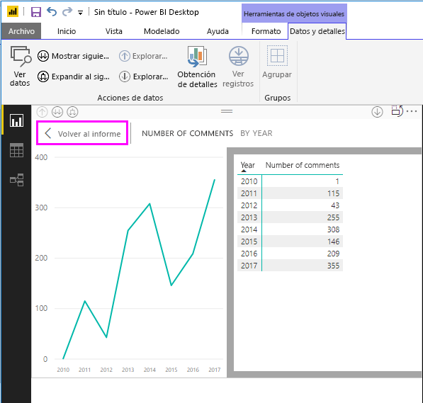

## Uso de Ver registros en Power BI Desktop

También puede centrarse en un registro de datos de una visualización y profundizar en los datos que contiene. Para usar **Ver registros**, seleccione una visualización y, a continuación, **Ver registros** en la pestaña **Datos y detalles** en la sección **Herramientas visuales** de la cinta. Después, seleccione una fila o punto de datos en la visualización. 

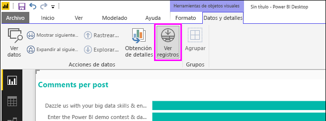

> [!NOTE]
> Si el botón **Ver registros** de la cinta está deshabilitado y en gris, significa que la visualización seleccionada no admite **Ver registros**.

También puede hacer clic con el botón derecho en un elemento de datos y seleccionar **Ver registros** en el menú que aparece.

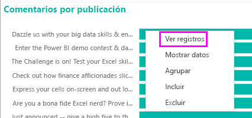

Al seleccionar **Ver registros** para un elemento de datos, el lienzo de Power BI Desktop muestra todos los datos asociados al elemento seleccionado. 

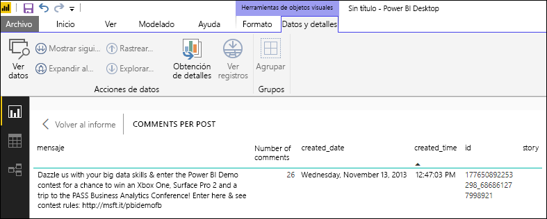

Para volver al informe, seleccione **< Volver al informe** en la esquina superior izquierda del lienzo.

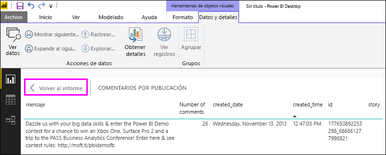

> [!NOTE]
>**Ver registros** tiene las siguientes limitaciones:
> - No puede cambiar los datos en la vista **Ver registros** y guardarlos de nuevo en el informe.
> - No se puede usar **Ver registros** cuando el objeto visual utiliza una medida calculada.
> - No se puede usar **Ver registros** al conectarse a un modelo multidimensional (MD) activo.

## Pasos siguientes
**Power BI Desktop** incluye todo tipo de características de administración de datos y formato de informes. Para ver algunos ejemplos, consulte los siguientes recursos:

* [Usar la agrupación y la discretización en Power BI Desktop](desktop-grouping-and-binning.md)
* [Usar líneas de cuadrícula, ajustar a la cuadrícula, orden Z, alineación y distribución en los informes de Power BI Desktop](desktop-gridlines-snap-to-grid.md)

