# <a name="tutorial-shape-and-combine-data-in-power-bi-desktop"></a>Tutorial: Combinar datos y darles forma en Power BI Desktop

Con Power BI Desktop, puede conectarse a muchos tipos de orígenes de datos distintos y dar forma a la información para que se ajuste a sus necesidades. De este modo, podrá crear informes visuales y compartirlos con otras personas. *Dar forma a los datos* significa transformar los datos: cambiar el nombre de las columnas o las tablas, convertir texto en números, quitar filas, configurar la primera fila como encabezado, etc. *Combinar* datos significa conectarse a dos o más orígenes de datos, darles la forma necesaria y consolidarlos después en una consulta útil.

En este tutorial, aprenderá a:

* Dar forma a los datos con el Editor de consultas.
* Conectarse a diferentes orígenes de datos.
* Combinar esos orígenes de datos y crear un modelo de datos para usarlo en los informes.

En este tutorial, se explica cómo se forma una consulta utilizando Power BI Desktop y se detallan algunas de las tareas más comunes. La consulta que se usa aquí se describe con más detalle, incluido el procedimiento para crear la consulta desde cero, en [Introducción a Power BI Desktop](desktop-getting-started.md).

El editor de consultas de Power BI Desktop hace un amplio uso de los menús contextuales, así como de la cinta de opciones **Transformar**. La mayor parte de los elementos que se pueden seleccionar en la cinta también están disponibles en el menú contextual que aparece al hacer clic con el botón derecho en un elemento (por ejemplo, en una columna).

## <a name="shape-data"></a>Dar forma a los datos
Cuando dé forma a los datos en el editor de consultas, tiene que proporcionar instrucciones paso a paso para que el editor de consultas pueda ajustar los datos por usted a medida que se cargan y se presentan. El origen de datos del que procede la información no se verá afectado. Los únicos datos a los que se va a *dar forma* o que se van a ajustar son los de esta vista concreta.

El editor de consulta registra los pasos especificados (por ejemplo, cambiar el nombre de una tabla, transformar un tipo de datos o eliminar una columna). Cada vez que esta consulta se conecte al origen de datos, el editor de consultas llevará a cabo esos pasos para que los datos siempre tengan la forma indicada. Este proceso tendrá lugar siempre que utilice el editor de consultas o que otra persona utilice su consulta compartida; por ejemplo, en el servicio Power BI. Estos pasos se capturan, de manera secuencial, en la sección **Pasos aplicados** del panel **Configuración de consulta**. Explicaremos cada uno de estos pasos en los párrafos siguientes.

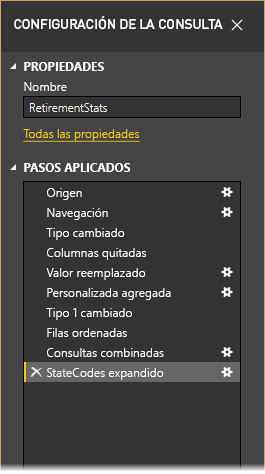

En [Introducción a Power BI Desktop](desktop-getting-started.md), vamos a utilizar datos sobre la jubilación y a darles forma con arreglo a nuestras necesidades. Estos datos los obtendremos de un origen de datos web al que vamos a conectarnos. Vamos a agregar una columna personalizada para calcular la clasificación en función de todos los datos que son factores iguales y la compararemos con la columna **Clasificación** existente.  

1. En la cinta **Agregar columna**, seleccione **Columna personalizada**, lo que le permitirá agregar una columna personalizada.

    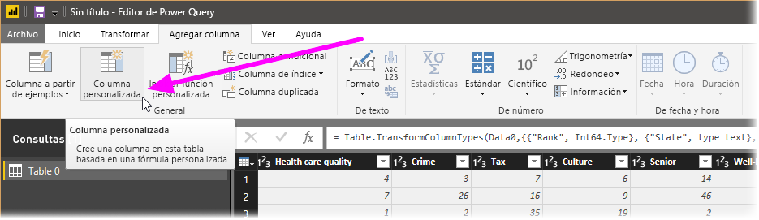

1. En la ventana **Columna personalizada**, en **Nuevo nombre de columna**, escriba _Nueva clasificación_. En **Fórmula de columna personalizada**, especifique lo siguiente:

    ```
    ([Cost of living] + [Weather] + [Health care quality] + [Crime] + [Tax] + [Culture] + [Senior] + [#"Well-being"]) / 8
    ```
 
1. Compruebe que el mensaje de estado es *No se han detectado errores de sintaxis* y seleccione **Aceptar**.

    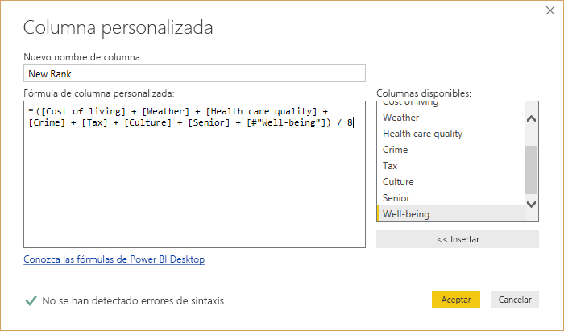

1. Para mantener la coherencia de los datos de la columna, vamos a transformar los nuevos valores de columna en números enteros. Para ello, solo tiene que hacer clic con el botón derecho en el encabezado de columna y seleccionar **Cambiar tipo \> Número entero**. 

    Si necesita seleccionar varias columnas, seleccione una columna, mantenga presionada la tecla **MAYÚS**, seleccione otras columnas adyacentes y haga clic con el botón derecho en el encabezado de una columna. También puede usar la tecla **CTRL** para elegir las columnas no adyacentes.

    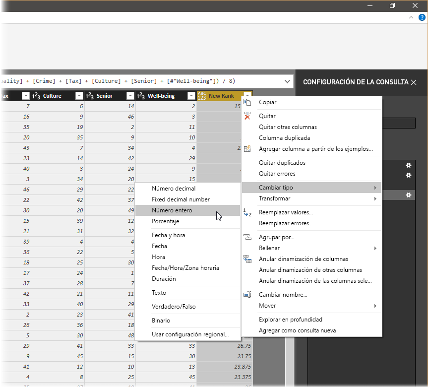

1. Para *transformar* el tipo de datos de una columna en otro, seleccione **Tipo de datos: Texto** en la cinta **Transformar**. 

   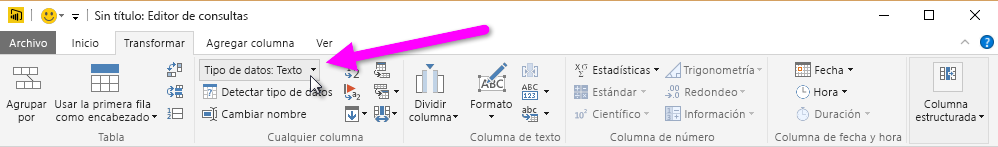

1. Tenga en cuenta que en **Configuración de la consulta**, la lista de **Pasos aplicados** contiene todos los pasos que se han aplicado para dar forma a los datos. Para quitar un paso del proceso, seleccione la **X** situada a la izquierda del paso correspondiente. 

    En la siguiente imagen, la lista de **Pasos aplicados** contiene los pasos que se han agregado hasta el momento: 
     - **Origen**: conexión con el sitio web.
     - **Navegación**: selección de la tabla. 
     - **Tipo cambiado**: modificación de columnas numéricas basadas en texto de *texto* a *número entero*. 
     - **Personalizada agregada**: incorporación de una columna personalizada.
     - **Tipo cambiado1**: último paso aplicado.

       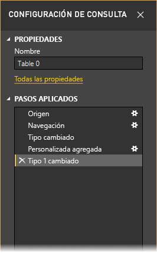

## <a name="adjust-data"></a>Ajuste de los datos

Antes de poder trabajar con esta consulta, debemos realizar algunos cambios para ajustar los datos:

   - Ajustar las clasificaciones quitando una columna.

       Hemos decidido que **Costo de la vida** no es un factor importante para nuestros resultados. Después de quitar la columna, descubrimos que los datos permanecen como estaban. 

   - Corregir algunos errores.

       Al quitar una columna, es necesario reajustar los cálculos de la columna **Nueva clasificación**, lo que implica que debemos cambiar una fórmula.

   - Ordenar los datos.

       Ordene los datos con arreglo a las columnas **Nueva clasificación** y **clasificación**.
 
   - Reemplazar los datos.

       Es importante detallar cómo se van a reemplazar determinados valores y la necesidad de insertar un **paso aplicado**.

   - Cambiar el nombre de la tabla. 

       Como **Tabla 0** no resulta una descripción útil para la tabla, cambiaremos su nombre.

1. Para quitar la columna **Costo de la vida**, seleccione la columna, elija la pestaña **Inicio** de la cinta y haga clic en **Quitar columnas**.

    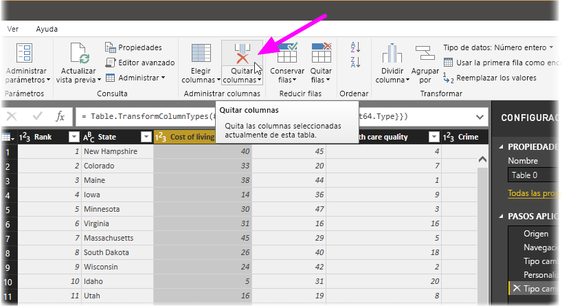

   Observe que los valores de **Nueva clasificación** no han cambiado, lo que se debe al orden de los pasos. Como el editor de consultas registra los pasos en orden, aunque de modo independiente, puede subir o bajar cada **paso aplicado** en la jerarquía. 

1. Haga clic con el botón derecho en un paso. El editor de consultas dispone de un menú que le permite realizar las tareas siguientes: 
   - **Cambiar nombre**: permite cambiar el nombre del paso.
   - **Eliminar**: permite eliminar el paso.
   - **Eliminar** **hasta el final**: permite quitar el paso actual y todos los pasos siguientes.
   - **Subir**: permite subir el paso en la lista.
   - **Bajar**: permite bajar el paso en la lista.

1. Suba el último paso, **Columnas quitadas**, y colóquelo justo encima del paso **Personalizada agregada**.

   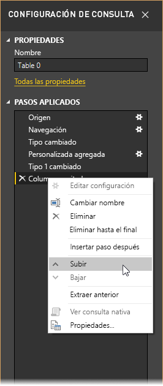

1. Seleccione el paso **Personalizada agregada**. 

   Tenga en cuenta que ahora aparece _Error_ en los datos, por lo que deberemos solucionarlo.

   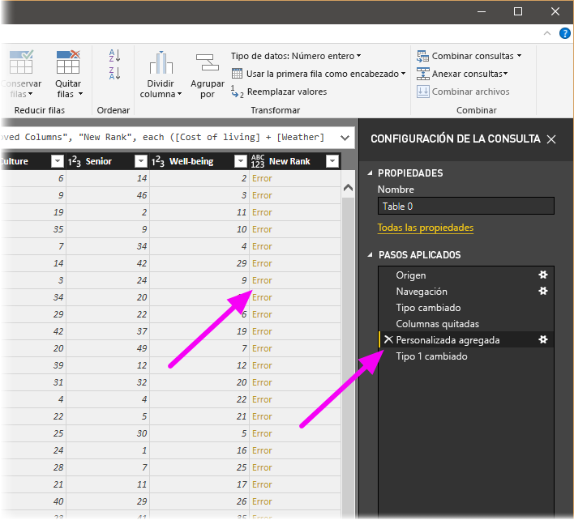

   Hay algunas maneras de obtener más información sobre cada error. Si selecciona la celda sin hacer clic en la palabra *Error*, podrá ver la información del error en la parte inferior de la ventana del editor de consultas.

   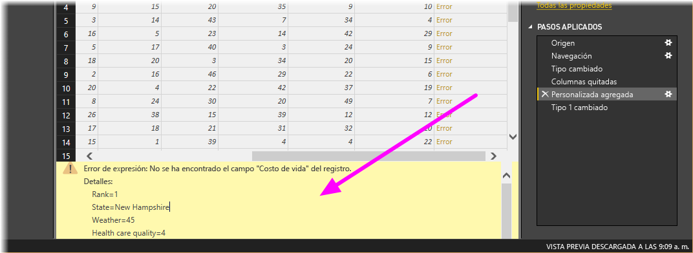

   Si hace clic en la palabra *Error* directamente, el editor de consultas crea un **paso aplicado** en el panel **Configuración de la consulta** y muestra información sobre el error. 

1. Como no necesitamos ver información sobre los errores, seleccione **Cancelar**.

1. Para corregir los errores, seleccione la columna **Nueva clasificación** y muestre la fórmula de datos de la columna seleccionando la casilla **Barra de fórmulas** de la pestaña **Ver**. 

   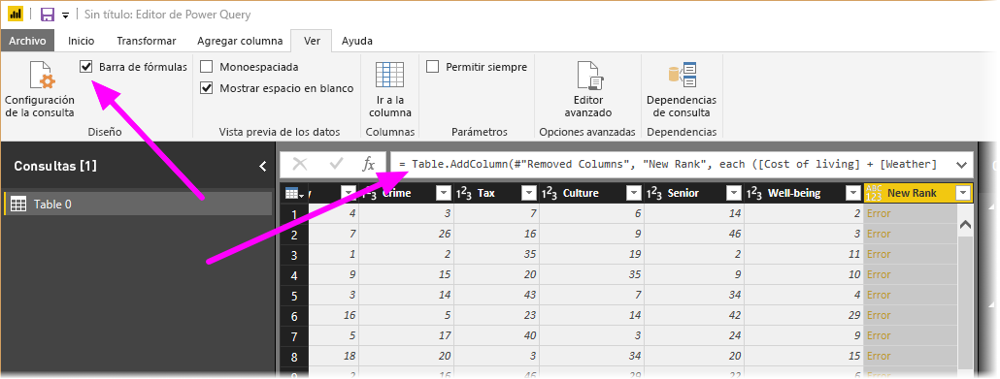

1. Quite el parámetro _Costo de la vida_ y reduzca el divisor modificando la fórmula del modo siguiente: 
   ```
    Table.AddColumn(#"Removed Columns", "New Rank", each ([Weather] + [Health care quality] + [Crime] + [Tax] + [Culture] + [Senior] + [#"Well-being"]) / 7)
   ```

1. Seleccione la marca de verificación verde situada a la izquierda del cuadro de fórmula o presione **Entrar**.

  El editor de consultas reemplaza los datos por los valores revisados y el paso **Personalizada agregada** se completa sin errores.

   > [!NOTE]
   > También puede seleccionar **Quitar errores** en la cinta o el menú contextual, lo que quitará todas las filas que contienen errores. Sin embargo, en este tutorial no queremos hacer esto, sino que queremos mantener los datos en la tabla.

1. Ordene los datos con arreglo a la columna **Nueva clasificación**. En primer lugar, seleccione el último paso aplicado, **Tipo cambiado1** para ver los datos más recientes. Después, seleccione la lista desplegable situada junto al encabezado de columna **Nueva clasificación** y seleccione **Orden ascendente**.

   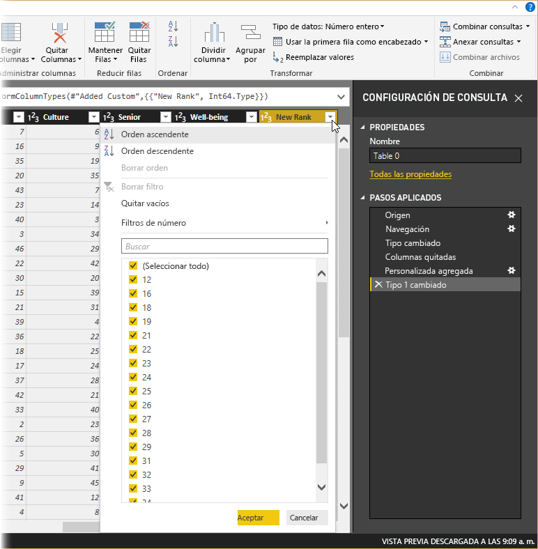

   Ahora, los datos están ordenados con arreglo a la columna **Nueva clasificación**. Sin embargo, si mira la columna **Clasificación**, verá que los datos no se ordenan de manera correcta cuando el valor de **Nueva clasificación** es igual. Lo corregiremos en el paso siguiente.

1. Para corregir este problema, seleccione la columna **Nueva clasificación** y cambie la fórmula de la **barra de fórmulas** del modo siguiente:

   ```
    = Table.Sort(#"Changed Type1",{{"New Rank", Order.Ascending},{"Rank", Order.Ascending}})
   ```

1. Seleccione la marca de verificación verde situada a la izquierda del cuadro de fórmula o presione **Entrar**. 

   Ahora, las filas se ordenan con arreglo a las dos columnas: **Nueva clasificación** y **Clasificación**. Además, puede seleccionar un **paso aplicado** en cualquier parte de la lista y seguir dando forma a los datos en ese momento en la secuencia. El editor de consultas insertará de forma automática un nuevo paso inmediatamente después del **paso aplicado**seleccionado actualmente. 

1. En **Paso aplicado**, seleccione el paso anterior a la columna personalizada, que es el paso **Columnas quitadas**. Aquí reemplazaremos el valor de la clasificación **El tiempo** de Arizona. Haga clic con el botón derecho en la celda que contiene la clasificación **El tiempo** de Arizona y seleccione **Reemplazar valores**. Observe cuál es el **paso aplicado** que está seleccionado actualmente.

   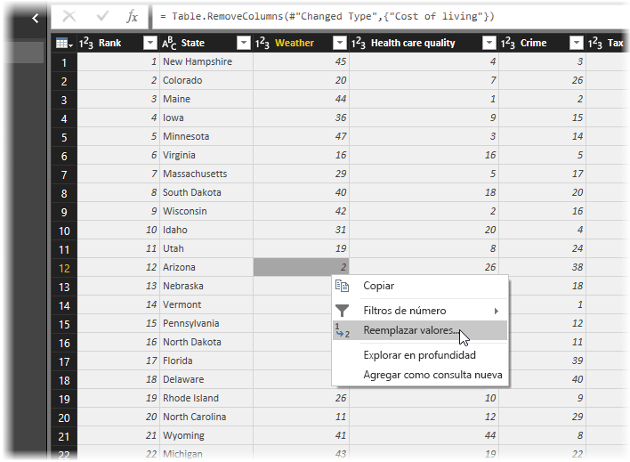

1. Seleccione **Insertar**.

    Como vamos a insertar un paso, el editor de consultas nos advierte del peligro de hacerlo, ya que los pasos posteriores podrían hacer que la consulta se interrumpiera. 

    

1. Cambie el valor de los datos a _51_. 

   El editor de consultas reemplaza los datos de Arizona. Cuando se crea un nuevo **paso aplicado**, el editor de consultas le asigna un nombre en función de la acción; en este caso, **Valor reemplazado**. Si tiene varios pasos con el mismo nombre en la consulta, el editor de consultas agrega un número (por orden) a cada **paso aplicado** para diferenciarlos entre ellos.

1. Seleccione el último **Paso aplicado** y **Filas ordenadas**. 

   Observe que los datos han cambiado con respecto a la nueva clasificación de Arizona. Este cambio se produce porque hemos insertado el paso **Valor reemplazado** en la ubicación correcta, antes del paso **Personalizada agregada**.

1. Por último, queremos cambiar el nombre de esa tabla por uno que sea descriptivo. En el panel **Configuración de la consulta**, en **Propiedades**, escriba el nuevo nombre de la tabla y seleccione **Entrar**. Vamos a llamar a esta tabla *EstadísticasJubilación*.

   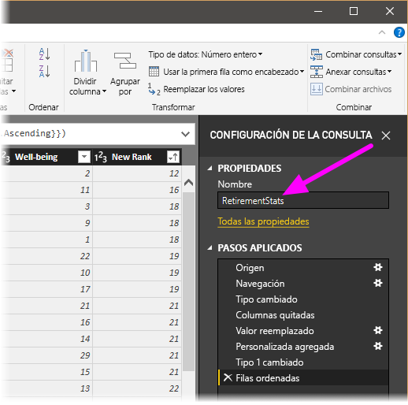

   Cuando empezamos a crear informes, resulta útil emplear nombres de tabla descriptivos, sobre todo cuando vamos a conectarnos a varios orígenes de datos y todos aparecen en el panel **Campos** de la vista **Informe**.

   Ahora, hemos dado a los datos la forma que necesitábamos. A continuación, vamos a conectarnos a otro origen de datos y combinar datos.

## <a name="combine-data"></a>Combinar datos
Los datos sobre diferentes estados resultan interesantes y serán útiles para crear otras consultas y análisis. Pero hay un problema: la mayoría de los datos usa una abreviatura de dos letras para los códigos de estado, no el nombre completo del estado. Debemos encontrar un modo de asociar las abreviaturas con los nombres de los estados.

Estamos de suerte: hay otro origen de datos públicos que hace justamente eso, pero necesita unos buenos ajustes para que podamos conectarlo a nuestra tabla sobre la jubilación. Para dar forma a los datos, siga estos pasos:

1. En la cinta **Inicio** del editor de consultas, seleccione **Nuevo origen \> Web**. 

2. Escriba la dirección del sitio web que contiene las abreviaturas de los estados, *https://en.wikipedia.org/wiki/List_of_U.S._state_abbreviations* , y seleccione **Conectar**.

   En Navegador, se muestra el contenido del sitio web.

    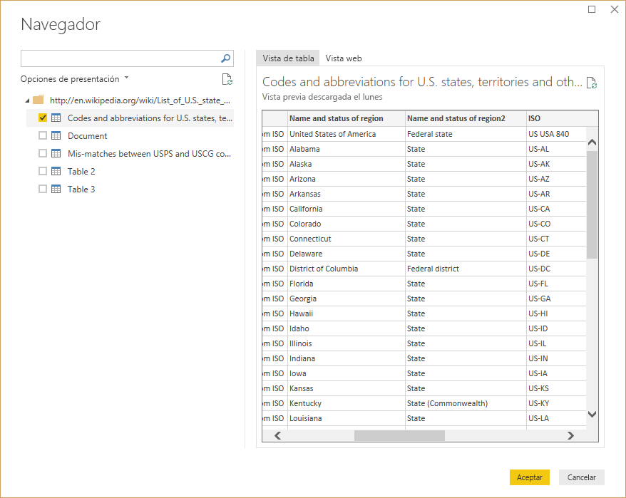

1. Seleccione **Codes and abbreviations** (Códigos y abreviaturas). 

   > [!TIP]
   > Llevará algo de tiempo dar forma a los datos de la tabla para reducirlos y que se adapten a lo que queremos. ¿Hay una forma más rápida o fácil de realizar los siguientes pasos? Sí, podríamos crear una *relación* entre las dos tablas y dar forma a los datos según esa relación. Los siguientes pasos nos ayudarán a aprender a trabajar con tablas. Sin embargo, las relaciones permiten utilizar rápidamente datos de distintas tablas.
> 
> 

Para ajusta los datos, siga estos pasos:

1. Quite la fila superior. Esta fila es el resultado del modo en que se creó la tabla de la página web, así que no la necesitamos. Desde la cinta de opciones **Inicio**, seleccione **Reducir filas \> Quitar filas \> Quitar filas superiores**.

    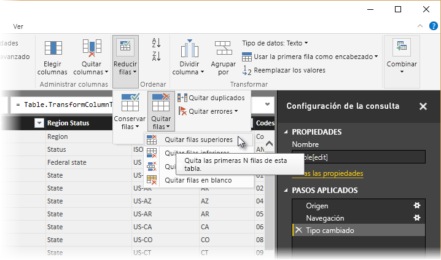

    Aparece la ventana **Quitar las primeras filas** , lo cual permite especificar el número de filas que desea quitar.

    > [!NOTE]
    > Si Power BI importa accidentalmente los encabezados de tabla como una fila en la tabla de datos, puede seleccionar **Usar la primera fila como encabezado** en la pestaña **Inicio** o desde la pestaña **Transformar** en la cinta de opciones para corregir la tabla.

1. Quite las 26 filas inferiores. Estas filas son territorios de EE. UU. y no necesitamos incluirlas. Desde la cinta de opciones **Inicio**, seleccione **Reducir filas \> Quitar filas \> Quitar filas inferiores**.

    

1. Como la tabla EstadísticasJubilación no tiene información sobre Washington D. C., debemos filtrarla en nuestra lista. Seleccione el menú desplegable **Estado de región** y desactive la casilla situada junto a **Distrito federal**.

    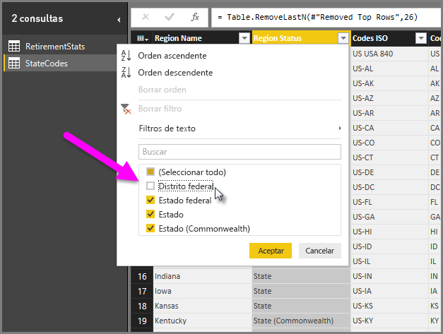

1. Quite algunas columnas innecesarias. Como solo necesitamos asignar a cada estado su abreviatura oficial de dos letras, podemos quitar las columnas siguientes: **columna1**, **columna3**, **columna4** y de la **columna6** a la **columna11**. En primer lugar, seleccione la **columna1**, mantenga presionada la tecla **CTRL** y seleccione todas las demás columnas que desee quitar. En la pestaña **Inicio** de la cinta, seleccione **Quitar columnas \> Quitar columnas**.

   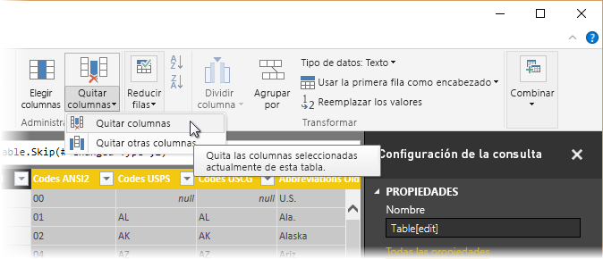

   > [!NOTE]
   > Es un buen momento para señalar que la *secuencia* de los pasos aplicados en el Editor de consultas es importante y puede afectar a la manera en que se da forma a los datos. También es importante tener en cuenta cómo un paso puede afectar a otro paso posterior; si quita un paso de los Pasos aplicados, es posible que los pasos siguientes no tengan el efecto buscado originalmente, debido al impacto de la secuencia de pasos de la consulta.

   > [!NOTE]
   > Al cambiar el tamaño de la ventana del editor de consultas para reducir el ancho, algunos elementos de la cinta se comprimen para optimizar el uso del espacio visible. Al aumentar el ancho de la ventana del editor de consultas, se expanden los elementos de la cinta para hacer el mayor uso posible del área aumentada de la cinta.

1. Cambie el nombre de las columnas y la tabla. Existen varias formas para cambiar el nombre de una columna: En primer lugar, seleccione la columna. Después, seleccione **Cambiar nombre** en la pestaña **Transformar** de la cinta o haga clic con el botón derecho y seleccione **Cambiar nombre**. La siguiente imagen tiene flechas que apuntan a ambas opciones; solo necesitará elegir una.

   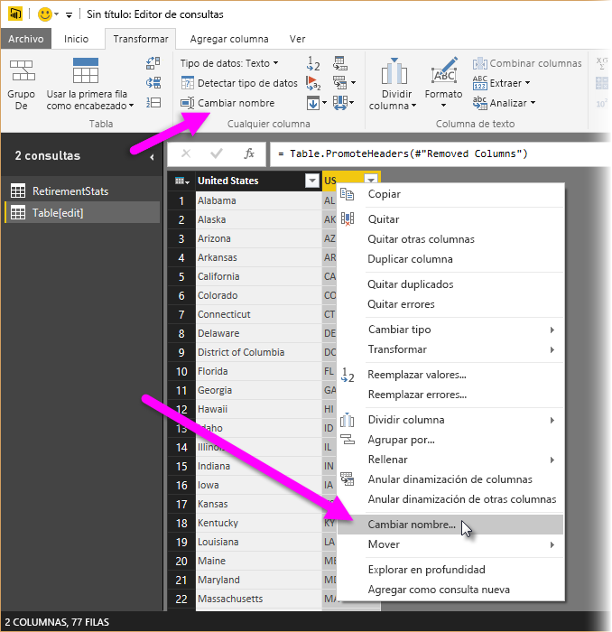

1. Vamos a llamarlas *Nombre de estado* y *Código de estado*. Para cambiar el nombre de la tabla, escriba el **nombre** en el panel **Configuración de la consulta**. Llame a esta tabla *CódigosEstado*.

## <a name="combine-queries"></a>Combinación de consultas

Ahora que hemos dado a la tabla CódigosEstado la forma que queríamos, vamos a combinar estas dos tablas (o consultas) en una sola. Como las tablas que tenemos ahora son el resultado de las consultas que aplicamos a los datos, a menudo también se les llama *consultas*.

Existen dos métodos principales para combinar consultas: *combinar* y *anexar*.

- Cuando se tienen una o varias columnas para agregar a otra consulta, se *fusionan* las consultas. 
- Cuando se tienen filas de datos adicionales que desea agregar a una consulta existente, se *anexa* la consulta.

En este caso, lo que vamos a hacer es combinar las consultas. Para ello, siga estos pasos:
 
1. En el panel izquierdo del editor de consultas, seleccione la consulta *en la que* quiere combinar la otra consulta. En este caso, será **EstadísticasJubilación**. 

1. Seleccione **Combinar \> Combinar consultas** en la pestaña **Inicio** de la cinta.

   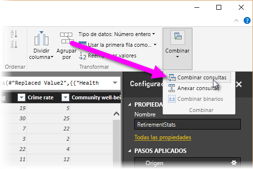

   Es posible que tenga que establecer los niveles de privacidad para garantizar que los datos se combinan sin que se incluyan o transfieran datos no deseados.

   Aparece la ventana **Combinar**. Le pedirá que seleccione la tabla que desea combinar con la tabla seleccionada y las columnas correspondientes que se van a utilizar para realizar la combinación. 

1. Seleccione **Estado** en la tabla EstadísticasJubilación y la consulta **CódigosEstado**. 

   Cuando haya seleccionado las columnas correspondientes apropiadas, se habilitará el botón **Aceptar**.

   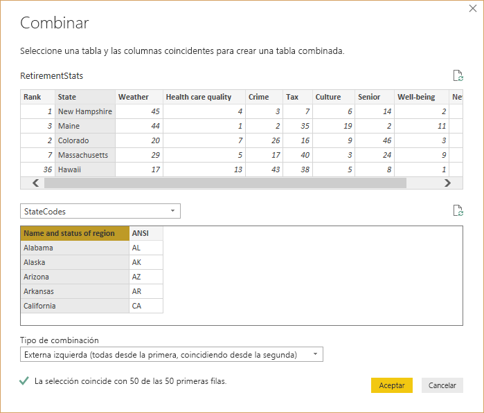

1. Seleccione **Aceptar**.

   El editor de consultas crea una nueva columna llamada **NewColumn** al final de la consulta con el contenido de la tabla (consulta) que se combinó con la consulta actual. Todas las columnas de la consulta combinada aparecen comprimidas en **NewColumn**, pero puede seleccionar **Expandir** para expandir la tabla e incluir las columnas que desee.

   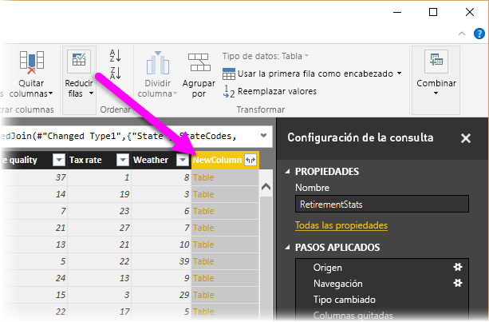

1. Para expandir la tabla combinada y seleccionar las columnas que desea incluir, haga clic en el icono de Expandir (). 

   Aparecerá la ventana **Expandir** .

   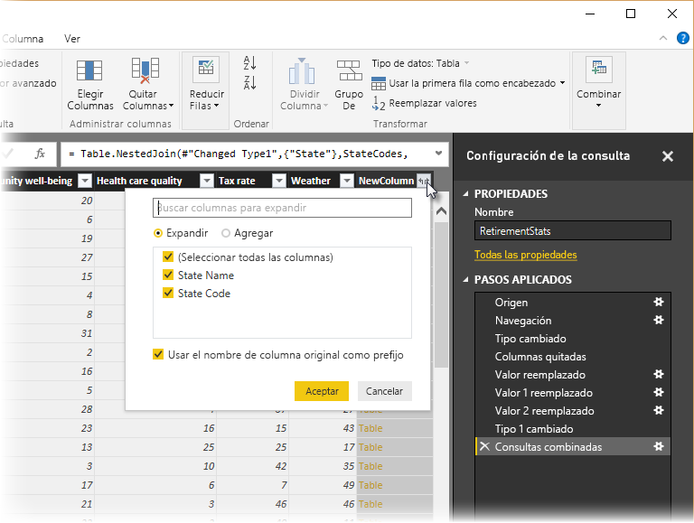

1. En este caso, solo vamos a utilizar la columna **Código de estado**. Seleccione esa columna, desactive **Usar el nombre de columna original como prefijo** y seleccione **Aceptar**.

   Si dejáramos activada la casilla **Usar el nombre de columna original como prefijo**, la columna combinada se llamaría **NewColumn.Código de estado**.

   > [!NOTE]
   > ¿Le gustaría saber cómo puede incorporar la tabla NewColumn? Puede experimentar un poco y si no le gustan los resultados, elimine ese paso de la lista de **Pasos aplicados** en el panel **Configuración de consulta** y la consulta regresará al estado anterior a la aplicación del paso **Expandir** . Puede realizar esta operación tantas veces como quiera hasta que el proceso de expansión tenga la apariencia deseada.

   Ahora tiene una única consulta (tabla) con dos orígenes de datos combinados, a los que se les ha dado forma para que se adecúen a sus necesidades. Esta consulta puede servir como base de muchas conexiones de datos interesantes, como estadísticas de costos de alojamiento, datos demográficos u oportunidades de trabajo en cualquier estado.

1. Para aplicar los cambios y cerrar el editor de consultas, seleccione **Cerrar y aplicar** en la pestaña **Inicio** de la cinta. 

   El conjunto de datos aparece en Power BI Desktop, listo para usarse para la creación de informes.

   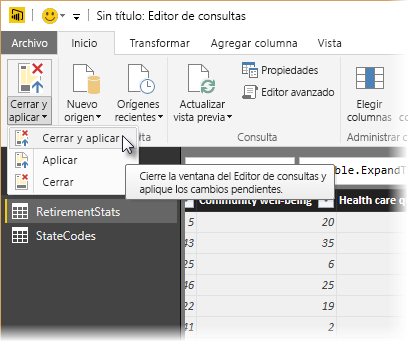

## <a name="next-steps"></a>Pasos siguientes
Para más información sobre Power BI Desktop y sus funcionalidades, consulte los siguientes recursos:

* [¿Qué es Power BI Desktop?](desktop-what-is-desktop.md)
* [Información general sobre consultas en Power BI Desktop](desktop-query-overview.md)
* [Orígenes de datos en Power BI Desktop](desktop-data-sources.md)
* [Conectarse a los datos en Power BI Desktop](desktop-connect-to-data.md)
* [Tareas de consultas comunes en Power BI Desktop](desktop-common-query-tasks.md)   

