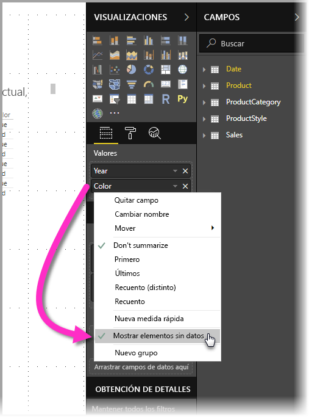
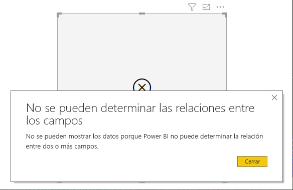

# Característica Mostrar elementos sin datos de Power BI

Power BI permite visualizar todo tipo de datos desde diversos orígenes. Al crear un objeto visual, Power BI solo muestra datos pertinentes cuando este se crea con el objetivo de poder administrar correctamente cómo se presentan y muestran los datos. Power BI determina qué datos son pertinentes en función de la configuración del objeto visual y del modelo de datos subyacente. En este artículo se describe cómo se comporta Power BI al determinar qué datos son pertinentes, con ejemplos que ilustran cómo se realizan las determinaciones.

## Determinación de los datos pertinentes

Para empezar a entender cómo Power BI determina qué datos son pertinentes para mostrar, veamos una tabla como ejemplo simple. Con el modelo representado en la sección de ejemplos, que se encuentra al final de este artículo, considere la posibilidad de crear una tabla con las siguientes opciones:

**1. Grupos de la misma tabla:** *Product[Color] - Product[Size]*

|*Product[Color]*  |*Product[Size]*  |
|---------|---------|
|Azul     |Grande         |
|Azul     |Mediano         |
|Azul     |Pequeño         |
|Rojo     |Grande         |

En este ejemplo, Power BI muestra las combinaciones de *[Color-Size]* que hay en la tabla *[Product]*. 

Ahora, veamos otra combinación:

**2. Grupos de tablas diferentes pero relacionadas directamente y una medida:** *ProductStyle[Finish] - Product[Color] - Sum(Sales[Quantity])*

|*ProductStyle[Finish]*  |*Product[Color]*  |*[SumQuantity]*  |
|---------|---------|---------|
|Gloss     |Azul         |10         |
|Matte     |Azul         |15         |

En este ejemplo, Power BI solo muestra las combinaciones que hay. Por ejemplo, no mostrará ("None" + "Blue") o ("Matte" + "Red") porque esas combinaciones no están en el modelo. La condición que determina qué combinaciones habrá es que el valor de *Sum(Sales[Quantity])* no esté en blanco.

Echemos un vistazo a un caso diferente: 

**3. Grupos de tablas diferentes pero relacionadas y ninguna medida:** *ProductStyle[Finish] - Product[Color]*

|*ProductStyle[Finish]*  |*Product[Color]*  |
|---------|---------|
|Gloss     |Azul         |
|Gloss     |Rojo         |
|Matte     |Azul         |

Como no hay ninguna medida explícita y las dos tablas están directamente relacionadas, Power BI trata de insertar una medida para restringir las combinaciones resultantes. En este caso, Power BI inserta una medida *CALCULATE(COUNTROWS('Product'))*, que no debe estar en blanco, ya que *Product* es la tabla común a ambas tablas.

Por lo tanto, Power BI muestra las combinaciones que tengan entradas en la tabla Product, que excluye las combinaciones de *("None" + "Blue")* y *("Matte" + "Red")*.

**4. Grupos de tablas diferentes pero no relacionadas**

El modelo de ejemplo no tiene esta combinación, pero si hubiera grupos de tablas diferentes pero no relacionadas, Power BI no podría relacionar dos columnas. Por tanto, el resultado sería una combinación cruzada de todos los valores de cada columna. En esa situación, Power BI emite un error de tipo *unconstrained join* (unión sin restricciones), ya que dichas combinaciones cruzadas son complicadas de calcular en la base de datos y no proporcionan mucha información al usuario. 

## Visualización de elementos sin datos

En la sección anterior se describe cómo Power BI determina qué datos son pertinentes para mostrar. Sin embargo, a veces puede que *quiera* mostrar elementos sin datos. 

La característica **Mostrar elementos sin datos** permite hacer exactamente eso: incluir filas y columnas de datos que no contienen datos de medida (valores de medida en blanco).

Para habilitar la característica **Mostrar elementos sin datos**, seleccione un objeto visual; luego, en el área **Campos**, haga clic con el botón derecho en el campo y seleccione la opción **Mostrar elementos sin datos** del menú que aparece, tal y como se muestra en la siguiente imagen.

La característica **Mostrar elementos sin datos** *no* tiene efecto en las siguientes circunstancias:

* No se han agregado medidas al objeto visual y las columnas de agrupamiento proceden de la misma tabla.
* Los grupos no están relacionados; Power BI no ejecuta consultas de objetos visuales que tengan grupos no relacionados.
* La medida no está relacionada con ninguno de los grupos; esto se debe a que la medida nunca estará en blanco para solamente algunas combinaciones de grupos.
* Hay un filtro de medidas definido por el usuario que excluye las medidas en blanco, por ejemplo: *SalesAmount > 0*.

### Funcionamiento de la característica Mostrar elementos sin datos

Los casos de uso más interesantes de la característica **Mostrar elementos sin datos** son cuando hay medidas. Observemos qué sucede cuando los grupos pertenecen a la misma tabla o pueden relacionarse a través de una ruta de acceso del modelo. Por ejemplo, *ProductStyle* está directamente relacionada con *Product* e indirectamente relacionada con *Sales*. *ProductStyle* y *ProductCategory* pueden relacionarse a través de la tabla *Product*, y así sucesivamente.

Veamos un par de situaciones interesantes y compararemos qué sucede cuando la característica **Mostrar elementos sin datos** está desactivada y activada. 

**1. Columnas de agrupamiento de la misma tabla:** *Product[Color] - Product[Size] - Sum(Sales[Quantity])*

Cómo aparece si está la característica **Mostrar elementos sin datos** desactivada:

|*Product[Color]*  |*Product[Size]*  |*[SumQuantity]*  |
|---------|---------|---------|
|Azul     |Mediano         |15         |
|Azul     |Pequeño         |10         |

Cómo aparece si está la característica **Mostrar elementos sin datos** activada:

|*Product[Color]*  |*Product[Size]*  |*[SumQuantity]*  |
|---------|---------|---------|
|Azul     |Grande         |         |
|Azul     |Mediano         |15         |
|Azul     |Pequeño         |10         |
|Rojo     |Grande         |         |

Observe cómo se muestran dos nuevas combinaciones con la característica activada: *Blue - Large* y *Red - Large*. Esas dos entradas tienen en blanco el valor de *Quantity* de la tabla *Sales*. Sin embargo, se muestran en la tabla *Product*.

**2. Columnas de agrupamiento de tablas relacionadas:** *ProductStyle[Finish] - Product[Color] - Sum(Sales[Quantity])*

Cómo aparece si está la característica **Mostrar elementos sin datos** desactivada:

|*ProductStyle[Finish]*  |*Product[Color]*  |*[SumQuantity]*  |
|---------|---------|---------|
|Gloss     |Azul         |10         |
|Matte     |Azul         |15         |

Cómo aparece si está la característica **Mostrar elementos sin datos** activada:

|*ProductStyle[Finish]*  |*Product[Color]*  |*[SumQuantity]*  |
|---------|---------|---------|
|Gloss     |Azul         |10         |
|Gloss     |Rojo         |         |
|Matte     |Azul         |15         |
|Ninguno     |         |         |

Observe cómo *(Gloss-Red)* y *(None, en blanco)* se mostraban como combinaciones. Este es el motivo por el que aparecían:
* Power BI primero tuvo en cuenta ProductStyle[Finish] y seleccionó todos los valores para mostrar, por lo que aparecieron Gloss, Matte y None.
* Con cada uno de estos valores, Power BI seleccionó todas las entradas correspondientes de *Product[Color]*. 
* Como *None* no se corresponde con ningún conjunto de datos *Product[Color]*, ese valor se muestra en blanco.

Es importante tener en cuenta que el mecanismo de selección de valores de las columnas depende del orden y puede considerarse como una operación *Combinación externa izquierda* entre tablas. Si se cambia el orden de las columnas, también cambiarán los resultados.

Veamos un ejemplo de cambio del orden y cómo afecta a los resultados. Se muestra lo mismo que en el punto **2** de esta sección, solo que con el orden cambiado.

**Product[Color] - ProductStyle[Finish] - Sum(Sales[Quantity])**

Cómo aparece si está la característica **Mostrar elementos sin datos** activada:

|*Product[Color]* |*ProductStyle[Finish]*  |*[SumQuantity]*  |
|---------|---------|---------|
|Azul     |Gloss         |10         |
|Azul     |Matte         |15         |
|Rojo     |Gloss         |         |

En este caso, observe cómo *ProductStyle[Finish]=None* no se muestra en la tabla. Esto se debe a que, en este caso, Power BI seleccionó primero todos los valores de *Color* de la tabla *Product*. Después, para cada color, Power BI eligió los valores de *Finish* correspondientes que contenían datos. Como *None* no se muestra en ninguna combinación de *Color*, no se seleccionó.

## Modelo de datos de ejemplo

En esta sección se muestra el modelo de datos de ejemplo que se ha utilizado en los ejemplos de este artículo.

**Modelo**: 

**Datos**:

|Product[ProductId]|    Product[ProductName]|   Product[Color]| Product[Size]|  Product[CategoryId]|    Product[StyleId]|
|---------|---------|---------|---------|---------|---------|
|1  |Prod1  |Azul   |Pequeño  |1  |1 |
|2  |Prod2  |Azul   |Mediano |2  |2 |
|3  |Prod3  |Rojo    |Grande  |1  |1 |
|4  |Prod4  |Azul   |Grande  |2  |2 |

|ProductCategory[CategoryId]|   ProductCategory[CategoryName]|
|---------|---------|
|1  |Teléfono   |
|2  |Cámara |
|3  |TV |

|ProductStyle[StyleId]| ProductStyle[Finish]|   ProductStyle[Polished]|
|---------|---------|---------|
|1  |Gloss  |Sí |
|2  |Matte  |No |
|3  |Ninguno   |No |

|Sales[SaleId]| Sales[ProductId]|   Sales[Date]|    Sales[Quantity]|
|---------|---------|---------|---------|
|1  |1  |1/1/2012 0:00| 10 |
|2  |2  |1/1/2013 0:00| 15 |

## Pasos siguientes

En este artículo se describe cómo se puede habilitar la característica **Mostrar elementos sin datos** de Power BI. Puede que también esté interesado en los siguientes artículos. 

* [Orígenes de datos en Power BI Desktop](desktop-data-sources.md)
